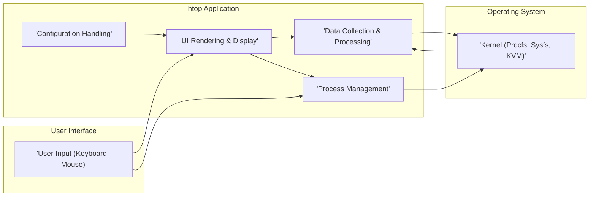
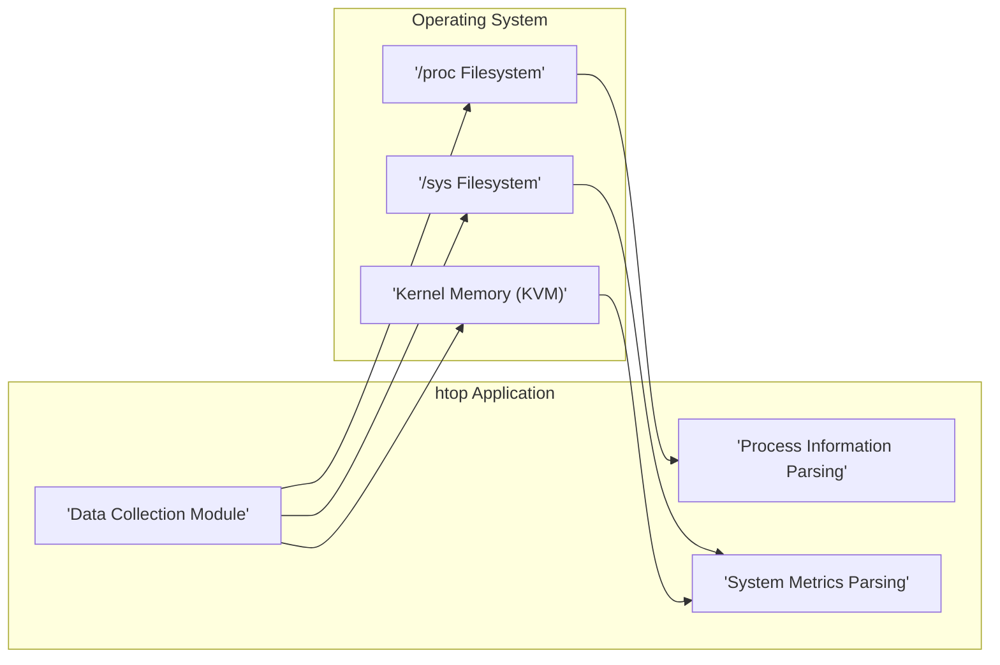
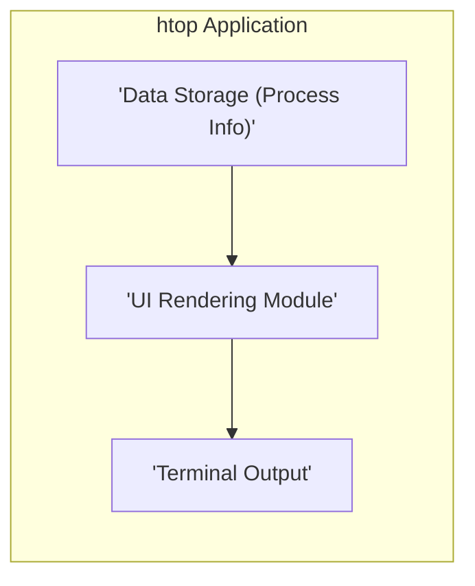
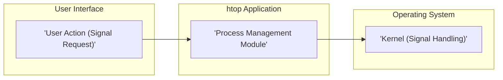

# Project Design Document: htop - Interactive Process Viewer

**Version:** 1.1
**Date:** October 26, 2023
**Author:** AI Software Architect

## 1. Introduction

This document provides an enhanced design overview of the `htop` project, an interactive process viewer for Linux, macOS, and FreeBSD. This revised document aims for greater clarity and detail regarding the system's architecture, components, and data flow, specifically tailored for subsequent threat modeling activities.

`htop` is a command-line utility enabling users to interactively monitor system processes and resources. It presents a real-time, dynamically updated view of running processes, alongside key system metrics such as CPU usage, memory consumption, and swap usage. Distinguished from the traditional `top` command, `htop` offers a more user-friendly interface incorporating features like horizontal and vertical scrolling, filtering, and direct process management actions.

## 2. Goals and Objectives

The core goals of `htop` are:

*   To offer an intuitive and interactive interface for observing system processes.
*   To display up-to-the-moment information about active processes, including CPU utilization, memory footprint, and other pertinent metrics.
*   To empower users to execute actions on processes, such as dispatching signals (e.g., `kill`, `stop`, `continue`).
*   To provide filtering and sorting mechanisms for efficient identification and analysis of specific processes.
*   To maintain a lightweight and resource-efficient operational footprint.
*   To ensure portability across various Unix-like operating systems.

## 3. System Architecture

`htop` employs a monolithic architecture, where all functionalities are encapsulated within a single executable. The primary components interact directly with the operating system kernel to retrieve information and execute commands.

### 3.1. High-Level Architecture

### 3.2. Component Description

*   **User Interface (UI) Rendering & Display:** This component is responsible for the visual presentation of process information and system metrics to the user. It manages screen updates, scrolling behavior, highlighting of elements, and the display of various data columns. It leverages the `ncurses` library for terminal interaction and manipulation.
*   **Data Collection & Processing:** This central component is tasked with gathering real-time information about running processes and overall system resource utilization. It interfaces with the operating system kernel through mechanisms like the `/proc` filesystem (procfs), the `/sys` filesystem (sysfs), and potentially kernel virtual memory (KVM) for accessing specific performance metrics. This component parses the raw data obtained from these sources and structures it into a format suitable for display.
*   **Process Management:** This component handles user-initiated requests to perform actions on specific processes, such as sending signals (e.g., `SIGKILL`, `SIGTERM`). It utilizes system calls like `kill()` to interact with the operating system's process management facilities.
*   **Configuration Handling:** This component manages user-specific configuration settings, including preferences for displayed columns, sorting criteria, and color schemes. It typically reads and writes configuration data to files stored within the user's home directory.

## 4. Data Flow

The primary data flow within `htop` involves the continuous retrieval of process and system information from the kernel and its subsequent presentation to the user through the terminal interface.

### 4.1. Data Collection Flow

*   **Initialization:** Upon startup, the `'Data Collection Module'` identifies the available data sources provided by the operating system, such as procfs, sysfs, and KVM (if supported and enabled).
*   **Data Retrieval:** The module periodically reads data from various files and directories within the `/proc` filesystem (e.g., `/proc/[pid]/stat`, `/proc/meminfo`) and the `/sys` filesystem (e.g., `/sys/devices/system/cpu/`). This retrieval process gathers information pertaining to individual processes and the overall system state. It may also access kernel memory via KVM for specialized metrics related to virtualization or kernel internals.
*   **Parsing:** The raw data retrieved from these sources, often in textual format, is processed by the `'Process Information Parsing'` and `'System Metrics Parsing'` sub-modules. This involves extracting relevant data fields and converting them into structured data formats suitable for internal use.
*   **Data Storage:** The parsed and structured data is then stored in internal data structures, typically using linked lists or arrays to represent the collection of process information.

### 4.2. Display Update Flow

*   **Refresh Trigger:** The UI update process is initiated periodically based on a configurable refresh interval or in response to user interactions that necessitate a screen redraw.
*   **Data Retrieval:** The `'UI Rendering Module'` accesses the internally stored process information.
*   **Filtering and Sorting:** If the user has configured filtering or sorting options, the module applies these rules to the retrieved data to present the desired subset and order of processes.
*   **Formatting:** The filtered and sorted data is then formatted for display within the terminal. This includes tasks like aligning columns, applying color codes based on resource usage or process state, and highlighting specific information.
*   **Terminal Output:** Finally, the formatted data is sent to the terminal using functions provided by the `ncurses` library, resulting in the updated display of process information.

### 4.3. Process Management Flow

*   **User Input:** The user interacts with the `htop` interface, selecting a specific process and initiating an action, such as sending a signal (e.g., pressing the 'k' key to initiate the kill signal process).
*   **Signal Handling:** The `'Process Management Module'` receives the user's request, including the target process ID (PID) and the desired signal to be sent.
*   **System Call:** The module then utilizes the `kill()` system call, providing the PID of the target process and the numerical representation of the selected signal. This system call requests the operating system kernel to deliver the specified signal to the target process.
*   **Kernel Action:** The operating system kernel receives the signal request and takes the appropriate action based on the signal type and the current state of the target process. This might involve terminating the process, pausing its execution, or triggering other signal-specific behaviors.

## 5. Security Considerations

While `htop` primarily functions as a monitoring tool, its capability to send signals to processes introduces several security considerations that are important for threat modeling.

*   **Privilege Escalation (Indirect):** `htop` itself operates with the privileges of the user who executes it. However, the ability to send signals to other processes means a user could potentially disrupt or terminate processes belonging to other users if the underlying operating system permissions allow it. This highlights the importance of proper system-level permission management.
*   **Information Disclosure:** `htop` displays a wealth of information about running processes, including command-line arguments (which may contain sensitive data), user and group IDs, resource consumption metrics, and file paths. Unauthorized access to an `htop` display (e.g., through screen sharing or physical access) could lead to the disclosure of this sensitive information.
*   **Input Validation (Limited):** While `htop`'s primary input is through keyboard commands for navigation and actions, the process filtering and search functionalities could theoretically be vulnerable to injection-style attacks if not carefully implemented. However, given the nature of the expected input (process names or IDs), this is a lower-risk area.
*   **Dependency Vulnerabilities:** `htop` relies on external libraries, most notably `ncurses`. Security vulnerabilities discovered in these dependencies could potentially be exploited to compromise `htop` or the system it runs on. Regular updates and security audits of dependencies are crucial.
*   **Signal Injection (Abuse of Functionality):** A malicious actor with sufficient privileges could intentionally use `htop` to send disruptive signals (like `SIGKILL`) to critical system processes, leading to a denial-of-service condition. This underscores the need to restrict access to systems and limit the ability to execute privileged commands.
*   **Configuration File Security:** The configuration file stored in the user's home directory could potentially be targeted for manipulation. An attacker could modify this file to alter `htop`'s behavior, potentially leading to information disclosure or other unintended consequences for the user. Proper file permissions on the configuration file are essential.
*   **Cross-Process Information Leakage:** While `htop` aims to present accurate information, vulnerabilities in the data collection mechanisms or parsing logic could potentially lead to the display of incorrect or misleading information, potentially blurring the lines between process boundaries and leaking information.

## 6. Deployment

`htop` is typically deployed as a standalone executable binary.

*   **Installation:** It is commonly installed using package managers on Linux distributions (e.g., `apt install htop`, `dnf install htop`) or can be compiled directly from the source code.
*   **Execution:** Users execute the `htop` command from their terminal. It operates entirely within the terminal environment.
*   **Permissions:** `htop` requires read access to the `/proc` and `/sys` filesystems to gather process and system information. Sending signals to other processes requires the user to have the necessary permissions to signal those specific processes, as enforced by the operating system's security model.

## 7. Technologies Used

*   **Primary Programming Language:** C
*   **Terminal User Interface Library:** `ncurses`
*   **Core Operating System Interfaces:**
    *   The `/proc` filesystem (procfs)
    *   The `/sys` filesystem (sysfs)
    *   Standard system calls (e.g., `kill()`, `open()`, `read()`)
    *   Potentially Kernel Virtual Memory (KVM) access for specific metrics.

## 8. Future Considerations

*   **Enhanced Security Measures:** While not a primary design goal, future development could explore features like more fine-grained control over process actions, enhanced input sanitization for filtering, or mechanisms to verify the integrity of collected data.
*   **Modular Design:** While currently implemented as a monolithic application, considering a more modular architecture could improve maintainability, facilitate testing of individual components, and potentially allow for the development of extensions or plugins.
*   **Expanded Metrics and Data Sources:** Future versions could incorporate support for displaying more advanced system metrics or integrate with other monitoring subsystems or data sources to provide a more comprehensive view of system performance.

This revised document provides a more detailed and refined design overview of the `htop` project, specifically tailored for effective threat modeling. The enhanced descriptions of the architecture, data flow, and security considerations aim to provide a clearer understanding of the system's inner workings and potential areas of vulnerability.
