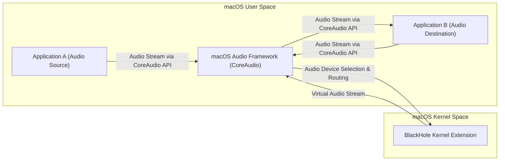
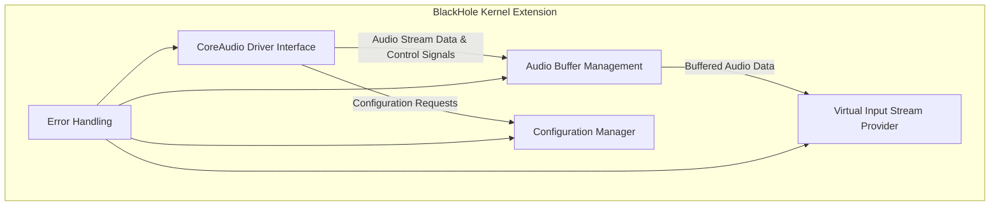

# Project Design Document: BlackHole Virtual Audio Driver

**Version:** 1.1
**Date:** October 26, 2023
**Author:** Gemini (AI Language Model)

## 1. Introduction

This document provides a detailed design overview of the BlackHole virtual audio driver for macOS. BlackHole is an open-source audio driver that allows applications to pass audio to other applications with zero additional latency. This document aims to clearly articulate the architecture, components, and data flow of BlackHole to facilitate a comprehensive threat modeling exercise. This revision includes more detail on the interaction with CoreAudio and expands on security considerations.

## 2. Goals and Objectives

The primary goal of this document is to provide a clear and detailed description of the BlackHole project's design. The specific objectives are:

*   Describe the high-level architecture of the system.
*   Identify the key components and their responsibilities, including more detail on their internal workings.
*   Illustrate the flow of audio data through the system with greater precision.
*   Highlight important interfaces and interactions between components, including the specifics of the CoreAudio API usage.
*   Provide sufficient detail to enable effective threat identification and analysis, with a stronger focus on potential attack vectors.

## 3. High-Level Architecture

BlackHole operates as a kernel extension (kext) within the macOS operating system. It intercepts and redirects audio streams between applications by registering itself as a virtual audio device within the CoreAudio framework.

**Description:**

*   Applications A and B utilize the macOS CoreAudio framework APIs to manage audio input and output.
*   BlackHole registers itself with CoreAudio as both an audio input and output device. This registration involves implementing specific CoreAudio driver interfaces.
*   When an application selects BlackHole as its output device, CoreAudio routes the audio stream to the BlackHole kernel extension through the implemented driver interfaces.
*   BlackHole internally processes this audio stream and makes it available as an input source, also through CoreAudio's driver interface mechanisms.
*   Another application can then select BlackHole as its input device, and CoreAudio will route the buffered audio stream from BlackHole to that application.

## 4. Detailed Architecture

The BlackHole kernel extension comprises several key components that work together to manage audio routing.

**Components:**

*   **CoreAudio Driver Interface:** This component implements the necessary interfaces defined by the macOS Audio Driver Kit (or IOKit Audio family). It acts as the bridge between CoreAudio and the internal workings of BlackHole.
    *   Responsibilities:
        *   Implementing `IOAudioEngine` and related classes to register as an audio device.
        *   Handling `IOAudioStream` objects for input and output streams.
        *   Managing audio buffer requests and providing audio data to CoreAudio.
        *   Responding to control commands from CoreAudio (e.g., start, stop, sample rate changes).
        *   Negotiating audio stream formats.
*   **Audio Buffer Management:** This component is responsible for the efficient and safe management of audio data buffers. It handles the temporary storage of audio samples as they are transferred between applications.
    *   Responsibilities:
        *   Allocating and deallocating kernel memory for audio buffers.
        *   Implementing mechanisms for writing incoming audio data to the buffer.
        *   Implementing mechanisms for reading audio data from the buffer.
        *   Managing buffer pointers and sizes to prevent overflows and underflows.
        *   Potentially using techniques like circular buffers for efficient streaming.
        *   Ensuring thread-safe access to the audio buffers.
*   **Virtual Input Stream Provider:** This component presents the buffered audio data as a virtual input stream to CoreAudio. It interacts with the Audio Buffer Management component to retrieve the audio data.
    *   Responsibilities:
        *   Implementing the necessary `IOAudioStream` methods to provide audio data on the input side.
        *   Synchronizing the input stream with the output stream to maintain timing.
        *   Handling requests for audio data from CoreAudio for the input stream.
        *   Potentially managing multiple consumers of the input stream.
*   **Configuration Manager:** This component manages the configurable parameters of the BlackHole driver.
    *   Responsibilities:
        *   Storing and retrieving driver settings (e.g., sample rate, buffer size, number of channels).
        *   Potentially exposing mechanisms for user-space configuration (though this is less common for kernel extensions and might involve a separate user-space utility).
        *   Validating configuration parameters to prevent invalid states.
*   **Error Handling:** This component is responsible for detecting and handling errors that occur within the kernel extension.
    *   Responsibilities:
        *   Implementing error detection mechanisms throughout the components.
        *   Logging errors to the system log.
        *   Potentially attempting to recover from certain errors.
        *   Reporting errors back to CoreAudio, which may propagate to user-space applications.

## 5. Data Flow

The following diagram illustrates the typical flow of audio data through the BlackHole system with more detail on the CoreAudio interaction.

```mermaid
graph LR
    subgraph "Application A (Source)"
        A1["Generate Audio Data"]
        A2["CoreAudio Output API Call"]
    end
    subgraph "macOS CoreAudio"
        C1["Route to BlackHole Output Stream"]
        C2["Call BlackHole's `getAudioBufferList`"]
    end
    subgraph "BlackHole Kernel Extension"
        B1["Receive Audio Data in `getAudioBufferList` (CoreAudio Driver Interface)"]
        B2["Write to Audio Buffer (Buffer Management)"]
        B3["Signal Data Available (Buffer Management)"]
    end
    subgraph "macOS CoreAudio"
        C3["Route from BlackHole Input Stream"]
        C4["Call BlackHole's Input `getAudioBufferList`"]
    end
    subgraph "BlackHole Kernel Extension"
        B4["Read from Audio Buffer (Buffer Management)"]
        B5["Provide Data in Input `getAudioBufferList` (CoreAudio Driver Interface)"]
    end
    subgraph "Application B (Destination)"
        D1["CoreAudio Input API Call"]
        D2["Receive Audio Data"]
        D3["Process Audio Data"]
    end

    A1 --> A2
    A2 --> C1
    C1 --> C2
    C2 --> B1
    B1 --> B2
    B2 --> B3
    B3 --> C4
    C4 --> B4
    B4 --> B5
    B5 --> C3
    C3 --> D1
    D1 --> D2
    D2 --> D3
```

**Detailed Steps:**

1. **Generate Audio Data:** The source application (Application A) generates audio data.
2. **CoreAudio Output API Call:** Application A uses CoreAudio output APIs to send the audio data, targeting the BlackHole output device.
3. **Route to BlackHole Output Stream:** CoreAudio identifies BlackHole as the target and prepares to transfer data.
4. **Call BlackHole's `getAudioBufferList`:** CoreAudio calls the `getAudioBufferList` method (or similar) on BlackHole's output `IOAudioStream` object, requesting a buffer to write to.
5. **Receive Audio Data in `getAudioBufferList`:** BlackHole's CoreAudio Driver Interface receives the request and the provided buffer.
6. **Write to Audio Buffer:** The received audio data is written into the managed audio buffer by the Audio Buffer Management component.
7. **Signal Data Available:** The Audio Buffer Management component signals that new data is available for reading.
8. **Call BlackHole's Input `getAudioBufferList`:** When the destination application (Application B) requests audio input from BlackHole, CoreAudio calls the `getAudioBufferList` method on BlackHole's input `IOAudioStream` object.
9. **Read from Audio Buffer:** The Audio Buffer Management component reads the buffered audio data.
10. **Provide Data in Input `getAudioBufferList`:** BlackHole's CoreAudio Driver Interface provides the read audio data back to CoreAudio in the `getAudioBufferList` call.
11. **Route from BlackHole Input Stream:** CoreAudio routes this data to the requesting application.
12. **CoreAudio Input API Call:** Application B uses CoreAudio input APIs to request audio data from the BlackHole input device.
13. **Receive Audio Data:** Application B receives the audio data from CoreAudio.
14. **Process Audio Data:** Application B processes the received audio data.

## 6. Key Interfaces and Interactions

*   **Application <-> CoreAudio:** Applications interact with CoreAudio using its public APIs (e.g., Audio Units, Audio Queues, AVFoundation) for audio input and output. This interaction involves system calls and framework-level communication.
*   **CoreAudio <-> BlackHole Kernel Extension:** CoreAudio interacts with the BlackHole kernel extension through the defined interfaces of the Audio Driver Kit (or IOKit Audio family). This involves:
    *   **Method Calls:** CoreAudio calls methods implemented by BlackHole (e.g., `getAudioBufferList`, `start`, `stop`).
    *   **Data Transfer:** Audio data is transferred between CoreAudio and BlackHole through memory buffers provided in the `getAudioBufferList` calls.
    *   **Control Signals:** CoreAudio sends control signals to BlackHole to manage the audio stream (e.g., start, stop, sample rate changes).
*   **BlackHole Components (Internal):** The components within the BlackHole kernel extension communicate through internal function calls, shared data structures, and potentially synchronization primitives (e.g., mutexes, semaphores) within the kernel space.

## 7. Deployment

BlackHole is deployed as a kernel extension. The typical deployment process involves:

*   Building the kernel extension from the source code using Xcode and the macOS SDK.
*   Signing the kernel extension with a valid developer certificate. This is crucial for macOS security.
*   Creating a distribution package (e.g., a `.pkg` installer) that includes the signed kernel extension.
*   Installing the kernel extension into the appropriate system directory (e.g., `/Library/Extensions`) using the installer, which requires administrator privileges.
*   On macOS versions with System Integrity Protection (SIP) enabled, the user may need to explicitly allow the loading of the kernel extension in System Preferences -> Security & Privacy after installation.
*   Once loaded, BlackHole appears as an available audio device in the macOS Sound settings and within applications that allow audio device selection.

## 8. Security Considerations

As a kernel extension, BlackHole operates with the highest level of privileges, making security a paramount concern. Potential security considerations and attack vectors include:

*   **Kernel Vulnerabilities:** Bugs or vulnerabilities within the BlackHole code (e.g., buffer overflows, use-after-free errors, integer overflows) could be exploited by malicious applications or actors to gain arbitrary code execution within the kernel. This could lead to complete system compromise.
*   **Privilege Escalation:** If user-space applications can manipulate the state or behavior of the kernel extension in unintended ways (e.g., through crafted CoreAudio API calls or configuration settings), it could lead to privilege escalation, allowing an attacker to gain root privileges.
*   **Data Integrity Violations:** Malicious actors could potentially attempt to inject or modify audio streams as they are routed through BlackHole. This could have implications for applications that rely on the integrity of the audio data.
*   **Denial of Service (DoS):** Resource exhaustion (e.g., excessive memory allocation, infinite loops) or crashes within the kernel extension could lead to a denial of service, making the system unstable or unusable. This could be triggered by malicious audio streams or crafted API calls.
*   **Information Disclosure:** Improper handling of audio data or internal state within the kernel extension could lead to the disclosure of sensitive information to unauthorized processes.
*   **Code Signing and Notarization Bypass:** If the code signing or notarization process is compromised, a malicious or vulnerable version of BlackHole could be installed and loaded onto a user's system.
*   **Supply Chain Attacks:** Vulnerabilities could be introduced into the BlackHole codebase through compromised dependencies or development tools.
*   **Side-Channel Attacks:**  While less likely for a driver like this, potential side-channel attacks could exploit timing differences or resource usage patterns to infer information about the audio stream.
*   **Improper Input Validation:** Lack of proper validation of input from CoreAudio or user-space configuration could lead to unexpected behavior or vulnerabilities.

This detailed design document provides a solid foundation for a comprehensive threat modeling exercise. By understanding the architecture, components, and data flow, security experts can systematically identify potential threats, vulnerabilities, and attack vectors associated with the BlackHole virtual audio driver. This will inform the development of appropriate security mitigations and testing strategies.