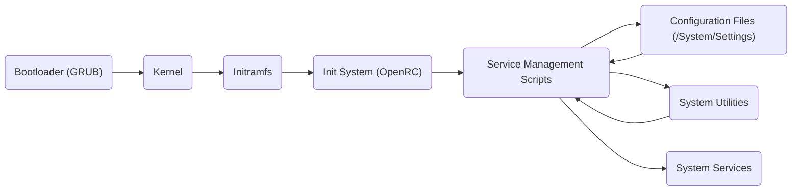

# Project Design Document: GoboLinux BootScripts

**Version:** 1.1
**Date:** October 26, 2023
**Author:** AI Software Architect

## 1. Introduction

This document provides a detailed design overview of the GoboLinux BootScripts project, located at [https://github.com/gobolinux/BootScripts](https://github.com/gobolinux/BootScripts). This document aims to clearly articulate the system's architecture, components, and data flow to facilitate subsequent threat modeling activities. It is intended for security engineers, developers, and anyone involved in the security assessment of the GoboLinux boot process. This revision clarifies certain aspects and enhances the description of component interactions.

## 2. Project Overview

The GoboLinux BootScripts project contains a collection of scripts and configuration files responsible for the system's initialization process during boot. Unlike traditional Linux distributions that adhere to the Filesystem Hierarchy Standard (FHS), GoboLinux organizes files by their purpose. This project plays a crucial role in setting up the environment, starting essential services, and preparing the system for user interaction within the GoboLinux paradigm. The scripts ensure that the unique GoboLinux directory structure is correctly initialized and that services are started in a manner consistent with this structure.

The primary function of these scripts is to orchestrate the boot sequence, ensuring all necessary components are initialized in the correct order. This includes mounting file systems, configuring hardware, starting system services, and setting up the user environment. The project aims to provide a flexible and maintainable way to manage the boot process within the specific context of GoboLinux.

## 3. System Architecture

The GoboLinux boot process, and consequently the BootScripts project, can be broken down into several key stages and components:

*   **Bootloader:**  Typically GRUB or a similar bootloader. It's responsible for loading the kernel and initial RAM disk (initramfs). While not strictly part of the `BootScripts` repository, it's the entry point and interacts with the initial stages managed by these scripts. The bootloader's configuration dictates which kernel and initramfs are loaded.
*   **Kernel:** The core of the operating system. It's loaded by the bootloader and initializes basic hardware and system functionalities. The kernel provides the fundamental building blocks upon which the rest of the system is built.
*   **Initramfs (Initial RAM Filesystem):** A temporary root filesystem loaded into memory. It contains essential tools and scripts needed to mount the real root filesystem and transition to the main system. The `BootScripts` project likely contributes to the contents and execution flow within the initramfs, particularly in setting up the GoboLinux specific directory structure.
*   **Init System:**  The first process started by the kernel after the initramfs stage. GoboLinux traditionally uses OpenRC, but the scripts might also accommodate other init systems or compatibility layers. The `BootScripts` are heavily involved in the init system's operation, providing the service definitions and startup logic.
*   **Service Management Scripts:** These scripts, often shell scripts, are responsible for starting, stopping, restarting, and managing individual system services. They are a core part of the `BootScripts` repository and are tailored to the GoboLinux environment.
*   **Configuration Files:** Various configuration files are used by the boot scripts and services to define system behavior. These files are often located within the `/System/Settings` directory in GoboLinux, reflecting its unique organization.
*   **System Utilities:**  Standard Linux utilities like `mount`, `udev`, `systemctl` (if systemd compatibility is present), and others are invoked by the boot scripts to perform specific tasks. These utilities are essential for performing low-level system operations during boot.

## 4. Data Flow

The boot process involves a sequence of actions and data exchange between the components. The following diagram illustrates a simplified data flow:

**Detailed Data Flow Description:**

1. **Bootloader Execution:** The "Bootloader (GRUB)" reads its configuration and loads the "Kernel" and "Initramfs" into memory.
2. **Kernel Initialization:** The "Kernel" starts, initializes hardware, and mounts the root filesystem from the "Initramfs".
3. **Initramfs Execution:** Scripts within the "Initramfs" are executed. These scripts, potentially part of the `BootScripts` project, perform tasks like:
    *   Detecting and mounting the real root filesystem.
    *   Loading necessary kernel modules.
    *   Setting up basic networking.
    *   Potentially initializing the GoboLinux directory structure if not already present.
4. **Init System Startup:** The kernel executes the "Init System (OpenRC)".
5. **Service Management:** The "Init System (OpenRC)" reads service definitions from "Configuration Files (/System/Settings)" and executes the corresponding "Service Management Scripts".
6. **Configuration Loading:** "Service Management Scripts" read "Configuration Files (/System/Settings)" to determine how to start and manage services.
7. **Utility Invocation:** "Service Management Scripts" invoke "System Utilities" to perform actions like starting daemons, creating directories, setting permissions, etc.
8. **Service Initialization:** "System Services" are started based on the configuration and the actions of the "Service Management Scripts".

## 5. Key Components and their Interactions

*   **Bootloader Configuration (e.g., `/boot/grub/grub.cfg`):**  Directs the boot process, specifying the kernel and initramfs to load. This configuration is typically managed by system administrators.
*   **Initramfs Scripts:**  Shell scripts within the initramfs (potentially within the `BootScripts` structure if they contribute to this stage) responsible for early system setup. These scripts are crucial for bridging the gap between the kernel and the main operating system.
*   **Init System Configuration (e.g., OpenRC configuration files in `/etc/rc.conf`, `/etc/init.d/` or their GoboLinux equivalents):** Defines the order and dependencies of services. The `BootScripts` project likely provides or influences these configurations, adapting them to the GoboLinux structure.
*   **Service Definition Scripts (within `BootScripts` or linked to from the init system's service directories):**  Contain the logic for starting, stopping, and managing individual services. These are the core of the `BootScripts` project, often written as shell scripts with specific commands for each service.
*   **Service-Specific Configuration Files (often in `/System/Settings/<ServiceName>`):**  Provide settings for individual services. These are read by the service management scripts to customize the behavior of each service.
*   **System Utilities (e.g., `mount`, `systemctl`, `ip`):** Executed by the boot scripts to perform system-level operations. The correct execution and availability of these utilities are essential for a successful boot.

## 6. Security Considerations (Initial Thoughts)

At this stage, before a formal threat model, we can identify potential areas of security concern:

*   **Privilege Escalation:** Vulnerabilities in boot scripts could allow an attacker to gain root privileges during the boot process, potentially compromising the entire system.
*   **Malicious Script Injection:** If the boot scripts or their configuration files can be modified by an attacker, they could inject malicious code that executes with high privileges, leading to arbitrary code execution.
*   **Supply Chain Attacks:** Compromised dependencies or malicious contributions to the `BootScripts` repository could introduce vulnerabilities that are difficult to detect.
*   **Configuration Vulnerabilities:** Incorrectly configured services or insecure default settings in configuration files could be exploited by attackers to gain unauthorized access or disrupt services.
*   **Denial of Service:**  Maliciously crafted boot scripts or configuration could prevent the system from booting correctly, rendering it unusable.
*   **Information Disclosure:**  Boot scripts might inadvertently expose sensitive information (e.g., passwords, API keys) if not handled carefully, especially during logging or error handling.
*   **Race Conditions:**  Concurrency issues in boot scripts, particularly during parallel service startup, could lead to unexpected behavior and potential security vulnerabilities.
*   **Insecure File Permissions:** Incorrect file permissions on boot scripts or configuration files could allow unauthorized modification, leading to compromise.
*   **Insufficient Input Validation:** Lack of proper input validation in boot scripts could make them susceptible to command injection or other vulnerabilities.

## 7. Assumptions and Constraints

*   It is assumed that the primary init system used by GoboLinux and targeted by these scripts is OpenRC, although compatibility with other systems might exist or be a future goal.
*   The scripts are primarily written in shell scripting languages (e.g., Bash), which requires careful attention to security best practices.
*   The target environment is a standard Linux system adhering to the GoboLinux file system structure. Deviations from this structure could lead to unexpected behavior.
*   The security of the underlying operating system and kernel is a separate concern, although the boot scripts interact directly with these components and rely on their integrity.
*   This design document focuses on the software aspects of the boot process and does not delve into hardware-level security or firmware vulnerabilities.

## 8. Future Considerations

*   **Modularization:**  Further modularizing the boot scripts could improve maintainability and security by isolating functionality and reducing the scope of potential vulnerabilities.
*   **Security Auditing:** Implementing automated security checks and static analysis tools for the boot scripts as part of the development process.
*   **Input Validation:** Ensuring robust input validation in the boot scripts to prevent injection attacks and handle unexpected input gracefully.
*   **Principle of Least Privilege:**  Reviewing the privileges required by each boot script and service to minimize the attack surface and limit the impact of potential compromises.
*   **Secure Boot Integration:** Exploring integration with secure boot mechanisms to ensure the integrity of the boot process from the firmware level up.
*   **Improved Error Handling and Logging:** Implementing more robust error handling and logging mechanisms to aid in debugging and security analysis without exposing sensitive information.
*   **Consideration of Systemd Compatibility:** If systemd compatibility is a goal, the design should account for the differences in service management and initialization.

This document provides a more refined and detailed understanding of the GoboLinux BootScripts project's architecture and data flow. This information will be crucial for conducting a thorough threat model to identify and mitigate potential security risks. The added details and clarifications aim to provide a more comprehensive foundation for security analysis.
