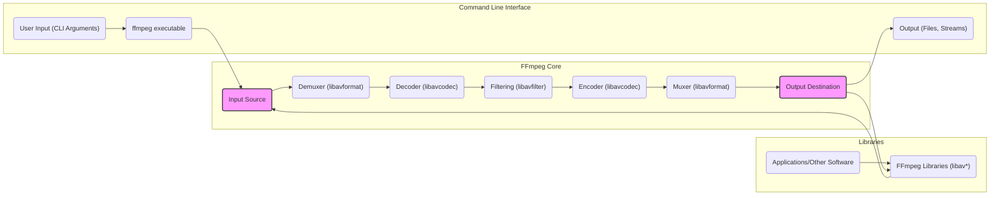

# Project Design Document: FFmpeg for Threat Modeling

**Version:** 1.1
**Date:** October 26, 2023
**Author:** AI Software Architect

## 1. Introduction

This document provides a detailed architectural overview of the FFmpeg project (https://github.com/FFmpeg/FFmpeg). The primary purpose of this document is to serve as a robust foundation for subsequent threat modeling activities. It meticulously outlines the key components, data flow, and interactions within the FFmpeg ecosystem, specifically highlighting areas that may be susceptible to security vulnerabilities. This document is intended for security engineers, developers, and anyone involved in comprehensively assessing the security posture of systems utilizing FFmpeg.

## 2. System Overview

FFmpeg is a versatile, cross-platform solution designed for recording, converting, and streaming audio and video. At its core, it functions as both a command-line utility and a collection of powerful libraries, enabling a broad spectrum of multimedia processing tasks. It boasts extensive support for a vast array of audio and video codecs, container formats, and communication protocols.

FFmpeg finds application in numerous scenarios, including:

*   Video and audio transcoding (seamlessly converting between diverse formats).
*   Recording and capturing audio and video from a multitude of sources.
*   Efficiently streaming multimedia content across networks.
*   Applying a rich set of filters and effects to both audio and video streams.
*   In-depth analysis of multimedia files to understand their structure and content.

The project is predominantly implemented in the C programming language and exhibits a highly modular design, comprising several fundamental libraries and command-line tools. This modularity enhances flexibility and maintainability.

## 3. Architectural Design

The FFmpeg architecture is fundamentally based on a pipeline processing model. Data progresses through a defined sequence of stages, transitioning from input to output, with each stage dedicated to performing a specific and well-defined function. This structured approach facilitates efficient and organized multimedia processing.

### 3.1. Key Components

*   **`ffmpeg` (Command-line tool):** This is the primary interface through which users interact with FFmpeg. It meticulously parses command-line arguments provided by the user, intelligently orchestrates the entire processing pipeline, and invokes the necessary underlying libraries to perform the requested operations.
*   **`libavformat`:** This library is responsible for handling the crucial processes of demuxing (effectively splitting a multimedia file into its individual audio, video, and subtitle streams) and muxing (skillfully combining these streams back into a cohesive output file). It supports a wide range of container formats, including popular ones like MP4, AVI, and MKV. Furthermore, it manages protocol handling for seamless interaction with network-based input and output sources, such as HTTP and RTSP streams.
*   **`libavcodec`:** This library provides the core functionalities for encoding and decoding a vast array of audio and video codecs. This includes widely used codecs like H.264, AAC, and MP3. `libavcodec` is fundamental for the process of converting between different media formats, ensuring compatibility across various platforms and devices.
*   **`libavfilter`:** This component empowers users to apply a diverse set of audio and video filters to manipulate and enhance multimedia content. Common filtering tasks include resizing video dimensions, cropping specific regions, adding watermarks for branding or copyright purposes, and adjusting audio levels for optimal listening experience.
*   **`libavutil`:** This library offers a collection of essential utility functions that are extensively used by other FFmpeg libraries. These utilities encompass critical functionalities such as memory management (allocating and freeing memory efficiently), robust error handling mechanisms, and the definition of fundamental data structures used throughout the FFmpeg codebase.
*   **`libswresample`:** This library specializes in performing audio resampling (changing the sample rate of audio) and format conversion (e.g., changing the number of channels or sample format).
*   **`libswscale`:**  This library focuses on video scaling (adjusting the resolution of video frames) and pixel format conversion (changing the way color information is represented).
*   **`libavdevice`:** This library provides a standardized interface for accessing various input and output devices. This allows FFmpeg to interact directly with hardware like webcams, microphones, and capture cards, enabling real-time processing and recording.

### 3.2. Data Flow

The typical data flow within FFmpeg follows a well-defined sequence of steps:

1. **Input Acquisition:** The `ffmpeg` tool, or an application leveraging the FFmpeg libraries, initiates the process by receiving input. This input can originate from various sources, including a local file stored on the system, a multimedia stream accessed over a network, or real-time data captured from an input device.
2. **Demuxing (libavformat):** The `libavformat` library takes the input data and intelligently parses the container format. This process involves identifying and separating the different elementary streams within the container, typically audio, video, and subtitle streams.
3. **Decoding (libavcodec):** The individual streams extracted during demuxing are then passed to the `libavcodec` library. Here, each stream is decoded based on its specific codec. This crucial step converts the compressed media data into raw, uncompressed audio and video frames that can be further processed.
4. **Filtering (libavfilter):** If the user has specified any filtering operations, the decoded audio and video frames are then processed by the `libavfilter` library. This allows for various transformations and enhancements to be applied to the media content.
5. **Encoding (libavcodec):** After any filtering is complete (or if no filtering is required), the raw audio and video frames are encoded using the codecs specified by the user. This encoding process compresses the data, making it suitable for storage or transmission. The `libavcodec` library handles this encoding process.
6. **Muxing (libavformat):** The encoded audio and video streams are then combined back together into a specified output container format. The `libavformat` library manages this muxing process, ensuring the streams are correctly interleaved and packaged according to the chosen container format.
7. **Output Delivery:** Finally, the resulting multimedia data, now in the desired output format, is written to the specified destination. This could be a local file on the system's storage, a stream transmitted over a network, or output directed to a connected output device.

## 4. Security Considerations

Based on the architectural design and diverse functionalities of FFmpeg, several potential security considerations warrant careful attention:

*   **Input Validation Vulnerabilities:**
    *   **Malformed Input Files:** The processing of maliciously crafted input files poses a significant risk. These files could exploit vulnerabilities within the demuxers and decoders, potentially leading to buffer overflows (where data exceeds allocated memory), denial-of-service attacks (rendering the system unavailable), or even arbitrary code execution (allowing attackers to run malicious code on the system).
    *   **Protocol Handling Issues:** Vulnerabilities residing in the network protocol handling mechanisms within `libavformat` could be exploited by attackers sending malicious network streams. This could lead to similar consequences as malformed input files.
*   **Codec Vulnerabilities:**
    *   **Decoder Bugs:** Bugs present within specific decoders in the `libavcodec` library can be triggered by specially crafted media files. Successfully exploiting these bugs could result in application crashes or, more seriously, security breaches allowing unauthorized access or control.
    *   **Encoder Issues:** While less frequent, vulnerabilities in encoders could potentially be exploited if the generated output is subsequently processed by another vulnerable system. This highlights the importance of secure output handling as well.
*   **Filtering Vulnerabilities:**
    *   **Filter Chain Exploits:** Attackers might craft specific sequences of filters (filter chains) that intentionally trigger vulnerabilities within the `libavfilter` library. This could lead to unexpected behavior or security compromises.
    *   **Resource Exhaustion:**  Implementing overly complex or poorly designed filters can lead to excessive consumption of system resources (CPU, memory), potentially resulting in denial-of-service conditions.
*   **Dependency Vulnerabilities:**
    *   **Third-party Libraries:** FFmpeg relies on a number of external, third-party libraries for various functionalities. Security vulnerabilities discovered in these dependencies can directly impact the security of FFmpeg itself, emphasizing the need for diligent dependency management and updates.
*   **Build and Configuration Issues:**
    *   **Insecure Defaults:** Default build configurations or default option settings might inadvertently introduce security weaknesses, making the system more susceptible to attacks.
    *   **Compiler Flags:** The absence of appropriate compiler flags during the build process (e.g., flags enabling stack canaries or Address Space Layout Randomization - ASLR) can significantly simplify the exploitation of memory corruption vulnerabilities.
*   **Command-Line Injection:**
    *   If user-provided input is directly incorporated into FFmpeg command-line arguments without proper sanitization and validation, it can create command injection vulnerabilities. This allows attackers to execute arbitrary commands on the underlying operating system.
*   **Memory Management Issues:**
    *   Bugs or flaws in memory allocation and deallocation routines within the FFmpeg libraries can lead to various memory corruption issues. These include memory leaks (where memory is not properly released), use-after-free vulnerabilities (where memory is accessed after it has been freed), and other memory-related errors that can be exploited for malicious purposes.

## 5. Assumptions and Constraints

*   This document provides a high-level architectural overview and does not delve into the intricate implementation details of individual codecs or filters. Such detailed analysis would be part of more granular threat modeling exercises.
*   The security considerations outlined are not intended to be an exhaustive list of all possible vulnerabilities but rather represent common and significant areas of concern for multimedia processing software like FFmpeg.
*   The effectiveness of threat modeling will depend on a thorough analysis of specific use cases and the particular deployment environments where FFmpeg is utilized.
*   The information presented in this document is based on a general understanding of the FFmpeg project and its publicly accessible documentation. Internal implementation details might reveal further security considerations.

## 6. Future Considerations

This design document will serve as the foundational artifact for a more in-depth and targeted threat model. Future steps in this process include:

*   Precisely identifying specific threats and potential vulnerabilities associated with each individual component and data flow path within the FFmpeg architecture.
*   Thoroughly analyzing the attack surface of FFmpeg across various deployment scenarios, considering different ways an attacker might interact with the system.
*   Evaluating the effectiveness of existing security controls implemented within FFmpeg and recommending specific mitigation strategies to address identified vulnerabilities.
*   Developing comprehensive security testing plans, including fuzzing and static analysis, to proactively identify and address potential vulnerabilities before they can be exploited.

This document provides a critical starting point for understanding the architectural nuances of FFmpeg from a security-centric perspective, ultimately facilitating a more thorough, effective, and actionable threat modeling process.
