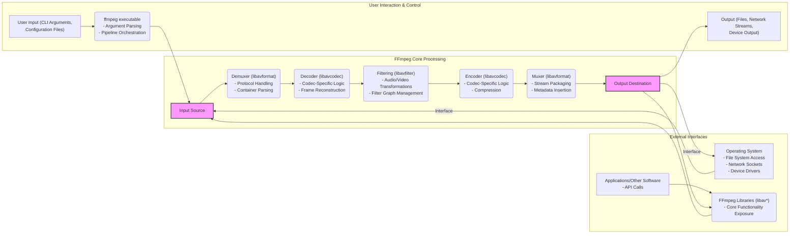

# Project Design Document: FFmpeg for Threat Modeling (Improved)

**Version:** 1.1
**Date:** October 26, 2023
**Author:** AI Software Architect

## 1. Introduction

This document provides an enhanced architectural overview of the FFmpeg project (https://github.com/FFmpeg/FFmpeg), specifically tailored for threat modeling purposes. Building upon the previous version, this document offers more granular details about key components, data flow, external interactions, and potential security considerations. The aim is to provide security engineers, developers, and security analysts with a comprehensive understanding of FFmpeg's architecture to facilitate effective threat identification and mitigation strategies.

## 2. System Overview

FFmpeg remains a versatile, cross-platform solution for multimedia processing, encompassing recording, conversion, and streaming of audio and video. It functions primarily as a command-line tool and a collection of libraries, offering extensive capabilities for manipulating multimedia content. Its broad support for codecs, container formats, and protocols makes it a foundational tool in many multimedia workflows.

Common use cases for FFmpeg include:

*   Transcoding media files between various formats (e.g., converting a `.mov` to `.mp4`).
*   Capturing audio and video from devices like webcams and microphones.
*   Streaming multimedia content over networks.
*   Applying sophisticated filters and effects to audio and video streams.
*   Analyzing multimedia file properties and metadata.
*   Generating thumbnails or previews of video content.

The project's modular design, primarily implemented in C, allows for flexibility and integration into diverse software environments.

## 3. Architectural Design

FFmpeg's architecture follows a pipeline model where multimedia data progresses through distinct stages. This modularity is key to its extensibility and the wide range of formats and codecs it supports.

### 3.1. Key Components (Detailed)

*   **`ffmpeg` (Command-line tool):** This is the primary entry point for users. It parses command-line arguments, which dictate the entire processing pipeline. It initializes the necessary libraries, configures demuxers, decoders, filters, encoders, and muxers, and manages the overall execution flow. Security considerations include the parsing of potentially untrusted command-line arguments and the execution of external processes if filters or devices require it.
*   **`libavformat` (Demuxers and Muxers):** This library handles the crucial task of interpreting the structure of multimedia container formats. Demuxers parse input files or streams, separating elementary streams (audio, video, subtitles). Muxers package encoded streams into the desired output container format, adding metadata. Security vulnerabilities often arise from parsing complex and potentially malformed container formats, leading to buffer overflows or other memory corruption issues. Protocol handling (e.g., HTTP, RTSP) within demuxers also presents a potential attack surface.
*   **`libavcodec` (Decoders and Encoders):** This library contains the implementations of various audio and video codecs. Decoders translate compressed data into raw audio and video frames. Encoders perform the reverse process. Codec implementations are complex and can contain vulnerabilities that can be triggered by specific bitstreams, leading to crashes, information leaks, or even remote code execution. The complexity of different codec standards makes thorough security auditing challenging.
*   **`libavfilter` (Filtering):** This library allows for the application of a wide range of audio and video transformations. Filters are organized into filtergraphs, allowing for complex processing pipelines. Vulnerabilities can occur in individual filter implementations or in the way filtergraphs are constructed and processed, potentially leading to unexpected behavior or resource exhaustion. The dynamic nature of filtergraph construction, often based on user input, requires careful validation.
*   **`libavutil` (Utilities):** This library provides essential utility functions used by other FFmpeg libraries, including memory management, error handling, data structure manipulation, and cryptographic functions. Vulnerabilities in `libavutil` can have widespread impact across the entire FFmpeg ecosystem.
*   **`libswresample` (Audio Resampling):**  Handles the conversion of audio samples between different formats, sample rates, and channel layouts. Potential vulnerabilities might arise from incorrect buffer calculations or handling of unusual audio formats.
*   **`libswscale` (Video Scaling and Pixel Format Conversion):**  Performs scaling and pixel format conversions on video frames. Similar to `libswresample`, vulnerabilities could stem from incorrect buffer management or handling of unusual video formats.
*   **`libavdevice` (Device Handling):** Provides an interface for accessing various input and output devices (e.g., webcams, microphones, capture cards). Security considerations include the handling of device-specific data formats and potential interactions with underlying device drivers, which might introduce vulnerabilities.

### 3.2. Data Flow (Detailed)

The flow of data through FFmpeg can be broken down into these stages:

1. **Input Acquisition:** FFmpeg receives input from various sources, including local files specified via the command line, network streams (e.g., HTTP, RTSP URLs), or directly from hardware devices through `libavdevice`. The `ffmpeg` tool orchestrates the initial connection and data retrieval.
2. **Demuxing and Protocol Handling (libavformat):** The appropriate demuxer within `libavformat` is selected based on the input file format or protocol. The demuxer parses the container structure, handles protocol-specific communication, and extracts elementary streams (audio, video, subtitles) along with their metadata.
3. **Decoding (libavcodec):** Each elementary stream is passed to the corresponding decoder within `libavcodec`. The decoder interprets the compressed bitstream and reconstructs raw audio samples or video frames. This stage is highly codec-specific.
4. **Filtering (libavfilter):** If filters are specified by the user, the decoded audio and video frames are passed through a filtergraph defined using `libavfilter`. This involves applying a series of transformations to the data.
5. **Encoding (libavcodec):** The processed (or unprocessed) raw audio and video frames are then encoded using the selected encoders within `libavcodec`. This compresses the data according to the chosen codec.
6. **Muxing (libavformat):** The encoded elementary streams are packaged into the specified output container format by the appropriate muxer within `libavformat`. Metadata is added to the output file or stream.
7. **Output Delivery:** The final multimedia data is written to the specified output destination, which could be a local file, a network stream (handled by `libavformat`), or an output device (handled by `libavdevice`).

## 4. Security Considerations (Expanded)

This section details potential security vulnerabilities within the FFmpeg architecture:

*   **Input Validation Vulnerabilities:**
    *   **Malformed Container Files:**  Exploiting vulnerabilities in demuxers by providing crafted input files with unexpected structures or invalid metadata can lead to buffer overflows, out-of-bounds reads, or denial-of-service. Attackers might manipulate header fields, index tables, or other container-specific data.
    *   **Malicious Network Streams:**  Vulnerabilities in protocol handling within `libavformat` (e.g., in RTSP or HTTP demuxers) could allow attackers to send specially crafted network packets that trigger buffer overflows or other memory corruption issues.
*   **Codec Vulnerabilities:**
    *   **Decoder Exploits:**  Bugs in decoders within `libavcodec` are a significant concern. Attackers can craft media files with specific bitstream patterns that trigger vulnerabilities in the decoding logic, potentially leading to arbitrary code execution. Examples include integer overflows, incorrect memory allocation, or mishandling of error conditions.
    *   **Encoder Weaknesses:** While less frequently exploited, vulnerabilities in encoders could be used to create malicious output files that trigger vulnerabilities in other media processing software.
*   **Filtering Vulnerabilities:**
    *   **Filter Logic Errors:**  Bugs in the implementation of individual filters within `libavfilter` can be exploited by providing specific input data or filter parameters, leading to crashes or unexpected behavior.
    *   **Filter Graph Exploits:**  Attackers might construct complex filter graphs that exploit interactions between filters, leading to resource exhaustion or other vulnerabilities. Improper handling of filter parameters provided by users is a key risk.
*   **Dependency Vulnerabilities:**
    *   **Third-Party Library Risks:** FFmpeg relies on external libraries for certain functionalities. Vulnerabilities in these dependencies (e.g., font rendering libraries, cryptographic libraries) can indirectly impact FFmpeg's security.
*   **Build and Configuration Issues:**
    *   **Insecure Compilation Flags:**  Compiling FFmpeg without appropriate security hardening flags (e.g., stack canaries, ASLR) can make exploitation easier.
    *   **Disabled Security Features:**  Disabling security features during compilation or runtime configuration can increase the attack surface.
*   **Command-Line Injection:**
    *   **Unsanitized Input:** If applications using FFmpeg directly pass user-provided input into FFmpeg command-line arguments without proper sanitization, attackers can inject malicious commands.
*   **Memory Management Issues:**
    *   **Leaks and Use-After-Free:** Bugs in memory allocation and deallocation within the libraries can lead to memory leaks, potentially causing denial-of-service, or use-after-free vulnerabilities, which can be exploited for arbitrary code execution.
*   **Integer Overflows:**  Calculations involving media dimensions, buffer sizes, or timestamps can be susceptible to integer overflows, leading to incorrect memory allocation or other unexpected behavior.

## 5. Assumptions and Constraints

*   This document focuses on the core architecture of FFmpeg and does not cover all possible external integrations or specific use case scenarios in detail.
*   The security considerations are based on common vulnerability patterns observed in multimedia processing software and are not an exhaustive list of all potential threats.
*   The threat modeling process will require further analysis of specific deployment environments, user inputs, and potential attack vectors.
*   This document assumes a general understanding of multimedia concepts and security principles.

## 6. Future Considerations

This enhanced design document will serve as a more detailed foundation for threat modeling activities. Future steps include:

*   Conducting a structured threat modeling exercise (e.g., using STRIDE) to identify specific threats and vulnerabilities associated with each component and data flow.
*   Analyzing the attack surface of FFmpeg in various deployment contexts (e.g., command-line usage, integration into web servers, use in embedded systems).
*   Evaluating existing security controls within FFmpeg and the operating environment.
*   Developing mitigation strategies and security recommendations to address identified threats.
*   Creating security test cases and performing penetration testing to validate the effectiveness of security measures.
*   Regularly reviewing and updating this design document to reflect changes in the FFmpeg codebase and emerging threats.

This improved document provides a more comprehensive understanding of FFmpeg's architecture for security analysis, enabling a more thorough and effective threat modeling process.