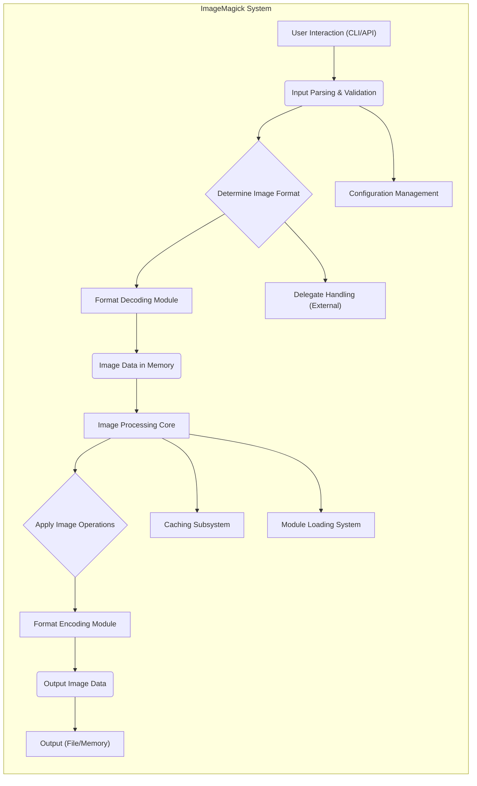
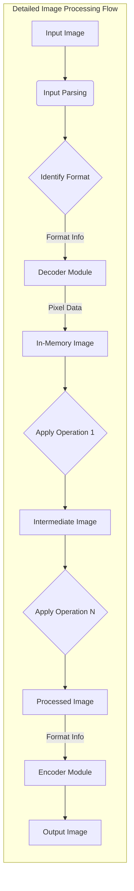

# Project Design Document: ImageMagick

**Version:** 1.1
**Date:** October 26, 2023
**Author:** Gemini (AI Language Model)

## 1. Introduction

This document provides an enhanced design overview of the ImageMagick software suite, building upon the previous version. ImageMagick is a versatile open-source software library and a collection of command-line tools designed for displaying, converting, and editing a wide array of raster and vector image file formats. This document aims to provide a more detailed understanding of ImageMagick's architecture, its core components, the flow of data within the system, and critical security considerations. This enhanced detail will facilitate more effective threat modeling activities.

## 2. Goals and Objectives

The fundamental goals of ImageMagick are:

*   To offer a comprehensive and extensible toolkit for image manipulation tasks.
*   To provide broad support for a diverse range of image file formats, both common and specialized.
*   To ensure cross-platform compatibility, enabling operation across various operating systems.
*   To facilitate extensibility, allowing users and developers to integrate custom functionalities and support for new formats.
*   To maintain high performance and efficiency in image processing operations, crucial for responsiveness and resource utilization.

This design document specifically focuses on elucidating the internal mechanisms of ImageMagick to better identify potential security vulnerabilities and attack surfaces.

## 3. High-Level Architecture

ImageMagick's architecture is inherently modular, comprising several interconnected components that work together to achieve its functionality. The key components are:

*   **Command-Line Interface (CLI):**  A set of executable utilities that provide users with direct access to ImageMagick's image manipulation capabilities through command-line commands.
*   **Application Programming Interfaces (APIs):** Libraries available in multiple programming languages (including C, C++, Perl, Python, and PHP) that allow developers to embed ImageMagick's functionality within their own applications.
*   **Image Processing Core:** The central engine responsible for the fundamental operations of reading, processing, and writing image data. This includes memory management for image pixels and metadata.
*   **Configuration Management:** A system for managing various settings, including supported image formats, mappings to external delegate programs, and resource usage limits.
*   **Delegate Handling:** A mechanism that allows ImageMagick to utilize external, third-party programs to handle image formats or operations for which it lacks native support.
*   **Module Loading System:** Enables the dynamic loading of external modules (e.g., shared libraries) to extend ImageMagick's capabilities, particularly for supporting specific image encoding and decoding formats.
*   **Caching Subsystem:**  Improves performance by storing frequently accessed image data, intermediate processing results, and other resources in memory or on disk.

## 4. Component-Level Design

This section provides a more granular view of the key components and their responsibilities.

### 4.1. Command-Line Interface (CLI)

*   Consists of various executable programs such as `convert`, `identify`, `mogrify`, `composite`, etc., each designed for specific image manipulation tasks.
*   Responsible for parsing command-line arguments provided by the user, interpreting the desired operations, and identifying input and output files.
*   Acts as a front-end, invoking the Image Processing Core and other internal components to execute the requested commands.

### 4.2. Application Programming Interfaces (APIs)

*   Provides a set of functions, data structures, and classes that allow software developers to integrate ImageMagick's image processing capabilities directly into their applications.
*   Offers language-specific bindings, abstracting the underlying C implementation and providing a more natural interface for different programming languages.
*   Enables programmatic control over image manipulation, allowing for dynamic and automated image processing workflows.

### 4.3. Image Processing Core

*   The central engine of ImageMagick, responsible for managing image data in memory and executing image manipulation algorithms.
*   Handles the representation of images internally, including pixel data, color profiles, and metadata.
*   Implements a wide range of image processing algorithms, including resizing, cropping, color adjustments, filtering, format conversion, and more.
*   Manages memory allocation and deallocation for image data to prevent leaks and ensure efficient resource utilization.
*   Orchestrates the interaction between format decoders and encoders during image loading and saving.

### 4.4. Configuration Management

*   Manages various configuration settings that govern ImageMagick's behavior.
*   Reads configuration files (e.g., `policy.xml`, `delegates.xml`, `type.xml`) at startup to load settings related to:
    *   Supported image formats and the associated decoder/encoder modules.
    *   Definitions of delegate programs for handling specific file types.
    *   Resource limits, such as maximum memory usage, disk space, and processing time.
    *   Security policies, including restrictions on certain coders, delegates, and operations.
*   Provides a mechanism for administrators to customize and secure ImageMagick's operation.

### 4.5. Delegate Handling

*   Allows ImageMagick to extend its capabilities by invoking external programs to handle tasks it cannot perform natively.
*   The `delegates.xml` file defines mappings between file extensions or MIME types and the corresponding external programs to be executed.
*   When ImageMagick encounters a file format for which it has a delegate defined, it constructs a command-line string based on the delegate definition and executes the external program.
*   This mechanism is crucial for supporting a wide range of formats but introduces security considerations related to the execution of external commands.

### 4.6. Module Loading System

*   Provides a dynamic mechanism for extending ImageMagick's functionality through loadable modules (typically shared libraries or DLLs).
*   Used primarily for adding support for new image formats (coders) and image processing filters.
*   Modules are loaded on demand when a specific format needs to be processed or a particular filter is requested.
*   This modular design allows for a more maintainable and extensible codebase.

### 4.7. Caching Subsystem

*   Improves performance by storing frequently accessed data in memory or on disk.
*   Caches include:
    *   Decoded pixel data of images.
    *   Intermediate results of image processing operations.
    *   Font data used for text rendering.
    *   Other resources that are expensive to load or generate repeatedly.
*   The caching behavior can be configured to balance memory usage and performance.

## 5. Data Flow

The typical flow of data within ImageMagick during an image processing operation involves these stages:

1. **Input Reception:** The process begins with the user providing input, either through command-line arguments to a CLI utility or through function calls to the API from within an application. This input specifies the source image file(s) and the desired operations.
2. **Input Parsing and Validation:** The CLI or API component parses the user's input, validating the syntax and ensuring that the requested operations are valid. This stage may involve checking file paths and command parameters.
3. **Image Format Determination:** ImageMagick analyzes the input file (typically by examining its header or file extension) to determine its format.
4. **Decoding Phase:** Based on the identified format, the appropriate format decoder module is loaded and invoked. This module reads the image data from the input file and decodes it into an internal, in-memory representation that ImageMagick can work with.
5. **In-Memory Image Representation:** The decoded image data is stored in memory, typically as a multi-dimensional array of pixel values, along with associated metadata such as image dimensions, color profile, and resolution.
6. **Processing Operations:** The Image Processing Core then applies the requested transformations and manipulations to the in-memory image data. This may involve a series of processing steps, utilizing various algorithms depending on the desired outcome (e.g., resizing, color correction, filtering).
7. **Encoding Phase:** Once the processing is complete, the appropriate format encoder module is selected based on the desired output format. This module takes the processed in-memory image data and encodes it into the specified output format.
8. **Output Generation:** The encoded image data is then written to the specified output file or returned to the calling application through the API.

## 6. Security Considerations

Security is a paramount concern for ImageMagick due to its widespread use and the nature of image processing, which involves handling potentially untrusted data. Key security considerations include:

*   **Robust Input Validation:** Thorough validation of input image files is crucial to prevent vulnerabilities such as buffer overflows, heap overflows, and denial-of-service attacks. This includes verifying file headers, magic numbers, dimensions, color depth, and other metadata against expected values and limits.
*   **Secure Memory Management:** Proper allocation, deallocation, and handling of memory are essential to prevent memory leaks, dangling pointers, and buffer overflows during image processing operations. This is particularly important when dealing with large image files.
*   **Delegate Security Best Practices:** Executing external programs through the delegate mechanism introduces significant security risks. Strict sanitization of input passed to delegates is necessary to prevent command injection vulnerabilities. The `policy.xml` file should be carefully configured to restrict delegate usage to trusted programs and limit their capabilities. Consider using absolute paths for delegates and avoiding user-supplied data in delegate commands where possible.
*   **Prevention of Integer Overflows:** Image processing algorithms often involve arithmetic operations on pixel values and image dimensions. Care must be taken to prevent integer overflows that could lead to unexpected behavior, incorrect calculations, or exploitable vulnerabilities. Use of safe arithmetic functions and range checking is recommended.
*   **Secure File System Operations:** When reading and writing files, ImageMagick must handle file paths securely to prevent path traversal vulnerabilities. Avoid constructing file paths based on user-supplied input without proper validation and sanitization.
*   **Resource Limit Enforcement:** Setting and enforcing appropriate resource limits (e.g., maximum memory usage, processing time, file size) can help mitigate denial-of-service attacks that attempt to exhaust system resources. The `policy.xml` file allows for configuring these limits.
*   **Third-Party Library Vulnerability Management:** ImageMagick relies on various external libraries for supporting different image formats and functionalities. Regularly updating these libraries and monitoring for known vulnerabilities is crucial.
*   **Policy Enforcement and Least Privilege:** The `policy.xml` file provides a powerful mechanism for restricting potentially dangerous operations. This should be configured according to the principle of least privilege, disabling any functionality that is not strictly necessary.
*   **Mitigation of Type Confusion Vulnerabilities:** Ensure that image types and data structures are handled correctly throughout the processing pipeline to prevent type confusion vulnerabilities, which can lead to memory corruption.
*   **Protection Against Billion Laughs/XML Bomb Attacks:** When processing XML-based image formats (like SVG), implement safeguards against entity expansion attacks (Billion Laughs) that can consume excessive memory and processing power.

## 7. Deployment Considerations

ImageMagick is deployed in various environments, each with its own security implications:

*   **Desktop Applications:** Used as a command-line tool or integrated library in desktop software. Security risks are primarily related to local file access and user privileges.
*   **Web Servers:** Frequently used on web servers to dynamically generate or manipulate images based on user requests. This is a high-risk environment where vulnerabilities can be exploited remotely. Input validation and secure delegate handling are critical.
*   **Cloud Environments:** Deployed in cloud environments for scalable image processing services. Security considerations include securing API endpoints, managing access controls, and protecting against resource exhaustion.
*   **Embedded Systems:** Can be used in embedded systems for image processing tasks. Resource constraints and the need for a small footprint are important considerations, along with security hardening.

## 8. Future Considerations

Future development efforts for ImageMagick could focus on:

*   **Enhanced Security Audits and Static Analysis:** Implementing more rigorous security testing and static analysis tools to identify potential vulnerabilities proactively.
*   **Improved Sandboxing or Isolation Techniques:** Exploring ways to further isolate the image processing engine and delegate execution to limit the impact of potential vulnerabilities.
*   **Modernization of Codebase for Security:** Adopting more modern programming practices and language features that inherently offer better security guarantees.
*   **Strengthening Default Security Policies:**  Making the default `policy.xml` more restrictive to reduce the attack surface out of the box.
*   **Formal Verification of Critical Components:** Applying formal verification techniques to critical parts of the codebase to mathematically prove their correctness and security.

This enhanced design document provides a more detailed and nuanced understanding of ImageMagick's architecture and security considerations, making it a more effective resource for threat modeling and security analysis.
