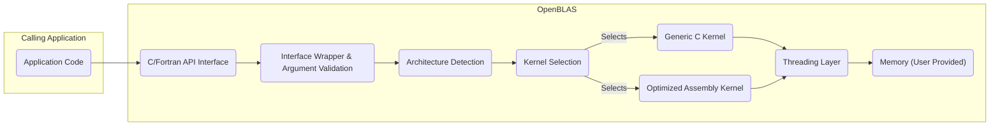

# Project Design Document: OpenBLAS

**Document Version:** 1.1
**Date:** October 26, 2023
**Prepared By:** [Your Name/Organization]

## 1. Introduction

This document provides a detailed architectural design of the OpenBLAS project, an optimized Basic Linear Algebra Subprograms (BLAS) library. This document serves as a foundation for future threat modeling activities, providing a comprehensive understanding of the system's components, data flow, and interactions.

### 1.1. Purpose

The primary purpose of this document is to clearly articulate the design and architecture of OpenBLAS. This will enable security professionals to effectively identify potential vulnerabilities and threats within the system.

### 1.2. Scope

This document covers the core architectural components of OpenBLAS, including its interfaces, internal structure, and key functionalities. It focuses on aspects relevant to security considerations, such as data handling, control flow, and external interactions.

### 1.3. Goals

*   Provide a clear and concise description of the OpenBLAS architecture.
*   Identify key components and their interactions.
*   Illustrate the flow of data within the system.
*   Highlight potential areas of security concern based on the design.

## 2. System Overview

OpenBLAS is an open-source, optimized implementation of the BLAS API. BLAS defines a set of low-level routines for performing common linear algebra operations such as vector and matrix addition, scalar multiplication, dot products, linear combinations, and matrix multiplications. OpenBLAS aims to provide high performance across a wide range of processor architectures.

### 2.1. Key Features

*   **Optimized Kernels:** Includes hand-tuned assembly kernels for various CPU architectures (x86, ARM, MIPS, etc.) to maximize performance. These are often architecture-specific implementations of standard BLAS routines.
*   **Multi-threading Support:** Utilizes multi-threading (typically via OpenMP, but can also support other threading models) to leverage multi-core processors for parallel execution of operations.
*   **C and Fortran Interfaces:** Provides standard C (CBLAS) and Fortran (FORTRAN 77 BLAS) APIs for integration with various numerical computing libraries and applications. This allows broad interoperability.
*   **Cross-Platform Compatibility:** Supports a wide range of operating systems (Linux, Windows, macOS, various BSDs) and processor architectures, making it highly portable.
*   **Dynamic Dispatch:** Selects the most appropriate kernel implementation at runtime based on factors such as data types, matrix dimensions, available hardware features (e.g., specific CPU instruction sets), and potentially even runtime performance characteristics.

## 3. Architectural Design

The OpenBLAS architecture can be broadly divided into the following layers and components:

### 3.1. API Layer

*   **C Interface (`cblas.h`):** Defines the standard C BLAS API. This is the recommended interface for new projects due to its more modern design.
*   **Fortran Interface (`f77blas.h`, `blas.h`):** Provides the traditional Fortran BLAS API, ensuring compatibility with legacy Fortran code.
*   **LAPACK Interface (`lapacke.h`, `lapack.h`):** While OpenBLAS primarily implements BLAS, it also includes some LAPACK (Linear Algebra PACKage) routines or interfaces to them, extending its functionality to higher-level linear algebra operations.

### 3.2. Dispatch Layer

*   **Interface Wrappers:** Functions that receive calls from the API layer. These wrappers perform initial argument validation (e.g., checking for null pointers, valid dimensions), data type conversions if necessary, and determine the appropriate kernel to execute based on the input parameters.
*   **Architecture Detection:** Code within OpenBLAS (often utilizing preprocessor directives and runtime checks) identifies the underlying CPU architecture and its capabilities (e.g., supported instruction sets like SSE, AVX, NEON).
*   **Kernel Selection Logic:** This component uses the detected architecture, the specific BLAS function being called, and the characteristics of the input data (e.g., data type, matrix sizes, leading dimensions) to select the most efficient kernel implementation. This might involve looking up function pointers in tables or using conditional logic.

### 3.3. Kernel Layer

*   **Generic C Kernels:** Basic, portable C implementations of BLAS routines. These serve as a fallback when optimized assembly kernels are not available for a specific architecture or operation. They prioritize correctness over peak performance.
*   **Optimized Assembly Kernels:** Hand-written assembly code tailored for specific CPU architectures and instruction sets. These kernels are the primary source of OpenBLAS's performance advantage. They are carefully crafted to exploit the specific features of the target processor.
*   **Threading Layer:**  Manages the parallel execution of BLAS operations using threads. This typically involves OpenMP directives within the kernels or calls to platform-specific threading APIs. The threading layer divides the work among available CPU cores to accelerate computations.

### 3.4. Memory Management

*   **User-Provided Memory:** OpenBLAS operates directly on memory buffers provided by the calling application. It does not typically allocate large amounts of memory internally for the primary data being processed.
*   **Internal Buffers (Limited):** Some routines might use small, temporary internal buffers for intermediate calculations or data rearrangement. The size and usage of these buffers are generally well-defined.

### 3.5. Build System

*   **Makefile/CMake:**  Used to configure and build the library for different platforms and architectures. The build system handles compiling C and assembly code, linking necessary libraries (like the threading library), and generating the final shared or static library. It allows for customization of build options, such as enabling specific CPU architectures or threading models.

## 4. Data Flow

The typical data flow for a BLAS operation in OpenBLAS is as follows:

**Detailed Steps:**

1. **Application Call:** The application code initiates a BLAS operation by calling a function through the C or Fortran API provided by OpenBLAS (Node A to Node B).
2. **Interface Handling:** The call is received by the corresponding interface function within OpenBLAS (Node B). This function acts as the entry point into the library.
3. **Argument Validation:** The interface wrapper performs essential checks on the input arguments, such as verifying pointer validity, ensuring dimensions are non-negative, and checking for potential inconsistencies (Node C).
4. **Architecture Detection:** OpenBLAS determines the specific CPU architecture and its supported features at runtime. This information is crucial for selecting the optimal kernel (Node D).
5. **Kernel Selection:** Based on the requested operation, the data types involved, the matrix dimensions, and the detected architecture, the kernel selection logic chooses the most appropriate kernel implementation. This could be a generic C kernel or a highly optimized assembly kernel (Node E).
6. **Kernel Execution:**
    *   If a generic C kernel is selected (Node F), it executes the BLAS operation using standard C code.
    *   If an optimized assembly kernel is selected (Node G), it executes the operation using hand-tuned assembly instructions specific to the detected CPU architecture, maximizing performance.
7. **Threading:** The threading layer (Node H) is invoked to parallelize the computation across multiple threads if the operation benefits from parallelism and multi-threading is enabled. This involves dividing the work among available CPU cores.
8. **Memory Access:** The selected kernel (either C or assembly) directly reads and writes data from/to the memory buffers provided by the calling application (Node I). OpenBLAS relies on the caller to manage the allocation and deallocation of these buffers.
9. **Return:** Once the computation is complete, the results are written back to the user-provided memory locations, and control is returned to the calling application.

## 5. Security Considerations (Preliminary)

Based on the architecture, some potential security considerations include:

*   **Buffer Overflows:**  A significant risk, particularly within the hand-written assembly kernels (Node G), where manual memory management is prevalent. Incorrect bounds checking during memory access could lead to buffer overflows if input dimensions are maliciously crafted or not properly validated.
*   **Integer Overflows/Underflows:** Calculations involving matrix dimensions, strides, or loop counters within the kernels (Nodes F and G) could potentially result in integer overflows or underflows. These can lead to unexpected behavior, incorrect memory access, or even exploitable conditions.
*   **Data Races (in multi-threaded execution):** When using multi-threading (Node H), concurrent access to shared memory without proper synchronization mechanisms (e.g., mutexes, locks) can lead to data races. This can result in unpredictable behavior, data corruption, and potentially exploitable vulnerabilities.
*   **Side-Channel Attacks:** Optimized assembly kernels (Node G), due to their low-level nature and direct interaction with hardware, might be susceptible to side-channel attacks. These attacks exploit information leaked through timing variations, power consumption, or other observable side effects of the computation.
*   **Supply Chain Attacks:**  The build system (Section 3.5) and dependencies are potential targets for supply chain attacks. Compromising the build process or introducing malicious code through dependencies could result in the distribution of a compromised OpenBLAS library.
*   **Argument Validation Issues:** Insufficient or incorrect validation of input arguments in the interface wrappers (Node C) can lead to various vulnerabilities. For example, failing to check for negative dimensions or excessively large values could lead to out-of-bounds memory access or integer overflows.
*   **Type Confusion:** Incorrect handling of data types or implicit type conversions within the kernels could lead to type confusion vulnerabilities, where data is interpreted as a different type than intended, potentially leading to security issues.
*   **Denial of Service (DoS):**  Providing extremely large or specially crafted input matrices could potentially lead to excessive memory consumption or very long computation times, resulting in a denial-of-service condition.

## 6. Dependencies

OpenBLAS has the following key dependencies:

*   **Compiler Toolchain:** A C and Fortran compiler (e.g., GCC, Clang, gfortran) is essential for building the library from source.
*   **Assembler:** An assembler (e.g., NASM, GAS) is required to assemble the architecture-specific assembly kernels.
*   **Build System Tools:**  Make or CMake are used to manage the build process, configure build options, and orchestrate the compilation and linking steps.
*   **Optional Dependencies:**
    *   **OpenMP Library (`libgomp`, `libomp`):** For enabling multi-threading support using OpenMP. The specific library depends on the compiler.
    *   **pthread Library:** May be used for threading on systems where OpenMP is not available or preferred.

## 7. Deployment

OpenBLAS is typically deployed as a shared or static library that is linked with applications requiring BLAS functionality.

*   **Shared Library (`.so` on Linux, `.dylib` on macOS, `.dll` on Windows):** The library is dynamically linked at runtime. This reduces the size of the application executable and allows for easier updates to the OpenBLAS library.
*   **Static Library (`.a` on Linux/macOS, `.lib` on Windows):** The library code is directly embedded into the application's executable during the linking process. This results in a larger executable but eliminates runtime dependencies on the OpenBLAS library.

## 8. Future Considerations

*   **Formal Verification of Kernels:** Applying formal verification techniques to critical assembly kernels could help in proving their correctness and absence of certain types of vulnerabilities.
*   **AddressSanitizer/MemorySanitizer Integration:**  Integrating AddressSanitizer (ASan) and MemorySanitizer (MSan) into the testing and development process can help detect memory-related errors (e.g., buffer overflows, use-after-free) early on.
*   **Strengthening Input Validation:** Implementing more robust and comprehensive input validation and sanitization at the API level can prevent many potential vulnerabilities.
*   **Secure Build Pipeline:** Implementing a secure build pipeline with checks for known vulnerabilities in dependencies and measures to prevent tampering can mitigate supply chain risks.
*   **Exploration of Memory-Safe Languages:** Investigating the feasibility of rewriting performance-critical sections in memory-safe languages could reduce the risk of memory-related vulnerabilities.
*   **Fuzzing:** Utilizing fuzzing techniques to automatically generate and test various inputs can help uncover unexpected behavior and potential vulnerabilities.

This document provides a more detailed and refined understanding of the OpenBLAS architecture for threat modeling purposes. Further in-depth analysis of specific components and code sections will be necessary to identify and mitigate concrete security risks.
