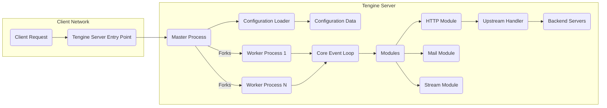
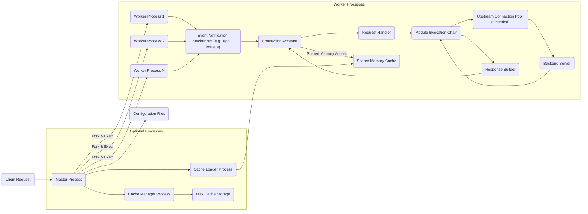
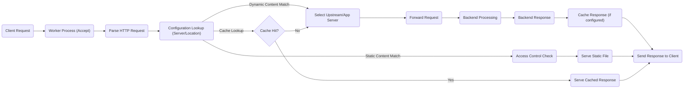

# Project Design Document: Alibaba Tengine Web Server

**Version:** 1.1
**Date:** October 26, 2023
**Author:** AI Software Architect

## 1. Introduction

This document provides an enhanced and detailed design overview of the Alibaba Tengine web server project, based on the information available at [https://github.com/alibaba/tengine](https://github.com/alibaba/tengine). This revised document aims to offer a more comprehensive and nuanced understanding of the system's architecture, core components, and request processing flow. This deeper understanding is crucial for effective threat modeling and the development of robust security strategies.

Tengine, inheriting its foundation from the widely-used Nginx server, incorporates performance optimizations and additional features developed by Alibaba. This document delves into the architectural nuances that differentiate Tengine and highlights areas relevant to security considerations.

## 2. Goals and Objectives

The primary goals of this design document are:

*   To provide a clear, concise, and improved description of the Tengine web server architecture, emphasizing security-relevant aspects.
*   To identify and elaborate on the key components and their interactions within the system, with a focus on potential security implications.
*   To illustrate the typical data flow for processing client requests in greater detail, highlighting points of potential vulnerability.
*   To explicitly outline potential areas of security concern based on the refined architectural design, providing concrete examples.
*   To serve as a more robust and detailed foundational document for future threat modeling exercises, enabling more precise and effective analysis.

## 3. System Architecture

### 3.1. High-Level Architecture

Tengine, like its Nginx predecessor, utilizes an event-driven, asynchronous, non-blocking architecture. This design enables efficient handling of numerous concurrent connections with minimal resource overhead.

*   **Client Request:** An incoming request from a client (e.g., a web browser, API client).
*   **Tengine Server Entry Point:** The initial point of contact for client requests, typically listening on specific ports.
*   **Master Process:** The privileged process responsible for configuration loading, worker process management, and signal handling.
*   **Configuration Loader:** The component responsible for reading and parsing the configuration files.
*   **Configuration Data:** The loaded configuration settings that dictate Tengine's behavior.
*   **Worker Process 1...N:** Non-privileged processes that handle client connections and process requests.
*   **Core Event Loop:** The central mechanism within worker processes that manages asynchronous events and I/O operations.
*   **Modules:** Loadable units of code that extend Tengine's functionality.
    *   **HTTP Module:** Handles HTTP and HTTPS protocol processing.
    *   **Mail Module:** Manages mail proxying functionalities (SMTP, POP3, IMAP).
    *   **Stream Module:** Facilitates TCP and UDP proxying.
*   **Upstream Handler:** Manages connections to backend servers for load balancing and proxying.
*   **Backend Servers:** The servers hosting the actual application logic or content.

### 3.2. Detailed Architecture

Tengine's architecture is based on a master-worker process model, enhancing stability and performance.

*   **Master Process:**
    *   Reads and validates the server configuration from files (e.g., `nginx.conf`).
    *   Binds to configured listening ports.
    *   Creates and manages worker processes, restarting them if necessary.
    *   Performs privileged operations, such as opening log files.
*   **Worker Processes:**
    *   Accept incoming client connections.
    *   Process requests and generate responses.
    *   Operate independently in a non-blocking, event-driven manner, maximizing concurrency.
    *   Typically, the number of worker processes is configured to match the number of CPU cores.
*   **Cache Loader Process (Optional):**
    *   Pre-loads cached data into shared memory during startup to improve initial performance.
*   **Cache Manager Process (Optional):**
    *   Manages the disk-based cache, including evicting expired or less frequently used entries.

*   **Configuration Files:** Plain text files (typically `nginx.conf` and files included within) that define the server's behavior, including virtual hosts, routing rules, and module settings.
*   **Event Notification Mechanism:**  An operating system feature (e.g., `epoll` on Linux, `kqueue` on BSD) that allows worker processes to efficiently monitor multiple file descriptors for events without blocking.
*   **Connection Acceptor:**  The part of the worker process responsible for accepting new client connections.
*   **Request Handler:**  Parses the incoming request, including headers and body, and determines the appropriate course of action.
*   **Module Invocation Chain:**  A sequence of modules that are invoked to process the request, based on the configuration. This allows for flexible and extensible request processing.
*   **Upstream Connection Pool:**  A pool of persistent connections to backend servers, improving performance by reducing connection overhead.
*   **Shared Memory Cache:**  An in-memory cache segment accessible by all worker processes, used for storing frequently accessed data like SSL session tickets or small cached responses.
*   **Disk Cache Storage:**  Persistent storage on disk for caching larger or less frequently accessed content.

## 4. Key Components

*   **Core:** The fundamental part of Tengine, managing worker processes, handling events through the event loop, and providing the infrastructure for module loading and interaction. It is responsible for the overall stability and performance of the server.
*   **HTTP Module (`ngx_http_module`):**  The central module for handling HTTP and HTTPS traffic. It encompasses functionalities like request parsing, header manipulation, content serving (static files, proxying), compression, and SSL/TLS termination. Security configurations within this module are critical.
*   **Server Blocks (`server` directive):** Define virtual hosts, enabling a single Tengine instance to host multiple websites or applications using different domain names or IP addresses. Misconfigurations here can lead to unintended access or information disclosure.
*   **Location Blocks (`location` directive):**  Specify how different URIs or URI patterns within a server block should be handled. This allows for granular control over access, caching, and proxying for different parts of a website. Improperly configured location blocks can create security vulnerabilities.
*   **Upstream Module (`ngx_http_upstream_module`):** Enables Tengine to act as a reverse proxy and load balancer, distributing incoming requests across multiple backend servers. Security considerations include securing communication with backend servers and preventing information leakage.
*   **Cache Modules (`ngx_http_proxy_cache_module`, `ngx_http_fastcgi_cache_module`, etc.):** Implement caching mechanisms to reduce load on backend servers and improve response times. Security concerns include cache poisoning and the potential exposure of sensitive data if caching is not configured correctly.
*   **SSL/TLS Module (`ngx_http_ssl_module`):** Provides support for secure HTTPS connections using SSL/TLS encryption. Proper configuration of cipher suites, protocols, and certificates is crucial for maintaining confidentiality and integrity.
*   **Mail Proxy Modules (`ngx_mail_core_module`, `ngx_mail_proxy_module`):**  Enable Tengine to act as a mail proxy server for protocols like SMTP, POP3, and IMAP. Security considerations involve securing the proxying of mail traffic and preventing unauthorized access.
*   **Stream Module (`ngx_stream_core_module`, `ngx_stream_proxy_module`):**  Allows Tengine to proxy arbitrary TCP and UDP connections, extending its capabilities beyond HTTP. Security implications include ensuring secure proxying of non-HTTP traffic.
*   **Third-Party Modules:** Tengine supports a wide array of third-party modules that extend its functionality. The security of these modules is paramount, as vulnerabilities within them can compromise the entire server.

## 5. Data Flow

The typical data flow for an HTTP request in Tengine involves several key stages:

1. A client initiates an HTTP request to the Tengine server, targeting a specific port and URI.
2. The request is received by a listening worker process, selected by the operating system's connection distribution mechanism.
3. The worker process parses the request headers and URI to understand the client's intent.
4. Based on the loaded configuration (server blocks and location blocks), Tengine determines the appropriate virtual host and how to handle the specific URI.
5. If the request maps to a static file location, Tengine retrieves the file from disk and sends it as the response. Access control checks are performed to ensure the client has permission to access the file.
6. If the request requires dynamic content, Tengine might:
    *   Proxy the request to an upstream backend server, potentially applying load balancing algorithms. Secure connections to upstream servers should be enforced where necessary.
    *   Pass the request to an application server (e.g., via FastCGI, uWSGI, or SCGI). Input sanitization and secure communication with the application server are important.
    *   Execute a script using a supported module (e.g., Lua). Security considerations for scripting modules include preventing code injection vulnerabilities.
7. If caching is configured for the requested resource, Tengine checks the cache (shared memory or disk) for a valid, unexpired response. If a cache hit occurs, the cached response is served directly to the client, bypassing backend processing.
8. If a cache miss occurs or caching is not enabled, and the request needs to be forwarded to a backend, Tengine establishes a connection (or reuses an existing connection from the upstream pool) to the designated backend server.
9. The backend server processes the request and sends an HTTP response back to Tengine.
10. Tengine may cache the received response based on configured caching directives before forwarding it to the client.
11. The worker process constructs the final HTTP response and sends it back to the client.
12. The connection may be kept alive for subsequent requests (HTTP keep-alive) or closed, depending on the configuration and client request.

## 6. Security Considerations

Based on the detailed architecture and data flow, potential security considerations are:

*   **Configuration Vulnerabilities:**
    *   Open redirects due to misconfigured rewrite rules.
    *   Exposure of sensitive information through improperly configured error pages or status pages.
    *   Bypass of access controls due to incorrect `location` block ordering or regular expression errors.
*   **Module Vulnerabilities:**
    *   Exploits in third-party modules that are not regularly updated.
    *   Vulnerabilities in core modules that could lead to remote code execution or denial of service.
*   **Upstream Security:**
    *   Man-in-the-middle attacks if communication with backend servers is not encrypted (e.g., using HTTPS).
    *   Information leakage if backend servers return sensitive data in headers that are not properly handled by Tengine.
*   **Denial of Service (DoS) Attacks:**
    *   Slowloris attacks that exploit Tengine's connection handling.
    *   HTTP flood attacks that overwhelm worker processes.
    *   Resource exhaustion attacks targeting memory or file descriptors.
*   **Input Validation:**
    *   Cross-site scripting (XSS) vulnerabilities if user-supplied data in headers or URIs is not properly sanitized before being included in responses.
    *   HTTP header injection vulnerabilities if Tengine does not properly validate or escape header values.
*   **SSL/TLS Configuration:**
    *   Use of weak or deprecated cipher suites, making connections vulnerable to attacks like POODLE or BEAST.
    *   Improper certificate validation, potentially allowing man-in-the-middle attacks.
*   **Access Control:**
    *   Missing or improperly configured authentication and authorization mechanisms.
    *   Bypass of access controls due to flaws in authentication modules or configurations.
*   **Buffer Overflows:**
    *   Although less frequent, potential vulnerabilities in Tengine's C code could lead to buffer overflow exploits if input is not handled carefully.
*   **Privilege Escalation:**
    *   Vulnerabilities in the master process could allow an attacker to gain root privileges.
    *   Incorrect file permissions could allow unauthorized modification of configuration files.
*   **Caching Issues:**
    *   Cache poisoning attacks where an attacker can inject malicious content into the cache.
    *   Serving of stale or sensitive data from the cache due to incorrect cache control headers.

## 7. Deployment Considerations

Secure deployment of Tengine involves several key aspects:

*   **Operating System Hardening:**  Securing the underlying operating system by applying security patches, disabling unnecessary services, and configuring firewalls.
*   **Principle of Least Privilege:** Running worker processes under a non-privileged user account to limit the impact of potential security breaches.
*   **Secure Configuration Practices:**
    *   Regularly reviewing and auditing the Tengine configuration.
    *   Disabling unnecessary modules to reduce the attack surface.
    *   Setting appropriate timeouts and limits to mitigate DoS attacks.
    *   Using strong, unique passwords for any administrative interfaces or authentication mechanisms.
*   **Regular Updates:** Keeping Tengine and its modules up-to-date with the latest security patches.
*   **Web Application Firewall (WAF):**  Deploying a WAF in front of Tengine to filter malicious traffic and protect against common web application attacks.
*   **Intrusion Detection/Prevention Systems (IDS/IPS):**  Implementing IDS/IPS to detect and potentially block malicious activity targeting Tengine.
*   **Security Audits and Penetration Testing:**  Regularly conducting security audits and penetration tests to identify vulnerabilities.
*   **Secure Logging and Monitoring:**  Configuring comprehensive logging to track access and errors, and implementing monitoring to detect suspicious activity.

## 8. Future Considerations

*   **Exploration of Tengine-Specific Features:**  A deeper dive into features unique to Tengine (beyond standard Nginx) is needed to identify any specific security implications they might introduce.
*   **Analysis of Dynamic Modules in Use:**  If specific dynamic modules are employed, their architecture, potential vulnerabilities, and security best practices for their configuration should be thoroughly investigated.
*   **Integration with Security Information and Event Management (SIEM) Systems:**  Understanding how Tengine logs can be effectively integrated with SIEM systems for centralized security monitoring and analysis.
*   **Benchmarking Security Performance:**  Evaluating the performance impact of various security configurations and identifying optimal settings.

This enhanced document provides a more detailed and security-focused understanding of the Tengine web server architecture. This information is crucial for conducting more effective threat modeling and implementing robust security measures.