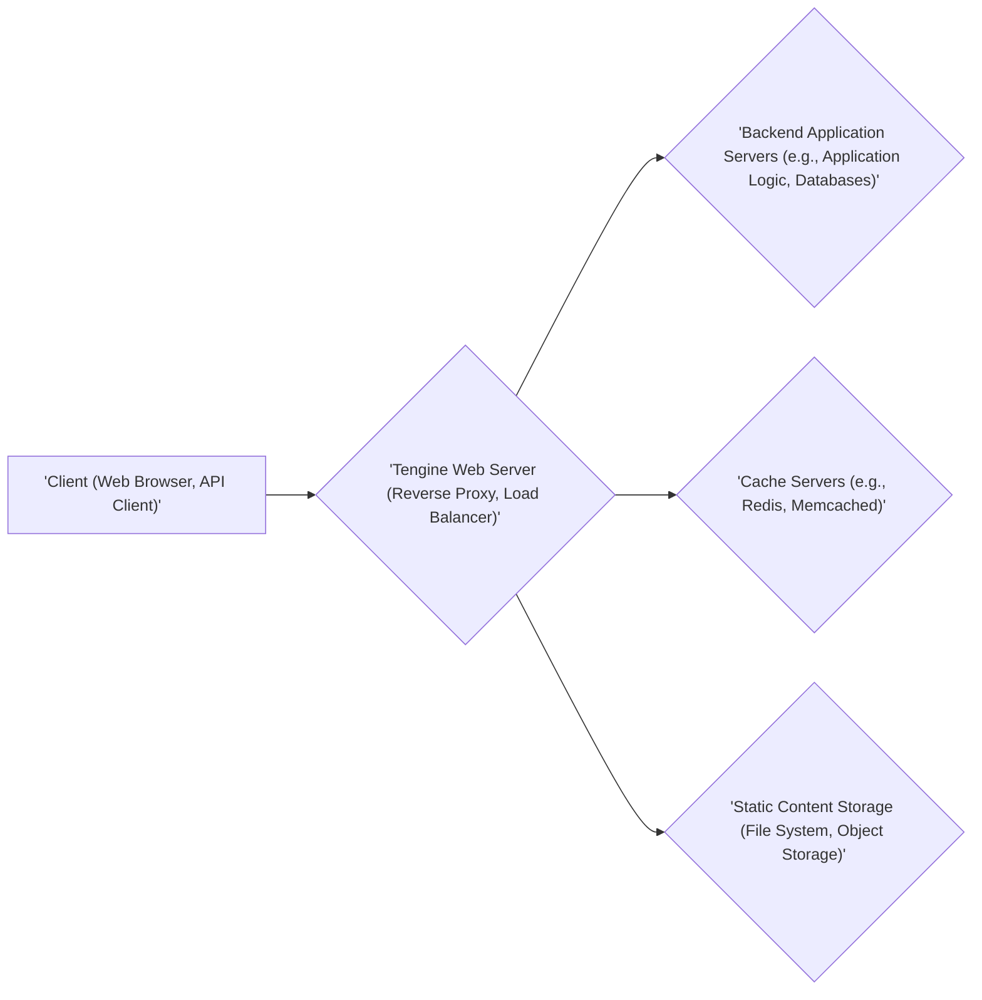

# Project Design Document: Tengine Web Server

**Version:** 1.1
**Date:** October 26, 2023
**Prepared by:** Gemini (AI Architecture Expert)

## 1. Introduction

This document provides an enhanced and detailed design overview of the Tengine web server project. Tengine is a robust, high-performance open-source HTTP server derived from the widely adopted Nginx server. It incorporates numerous advanced features and optimizations, making it a powerful choice for various web serving needs. This document aims to provide a comprehensive understanding of Tengine's architecture, core components, and request processing flow, serving as a foundation for subsequent threat modeling and security analysis. The information presented is based on the publicly available source code and documentation of the Tengine project found at [https://github.com/alibaba/tengine](https://github.com/alibaba/tengine). This document builds upon the previous version with added clarity and detail.

## 2. Goals and Objectives

The primary goals and objectives of the Tengine project, as inferred from its design and features, are:

* **Maximize Performance:** Achieve high throughput and low latency in serving web content and proxying requests. This includes efficient handling of concurrent connections and optimized resource utilization.
* **Ensure Stability and Reliability:** Provide a dependable and fault-tolerant web serving platform with minimal downtime. This involves robust error handling and graceful degradation capabilities.
* **Enhance Extensibility through Modular Design:** Facilitate the addition of new functionalities and customization via a well-defined module architecture. This allows developers to extend Tengine's capabilities without modifying the core codebase.
* **Implement Advanced Features Beyond Core Nginx:** Integrate features that improve operational efficiency, security, and performance, such as dynamic module loading, session persistence, advanced load balancing algorithms, and enhanced health checks for upstream servers.
* **Maintain Open Source Transparency and Community Engagement:** Foster an open and collaborative development environment, encouraging community contributions, feedback, and scrutiny to ensure code quality and security.

## 3. Target Audience

This design document is intended for a diverse audience with varying technical backgrounds and interests:

* **Security Engineers and Architects:** To gain a deep understanding of Tengine's internal workings, identify potential attack surfaces, and develop effective threat mitigation strategies. This includes understanding data flow, component interactions, and security-relevant configurations.
* **Software Developers:** To understand the architectural patterns, module interfaces, and extension points for developing new modules, debugging issues, and contributing to the Tengine project. This requires knowledge of the core components and their interactions.
* **Operations Engineers and System Administrators:** To understand the deployment models, configuration options, monitoring capabilities, and operational characteristics of Tengine for efficient deployment, management, and troubleshooting in production environments.
* **Project Managers and Technical Leads:** To obtain a high-level overview of Tengine's capabilities, components, and architectural considerations for planning projects, allocating resources, and making informed technical decisions.

## 4. System Architecture

### 4.1. High-Level Architecture



* **'Client (Web Browser, API Client)'**: Represents any entity initiating a request to the web server, such as a user's web browser or an application making API calls.
* **'Tengine Web Server (Reverse Proxy, Load Balancer)'**:  The central component acting as the entry point for client requests. It can function as a reverse proxy, forwarding requests to backend servers, and as a load balancer, distributing traffic across multiple backends.
* **'Backend Application Servers (e.g., Application Logic, Databases)'**: Servers responsible for executing application logic, processing data, and interacting with databases.
* **'Cache Servers (e.g., Redis, Memcached)'**:  External caching systems used to store frequently accessed data, reducing the load on backend servers and improving response times.
* **'Static Content Storage (File System, Object Storage)'**: The location where static assets like images, CSS files, and JavaScript files are stored and served.

### 4.2. Detailed Architecture

Tengine, inheriting from Nginx, employs a non-blocking, event-driven architecture based on a master-worker process model.

```mermaid
graph LR
    subgraph "'Tengine Process Model'"
        A["'Master Process'"]
        B["'Worker Process 1'"]
        C["'Worker Process 2'"]
        D["'Worker Process N'"]
        E["'Cache Manager Process'"]
        F["'Cache Loader Process'"]
    end

    A -- "'Configuration Loading, Process Management, Signal Handling'" --> B
    A -- "'Configuration Loading, Process Management, Signal Handling'" --> C
    A -- "'Configuration Loading, Process Management, Signal Handling'" --> D
    A -- "'Signal Handling (e.g., Reload, Shutdown)'" --> B
    A -- "'Signal Handling (e.g., Reload, Shutdown)'" --> C
    A -- "'Signal Handling (e.g., Reload, Shutdown)'" --> D
    B -- "'Accept and Process Client Requests (HTTP/HTTPS)'" --> "'Backend Application Servers'"
    C -- "'Accept and Process Client Requests (HTTP/HTTPS)'" --> "'Backend Application Servers'"
    D -- "'Accept and Process Client Requests (HTTP/HTTPS)'" --> "'Backend Application Servers'"
    B -- "'Serve Static Content'" --> "'Static Content Storage'"
    C -- "'Serve Static Content'" --> "'Static Content Storage'"
    D -- "'Serve Static Content'" --> "'Static Content Storage'"
    B -- "'Interact for Caching Operations'" --> E
    C -- "'Interact for Caching Operations'" --> E
    D -- "'Interact for Caching Operations'" --> E
    E -- "'Manage In-Memory Cache, Eviction Policies'" --> "'Cache Servers'"
    A -- "'Initiate Cache Loading on Startup/Reload'" --> F
    F -- "'Load Cached Data from Disk to Memory'" --> E
```

* **'Master Process'**: The parent process responsible for high-level management tasks:
    * **'Configuration Loading, Process Management, Signal Handling'**: Reads and validates the `tengine.conf` configuration file, creates and manages worker processes, and handles system signals.
    * **'Signal Handling (e.g., Reload, Shutdown)'**:  Responds to signals for graceful restarts, configuration reloads, and shutdowns without interrupting active connections.
    * **'Initiate Cache Loading on Startup/Reload'**: Starts the cache loader process to populate the cache.

* **'Worker Process 1'**, **'Worker Process 2'**, **'Worker Process N'**:  Multiple worker processes handle incoming client requests concurrently:
    * **'Accept and Process Client Requests (HTTP/HTTPS)'**: Accept new connections and process HTTP/HTTPS requests.
    * **'Serve Static Content'**: Retrieve and serve static files from the designated storage.
    * **'Interact for Caching Operations'**: Communicate with the cache manager process for storing and retrieving cached content.

* **'Cache Manager Process'**:  Manages the in-memory cache:
    * **'Manage In-Memory Cache, Eviction Policies'**:  Stores cached data, implements eviction policies to remove stale or less frequently used entries, and interacts with external cache servers.

* **'Cache Loader Process'**:  Responsible for pre-populating the cache:
    * **'Load Cached Data from Disk to Memory'**: Loads cached data from disk into memory during server startup or configuration reloads to improve initial performance.

## 5. Key Components

* **Core HTTP Engine**: The foundational component responsible for parsing HTTP requests and generating HTTP responses. It handles the core logic of the HTTP protocol.
* **Event Modules**: Implement the underlying event notification mechanism (e.g., `epoll` on Linux, `kqueue` on FreeBSD) enabling Tengine to efficiently manage a large number of concurrent connections using a non-blocking I/O model.
* **Module Architecture**: Tengine's functionality is highly extensible through a modular design. This allows for adding new features and modifying existing behavior without altering the core. Key module categories include:
    * **Core Modules**: Provide essential functionalities for the server's operation, such as configuration parsing (`ngx_core_module`), process management, and logging (`ngx_log_module`).
    * **HTTP Modules**: Handle HTTP-specific features and directives. Examples include:
        * `ngx_http_core_module`: Core HTTP request processing and response generation.
        * `ngx_http_proxy_module`: Implements reverse proxying capabilities, forwarding requests to backend servers.
        * `ngx_http_upstream_module`: Manages connections to upstream servers, including load balancing and health checks.
        * `ngx_http_static_module`: Enables serving static files directly from the file system.
        * `ngx_http_gzip_module`: Compresses HTTP responses to reduce bandwidth usage.
        * `ngx_http_ssl_module`: Provides support for HTTPS by handling SSL/TLS encryption and decryption.
        * `ngx_http_auth_basic_module`: Implements basic HTTP authentication.
        * `ngx_http_limit_req_module`:  Provides rate limiting capabilities to protect against abuse.
    * **Mail Modules**: (Primarily inherited from Nginx and less relevant for typical web serving scenarios, handling mail proxying).
    * **Stream Modules**: Enable proxying of TCP and UDP traffic.
    * **Tengine-Specific Modules**: Modules developed specifically for Tengine, offering enhanced functionalities such as:
        * Dynamic module loading: Allows adding or removing modules without recompiling the server.
        * Session persistence: Enables maintaining user sessions across multiple backend servers.
        * Enhanced upstream health checks: Provides more sophisticated methods for monitoring the health of backend servers.
* **Memory Management**: Tengine employs efficient memory management techniques to minimize overhead and improve performance. This includes techniques like memory pooling and caching.
* **Logging System**: A robust logging system records server events, errors, and access logs, crucial for monitoring, debugging, and security auditing.
* **Configuration System**:  Tengine uses a hierarchical, text-based configuration file (`tengine.conf`) to define server behavior, virtual hosts, load balancing settings, and module parameters.
* **Upstream Module**: Manages connections to backend servers, implementing load balancing algorithms (e.g., round-robin, least connections), and performing health checks to ensure requests are routed to healthy servers.
* **Cache Subsystem**:  Provides mechanisms for caching static and dynamic content in memory and potentially on disk, reducing the load on backend servers and improving response times.

## 6. Data Flow

The typical flow of an incoming HTTP request through Tengine involves the following steps:

1. **Client Request Initiation**: A client (web browser, API client) sends an HTTP request to the configured IP address and port of the Tengine server.
2. **Connection Acceptance by Master Process**: The master process listens on the configured ports. Upon receiving a new connection request, it accepts the connection and delegates it to one of the worker processes.
3. **Request Handling by Worker Process**: An idle worker process accepts the connection.
4. **Request Parsing**: The worker process parses the incoming HTTP request headers and body.
5. **Virtual Host Determination**: Tengine determines the appropriate virtual host based on the `Host` header in the request.
6. **Configuration Lookup**: Based on the virtual host and the requested URI, Tengine locates the matching server block and location block within the `tengine.conf` configuration file.
7. **Module Chain Execution**: The request is then processed by a chain of HTTP modules configured for the matching location. This can involve various actions:
    * **Security Checks**: Modules like `ngx_http_access_module` and `ngx_http_auth_basic_module` perform access control and authentication. The `ngx_http_limit_req_module` can enforce rate limiting.
    * **Static Content Serving**: If the request maps to a static file, the `ngx_http_static_module` retrieves the file from disk and sends it to the client.
    * **Caching**: The caching modules check if the requested content is already in the cache. If so, the cached response is served directly. If not, the request proceeds to the backend.
    * **Proxying**: If configured, the `ngx_http_proxy_module` forwards the request to an upstream backend server selected by the `ngx_http_upstream_module`.
    * **Content Manipulation**: Modules can modify request headers, response headers, or the content itself (e.g., `ngx_http_gzip_module` for compression).
8. **Backend Interaction (if applicable)**: If the request is proxied, Tengine establishes a connection with the selected backend server, sends the client's request, and receives the backend's response.
9. **Response Generation**: The worker process constructs the HTTP response, including headers and the response body (either from a static file, the cache, or the backend server).
10. **Response Delivery**: The worker process sends the generated HTTP response back to the client.
11. **Logging**:  Details of the request and response are logged to the access log by the `ngx_http_log_module`. Errors are logged to the error log.
12. **Connection Closure**: The connection between the client and the worker process is closed (depending on HTTP keep-alive settings).

## 7. Security Considerations

This section outlines potential security considerations inherent in Tengine's architecture and common web server vulnerabilities. This serves as a starting point for comprehensive threat modeling activities.

* **Input Validation Vulnerabilities**:
    * **Cross-Site Scripting (XSS)**: Improper handling of user-supplied data in request headers or URIs can allow attackers to inject malicious scripts into web pages viewed by other users.
    * **SQL Injection**: If Tengine interacts with backend databases (directly or indirectly), insufficient sanitization of input passed to database queries can lead to SQL injection attacks.
    * **Header Injection**:  Vulnerabilities in handling HTTP headers can allow attackers to manipulate headers, potentially leading to cache poisoning or other exploits.
* **Authentication and Authorization Flaws**:
    * **Weak Authentication Schemes**: Using insecure authentication methods or weak password policies can compromise user accounts.
    * **Authorization Bypass**: Misconfigurations or flaws in authorization logic can allow unauthorized access to resources.
* **TLS/SSL Configuration Issues**:
    * **Weak Cipher Suites**: Using outdated or weak cryptographic algorithms can make connections vulnerable to eavesdropping.
    * **Protocol Downgrade Attacks**:  Misconfigurations can allow attackers to force the use of older, less secure TLS protocols.
    * **Improper Certificate Validation**: Failure to properly validate server or client certificates can lead to man-in-the-middle attacks.
* **Memory Safety Vulnerabilities**:
    * **Buffer Overflows**: Potential vulnerabilities in the C code of Tengine or its modules due to improper memory management can be exploited to execute arbitrary code.
    * **Integer Overflows**:  Errors in handling integer arithmetic can lead to unexpected behavior and potential security issues.
* **Denial of Service (DoS) Attacks**:
    * **SYN Flood Attacks**: Exploiting the TCP handshake process to exhaust server resources.
    * **Slowloris Attacks**:  Sending partial HTTP requests to keep connections open and exhaust resources.
    * **HTTP Request Smuggling**: Exploiting discrepancies in how Tengine and backend servers parse HTTP requests.
* **Configuration Security**:
    * **Exposure of Sensitive Information**:  Accidental exposure of sensitive data (e.g., API keys, database credentials) in configuration files.
    * **Insecure Default Configurations**: Using default configurations that are not hardened against common attacks.
    * **Incorrect File Permissions**:  Setting overly permissive file permissions on configuration files or other sensitive data.
* **Third-Party Module Vulnerabilities**: Security flaws in third-party modules can introduce vulnerabilities into the Tengine server.
* **Privilege Escalation Vulnerabilities**:  Flaws in process management or file handling could potentially allow an attacker to gain elevated privileges.
* **Logging and Monitoring Deficiencies**: Insufficient logging can hinder incident response and make it difficult to detect malicious activity.
* **Software Update and Patch Management**: Failure to apply security patches promptly can leave the server vulnerable to known exploits.
* **Cache Poisoning Attacks**:  Attackers might be able to inject malicious content into the cache, which is then served to other users.

## 8. Deployment

Tengine's flexible architecture allows for deployment in various scenarios and environments:

* **Standalone Web Server**: Serving static content and potentially acting as a frontend for a single application server.
* **Reverse Proxy**: Acting as an intermediary between clients and backend servers, providing security, load balancing, and caching.
* **Load Balancer**: Distributing incoming traffic across multiple backend servers to improve performance and availability. Common load balancing algorithms include round-robin, least connections, and IP hash.
* **API Gateway**: Managing and securing access to backend APIs, providing features like authentication, authorization, and rate limiting.
* **Caching Layer**:  Serving cached content to reduce latency and the load on origin servers.
* **Deployment Environments**:
    * **Bare Metal Servers**: Direct installation on physical hardware for maximum performance.
    * **Virtual Machines (VMs)**: Deployment within virtualized environments for flexibility and resource management.
    * **Containers (e.g., Docker, Kubernetes)**: Containerized deployments offer portability, scalability, and easier management in modern cloud environments.
    * **Cloud Platforms (e.g., AWS, Azure, GCP)**: Deployment on cloud infrastructure leveraging managed services for scalability and reliability.

## 9. Technologies Used

* **Core Programming Language**: C
* **Supported Operating Systems**: Primarily Linux-based distributions, other Unix-like systems (e.g., FreeBSD, macOS)
* **Networking Protocols**: HTTP, HTTPS, TCP, UDP
* **SSL/TLS Library**: OpenSSL (or compatible libraries like LibreSSL, BoringSSL)
* **Configuration File Format**: Custom text-based configuration syntax
* **Build System**:  Typically uses `autoconf` and `make`
* **Scripting Languages (for extensions)**: Lua (via the `ngx_http_lua_module`)

## 10. Future Considerations

* **Enhanced Support for Modern Protocols**:  Exploring and implementing support for newer HTTP versions (e.g., HTTP/3) and other relevant protocols.
* **Improved Observability and Monitoring**:  Integrating with more advanced monitoring and tracing tools for better insights into performance and security.
* **Strengthened Security Features**:  Continuously evaluating and incorporating new security mechanisms and mitigations against emerging threats, including more robust defenses against layer 7 attacks.
* **Performance Optimizations**:  Ongoing efforts to optimize code and algorithms for even greater performance and resource efficiency.
* **Cloud-Native Integrations**:  Deeper integration with cloud-native technologies and platforms, such as service meshes and serverless functions.
* **Community Growth and Collaboration**:  Actively fostering a vibrant and engaged community of users and developers to contribute to the project's evolution.

This improved design document provides a more detailed and comprehensive understanding of the Tengine web server. It offers valuable insights for security analysis and threat modeling, development efforts, and operational considerations.