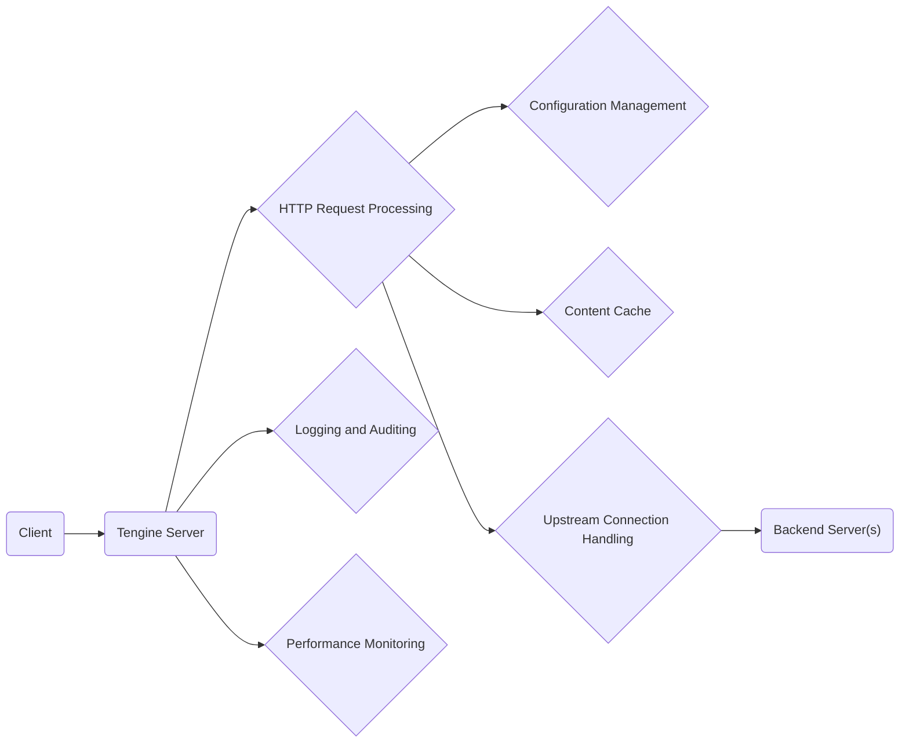

# Project Design Document: Tengine Web Server

**Version:** 1.1
**Date:** October 26, 2023
**Author:** AI Software Architect

## 1. Introduction

This document provides an enhanced design overview of the Tengine web server project, an open-source HTTP server forked from Nginx. This detailed description aims to facilitate effective threat modeling by clearly outlining Tengine's architecture, components, and data flow. Understanding these aspects is crucial for identifying potential vulnerabilities and security risks.

## 2. Goals and Objectives

The core objectives of the Tengine project are:

*   To deliver a robust, dependable, and high-performing HTTP server solution.
*   To incorporate advanced features and capabilities beyond the standard Nginx distribution.
*   To maintain seamless compatibility with existing Nginx configurations and modules, minimizing migration efforts.
*   To foster a platform for ongoing innovation and customization within the web serving domain.

## 3. High-Level Architecture

Tengine employs an event-driven, asynchronous, and non-blocking architecture. This design enables it to manage a large number of concurrent connections efficiently while minimizing resource utilization.



*   **Client:** Any user agent or system initiating HTTP requests to the Tengine server.
*   **Tengine Server:** The primary process responsible for receiving and processing incoming requests.
*   **HTTP Request Processing:**  Handles the parsing, routing, and generation of HTTP requests and responses.
*   **Configuration Management:**  Responsible for loading, interpreting, and applying server settings and directives.
*   **Content Cache:** Stores frequently accessed content to reduce latency and backend load.
*   **Upstream Connection Handling:** Manages connections to backend servers, including load balancing and health checks.
*   **Backend Server(s):** Application servers or other resources that Tengine proxies requests to.
*   **Logging and Auditing:** Records server activity, errors, and access attempts for monitoring and security analysis.
*   **Performance Monitoring:** Collects and exposes metrics related to server performance and resource usage.

## 4. Detailed Design

This section provides a deeper look into the key components and their functionalities within the Tengine architecture, with a focus on aspects relevant to security.

### 4.1. Core Components

*   **Master Process:**
    *   Reads and validates the main configuration file (`tengine.conf`).
    *   Creates and manages worker processes, ensuring process isolation.
    *   Performs privileged operations, such as binding to listening ports, requiring careful security considerations.
    *   Monitors worker processes and restarts them in case of unexpected termination, enhancing resilience.
*   **Worker Processes:**
    *   Accept and handle incoming client connections in a non-blocking manner.
    *   Process HTTP requests and generate responses based on the configuration and request details.
    *   Execute configured modules, extending Tengine's functionality.
    *   Operate independently, minimizing the impact of a failure in one process.
*   **Cache Manager Process (Optional):**
    *   Manages the on-disk cache, including storing and retrieving cached content.
    *   Implements cache eviction policies to manage storage space.
    *   Coordinates with worker processes for cache updates and retrievals.
*   **Cache Loader Process (Optional):**
    *   Pre-loads cached data into memory during startup, improving performance after restarts.
    *   Requires secure access to the cache storage.

### 4.2. Key Modules

*   **HTTP Core Module (`ngx_http_core_module`):**
    *   Parses HTTP request headers and bodies, a critical point for input validation.
    *   Constructs HTTP response headers and bodies, requiring careful output encoding to prevent XSS.
    *   Manages HTTP connection states (keep-alive), which can be a target for DoS attacks.
*   **Server Block Module (`ngx_http_server_module`):**
    *   Defines virtual hosts based on server names or IP addresses, controlling access to different applications.
    *   Allows for distinct security configurations for different virtual hosts.
*   **Location Block Module (`ngx_http_location_module`):**
    *   Defines how requests matching specific URIs are handled, enabling granular access control.
    *   Can specify different authentication methods and authorization rules.
*   **Upstream Module (`ngx_http_upstream_module`):**
    *   Defines groups of backend servers, managing connections and load distribution.
    *   Implements health checks to ensure only healthy servers receive traffic.
    *   Load balancing algorithms can impact performance and resilience.
*   **Proxy Module (`ngx_http_proxy_module`):**
    *   Forwards client requests to backend servers, potentially exposing backend services.
    *   Handles responses from backend servers, requiring careful handling of backend errors.
    *   Can modify request and response headers, which can be a security concern if not done properly.
*   **Cache Module (`ngx_http_cache_module`):**
    *   Caches responses to reduce backend load and improve performance.
    *   Requires careful configuration to prevent caching of sensitive data.
    *   Cache invalidation mechanisms are important for data consistency.
*   **SSL/TLS Module (`ngx_ssl_module` using OpenSSL or BoringSSL):**
    *   Handles secure connections using SSL/TLS protocols, crucial for data confidentiality and integrity.
    *   Manages SSL certificates and private keys, requiring secure storage and rotation.
    *   Configuration of ciphers and protocols impacts security strength.
*   **Rewrite Module (`ngx_http_rewrite_module`):**
    *   Allows modifying the requested URI, which can be used for security purposes (e.g., redirecting insecure requests).
    *   Complex rewrite rules can introduce vulnerabilities if not carefully implemented.
*   **Access Control Modules (`ngx_http_access_module`, `ngx_http_auth_basic_module`, etc.):**
    *   Controls access based on IP addresses, user credentials, and other criteria.
    *   Proper configuration is essential to prevent unauthorized access.
    *   Authentication mechanisms should be robust and secure.
*   **Log Module (`ngx_http_log_module`):**
    *   Writes access logs and error logs, providing valuable data for security auditing and incident response.
    *   Log formats should be carefully configured to include relevant information without exposing sensitive data.
*   **Mail Proxy Module (Optional):**
    *   Provides proxy functionality for mail protocols. Security considerations for mail protocols are different from HTTP.
*   **Stream Module (Optional):**
    *   Provides proxy functionality for TCP and UDP streams. Security considerations for generic TCP/UDP proxying are important.

### 4.3. Configuration

*   Tengine's behavior is defined by its configuration file (`tengine.conf`), a critical security artifact.
*   The configuration uses a hierarchical structure with directives organized into blocks (`http`, `server`, `location`, `upstream`).
*   Directives specify parameters like listening ports, server names, file paths, caching behavior, and security policies.
*   Secure storage and access control for the configuration file are paramount.
*   Changes to the configuration typically require a reload or restart, which should be handled securely.

## 5. Data Flow

The following describes the typical flow of an HTTP request through Tengine, highlighting security-relevant steps:

1. **Client sends an HTTP request to the Tengine server.**
2. **The Master process listens on configured ports.** Binding to privileged ports requires appropriate permissions.
3. **A Worker process accepts the incoming connection.** Connection limits and timeouts can help mitigate DoS attacks.
4. **The Worker process reads the request headers and body.** This is the first point of input validation.
5. **The HTTP Core module parses the request.**  Vulnerabilities in the parser can lead to exploits.
6. **Tengine determines the appropriate Server block based on the Host header or IP address.** This step is crucial for virtual hosting security.
7. **Within the Server block, Tengine matches the request URI against configured Location blocks.** Access control rules are applied here.
8. **Based on the matching Location block, Tengine executes the configured modules.**
    *   **If caching is enabled and the content is in the cache, the cached response is served directly.** Ensure the cache doesn't contain sensitive information for unauthorized users.
    *   **If the request needs to be proxied, the Upstream module selects a backend server.** Secure communication with backend servers is important.
    *   **The Proxy module forwards the request to the selected backend server.**  Careful handling of headers and data is required.
9. **The backend server processes the request and sends a response back to Tengine.**
10. **The Proxy module receives the response from the backend server.** Response headers should be inspected for potential security issues.
11. **Tengine may cache the response based on configured caching directives.**  Ensure sensitive data is not cached inappropriately.
12. **Tengine constructs the HTTP response and sends it back to the client.** Output encoding is crucial to prevent XSS.
13. **The Log module records the transaction details.** Logs should be secured to prevent tampering.

```mermaid
sequenceDiagram
    participant Client
    participant Tengine_Master as Tengine (Master Process)
    participant Tengine_Worker as Tengine (Worker Process)
    participant HTTP_Core as HTTP Core Module
    participant Server_Block as Server Block
    participant Location_Block as Location Block
    participant Cache_Module as Cache Module
    participant Upstream_Module as Upstream Module
    participant Backend_Server as Backend Server
    participant Proxy_Module as Proxy Module
    participant Log_Module as Log Module

    Client->>Tengine_Worker: HTTP Request
    activate Tengine_Worker
    Tengine_Worker->>HTTP_Core: Parse Request & Validate Input
    activate HTTP_Core
    HTTP_Core->>Server_Block: Determine Server Block
    activate Server_Block
    Server_Block->>Location_Block: Match Location Block & Apply Access Control
    activate Location_Block
    Location_Block->>Cache_Module: Check Cache
    activate Cache_Module
    alt Cache Hit
        Cache_Module-->>Tengine_Worker: Cached Response
        deactivate Cache_Module
        Tengine_Worker->>Client: HTTP Response (Cached & Encoded)
    else Cache Miss
        Cache_Module-->>Location_Block: Cache Miss
        deactivate Cache_Module
        Location_Block->>Upstream_Module: Select Backend Server
        activate Upstream_Module
        Upstream_Module->>Backend_Server: Forward Request (Securely)
        activate Backend_Server
        Backend_Server-->>Proxy_Module: HTTP Response
        deactivate Backend_Server
        Proxy_Module->>Cache_Module: Store in Cache (if applicable)
        activate Cache_Module
        deactivate Cache_Module
        Proxy_Module->>Tengine_Worker: Response from Backend
        deactivate Upstream_Module
    end
    Tengine_Worker->>Client: HTTP Response (Encoded)
    HTTP_Core-->>Tengine_Worker: Response Processing
    deactivate HTTP_Core
    Tengine_Worker->>Log_Module: Log Transaction
    activate Log_Module
    deactivate Log_Module
    deactivate Tengine_Worker
```

## 6. Security Considerations

Security is a paramount concern for Tengine. Key considerations include:

*   **Robust Input Validation:**  Thoroughly validate all input data (headers, bodies, URIs) to prevent injection attacks (SQL, command, header injection).
*   **Secure Output Encoding:**  Properly encode all output data to prevent cross-site scripting (XSS) vulnerabilities.
*   **Strong SSL/TLS Configuration:**  Employ strong ciphers, use up-to-date protocols, enforce HTTPS, and implement HSTS to protect communication. Securely manage certificates and private keys.
*   **Granular Access Control:**  Utilize access control modules to restrict access based on IP addresses, authentication, and authorization rules. Implement the principle of least privilege.
*   **Effective DoS Protection:**  Configure limits for connections, request rates, and timeouts to mitigate denial-of-service attacks. Consider using rate-limiting modules.
*   **Configuration File Security:**  Protect the `tengine.conf` file with appropriate file system permissions and restrict access.
*   **Third-Party Module Scrutiny:**  Carefully evaluate and audit any third-party modules for potential vulnerabilities before deployment.
*   **Regular Security Updates:**  Keep Tengine and its dependencies (OpenSSL, etc.) updated with the latest security patches. Implement a patch management process.
*   **Comprehensive Logging and Monitoring:**  Enable detailed logging and monitoring to detect suspicious activity and facilitate incident response. Securely store and analyze logs.
*   **Principle of Least Privilege:** Run worker processes with minimal necessary privileges to limit the impact of potential compromises.
*   **Secure Defaults:**  Ensure default configurations are secure and avoid exposing unnecessary information.
*   **Regular Security Audits and Penetration Testing:** Conduct periodic security assessments to identify and address potential vulnerabilities.

## 7. Deployment Considerations

Secure deployment practices are crucial for Tengine:

*   **Operating System Hardening:**  Harden the underlying operating system to reduce the attack surface.
*   **Network Segmentation:**  Deploy Tengine within a segmented network to limit the impact of a breach.
*   **Firewall Configuration:**  Configure firewalls to allow only necessary traffic to and from the Tengine server.
*   **Secure Key Management:**  Securely store and manage SSL/TLS private keys, potentially using hardware security modules (HSMs).
*   **Regular Security Scanning:**  Implement regular vulnerability scanning of the Tengine server and its environment.
*   **Configuration Management:**  Use configuration management tools (Ansible, Chef, Puppet) to ensure consistent and secure configurations.
*   **Container Security:**  When deploying in containers, follow container security best practices.
*   **Monitoring and Alerting:**  Implement monitoring and alerting for security-related events.

## 8. Future Considerations

*   Enhanced integration with modern authentication and authorization frameworks (OAuth 2.0, OpenID Connect).
*   Improved support for emerging protocols like HTTP/3 and QUIC, with careful consideration of their security implications.
*   Advanced monitoring and observability tools for better security insights.
*   Development of new security-focused modules and features.
*   Continued focus on performance and security optimizations.

This enhanced design document provides a more detailed and security-focused overview of the Tengine web server project. It serves as a valuable resource for understanding the system's architecture and will be instrumental in conducting thorough threat modeling to identify and mitigate potential security risks effectively.