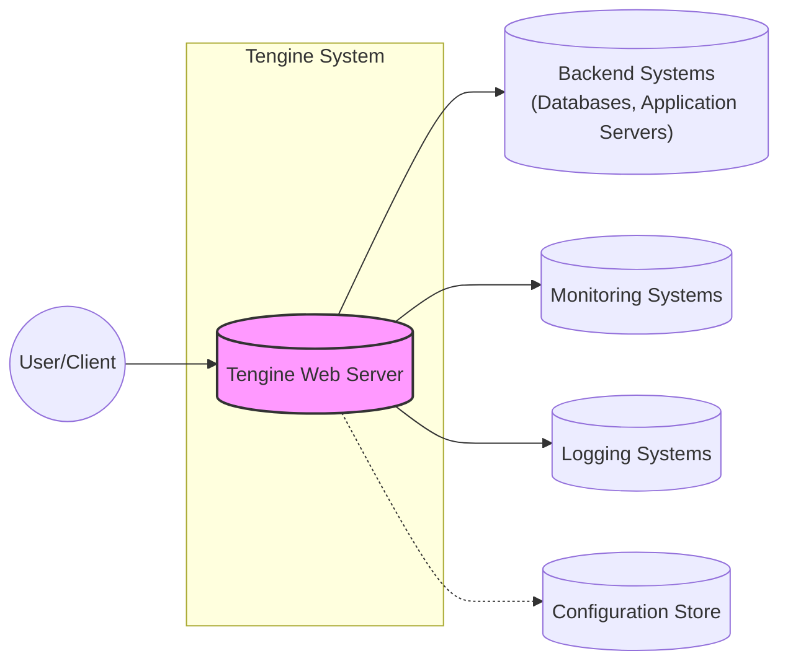
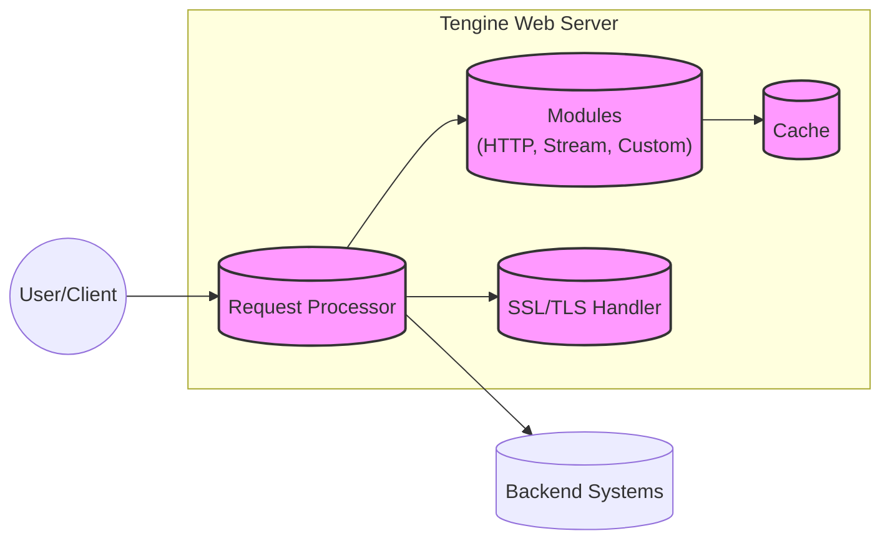
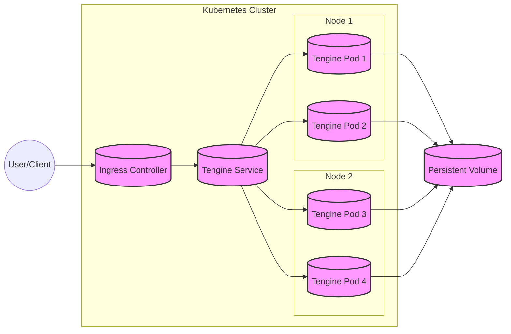
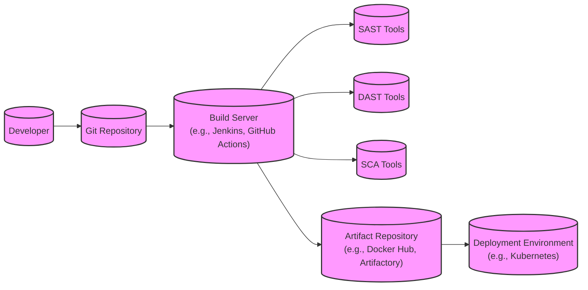

Okay, let's create a design document for the Tengine project, focusing on aspects relevant for threat modeling.

# BUSINESS POSTURE

Tengine is a web server originated by Taobao, the large online marketplace of Alibaba Group.  It's based on Nginx and has been enhanced with many advanced features.  Given its origin and purpose, the following business priorities and goals are likely:

*   Priorities:
    *   High Availability and Reliability:  Tengine likely powers critical e-commerce infrastructure, so uptime and resilience to failures are paramount.  Downtime directly translates to lost revenue and customer dissatisfaction.
    *   Performance and Scalability:  The system must handle massive traffic loads, especially during peak shopping periods (e.g., Singles' Day).  Low latency and high throughput are essential.
    *   Security:  Protecting user data, financial transactions, and the integrity of the platform is crucial.  This includes preventing unauthorized access, data breaches, and denial-of-service attacks.
    *   Maintainability and Extensibility:  The system needs to be easily maintained and updated to adapt to changing business needs and security threats.  The ability to add new features and modules is important.
    *   Operational Efficiency:  Minimizing operational costs (e.g., server resources, energy consumption) while maintaining performance is a key consideration.

*   Goals:
    *   Provide a robust and performant web server platform for Alibaba's e-commerce services.
    *   Enhance Nginx with features tailored to Alibaba's specific needs.
    *   Offer a stable and secure platform for web applications.
    *   Support a large number of concurrent connections and high traffic volumes.

*   Business Risks:
    *   Service Outages:  Any disruption to Tengine's service can significantly impact Alibaba's revenue and reputation.
    *   Data Breaches:  Exposure of sensitive user data (e.g., personal information, credit card details) would have severe legal and financial consequences.
    *   Performance Degradation:  Slow response times or inability to handle peak loads can lead to lost sales and customer churn.
    *   Compromised System Integrity:  Attackers gaining control of Tengine servers could manipulate website content, steal data, or launch further attacks.
    *   Vulnerability Exploitation:  Unpatched vulnerabilities in Tengine or its dependencies could be exploited by attackers.

# SECURITY POSTURE

Based on the GitHub repository and general knowledge of web servers, the following security controls and accepted risks are likely present:

*   security control:  Inherits Nginx's security features: Tengine benefits from the security features built into Nginx, such as its event-driven architecture, which is less vulnerable to certain types of attacks compared to traditional thread-based servers. Described in Nginx documentation.
*   security control:  Input validation:  Like Nginx, Tengine likely performs some level of input validation to prevent common web attacks like cross-site scripting (XSS) and SQL injection. Described in Nginx documentation and Tengine specific modules.
*   security control:  Access controls:  Configuration options to restrict access to specific resources and IP addresses. Described in Nginx documentation and Tengine specific modules.
*   security control:  SSL/TLS support:  Capability to encrypt communication between the server and clients, protecting sensitive data in transit. Described in Nginx documentation and Tengine specific modules.
*   security control:  Module system:  The ability to extend functionality through modules allows for the addition of custom security features. Described in Tengine documentation.
*   accepted risk:  Complexity of configuration:  Like Nginx, Tengine's configuration can be complex, increasing the risk of misconfiguration that could lead to security vulnerabilities.
*   accepted risk:  Dependency on third-party modules:  The use of third-party modules introduces the risk of vulnerabilities in those modules.
*   accepted risk:  Potential for zero-day vulnerabilities:  As with any software, there's always the risk of undiscovered vulnerabilities that could be exploited.

*   Recommended Security Controls:

    *   Web Application Firewall (WAF):  Implement a WAF (either as a Tengine module or a separate component) to provide more robust protection against web application attacks.
    *   Regular Security Audits and Penetration Testing:  Conduct regular security assessments to identify and address vulnerabilities.
    *   Intrusion Detection/Prevention System (IDS/IPS):  Deploy an IDS/IPS to monitor network traffic and detect/prevent malicious activity.
    *   Dynamic Application Security Testing (DAST): Integrate DAST tools into the CI/CD pipeline to automatically scan for vulnerabilities in the running application.
    *   Runtime Application Self-Protection (RASP): Consider using RASP technology to provide runtime protection against attacks.
    *   Supply Chain Security: Implement robust measures to secure the software supply chain, including verifying the integrity of third-party modules and dependencies.

*   Security Requirements:

    *   Authentication:
        *   Strong authentication mechanisms for administrative access to Tengine configuration.
        *   Support for multi-factor authentication (MFA) for administrative access.
        *   Secure handling of session tokens and cookies.

    *   Authorization:
        *   Fine-grained access control to restrict access to resources based on user roles and permissions.
        *   Principle of least privilege: Users and processes should only have the minimum necessary access rights.

    *   Input Validation:
        *   Strict input validation for all user-supplied data to prevent common web attacks (XSS, SQL injection, etc.).
        *   Output encoding to prevent XSS vulnerabilities.
        *   Parameterized queries or prepared statements to prevent SQL injection.

    *   Cryptography:
        *   Use of strong, up-to-date cryptographic algorithms and protocols (e.g., TLS 1.3).
        *   Secure key management practices.
        *   Protection of sensitive data at rest using encryption.
        *   Regular review and update of cryptographic configurations.

# DESIGN

## C4 CONTEXT

*   Elements Description:

    *   Element:
        *   Name: User/Client
        *   Type: User
        *   Description: Represents users accessing web applications served by Tengine.
        *   Responsibilities: Initiates HTTP requests to Tengine.
        *   Security Controls: Browser security features, TLS/SSL.

    *   Element:
        *   Name: Tengine Web Server
        *   Type: System
        *   Description: The Tengine web server itself.
        *   Responsibilities: Handles incoming HTTP requests, serves static content, proxies requests to backend systems, manages SSL/TLS termination.
        *   Security Controls: Input validation, access controls, SSL/TLS support, WAF (recommended), IDS/IPS (recommended).

    *   Element:
        *   Name: Backend Systems (Databases, Application Servers)
        *   Type: System
        *   Description: Backend systems that Tengine interacts with, such as databases and application servers.
        *   Responsibilities: Process business logic, store and retrieve data.
        *   Security Controls: Database security controls, application server security controls, network segmentation.

    *   Element:
        *   Name: Monitoring Systems
        *   Type: System
        *   Description: Systems used to monitor the performance and health of Tengine.
        *   Responsibilities: Collect metrics, generate alerts.
        *   Security Controls: Access controls, secure communication channels.

    *   Element:
        *   Name: Logging Systems
        *   Type: System
        *   Description: Systems used to store and analyze Tengine logs.
        *   Responsibilities: Store logs, provide search and analysis capabilities.
        *   Security Controls: Access controls, secure storage, log integrity protection.

    *   Element:
        *   Name: Configuration Store
        *   Type: System
        *   Description: Storage for Tengine configuration files.
        *   Responsibilities: Store and provide access to configuration data.
        *   Security Controls: Access controls, version control, secure storage.

## C4 CONTAINER

*   Elements Description:

    *   Element:
        *   Name: Request Processor
        *   Type: Container
        *   Description: The core component that handles incoming requests.
        *   Responsibilities: Parses requests, routes requests to appropriate modules, manages connections.
        *   Security Controls: Input validation, connection limits, rate limiting.

    *   Element:
        *   Name: Cache
        *   Type: Container
        *   Description: Caches frequently accessed content to improve performance.
        *   Responsibilities: Stores and retrieves cached data.
        *   Security Controls: Cache invalidation policies, access controls.

    *   Element:
        *   Name: Modules (HTTP, Stream, Custom)
        *   Type: Container
        *   Description:  Modules that extend Tengine's functionality.
        *   Responsibilities:  Handle specific protocols (HTTP, Stream), provide custom features.
        *   Security Controls:  Module-specific security controls, sandboxing (recommended).

    *   Element:
        *   Name: SSL/TLS Handler
        *   Type: Container
        *   Description: Handles SSL/TLS encryption and decryption.
        *   Responsibilities:  Manages SSL/TLS certificates, encrypts and decrypts traffic.
        *   Security Controls:  Strong ciphers, certificate validation, key management.

    *   Element:
        *   Name: Backend Systems
        *   Type: System
        *   Description: Backend systems that Tengine interacts with.
        *   Responsibilities: Process business logic, store and retrieve data.
        *   Security Controls: Database security controls, application server security controls, network segmentation.

    *   Element:
        *   Name: User/Client
        *   Type: User
        *   Description: Represents users accessing web applications served by Tengine.
        *   Responsibilities: Initiates HTTP requests to Tengine.
        *   Security Controls: Browser security features, TLS/SSL.

## DEPLOYMENT

Tengine can be deployed in various ways, including:

1.  **Bare Metal Servers:**  Installing Tengine directly on physical servers.
2.  **Virtual Machines:**  Deploying Tengine within virtual machines (e.g., using VMware, KVM, Xen).
3.  **Containers:**  Running Tengine inside containers (e.g., Docker) orchestrated by a container orchestration platform (e.g., Kubernetes).
4.  **Cloud Platforms:**  Deploying Tengine on cloud platforms like Alibaba Cloud, AWS, Azure, or GCP, using their respective services (e.g., VMs, container services).

We'll describe the containerized deployment using Kubernetes, as it's a common and modern approach.

*   Elements Description:

    *   Element:
        *   Name: Tengine Pod (1-4)
        *   Type: Container
        *   Description:  A Kubernetes Pod running a Tengine container.
        *   Responsibilities:  Handles incoming HTTP requests, serves content.
        *   Security Controls:  Container security best practices, network policies, resource limits.

    *   Element:
        *   Name: Ingress Controller
        *   Type: Component
        *   Description:  A Kubernetes Ingress controller that manages external access to the Tengine service.
        *   Responsibilities:  Routes traffic to the appropriate service, handles TLS termination.
        *   Security Controls:  TLS configuration, access controls, WAF integration (recommended).

    *   Element:
        *   Name: Tengine Service
        *   Type: Component
        *   Description:  A Kubernetes Service that provides a stable endpoint for accessing the Tengine Pods.
        *   Responsibilities:  Load balances traffic across Tengine Pods.
        *   Security Controls:  Network policies.

    *   Element:
        *   Name: Persistent Volume
        *   Type: Storage
        *   Description: Persistent storage for Tengine configuration and data.
        *   Responsibilities: Provides persistent storage.
        *   Security Controls: Access controls, encryption at rest.

    *   Element:
        *   Name: User/Client
        *   Type: User
        *   Description: Represents users accessing web applications served by Tengine.
        *   Responsibilities: Initiates HTTP requests to Tengine.
        *   Security Controls: Browser security features, TLS/SSL.

    *   Element:
        *   Name: Node (1-2)
        *   Type: Node
        *   Description: Kubernetes worker node.
        *   Responsibilities: Host for pods.
        *   Security Controls: OS hardening, network security.

## BUILD

The Tengine build process likely involves the following steps:

1.  **Development:** Developers write code and configuration files.
2.  **Source Code Management:** Code is stored in a version control system (e.g., Git).
3.  **Build Automation:** A build system (e.g., Make, CMake) compiles the source code and creates build artifacts.
4.  **Testing:** Automated tests (unit tests, integration tests) are run to verify the code's functionality.
5.  **Packaging:** The build artifacts are packaged into a distributable format (e.g., a tarball, a Docker image).
6.  **Deployment:** The package is deployed to the target environment.

*   Security Controls in the Build Process:

    *   security control:  Source Code Analysis (SAST): Integrate SAST tools into the build pipeline to scan the source code for vulnerabilities.
    *   security control:  Software Composition Analysis (SCA): Use SCA tools to identify and manage vulnerabilities in third-party dependencies.
    *   security control:  Build Automation: Use a secure build system and ensure that build scripts are protected from unauthorized modification.
    *   security control:  Artifact Signing: Digitally sign build artifacts to ensure their integrity and authenticity.
    *   security control:  Secure Artifact Repository: Store build artifacts in a secure repository with access controls.

# RISK ASSESSMENT

*   Critical Business Processes:
    *   Serving web content and applications.
    *   Handling user requests and transactions.
    *   Interacting with backend systems.
    *   Maintaining service availability and performance.

*   Data to Protect:
    *   User data (personal information, login credentials, financial data).
    *   Website content and configuration.
    *   Session data.
    *   Logs and monitoring data.
    *   TLS/SSL certificates and keys.

*   Data Sensitivity:
    *   User data: High sensitivity (subject to privacy regulations like GDPR, CCPA).
    *   Website content: Medium to high sensitivity (depending on the content).
    *   Session data: High sensitivity (could be used for session hijacking).
    *   Logs: Medium sensitivity (could contain sensitive information).
    *   TLS/SSL certificates and keys: Extremely high sensitivity (compromise would allow attackers to decrypt traffic).

# QUESTIONS & ASSUMPTIONS

*   Questions:
    *   What specific third-party modules are commonly used with Tengine in Alibaba's environment?
    *   What are the existing logging and monitoring practices for Tengine deployments?
    *   What are the specific performance and scalability requirements for Tengine?
    *   What is the current process for managing Tengine configuration changes?
    *   Are there any existing security incident response plans for Tengine?
    *   What is the update and patching process for Tengine and its dependencies?

*   Assumptions:
    *   BUSINESS POSTURE: Alibaba has a mature security program and prioritizes the security of its infrastructure.
    *   SECURITY POSTURE: Basic security controls (e.g., firewalls, network segmentation) are in place.
    *   DESIGN: Tengine is deployed in a high-availability configuration.  A robust monitoring and alerting system is in place.  Regular backups are performed.