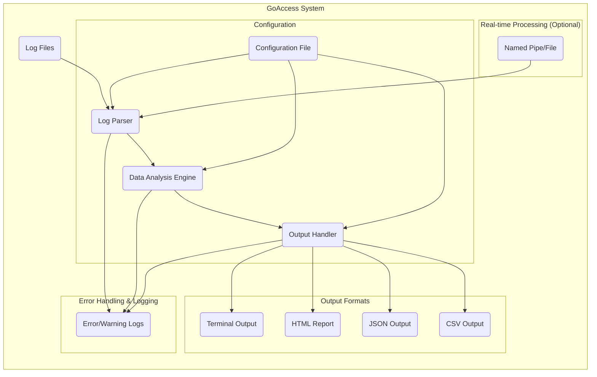

# Project Design Document: GoAccess - Real-time Web Log Analyzer

**Version:** 1.1
**Date:** October 26, 2023
**Author:** AI Software Architect

## 1. Introduction

This document provides a detailed design overview of the GoAccess project, a real-time web log analyzer. The primary purpose of this document is to serve as a comprehensive reference for understanding the system's architecture, components, and data flow, specifically to facilitate thorough threat modeling. This document will be used to identify potential security vulnerabilities and inform the design of appropriate mitigation strategies.

## 2. Goals and Objectives

* **Primary Goal:** Provide a clear, detailed, and security-focused architectural overview of GoAccess.
* **Objectives:**
    * Clearly describe the major components of the GoAccess system and their interactions.
    * Accurately illustrate the data flow within the system, highlighting potential security touchpoints.
    * Outline the different deployment models and their security implications.
    * Identify key technologies used and their inherent security characteristics.
    * Provide a solid foundation for subsequent threat modeling activities, enabling the identification of potential vulnerabilities.

## 3. Target Audience

This document is intended for:

* Security engineers responsible for threat modeling, security architecture reviews, and penetration testing.
* Software developers involved in maintaining, extending, or integrating with GoAccess.
* DevOps engineers responsible for deploying, configuring, and securing GoAccess in various environments.

## 4. Scope

This document comprehensively covers the core functionality of GoAccess as a web log analyzer. It includes:

* Log input processing from various sources.
* Data parsing and analysis, including statistical calculations.
* Real-time and static analysis modes of operation.
* Generation of various output formats (terminal, HTML, JSON, CSV).
* Configuration options and their impact on security.
* Error handling and logging mechanisms within GoAccess.

This document does not cover:

* Specific low-level implementation details of individual functions or algorithms.
* The internal workings of third-party libraries beyond their general purpose and potential security implications.
* Detailed performance benchmarks or optimization strategies.

## 5. High-Level Architecture

GoAccess is primarily a command-line application developed in C. It processes web server access logs and generates statistical reports. The core architecture can be visualized as follows:

**Components:**

* **Log Files:** The primary input source containing web server access logs (e.g., Apache, Nginx access.log).
* **Log Parser:** Responsible for reading and interpreting individual log entries based on the specified log format.
* **Data Analysis Engine:** The central component that processes the parsed log data, performs calculations, and aggregates statistical information.
* **Output Handler:** Formats and renders the analyzed data into the desired output format.
* **Configuration File:** Stores user-defined settings, including log format, date format, output preferences, filtering rules, and other operational parameters.
* **Terminal Output:** Displays the analysis results directly within the command-line interface.
* **HTML Report:** Generates a self-contained HTML file containing interactive dashboards, charts, and tables.
* **JSON Output:** Produces a JSON-formatted representation of the analysis results.
* **CSV Output:** Generates a comma-separated value file of the analysis results.
* **Named Pipe/File (Optional):** Enables real-time log processing by reading from a named pipe or a continuously updated file.
* **Error/Warning Logs:** Internal logging mechanism for recording errors, warnings, and potentially security-relevant events within GoAccess.

## 6. Detailed Design

This section provides a more granular view of the key components, their functionalities, and associated security considerations.

### 6.1. Log Parser

* **Functionality:**
    * Reads log files line by line from the specified input source.
    * Parses each line according to the configured log format string, which can be predefined or custom.
    * Extracts relevant fields such as client IP address, timestamp, request method, requested URL, HTTP status code, user agent, and referrer.
    * Supports various log formats and allows for custom format definitions.
    * Can handle compressed log files (e.g., gzip, bzip2).
* **Key Considerations for Threat Modeling:**
    * **Log Format String Injection:**  A malicious user potentially influencing the log format string could lead to parsing errors, crashes, or information disclosure if not handled carefully.
    * **Input Validation Vulnerabilities:** Insufficient validation of log entry content could lead to injection attacks (e.g., command injection if log data is used in system calls later) or buffer overflows.
    * **Denial of Service (DoS) via Malformed Logs:**  Crafted log entries could be designed to consume excessive resources during parsing, leading to a denial of service.
    * **Path Traversal:** If log file paths are user-controlled, vulnerabilities could arise if proper sanitization isn't in place.

### 6.2. Data Analysis Engine

* **Functionality:**
    * Aggregates parsed log data based on various criteria (e.g., IP address, requested URL, date/time).
    * Calculates statistics such as hit counts, unique visitors, requested files, referring sites, operating systems, browsers, and HTTP status codes.
    * Maintains in-memory data structures (e.g., hash maps, trees) to store and update the analysis results efficiently.
    * Supports filtering and sorting of data based on different metrics.
* **Key Considerations for Threat Modeling:**
    * **Data Integrity Issues:** Maliciously crafted log entries could potentially skew the analysis results, leading to inaccurate reporting.
    * **Resource Exhaustion:** A large volume of unique log entries or specific types of requests could lead to excessive memory consumption or CPU usage, causing performance degradation or crashes.
    * **Algorithmic Complexity Vulnerabilities:** Inefficient algorithms in the analysis engine could be exploited with specific input patterns to cause performance issues.
    * **Integer Overflow/Underflow:** Calculations involving large numbers of requests or data sizes could be susceptible to integer overflow or underflow vulnerabilities.

### 6.3. Output Handler

* **Functionality:**
    * Formats the analyzed data into the selected output format (terminal, HTML, JSON, CSV).
    * For HTML output:
        * Generates interactive dashboards with charts and tables using embedded JavaScript libraries (e.g., NVD3).
        * Provides options for customization, theming, and report generation.
    * For JSON and CSV output:
        * Structures the data in a standardized, machine-readable format.
* **Key Considerations for Threat Modeling:**
    * **Cross-Site Scripting (XSS) in HTML Output:** If user-controlled data from logs is not properly sanitized before being included in the HTML report, it could lead to XSS vulnerabilities.
    * **Injection Attacks in JSON/CSV Output:** If the generated JSON or CSV output is consumed by other systems without proper input validation, it could be vulnerable to injection attacks (e.g., CSV injection).
    * **Information Disclosure:** The output might inadvertently contain sensitive information that should be protected, depending on the log data and configuration.
    * **Path Traversal in Output File Generation:** If output file paths are user-controlled, vulnerabilities could arise if proper sanitization isn't in place.

### 6.4. Configuration Management

* **Functionality:**
    * Reads configuration parameters from a configuration file (typically `goaccess.conf`) or command-line arguments.
    * Allows users to customize various aspects of GoAccess's behavior, including log format, date format, output options, filtering rules, and real-time settings.
    * Supports reloading the configuration without requiring a full restart in some scenarios.
* **Key Considerations for Threat Modeling:**
    * **Configuration File Security:** The configuration file may contain sensitive information (e.g., custom log formats that reveal internal paths). It should be protected with appropriate file system permissions to prevent unauthorized access or modification.
    * **Command-Line Injection:** Improper handling of command-line arguments could lead to command injection vulnerabilities.
    * **Insecure Defaults:** Default configuration settings should be reviewed to ensure they do not introduce unnecessary security risks.
    * **Privilege Escalation:** If GoAccess is run with elevated privileges and the configuration can be modified by a less privileged user, it could lead to privilege escalation.

### 6.5. Real-time Processing (Optional)

* **Functionality:**
    * Monitors a named pipe or a specified file for new log entries.
    * Processes new log entries as they are written, providing near real-time analysis updates.
* **Key Considerations for Threat Modeling:**
    * **Data Source Integrity:** A malicious process could potentially write fabricated log data to the named pipe or monitored file, corrupting the analysis.
    * **Denial of Service (DoS):** A flood of log entries through the real-time input could overwhelm GoAccess, leading to a denial of service.
    * **Race Conditions:** Concurrent access to the real-time input source and the analysis engine could introduce race conditions if not properly synchronized.

### 6.6. Error Handling & Logging

* **Functionality:**
    * Includes mechanisms for handling errors and unexpected events during log parsing, analysis, and output generation.
    * Logs errors, warnings, and potentially security-relevant events to a designated log file or standard error.
* **Key Considerations for Threat Modeling:**
    * **Information Disclosure in Logs:** Error messages might reveal sensitive information about the system or application.
    * **Log Forgery/Tampering:** If the logging mechanism is not secure, attackers could potentially forge or tamper with log entries to hide malicious activity.
    * **Insufficient Logging:** Lack of sufficient logging can hinder incident response and forensic analysis.

## 7. Data Flow

The typical data flow within GoAccess is as follows:

1. **Input:** GoAccess receives the path to one or more log files or a named pipe as input, either through command-line arguments or configuration.
2. **Parsing:** The Log Parser reads and parses the log entries based on the configured log format. Error handling occurs here for malformed or unexpected log entries.
3. **Analysis:** The Data Analysis Engine processes the parsed data, aggregating statistics and storing them in in-memory data structures.
4. **Output:** The Output Handler formats the analyzed data according to the selected output method (terminal, HTML, JSON, CSV), applying necessary sanitization for HTML output.
5. **Presentation/Storage:** The output is either displayed in the terminal, saved to a file (HTML, JSON, CSV), or streamed.

For real-time processing:

1. **Monitoring:** GoAccess continuously monitors the specified named pipe or file for new log entries.
2. **Parsing:** New log entries written to the pipe/file are immediately read and parsed by the Log Parser.
3. **Analysis:** The Data Analysis Engine updates the existing statistics with the new data in real-time.
4. **Output (Optional):** GoAccess can be configured to periodically output updated reports in real-time mode.

## 8. Deployment Model

GoAccess is typically deployed as a command-line tool on a server or workstation where web server logs are accessible. Common deployment scenarios and their security implications include:

* **Direct Execution on Web Server:**
    * **Pros:** Simple setup, direct access to logs.
    * **Cons:** Potential resource contention with the web server, security risks if GoAccess is compromised on the web server.
* **Centralized Log Analysis Server:**
    * **Pros:** Dedicated resource for analysis, separation of concerns.
    * **Cons:** Requires secure log transfer mechanisms, potential bottleneck if the central server is overloaded.
* **Scheduled Task/Cron Job:**
    * **Pros:** Automation of report generation.
    * **Cons:** Reports might be outdated, potential security risks if the scheduled task is compromised.
* **Integration with Log Management Systems:**
    * **Pros:** Enhanced scalability and management capabilities.
    * **Cons:** Security depends on the security of the integrated log management system.

## 9. Technology Stack

* **Programming Language:** C
* **Core Libraries:**
    * `ncurses` or `slang`: For creating the terminal user interface.
    * `pcre` (Perl Compatible Regular Expressions): For flexible and powerful log parsing.
    * Standard C libraries for input/output, memory management, etc.
* **HTML Output Dependencies:**
    * Embedded JavaScript libraries like NVD3 for generating interactive charts and visualizations.

## 10. Security Considerations (Detailed)

This section expands on the preliminary security considerations, providing more detail relevant for threat modeling.

* **Input Validation:**
    * **Threat:** Log injection attacks, buffer overflows, denial of service.
    * **Mitigation:** Implement strict input validation on log entries based on the expected format. Sanitize input data before processing. Use safe string handling functions to prevent buffer overflows.
* **Output Sanitization:**
    * **Threat:** Cross-site scripting (XSS) vulnerabilities in HTML reports.
    * **Mitigation:**  Thoroughly sanitize all user-controlled data (from logs) before including it in the HTML output. Use context-aware escaping techniques. Consider using Content Security Policy (CSP).
* **Configuration Security:**
    * **Threat:** Unauthorized access or modification of configuration, leading to information disclosure or compromised analysis.
    * **Mitigation:** Store the configuration file with appropriate file system permissions (restrict read/write access). Avoid storing sensitive information directly in the configuration file if possible.
* **Command-Line Injection:**
    * **Threat:** Attackers injecting malicious commands through command-line arguments.
    * **Mitigation:** Carefully validate and sanitize all command-line input. Avoid using shell interpreters to execute external commands based on user input.
* **Resource Management:**
    * **Threat:** Denial of service through excessive resource consumption (CPU, memory).
    * **Mitigation:** Implement limits on resource usage. Employ efficient algorithms for data processing. Implement safeguards against processing excessively large or malformed log files.
* **Privilege Management:**
    * **Threat:** Running GoAccess with unnecessary privileges increases the impact of potential vulnerabilities.
    * **Mitigation:** Run GoAccess with the minimum necessary privileges required for its operation.
* **Real-time Processing Security:**
    * **Threat:** Injection of malicious data through named pipes or monitored files.
    * **Mitigation:** Secure the named pipe or monitored file to restrict write access to authorized processes.
* **Error Handling and Logging:**
    * **Threat:** Information disclosure through verbose error messages, log tampering.
    * **Mitigation:** Implement secure logging practices. Avoid logging sensitive information in error messages. Protect log files from unauthorized access and modification.

## 11. Assumptions and Constraints

* **Assumption:** The underlying operating system and supporting libraries are reasonably secure and up-to-date.
* **Assumption:** Users deploying and configuring GoAccess have a basic understanding of security best practices.
* **Constraint:** GoAccess is primarily a command-line tool and lacks a built-in authentication or authorization mechanism. Security relies heavily on the security of the host system.
* **Constraint:** The security of the generated reports (especially HTML) depends on the context in which they are viewed and the security of the viewing application (web browser).

## 12. Future Considerations

* **Enhanced Security Features:** Implement more robust security features such as input sanitization libraries, secure configuration management with encryption, and improved logging capabilities.
* **Web Interface with Authentication:** Developing a web interface with built-in authentication and authorization would improve usability and security for certain deployment scenarios.
* **Plugin Architecture with Security Audits:** If a plugin architecture is implemented, thorough security audits of plugins would be necessary.
* **Regular Security Audits and Penetration Testing:** Periodic security assessments are crucial to identify and address potential vulnerabilities.

This revised document provides a more detailed and security-focused design overview of the GoAccess project, offering a stronger foundation for comprehensive threat modeling activities. The enhanced information regarding potential threats and mitigations will be invaluable in identifying vulnerabilities and designing appropriate security controls.
