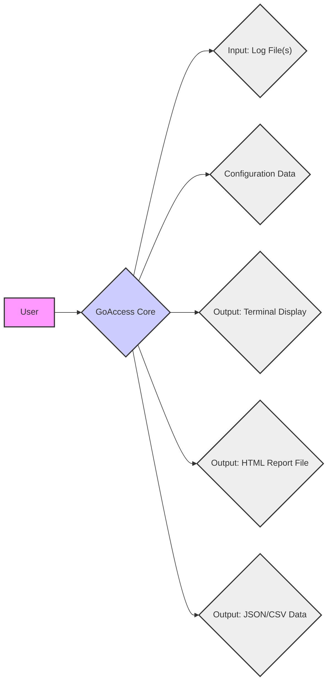
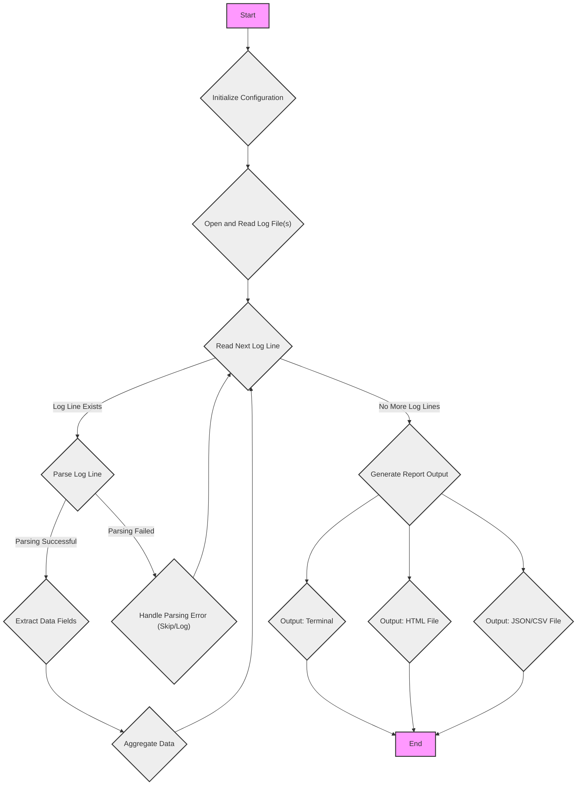

# Project Design Document: GoAccess - Real-time Web Log Analyzer

**Version:** 1.1
**Date:** October 26, 2023
**Author:** Gemini (AI Language Model)

## 1. Introduction

This document provides an enhanced and detailed design overview of the GoAccess project, a real-time web log analyzer and interactive viewer. This document aims to clearly outline the system's architecture, components, data flow, and key considerations for future threat modeling activities. This revision includes more granular detail and clarifies certain aspects of the system.

## 2. Goals and Objectives

The primary goals of GoAccess are:

- To provide a fast and efficient method for parsing and analyzing web server access logs.
- To present log data in a human-readable and interactive format, suitable for real-time monitoring and historical analysis.
- To support a wide range of common web server log formats, including Apache, Nginx, Amazon S3, and others, with the ability to define custom formats.
- To offer diverse output options, including real-time terminal output, static HTML reports, and structured data formats like JSON and CSV for integration with other systems.
- To be a lightweight, portable, and dependency-free command-line tool, making it easy to deploy and use on various platforms.

## 3. System Architecture Overview

GoAccess operates as a command-line application that processes log files and generates reports based on the parsed data. The core architecture can be visualized as follows:

Key architectural elements:

- **User:** The individual or automated system invoking the GoAccess application via the command line.
- **GoAccess Core:** The central processing unit of the application. It orchestrates log parsing, data aggregation, and report generation based on the provided input and configuration.
- **Input: Log File(s):** The primary data source, containing raw web server access log entries. GoAccess can process single or multiple log files.
- **Configuration Data:**  Settings that control GoAccess's behavior. This can be provided through a configuration file (`goaccess.conf`) or command-line arguments. It includes details like log format, output type, and filtering options.
- **Output: Terminal Display:**  The interactive, real-time output mode where analysis results are displayed directly in the user's terminal.
- **Output: HTML Report File:** Generates a static HTML file containing the analysis results, often including interactive JavaScript elements for enhanced visualization.
- **Output: JSON/CSV Data:** Exports the aggregated and analyzed log data in structured JSON or CSV formats, suitable for further processing or integration with other tools.

## 4. Component Details

This section provides a more detailed breakdown of the key components within the GoAccess architecture:

- **Log Parser Module:**
    - **Functionality:** Reads and interprets raw log data from the specified input file(s).
    - **Log Format Handling:** Supports a variety of predefined log formats (e.g., CLF, combined, W3C) and allows users to define custom formats using a format string.
    - **Data Extraction:** Extracts relevant fields from each log line based on the configured format, including IP address, timestamp, request method, requested URL, HTTP status code, user agent, and referrer.
    - **Error Handling:** Attempts to gracefully handle malformed or incomplete log lines, potentially logging errors or skipping problematic entries.
    - **Buffering:** May employ buffering techniques to optimize reading and processing of large log files.

- **Data Aggregation Engine:**
    - **Functionality:** Processes the parsed log data and aggregates it based on various metrics and dimensions.
    - **Metrics Tracking:** Maintains counters and statistics for key performance indicators (KPIs) such as:
        - Number of requests
        - Unique visitors (based on IP address)
        - Requested files/resources
        - Referring sites
        - Operating systems and browsers (derived from user agent strings)
        - HTTP status codes
        - Geo location of visitors (if enabled and configured with a GeoIP database).
    - **Data Structures:** Utilizes in-memory data structures (e.g., hash maps, trees) for efficient storage and retrieval of aggregated data.
    - **Filtering and Sorting:** Implements filtering capabilities based on various criteria (e.g., IP address, date range, requested resource) and allows sorting of results by different metrics.

- **Report Generation Module:**
    - **Functionality:** Takes the aggregated data from the Data Aggregation Engine and formats it into the desired output format.
    - **Terminal Output Renderer:**
        - Formats data for display in a terminal environment, often using ASCII characters and ANSI escape codes for basic visualizations and color-coding.
        - Provides an interactive interface (in terminal mode) allowing users to navigate through different reports and drill down into details.
    - **HTML Report Generator:**
        - Generates a static HTML file containing the analysis results.
        - Includes interactive elements (typically using JavaScript libraries) for sorting, filtering, and visualizing data in tables, charts, and graphs.
        - Allows customization of the HTML report's appearance through themes or CSS.
    - **JSON/CSV Exporter:**
        - Serializes the aggregated data into JSON or CSV format.
        - Provides options for customizing the output format (e.g., field delimiters, quoting).

- **Configuration Management Component:**
    - **Functionality:** Loads, parses, and manages configuration settings for GoAccess.
    - **Configuration File Handling:** Reads configuration parameters from the `goaccess.conf` file, typically located in a user's home directory or a system-wide configuration directory.
    - **Command-Line Argument Parsing:** Processes command-line options provided by the user, allowing for overriding or supplementing configuration file settings.
    - **Default Settings:** Provides sensible default values for configuration options not explicitly specified by the user.
    - **Validation:** Performs basic validation of configuration parameters to ensure they are within acceptable ranges or formats.

- **User Interface (Terminal Mode):**
    - **Functionality:** Provides an interactive text-based interface when GoAccess is run without the `-o` option (for file output).
    - **Navigation:** Allows users to switch between different report panels (e.g., general statistics, top visitors, requested files) using keyboard shortcuts.
    - **Drill-Down Capabilities:** Enables users to select specific entries in a report (e.g., a particular IP address) to view more detailed information related to that entry.
    - **Filtering:** Supports real-time filtering of the displayed data based on user-defined criteria.

## 5. Data Flow

The typical data flow within GoAccess can be described in a more detailed sequence:

1. **Invocation:** The user executes the `goaccess` command in the terminal, providing the path to the log file(s) and optionally, configuration parameters via command-line arguments.
2. **Configuration Initialization:** The Configuration Management Component loads settings, prioritizing command-line arguments over configuration file settings. Default values are used for unspecified options.
3. **Log File Input:** The Log Parser Module opens and prepares to read the specified log file(s).
4. **Line-by-Line Processing:** The Log Parser reads the log file(s) line by line.
5. **Log Line Parsing:** For each log line, the Log Parser attempts to parse the line according to the configured log format. If parsing fails, the line might be skipped or an error logged.
6. **Data Extraction and Aggregation:** Successfully parsed data is extracted and passed to the Data Aggregation Engine. The engine updates its internal data structures, incrementing counters and accumulating statistics based on the extracted information.
7. **Report Generation Trigger:** Once all log lines have been processed (or in real-time for piped input), the Report Generation Module is invoked.
8. **Output Formatting:** Based on the selected output method (terminal, HTML, JSON/CSV), the Report Generation Module formats the aggregated data.
    - **Terminal Output:** The Terminal Output Renderer formats the data for console display.
    - **HTML Output:** The HTML Report Generator creates an HTML file with embedded data and potentially JavaScript for interactivity.
    - **JSON/CSV Output:** The JSON/CSV Exporter serializes the data into the respective format.
9. **Output Delivery:** The generated report is either displayed in the terminal or written to the specified output file.

## 6. Security Considerations (Detailed)

This section expands on potential security considerations, providing more specific examples of potential threats:

- **Log File Handling Vulnerabilities:**
    - **Path Traversal:** If the log file path is provided via user input or an external configuration without proper sanitization, an attacker could potentially specify paths outside the intended directory, leading to unauthorized file access or information disclosure. For example, providing a path like `../../../../etc/passwd`.
    - **Denial of Service (DoS) through Large Files:** Processing extremely large log files, especially those maliciously crafted with repetitive or verbose entries, could consume excessive memory and CPU resources, leading to a denial of service.
    - **Symbolic Link Exploitation:** If GoAccess follows symbolic links when processing log files, an attacker could create a symbolic link pointing to a sensitive file, potentially allowing GoAccess to read and process its contents.

- **Configuration Handling Vulnerabilities:**
    - **Command Injection:** If configuration options, particularly custom log format strings, are not properly sanitized, an attacker might inject malicious commands that could be executed by the system. For instance, a crafted log format string could include shell commands.
    - **Unintended Configuration Overrides:** If GoAccess doesn't properly restrict where it loads configuration files from, an attacker might be able to place a malicious `goaccess.conf` file in a predictable location that GoAccess will load, overriding legitimate settings.

- **Output Generation Vulnerabilities:**
    - **Cross-Site Scripting (XSS) in HTML Reports:** If user-provided data from log entries (e.g., within URLs, referrers, or user agents) is directly embedded into the generated HTML report without proper encoding or sanitization, it could lead to XSS vulnerabilities. An attacker could inject malicious JavaScript code into a log entry, which would then be executed in the browsers of users viewing the report.
    - **Information Disclosure in Reports:**  Care must be taken to ensure that sensitive information, if present in the logs, is not inadvertently exposed in the generated reports. This could include internal IP addresses, API keys, or other confidential data.

- **Dependency Management Risks:**
    - **Vulnerable Libraries:** If GoAccess relies on external libraries (though it aims to be dependency-free), vulnerabilities in those libraries could introduce security risks. Regular updates and security audits of any dependencies are crucial.

- **Integer Overflow/Underflow in Aggregation:**
    - **Data Corruption:** If the data aggregation logic doesn't properly handle extremely large numbers of requests or other metrics, integer overflows or underflows could occur, leading to inaccurate reporting or potentially exploitable conditions.

- **Memory Management Issues:**
    - **Buffer Overflows:**  Improper handling of input data during parsing or aggregation could lead to buffer overflows if data exceeds allocated memory boundaries. This could potentially be exploited to execute arbitrary code.

## 7. Deployment Considerations

GoAccess is typically deployed as a command-line tool in environments where access to web server logs is available. Common deployment scenarios include:

- **Direct Execution on Web Servers:** Running GoAccess directly on the web server itself to analyze logs in real-time or generate periodic reports. This requires careful consideration of resource usage to avoid impacting the server's primary function.
- **Centralized Log Processing Systems:** Integrating GoAccess into a centralized log management pipeline where logs are collected from multiple servers and then processed. This allows for aggregated analysis across an entire infrastructure.
- **Local Analysis on Administrative Machines:** Downloading or transferring log files to a local administrative machine for analysis using GoAccess, isolating the analysis process from the production web servers.
- **Containerized Environments:** Deploying GoAccess within Docker or other container environments for isolated and reproducible analysis.

## 8. Future Enhancements (Out of Scope for Initial Threat Modeling)

While not the primary focus of this design document for threat modeling, potential future enhancements could include:

- **Real-time Log Streaming and Analysis:**  Implementing support for directly processing log data as it is being written, without requiring the entire log file to be present.
- **Web-Based User Interface:** Developing a web-based interface for accessing and interacting with GoAccess reports, potentially offering more advanced visualization and filtering capabilities.
- **Integration with Data Stores:**  Adding the ability to store aggregated data in databases or other data stores for more persistent storage and advanced querying.
- **Enhanced Visualization Options:**  Incorporating more sophisticated charting and graphing libraries to provide richer data visualization.
- **Alerting and Monitoring Features:**  Adding capabilities to trigger alerts based on specific patterns or anomalies detected in the log data.

This improved document provides a more detailed and nuanced understanding of the GoAccess project's design, offering a stronger foundation for subsequent threat modeling activities. The enhanced descriptions of components, data flow, and security considerations aim to facilitate a more comprehensive identification and mitigation of potential vulnerabilities.