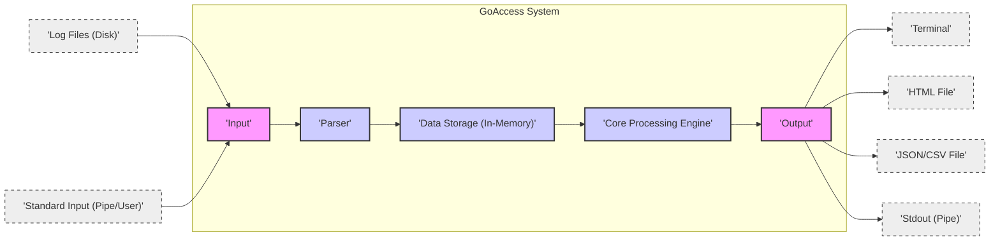
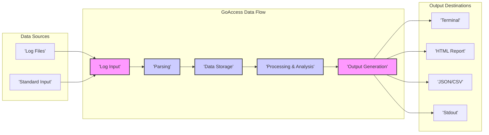

# Project Design Document: GoAccess - Real-time Web Log Analyzer

**Version:** 1.1
**Date:** 2023-10-27
**Author:** AI Expert

## 1. Introduction

This document provides a detailed design overview of GoAccess, a real-time web log analyzer. This document is intended to be used as a basis for threat modeling and security analysis of the GoAccess project. It outlines the system's architecture, components, data flow, and external interactions.

GoAccess is a fast and open-source real-time web log analyzer and interactive viewer. It is designed to be run in a terminal on *nix systems or through a browser. GoAccess parses web server access logs and provides valuable HTTP statistics for system administrators and web developers.

**Project Repository:** [https://github.com/allinurl/goaccess](https://github.com/allinurl/goaccess)

## 2. System Architecture

GoAccess is designed as a modular and efficient command-line application. The core architecture can be visualized as follows:

### 2.1. Components Description

*   **Input:** This component is the entry point for log data. GoAccess supports the following input methods:
    *   **Log Files (Disk):**  Reads one or more log files from the local file system or accessible network file systems. File paths are provided as command-line arguments or within a configuration file.
    *   **Standard Input (Pipe/User):** Accepts log data streamed via standard input. This enables real-time analysis by piping data from commands like `tail -f` or other log management tools.

*   **Parser:** The parser is the central component responsible for interpreting raw log lines. It performs the following actions:
    *   **Log Format Configuration:** GoAccess supports predefined log formats (e.g., CLF, Combined, W3C) and custom formats defined using format strings. Users specify the format via command-line options or configuration files.
    *   **Tokenization and Field Extraction:**  Parses each log line based on the configured format, breaking it into tokens and extracting relevant fields. This involves identifying delimiters (spaces, commas, etc.) and applying format specifiers (e.g., `%h` for hostname, `%t` for timestamp).
    *   **Data Type Conversion:** Converts extracted fields into appropriate data types. For example, timestamps are converted to time objects, status codes to integers, and IP addresses to IP address objects.
    *   **Error Handling:** Manages parsing errors. GoAccess typically handles errors by:
        *   **Skipping Invalid Lines:** By default, GoAccess skips lines that do not conform to the specified log format.
        *   **Error Logging (STDERR):**  Parsing errors might be logged to standard error, depending on configuration and verbosity levels.
        *   **Configuration Options:**  Future enhancements could include options to halt processing on parsing errors or implement more sophisticated error recovery.

*   **Data Storage (In-Memory):** GoAccess leverages in-memory data structures for speed and real-time analysis.
    *   **Optimized Data Structures:** Employs efficient data structures such as hash tables (e.g., for fast lookups of unique visitors, URLs), trees (e.g., for sorted lists of top requests), and arrays to store aggregated statistics. The specific data structures are chosen for optimal performance in aggregation, sorting, and retrieval operations.
    *   **Temporary Nature:** Data is stored in memory only during the GoAccess process execution. Data is not persisted to disk in this stage, except when generating output reports.
    *   **Memory Management:**  GoAccess is designed to be memory-efficient. However, memory usage can increase with the volume and complexity of logs being processed.  Efficient memory allocation and deallocation are crucial for handling large datasets.

*   **Core Processing Engine:** This component analyzes the parsed and stored log data to generate statistics and insights. It performs:
    *   **Data Aggregation and Grouping:** Aggregates log data based on various dimensions, including:
        *   Time intervals (hourly, daily, monthly, yearly)
        *   Client IP addresses
        *   Requested URLs and paths
        *   HTTP status codes
        *   User agent strings (browsers, operating systems, bots)
        *   Referrer URLs
        *   Geographical location (using optional GeoIP databases)
    *   **Statistical Calculations:** Computes various metrics and statistics based on aggregated data:
        *   Request counts (total, unique visitors, hits/misses)
        *   Bandwidth usage (total traffic, traffic per resource)
        *   Response times (average, min, max, percentiles)
        *   HTTP status code distribution (2xx, 3xx, 4xx, 5xx errors)
        *   Top URLs, referrers, user agents, operating systems, browsers, countries
        *   Time distribution of requests (peak hours, days of the week)
    *   **Filtering and Sorting:** Provides capabilities to filter and sort the analyzed data based on different criteria. Users can filter by date/time ranges, IP addresses, URLs, status codes, and other dimensions. Sorting allows users to rank results by request count, bandwidth, response time, etc.

*   **Output:** The Output component presents the analyzed data in various formats for user consumption. GoAccess supports multiple output methods:
    *   **Terminal (Interactive Dashboard):** Displays a real-time, interactive dashboard in the terminal using ncurses. This interface allows users to navigate through different statistics modules, drill down into details, and sort data dynamically.
    *   **HTML Report (Static Web Page):** Generates a static HTML report containing all the statistics and visualizations. This report can be opened in any web browser and is suitable for sharing and archiving. The HTML report is self-contained (typically with embedded CSS and potentially JavaScript for enhanced interactivity).
    *   **JSON/CSV Output (Data Export):** Exports the raw or aggregated data in JSON (JavaScript Object Notation) or CSV (Comma-Separated Values) formats. These formats are suitable for programmatic consumption, data exchange, and integration with other data analysis tools or systems.
    *   **Stdout (Pipe for Scripting):** Outputs data to standard output. This allows piping the output to other command-line tools for further processing, scripting, or integration into automated workflows.

## 3. Data Flow

The data flow within GoAccess is a sequential pipeline, processing log data from input to output:

1.  **Log Input:** Log data is ingested from either specified log files or standard input.
2.  **Parsing:** The input log lines are parsed according to the configured log format. Relevant data fields are extracted and converted to appropriate data types.
3.  **Data Storage:** Parsed data is temporarily stored in in-memory data structures for efficient access and processing.
4.  **Processing & Analysis:** The stored data is analyzed and aggregated to generate various web traffic statistics and metrics.
5.  **Output Generation:** The analyzed data is formatted and outputted to the chosen destination, such as the terminal, HTML report, JSON/CSV files, or standard output.

## 4. External Interactions

GoAccess interacts with the following external entities:

*   **File System:**
    *   **Reading Log Files:** GoAccess reads log data from log files located on the file system. This requires read permissions on the log files and directories.
    *   **Configuration Files:** GoAccess reads configuration settings from configuration files (e.g., `goaccess.conf`). This involves reading configuration parameters like log format, date format, output options, etc.
    *   **Output Files (Writing Reports):** GoAccess writes HTML, JSON, and CSV reports to the file system. This requires write permissions to the designated output directories.
    *   **GeoIP Databases (Optional):** GoAccess can optionally utilize external GeoIP databases (e.g., MaxMind DB) to enrich log data with geographical information. It reads these database files from the file system.  *Note: GoAccess itself typically does not download or update GeoIP databases. This is usually handled by external scripts or system administration tasks.*

*   **Standard Input/Output (STDIN/STDOUT/STDERR):**
    *   **Input via STDIN:** GoAccess can receive log data streamed through standard input, enabling integration with pipes and other command-line tools.
    *   **Output to STDOUT:** GoAccess can output processed data to standard output, allowing piping to other commands for further processing or scripting.
    *   **Error and Logging to STDERR:** GoAccess writes error messages, warnings, and diagnostic information to standard error.

*   **Terminal (TTY):**
    *   **Interactive Terminal UI:** When run in terminal mode, GoAccess interacts directly with the terminal to display the interactive user interface using the ncurses library. This involves terminal control sequences for screen manipulation, input handling, and color output.

*   **Web Browser (for HTML Reports):**
    *   **Viewing HTML Reports:** HTML reports generated by GoAccess are designed to be viewed in a web browser. The browser renders the HTML, CSS (embedded in the report), and any JavaScript (if included for interactivity) to display the statistics and visualizations.

## 5. Technology Stack

*   **Programming Language:** C (primarily ANSI C)
*   **User Interface Library (Terminal):** ncurses (for interactive terminal UI)
*   **Operating System Compatibility:** POSIX-compliant systems (*nix, Linux distributions, macOS, BSD variants).  Potentially Windows via compatibility layers like Cygwin or WSL (Windows Subsystem for Linux).
*   **Build System:** Autotools (autoconf, automake, libtool)
*   **Optional Libraries (for extended features):**
    *   **GeoIP Libraries:**
        *   `libmaxminddb` (recommended for MaxMind DB format)
        *   `libgeoip` (older GeoIP Legacy format)
        *   Used for geographical location enrichment based on IP addresses.
    *   **zlib or bzip2:** For handling compressed log files (gzip or bzip2 compressed).
    *   **pcre (Perl Compatible Regular Expressions):**  Potentially used for advanced log format parsing or filtering (check source code for actual usage).
*   **Compiler:** GCC (GNU Compiler Collection) or Clang (typically compiled using standard C compilers available on POSIX systems).

## 6. Deployment Model

GoAccess is a command-line tool typically deployed directly on systems where web server logs are accessible. Common deployment scenarios and their security considerations include:

*   **Directly on Web Servers (Local Analysis):**
    *   **Scenario:** GoAccess is installed and run directly on the web server itself to analyze access logs generated by that server.
    *   **Security Considerations:**
        *   **Resource Consumption:** Running GoAccess on a production web server might consume server resources (CPU, memory, I/O). Monitor resource usage to avoid impacting web server performance, especially during peak traffic.
        *   **Exposure of GoAccess Binaries:** If the web server is compromised, GoAccess binaries could also be potentially misused by an attacker. Ensure proper file system permissions and security hardening of the web server.
        *   **Log File Security:** Ensure proper access control to log files to prevent unauthorized access or modification, both by GoAccess and other processes on the server.

*   **Dedicated Log Processing Servers (Centralized Analysis):**
    *   **Scenario:** Web server logs are transferred (e.g., via rsync, scp, log shipping tools) to dedicated log processing servers. GoAccess is run on these servers to analyze aggregated logs from multiple web servers.
    *   **Security Considerations:**
        *   **Log Data in Transit Security:** Secure the transfer of log data from web servers to processing servers (e.g., use encrypted channels like SSH/SCP, TLS for log shipping).
        *   **Security of Log Processing Servers:** Harden log processing servers as they handle sensitive log data. Implement access controls, intrusion detection, and regular security updates.
        *   **Data Storage Security:** Secure the storage of aggregated log data on processing servers. Implement appropriate access controls and encryption if necessary.

*   **Local Workstations (Ad-hoc Analysis):**
    *   **Scenario:** Developers or administrators download log files to their local workstations and use GoAccess for analysis.
    *   **Security Considerations:**
        *   **Data Leakage:** Be mindful of sensitive data contained in log files when downloading them to local workstations. Ensure workstations are securely managed and protected.
        *   **Malicious Log Files:** Exercise caution when analyzing log files from untrusted sources. While GoAccess parsing vulnerabilities are less likely to directly compromise the workstation, it's good practice to analyze logs in a controlled environment.

*   **Scripted Automation (Scheduled Reports):**
    *   **Scenario:** GoAccess is integrated into scripts or automation workflows (e.g., cron jobs) to generate reports automatically on a scheduled basis.
    *   **Security Considerations:**
        *   **Script Security:** Secure the scripts that run GoAccess. Avoid storing sensitive credentials in scripts.
        *   **Output File Security:** Ensure that generated reports are stored securely and access is controlled.
        *   **Resource Management:**  Schedule GoAccess jobs to run during off-peak hours to minimize resource contention on servers.

## 7. Security Considerations (For Threat Modeling)

This design document is intended to facilitate threat modeling. Key security considerations for GoAccess include:

*   **Input Validation and Sanitization (Log Parsing):**
    *   **Log Format String Vulnerabilities:**  Improper handling of custom log format strings could potentially lead to vulnerabilities if format specifiers are not correctly validated and sanitized.  While less likely in GoAccess due to its mature codebase, format string bugs are a general concern in C applications.
    *   **Buffer Overflow/Underflow in Parsing:**  Vulnerabilities in the parsing logic, especially when handling long or malformed log lines, could potentially lead to buffer overflows or underflows in C code if bounds checking is insufficient. This could result in crashes or, in more severe cases, code execution.
    *   **Denial of Service via Malformed Logs:**  Crafted malicious log lines designed to exploit parsing inefficiencies or resource-intensive parsing operations could potentially lead to denial of service by consuming excessive CPU or memory. Regular expression complexity in log parsing (if used) could also be a DoS vector.
    *   **Injection Attacks via Log Data (Output Context):** If log data contains attacker-controlled content (e.g., User-Agent, Referrer, URI), and this data is directly reflected in output reports (especially HTML), vulnerabilities like Cross-Site Scripting (XSS) could arise if output is not properly encoded and sanitized. For example, if User-Agent contains `` and is displayed in the HTML report without escaping, it could execute in the browser.

*   **Privilege Management (Principle of Least Privilege):**
    *   **Minimize Running Privileges:** GoAccess should be run with the minimum necessary privileges required to read log files, write output files, and access GeoIP databases (if used). Avoid running GoAccess as root or with unnecessary elevated privileges.
    *   **File System Permissions:** Ensure appropriate file system permissions are set for log files, configuration files, output directories, and GeoIP databases to restrict access to authorized users and processes only.

*   **Output Security (Report Generation):**
    *   **Cross-Site Scripting (XSS) in HTML Reports:**  Thoroughly sanitize and encode all user-controlled data (extracted from logs) before including it in HTML reports. Use proper HTML escaping techniques to prevent XSS vulnerabilities. Pay special attention to fields like User-Agent, Referrer, and URI, which are often attacker-influenced.
    *   **Information Disclosure in Reports:**  Carefully review generated reports to ensure that sensitive information is not inadvertently exposed. Avoid including internal paths, configuration details, or other confidential data in reports unless explicitly intended and secured. Be mindful of potentially sensitive data in URLs and request parameters logged in access logs.

*   **Denial of Service (Resource Exhaustion):**
    *   **Large Log File Handling:** GoAccess is designed to handle large log files, but extremely large files or a high volume of real-time log data could still potentially lead to resource exhaustion (CPU, memory, disk I/O). Implement monitoring and resource limits if necessary, especially when running GoAccess on production systems.
    *   **Rate Limiting/Input Size Limits (Consideration for Future Enhancements):**  For scenarios processing untrusted log data or in high-load environments, consider implementing rate limiting on input log data or setting limits on the size of log files processed to mitigate potential DoS attacks.

*   **File System Security (Configuration and Data Storage):**
    *   **Secure Configuration File Handling:** Store GoAccess configuration files (`goaccess.conf`) securely. Restrict read and write access to authorized users only. Avoid storing sensitive information (e.g., credentials) directly in configuration files if possible.
    *   **Output File Permissions:** Set appropriate permissions for generated output files (HTML, JSON, CSV) to control access and prevent unauthorized modification or disclosure. Store reports in secure locations if they contain sensitive information.

This security considerations section provides a starting point for a more in-depth threat model. A comprehensive threat model would involve systematically identifying potential threats, vulnerabilities, and attack vectors, and then developing mitigation strategies specific to the GoAccess implementation and deployment environment.  Further security analysis should include source code review, static analysis, and dynamic testing to identify and address potential vulnerabilities.