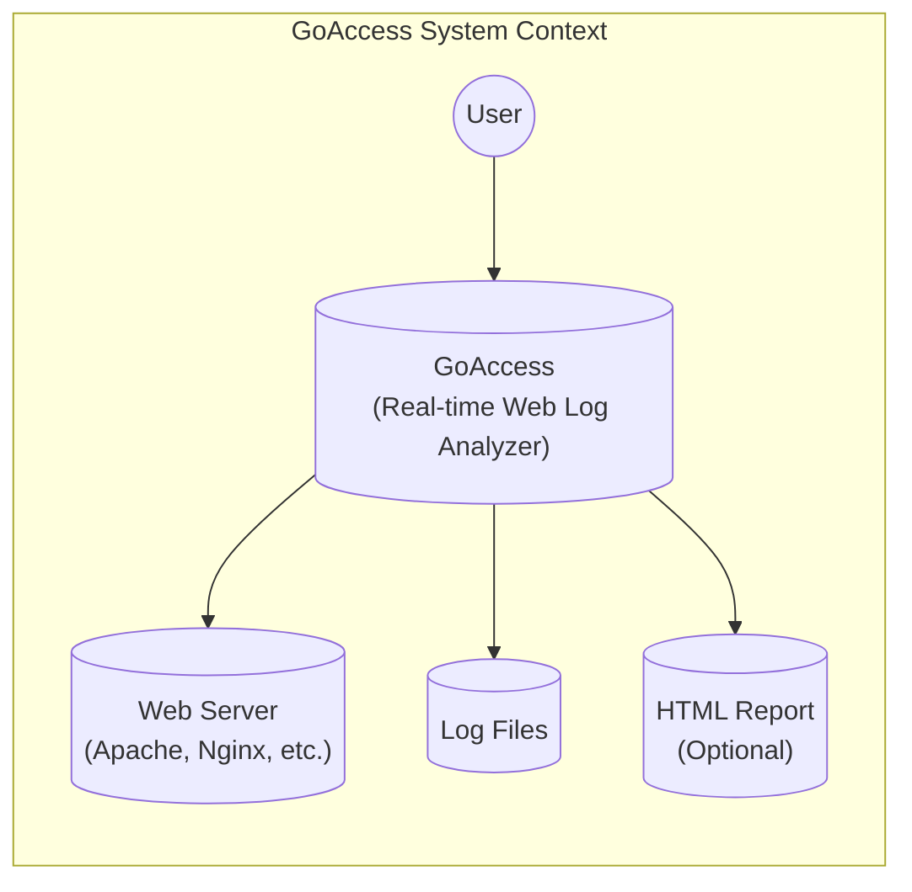
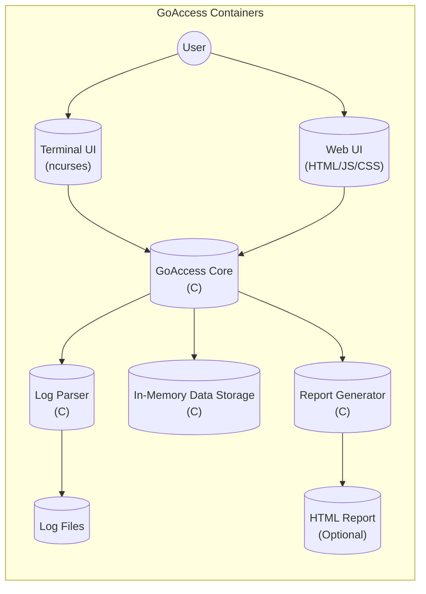
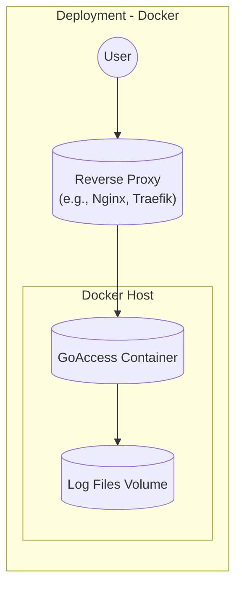
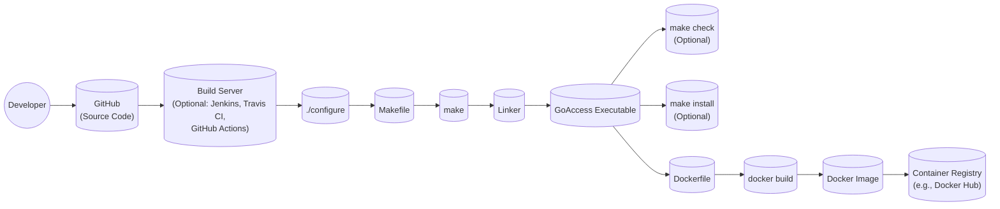

Okay, let's create a design document for GoAccess, based on the provided GitHub repository.

# BUSINESS POSTURE

GoAccess is a real-time web log analyzer and interactive viewer.  It's designed to be fast and efficient, processing web server logs and presenting them in a visually appealing and informative way.

Priorities:

*   Provide real-time log analysis.
*   Offer a user-friendly interface (both terminal and web-based).
*   Maintain high performance and low resource consumption.
*   Support various log formats (Apache, Nginx, CloudFront, etc.).
*   Be easily deployable and configurable.
*   Open source and community-driven.

Goals:

*   Enable users to quickly identify website traffic patterns, errors, and potential security issues.
*   Provide insights into visitor behavior, popular content, and referring sites.
*   Aid in troubleshooting website performance problems.
*   Help in capacity planning and resource allocation.

Business Risks:

*   Inaccurate or misleading log analysis, leading to incorrect conclusions.
*   Performance bottlenecks or crashes under heavy load, disrupting monitoring capabilities.
*   Security vulnerabilities that could expose sensitive log data or allow unauthorized access.
*   Lack of support for new or custom log formats, limiting usability.
*   Difficult or complex configuration, hindering adoption.
*   Inability to scale to handle large log files or high traffic volumes.

# SECURITY POSTURE

Existing Security Controls:

*   security control: Input validation: GoAccess parses log files, and robust input validation is crucial to prevent vulnerabilities like buffer overflows or format string bugs.  This is handled within the GoAccess codebase (src/parser.c, src/settings.c, and related files).
*   security control: Data sanitization:  Output is sanitized to prevent cross-site scripting (XSS) vulnerabilities, especially in the HTML report. This is implemented in the output generation modules (src/output.c, and related files).
*   security control: Regular expression handling: GoAccess uses regular expressions for log format parsing.  Careful crafting and testing of these regexes are essential to avoid ReDoS (Regular Expression Denial of Service) vulnerabilities. This is handled within the parsing logic (src/parser.c).
*   security control: Optional HTTPS support for the web interface: GoAccess can be configured to use HTTPS for its web interface, protecting data in transit. This is a configuration option, described in the documentation.
*   security control: Limited file access: GoAccess should only be granted read access to the necessary log files and write access to its output directory (if generating HTML reports). This is an operational/deployment consideration.
*   security control: No built-in authentication: GoAccess itself does not have built-in authentication mechanisms. It relies on external mechanisms (e.g., web server authentication, firewall rules) to control access. This is by design, documented in the FAQs and man page.

Accepted Risks:

*   accepted risk: No built-in authentication: As mentioned above, GoAccess relies on external authentication. This is acceptable because GoAccess is often used behind a reverse proxy or within a protected network.
*   accepted risk: Potential for information disclosure if misconfigured: If GoAccess is exposed to the public internet without proper access controls, it could leak sensitive information from the log files. This is an accepted risk, mitigated by proper configuration and deployment.
*   accepted risk: Dependency vulnerabilities: GoAccess depends on external libraries (e.g., ncurses, OpenSSL). Vulnerabilities in these libraries could impact GoAccess. This is mitigated by keeping dependencies up-to-date and monitoring for security advisories.

Recommended Security Controls:

*   security control: Integrate with a Security Information and Event Management (SIEM) system: Forwarding parsed log data to a SIEM can enhance threat detection and incident response.
*   security control: Implement robust auditing of GoAccess configuration changes: Track who made changes to the GoAccess configuration and when.
*   security control: Consider using a Web Application Firewall (WAF) in front of the GoAccess web interface: A WAF can provide an additional layer of protection against web-based attacks.

Security Requirements:

*   Authentication: GoAccess itself does not require authentication, but access to the GoAccess interface (terminal or web) *must* be controlled through external mechanisms (e.g., SSH, web server authentication, firewall rules).
*   Authorization: Access to log files *must* be restricted to the GoAccess process and authorized users only.  The principle of least privilege *must* be applied.
*   Input Validation: All input from log files *must* be rigorously validated to prevent parsing errors and security vulnerabilities.  This includes handling unexpected or malicious data gracefully.
*   Cryptography: If the web interface is used, HTTPS *must* be enabled to protect data in transit.  Strong ciphers and protocols *must* be used.  If storing sensitive data (which GoAccess generally does not do), appropriate encryption *must* be used.
*   Output Encoding: Output, especially to the HTML report, *must* be properly encoded to prevent XSS vulnerabilities.

# DESIGN

## C4 CONTEXT

Element Descriptions:

*   Element:
    *   Name: User
    *   Type: Person
    *   Description: A person who interacts with GoAccess to analyze web server logs.
    *   Responsibilities:
        *   Accessing the GoAccess interface (terminal or web).
        *   Configuring GoAccess.
        *   Interpreting the results.
    *   Security controls:
        *   Authentication and authorization are handled externally (e.g., SSH, web server authentication, firewall).

*   Element:
    *   Name: GoAccess
    *   Type: Software System
    *   Description: The GoAccess real-time web log analyzer.
    *   Responsibilities:
        *   Parsing web server log files.
        *   Generating real-time reports (terminal and/or web).
        *   Providing interactive analysis capabilities.
    *   Security controls:
        *   Input validation.
        *   Data sanitization.
        *   Optional HTTPS support.

*   Element:
    *   Name: Web Server
    *   Type: Software System
    *   Description: The web server that generates the log files (e.g., Apache, Nginx, IIS, CloudFront).
    *   Responsibilities:
        *   Serving web content.
        *   Generating access logs.
    *   Security controls:
        *   Standard web server security best practices (e.g., secure configuration, regular patching).

*   Element:
    *   Name: Log Files
    *   Type: Data
    *   Description: The web server access log files that GoAccess analyzes.
    *   Responsibilities:
        *   Storing information about web server requests and responses.
    *   Security controls:
        *   Access control (read-only for GoAccess).
        *   Regular log rotation and archiving.

*   Element:
    *   Name: HTML Report
    *   Type: Data
    *   Description: An optional HTML report generated by GoAccess.
    *   Responsibilities:
        *   Providing a static, web-based view of the analyzed log data.
    *   Security controls:
        *   Output encoding to prevent XSS.
        *   Access control (if exposed via a web server).

## C4 CONTAINER

Element Descriptions:

*   Element:
    *   Name: User
    *   Type: Person
    *   Description: (Same as in Context Diagram)
    *   Responsibilities: (Same as in Context Diagram)
    *   Security controls: (Same as in Context Diagram)

*   Element:
    *   Name: Terminal UI
    *   Type: Container (Terminal Application)
    *   Description: The interactive terminal-based user interface, built using the ncurses library.
    *   Responsibilities:
        *   Displaying real-time log data in the terminal.
        *   Allowing user interaction (navigation, filtering, etc.).
    *   Security controls:
        *   Relies on terminal security and user authentication.

*   Element:
    *   Name: Web UI
    *   Type: Container (Web Application)
    *   Description: The optional web-based user interface, using HTML, JavaScript, and CSS.
    *   Responsibilities:
        *   Displaying real-time log data in a web browser.
        *   Providing interactive analysis features.
    *   Security controls:
        *   HTTPS support (optional, but recommended).
        *   Output encoding to prevent XSS.
        *   Relies on external web server authentication.

*   Element:
    *   Name: GoAccess Core
    *   Type: Container (C Application)
    *   Description: The core logic of GoAccess, responsible for coordinating the other components.
    *   Responsibilities:
        *   Managing the main program loop.
        *   Handling configuration.
        *   Coordinating data flow between the parser, storage, and report generator.
    *   Security controls:
        *   Central point for enforcing security policies.

*   Element:
    *   Name: Log Parser
    *   Type: Container (C Module)
    *   Description: The module responsible for parsing web server log files.
    *   Responsibilities:
        *   Reading log files line by line.
        *   Extracting relevant data fields based on the configured log format.
        *   Handling different log formats (Apache, Nginx, etc.).
    *   Security controls:
        *   Robust input validation to prevent vulnerabilities.
        *   Careful regular expression handling.

*   Element:
    *   Name: Data Storage
    *   Type: Container (In-Memory Data Structures)
    *   Description: In-memory data structures used to store the parsed log data.
    *   Responsibilities:
        *   Storing data efficiently for fast access and analysis.
        *   Providing data to the report generator.
    *   Security controls:
        *   Data is not persisted to disk (unless using the on-disk storage option, which is not the default).

*   Element:
    *   Name: Report Generator
    *   Type: Container (C Module)
    *   Description: The module responsible for generating reports (terminal and HTML).
    *   Responsibilities:
        *   Formatting data for display in the terminal or web UI.
        *   Generating the HTML report (if enabled).
    *   Security controls:
        *   Output encoding to prevent XSS (in the HTML report).

*   Element:
    *   Name: Log Files
    *   Type: Data
    *   Description: (Same as in Context Diagram)
    *   Responsibilities: (Same as in Context Diagram)
    *   Security controls: (Same as in Context Diagram)

*   Element:
    *   Name: HTML Report
    *   Type: Data
    *   Description: (Same as in Context Diagram)
    *   Responsibilities: (Same as in Context Diagram)
    *   Security controls: (Same as in Context Diagram)

## DEPLOYMENT

GoAccess can be deployed in several ways:

1.  **Directly on the Web Server:** GoAccess can be installed and run directly on the same server that hosts the website and generates the log files. This is the simplest approach for single-server setups.
2.  **Dedicated Monitoring Server:** GoAccess can be installed on a separate server dedicated to monitoring. This server would need access to the log files, either through network shares (e.g., NFS, SMB) or by using a log shipping mechanism (e.g., rsyslog, syslog-ng, Filebeat).
3.  **Containerized Deployment (Docker):** GoAccess can be deployed as a Docker container. This provides isolation and portability. The Docker container would need to be configured to access the log files (e.g., by mounting a volume).
4.  **Cloud-Based Deployment (e.g., AWS, Azure, GCP):** GoAccess can be deployed on a cloud instance (e.g., EC2, Azure VM, Google Compute Engine). Log files can be accessed directly if GoAccess is on the same instance as the web server, or through cloud-specific log management services (e.g., CloudWatch Logs, Azure Monitor Logs, Google Cloud Logging).

We'll describe the **Docker containerized deployment** in detail, as it's a common and recommended approach.

Element Descriptions:

*   Element:
    *   Name: User
    *   Type: Person
    *   Description: (Same as in Context Diagram)
    *   Responsibilities: (Same as in Context Diagram)
    *   Security controls: (Same as in Context Diagram)

*   Element:
    *   Name: Docker Host
    *   Type: Node (Server)
    *   Description: The server that hosts the Docker engine and runs the GoAccess container.
    *   Responsibilities:
        *   Running the Docker daemon.
        *   Providing resources (CPU, memory, storage) to the container.
    *   Security controls:
        *   Operating system security best practices (e.g., regular patching, firewall).
        *   Docker daemon security best practices.

*   Element:
    *   Name: GoAccess Container
    *   Type: Container (Docker Container)
    *   Description: The Docker container running the GoAccess application.
    *   Responsibilities:
        *   Running the GoAccess process.
        *   Accessing log files from the mounted volume.
    *   Security controls:
        *   Container isolation.
        *   Limited privileges within the container.
        *   Regularly updating the GoAccess Docker image.

*   Element:
    *   Name: Log Files Volume
    *   Type: Data (Volume)
    *   Description: A Docker volume that is mounted into the GoAccess container, providing access to the log files.
    *   Responsibilities:
        *   Storing the log files.
    *   Security controls:
        *   Access control to the volume (read-only for the GoAccess container).

*   Element:
    *   Name: Reverse Proxy
    *   Type: Software System
    *   Description: A reverse proxy (e.g., Nginx, Traefik) that sits in front of the GoAccess container.
    *   Responsibilities:
        *   Handling incoming requests from users.
        *   Forwarding requests to the GoAccess container.
        *   Providing HTTPS termination (recommended).
        *   Implementing authentication and authorization (recommended).
    *   Security controls:
        *   HTTPS configuration (strong ciphers and protocols).
        *   Authentication and authorization mechanisms.
        *   Web Application Firewall (WAF) capabilities (optional).

## BUILD

GoAccess is primarily written in C and uses the GNU Autotools (autoconf, automake) build system.  A typical build process involves the following steps:

1.  **Developer:** A developer writes or modifies the GoAccess source code.
2.  **Source Code Repository (GitHub):** The code is committed and pushed to the GitHub repository.
3.  **Build Server (Optional):** A build server (e.g., Jenkins, Travis CI, GitHub Actions) can be used to automate the build process. This is not strictly required, as GoAccess can be built manually.
4.  **Configure Script:** The `configure` script is generated by autoconf. It checks for dependencies and system-specific settings.
5.  **Makefile Generation:** The `configure` script generates the `Makefile`.
6.  **Compilation:** The `make` command compiles the source code into object files.
7.  **Linking:** The linker combines the object files and libraries (e.g., ncurses, OpenSSL) to create the GoAccess executable.
8.  **Testing (Optional):**  `make check` can be run to execute unit tests.
9.  **Installation (Optional):** `make install` installs the executable and related files to the system.
10. **Docker Image Build (Optional):** A Dockerfile is used to create a Docker image containing the GoAccess executable and its dependencies. This image can then be pushed to a container registry (e.g., Docker Hub).

Security Controls in the Build Process:

*   security control: Static Analysis Security Testing (SAST): SAST tools (e.g., Coverity, SonarQube) can be integrated into the build process to scan the source code for potential vulnerabilities. This could be part of a GitHub Action or a step in the build server pipeline.
*   security control: Dependency Scanning: Tools like `dependency-check` or GitHub's built-in dependency scanning can be used to identify known vulnerabilities in GoAccess's dependencies.
*   security control: Code Signing (Optional): The GoAccess executable and/or Docker image can be digitally signed to ensure its integrity and authenticity.
*   security control: Build Environment Security: The build server (if used) should be secured according to best practices (e.g., limited access, regular patching).
*   security control: Reproducible Builds: Aim for reproducible builds, where the same source code always produces the same binary output. This helps ensure that the build process hasn't been tampered with.

# RISK ASSESSMENT

Critical Business Processes:

*   Website monitoring and analysis.
*   Troubleshooting website performance issues.
*   Identifying potential security threats.
*   Capacity planning.

Data Sensitivity:

*   **Log Files:** Contain potentially sensitive information, including:
    *   IP addresses (PII).
    *   User agent strings (browser and operating system information).
    *   Requested URLs (can reveal internal application structure or sensitive data).
    *   Referrer URLs (can reveal information about user browsing habits).
    *   HTTP status codes (can indicate errors or vulnerabilities).
    *   Cookies (can contain session IDs or other sensitive data).
    *   Query parameters (can contain sensitive data).
*   **HTML Report (if generated):** Contains a summarized version of the log data, which may also include sensitive information.
*   **GoAccess Configuration:** Contains settings that define how GoAccess processes logs, including the log format and output options.  This is generally not considered highly sensitive.

Data Sensitivity Levels:

*   IP Addresses:  Potentially Personally Identifiable Information (PII), subject to regulations like GDPR.
*   Other Log Data:  Sensitivity varies depending on the specific website and the data being logged.  Can range from low (e.g., static asset requests) to high (e.g., requests containing authentication tokens or personal data).
*   HTML Report: Same sensitivity level as the underlying log data.
*   GoAccess Configuration: Low sensitivity.

# QUESTIONS & ASSUMPTIONS

Questions:

*   What specific log formats are most commonly used by users of GoAccess? (This helps prioritize support for different log formats and their associated parsing challenges.)
*   What are the typical log file sizes and traffic volumes that GoAccess needs to handle? (This helps determine performance requirements and scalability considerations.)
*   What are the most common deployment scenarios for GoAccess? (This helps prioritize documentation and support for different deployment methods.)
*   Are there any specific security certifications or compliance requirements that GoAccess needs to meet? (e.g., SOC 2, HIPAA)
*   What level of detail is required in the HTML reports? Are there any specific customization requests?
*   What is the expected frequency of updates and releases for GoAccess?

Assumptions:

*   BUSINESS POSTURE: We assume that users prioritize real-time analysis, ease of use, and performance. We also assume that users are aware of the potential security implications of exposing log data and will take appropriate measures to protect it.
*   SECURITY POSTURE: We assume that GoAccess will be deployed in a secure environment, with appropriate access controls and network segmentation. We assume that users will follow security best practices, such as enabling HTTPS for the web interface and limiting access to the log files.
*   DESIGN: We assume that the core functionality of GoAccess will remain focused on log analysis and reporting. We assume that the terminal and web interfaces will continue to be the primary means of interacting with GoAccess. We assume that Docker will continue to be a popular deployment method.