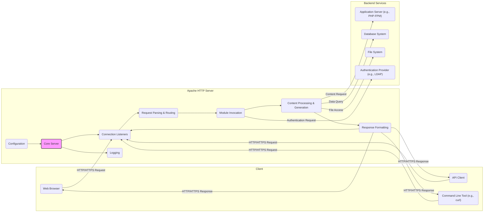

## Project Design Document: Apache HTTP Server (httpd) - Enhanced for Threat Modeling

**1. Introduction**

This document provides an enhanced architectural design overview of the Apache HTTP Server (httpd), based on the codebase at [https://github.com/apache/httpd](https://github.com/apache/httpd). This design document is specifically tailored to facilitate threat modeling activities by providing a detailed understanding of the server's components, data flows, and external interactions.

**2. Goals and Objectives**

The core objective of the Apache HTTP Server is to reliably and securely serve web content to clients. Key goals include:

*   Efficiently serving static and dynamically generated content over HTTP and HTTPS protocols.
*   Robustly handling concurrent requests from numerous clients.
*   Providing a highly modular and extensible architecture to accommodate diverse functionalities.
*   Implementing strong authentication and authorization mechanisms to control access to resources.
*   Incorporating security features to mitigate common web application vulnerabilities.
*   Offering comprehensive configuration options to support varied deployment scenarios and security policies.
*   Maintaining a stable, reliable, and performant platform.

**3. High-Level Architecture**

The Apache HTTP Server employs a modular, event-driven architecture. The core server manages fundamental operations, while loadable modules extend its capabilities. Configuration plays a vital role in defining the server's behavior and the modules it utilizes.

**4. Component Breakdown**

*   **Core Server:** The foundational component responsible for managing the server's lifecycle, accepting incoming connections, and orchestrating request processing. It relies heavily on the configuration.
*   **Connection Listeners:**  Handle incoming network connections on configured ports (e.g., 80 for HTTP, 443 for HTTPS). These components manage the initial handshake and establish the connection.
*   **Request Parsing & Routing:**  Parses the incoming HTTP request headers and body to determine the requested resource and the appropriate handler. This involves URL decoding and identifying the target virtual host.
*   **Module Invocation:**  The mechanism by which the core server calls upon registered modules to handle specific aspects of the request. The order of module invocation is determined by the configuration.
*   **Content Processing & Generation:**  The stage where the actual content to be served is retrieved or generated. This can involve:
    *   Serving static files directly from the file system.
    *   Executing server-side scripts or applications (e.g., via CGI, FastCGI, or embedded interpreters).
    *   Proxying requests to backend application servers.
    *   Retrieving data from databases.
*   **Response Formatting:**  Constructs the HTTP response, including setting appropriate headers (e.g., content type, caching directives, security headers) and the response body.
*   **Configuration:**  A set of text files (`httpd.conf`, `.htaccess`, module-specific configurations) that dictate the server's behavior, including:
    *   Virtual host definitions.
    *   Module loading and configuration.
    *   Access control policies.
    *   Security settings (e.g., TLS/SSL configuration).
    *   Logging parameters.
    *   URL rewriting rules.
*   **Logging:**  Records server activity, including access logs, error logs, and module-specific logs. This information is crucial for monitoring, auditing, and security analysis.

**5. Data Flow (Detailed)**

A typical HTTP/HTTPS request flows through the following stages:

1. **Client Request:** A client initiates an HTTP/HTTPS request targeting the server's IP address and port.
2. **Connection Acceptance:** The **Connection Listener** on the designated port accepts the incoming TCP connection. For HTTPS, a TLS/SSL handshake occurs to establish a secure channel.
3. **Request Reception:** The core server receives the raw HTTP request data.
4. **Request Parsing:** The **Request Parsing & Routing** component parses the HTTP request line, headers, and potentially the body. This includes:
    *   Identifying the HTTP method (GET, POST, etc.).
    *   Extracting the requested URI.
    *   Processing request headers (e.g., cookies, user-agent).
5. **Virtual Host Determination:** Based on the request's Host header, the server determines the appropriate virtual host configuration to apply.
6. **Module Processing (Request Phase):**  Registered modules are invoked in a configured order to process the request. This can involve:
    *   **Authentication Modules:**  Verifying user credentials (e.g., `mod_auth_basic`, `mod_auth_digest`).
    *   **Authorization Modules:**  Determining if the authenticated user has permission to access the requested resource (e.g., `mod_authz_host`, `mod_authz_user`).
    *   **Rewrite Modules:**  Modifying the requested URI (e.g., `mod_rewrite`).
    *   **Security Modules:**  Applying security policies or filtering malicious requests (e.g., `mod_security`).
7. **Content Handler Selection:** Based on the request URI and configuration, the server selects the appropriate content handler (e.g., a static file handler, a CGI script handler, a proxy handler).
8. **Content Generation/Retrieval:** The selected handler retrieves or generates the response content. This might involve:
    *   Reading a static file from the file system.
    *   Executing a CGI script or application.
    *   Forwarding the request to a backend application server via a proxy module (e.g., `mod_proxy`).
    *   Querying a database.
9. **Module Processing (Response Phase):** Modules are invoked again to process the generated response. This can involve:
    *   Adding or modifying response headers.
    *   Compressing the response body.
    *   Caching the response.
10. **Response Formatting:** The **Response Formatting** component constructs the complete HTTP response, including headers and the body.
11. **Response Transmission:** The server sends the HTTP response back to the client over the established connection.
12. **Logging:** The **Logging** component records details about the request and response.

**6. External Interactions**

The Apache HTTP Server interacts with various external systems and entities:

*   **Clients (Web Browsers, API Clients, Command-line Tools):** Initiate HTTP/HTTPS requests to access resources hosted on the server. Communication occurs over TCP/IP.
*   **Backend Application Servers (e.g., PHP-FPM, Node.js, Python WSGI servers):**  Handle dynamic content generation. Apache typically communicates with these servers using protocols like FastCGI, HTTP (as a reverse proxy), or Unix domain sockets.
*   **Database Systems (e.g., MySQL, PostgreSQL, MariaDB):**  Store and retrieve data used by backend applications. Communication typically occurs via database-specific protocols.
*   **File System:** Stores static content, configuration files, log files, and temporary files. The server requires read access to serve content and read/write access for configuration and logging.
*   **Authentication Providers (e.g., LDAP servers, Active Directory, OAuth providers):** Used to verify user credentials. Communication occurs via protocols like LDAP or HTTP-based authentication flows.
*   **DNS Servers:** Used to resolve domain names to IP addresses during startup and potentially for virtual host resolution. Communication occurs via the DNS protocol.
*   **Certificate Authorities (CAs):**  Used to obtain and verify TLS/SSL certificates for HTTPS.
*   **Load Balancers and Reverse Proxies:**  Sit in front of Apache to distribute traffic, provide SSL termination, and enhance security. Communication between the load balancer/proxy and Apache occurs over HTTP or HTTPS.
*   **System Logging Facilities (e.g., syslog):**  Used to forward log messages for centralized logging and monitoring.

**7. Security Considerations (Detailed)**

Several security aspects are critical for the Apache HTTP Server:

*   **Input Validation Vulnerabilities:**  Improper handling of client-supplied data can lead to various attacks:
    *   **Cross-Site Scripting (XSS):**  If user input is not properly sanitized before being included in HTML output.
    *   **SQL Injection:** If user input is directly incorporated into database queries without proper escaping.
    *   **Command Injection:** If user input is used to construct system commands.
    *   **Path Traversal:** If user input can manipulate file paths, allowing access to unauthorized files.
*   **Authentication and Authorization Weaknesses:**
    *   **Weak Credentials:**  Default or easily guessable passwords.
    *   **Insecure Session Management:**  Vulnerabilities in how user sessions are created, maintained, and invalidated.
    *   **Bypassable Authorization:**  Flaws in the authorization logic allowing unauthorized access.
*   **TLS/SSL Configuration Issues:**
    *   **Weak Cipher Suites:**  Using outdated or insecure encryption algorithms.
    *   **Improper Certificate Management:**  Expired or improperly configured certificates.
    *   **Vulnerabilities in TLS protocol implementations:**  Susceptible to attacks like BEAST or POODLE (though largely mitigated in modern versions).
*   **Access Control Failures:**
    *   **Incorrect File Permissions:**  Allowing unauthorized access to sensitive files.
    *   **Misconfigured `.htaccess` files:**  Creating unintended access control loopholes.
*   **Logging and Monitoring Deficiencies:**
    *   **Insufficient Logging:**  Lack of detailed logs hinders incident investigation.
    *   **Insecure Log Storage:**  Logs themselves becoming targets for attackers.
*   **Module Vulnerabilities:**  Security flaws in loaded modules can expose the server to risks. It's crucial to keep modules updated. Examples include:
    *   Vulnerabilities in `mod_php` allowing remote code execution.
    *   Bypass vulnerabilities in authentication modules.
*   **Configuration Errors:**  Incorrectly configured server settings can introduce vulnerabilities:
    *   Exposing sensitive information in server status pages.
    *   Enabling unnecessary features or modules.
    *   Weak default configurations.
*   **Denial of Service (DoS) Attacks:**  Overwhelming the server with requests, potentially exploiting vulnerabilities in request processing or resource management.
*   **HTTP Desync Attacks:** Exploiting discrepancies in how intermediaries and the backend server parse HTTP requests.

**8. Deployment Model Considerations**

The deployment model significantly impacts the threat landscape:

*   **Standalone Server:**  Requires careful management of the entire server environment, including the operating system and network security.
*   **Containerized Environment:**  Provides isolation but requires securing the container runtime and image dependencies. Vulnerabilities in the base image can be a risk.
*   **Cloud Environments:**  Leverages cloud provider security features but introduces dependencies on the provider's security posture and configuration. Misconfigured cloud resources can create vulnerabilities.

**9. Technology Stack**

*   **Core Language:** C
*   **Primary Protocols:** HTTP, HTTPS
*   **Supported Operating Systems:**  Linux, Windows, macOS, and various Unix-like systems.
*   **Key Configuration Files:** `httpd.conf`, module-specific configuration files, `.htaccess` files.
*   **Logging Mechanisms:** Plain text log files, integration with system logging facilities.

This enhanced design document provides a more detailed and security-focused overview of the Apache HTTP Server, making it suitable for in-depth threat modeling exercises. Identifying potential vulnerabilities within these components, data flows, and interactions is crucial for securing web applications served by Apache.