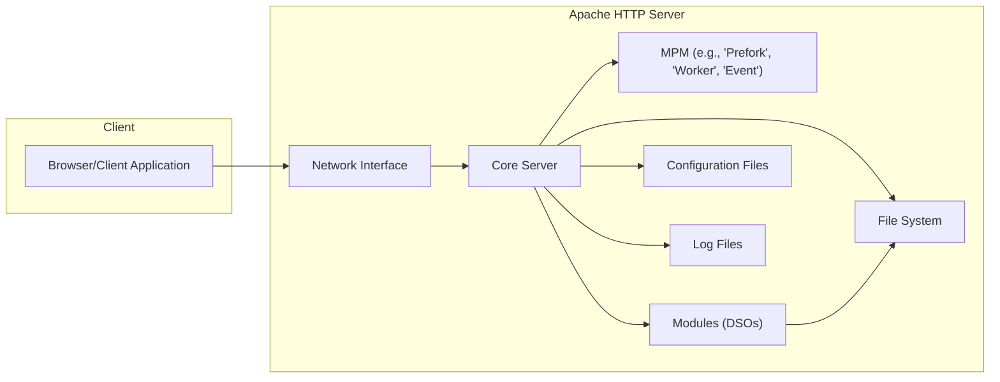
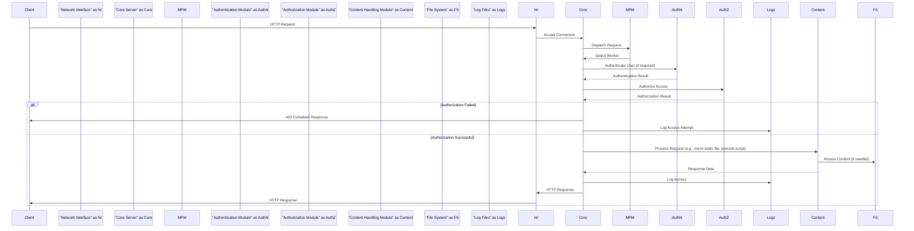
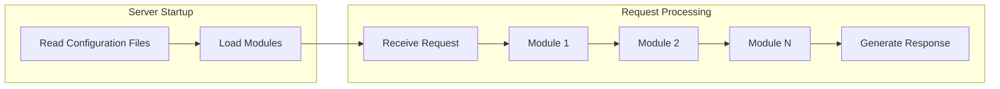

# Project Design Document: Apache HTTPD (Improved for Threat Modeling)

**Project Repository:** [https://github.com/apache/httpd](https://github.com/apache/httpd)

**Document Version:** 1.1
**Date:** October 26, 2023
**Author:** AI Software Architect

## 1. Introduction

This document provides an enhanced architectural design of the Apache HTTP Server (httpd) project, based on its codebase in the specified GitHub repository. This improved document is specifically tailored for threat modeling activities, offering a detailed view of the system's components, their interactions, and potential security implications.

## 2. Project Overview

Apache HTTP Server is a robust, open-source web server renowned for its flexibility and wide adoption. Its core function is to serve web content over HTTP and HTTPS. The server's modular design allows for extensive customization and feature extension. Understanding its architecture is crucial for identifying potential attack surfaces and vulnerabilities.

## 3. Architectural Overview

The Apache HTTP Server employs a modular architecture, where a central core provides fundamental functionalities, and loadable modules extend its capabilities. This modularity, while beneficial for flexibility, also introduces complexities from a security perspective.

### 3.1. Core Components

*   **Core Server:** The primary process responsible for initializing the server, listening for connections, managing worker processes/threads, and orchestrating the interaction between different modules. It handles the fundamental request processing lifecycle.
*   **Multi-Processing Modules (MPMs):** These modules govern how the server handles concurrent requests. The choice of MPM significantly impacts resource utilization and security characteristics. Examples include `prefork` (process-based), `worker` (thread-based), and `event` (asynchronous event-driven).
*   **Modules (DSOs - Dynamic Shared Objects):**  These are loadable units of code that extend the server's functionality. They can implement features like authentication, authorization, content compression, request rewriting, and security enhancements. The wide range of available modules introduces a diverse set of potential vulnerabilities.
*   **Configuration Files:** Text-based files (primarily `httpd.conf` and `.htaccess`) that dictate the server's behavior. These files define crucial security settings, including access controls, module configurations, and TLS parameters. Misconfigurations in these files are a common source of vulnerabilities.
*   **Log Files:**  Record server activity, errors, and access attempts. Different log types (e.g., access logs, error logs, module-specific logs) provide valuable information for security monitoring and incident response. However, insufficient logging or insecure log storage can hinder security efforts.
*   **Network Interfaces:** The points through which the server listens for and communicates over network connections. These interfaces are the primary entry points for external attacks.
*   **File System:** Used to store configuration files, web content (static files, scripts), and module libraries. Improper file permissions and vulnerabilities in served content are significant security concerns.

### 3.2. High-Level Architecture Diagram

## 4. Component Details

### 4.1. Core Server

*   **Functionality:**
    *   Initializes the server environment and loads configured modules.
    *   Listens for incoming network connections on specified ports.
    *   Accepts client connections and manages their lifecycle.
    *   Parses incoming HTTP requests.
    *   Routes requests to the appropriate modules for processing.
    *   Manages worker processes or threads based on the selected MPM.
    *   Constructs and sends HTTP responses back to clients.
    *   Handles signals for server management (e.g., restart, shutdown).
*   **Security Relevance:**
    *   Vulnerabilities in the core server can have widespread impact.
    *   Incorrect handling of requests can lead to buffer overflows or other memory corruption issues.
    *   The process of loading modules introduces potential risks if untrusted modules are used.
*   **Key Interactions:**
    *   Receives connections from the Network Interface.
    *   Delegates connection handling to the MPM.
    *   Invokes and interacts with loaded Modules.
    *   Reads server settings from Configuration Files.
    *   Writes operational information and errors to Log Files.
    *   Accesses the File System to load modules and potentially serve default content.

### 4.2. Multi-Processing Modules (MPMs)

*   **Functionality:**
    *   Implement the server's concurrency model, determining how multiple requests are handled simultaneously.
    *   Manage the creation, destruction, and lifecycle of worker processes or threads.
    *   Distribute incoming requests to available workers.
*   **Security Relevance:**
    *   The choice of MPM can affect the server's resilience to denial-of-service attacks.
    *   Process-based MPMs (`prefork`) offer better isolation between requests but consume more resources.
    *   Thread-based MPMs (`worker`, `event`) are more resource-efficient but require careful handling of shared memory to avoid race conditions and other concurrency issues.
*   **Examples:**
    *   `prefork`: Creates multiple independent processes, each handling a single request. Vulnerabilities in one process are less likely to affect others.
    *   `worker`: Creates multiple threads within a few processes. More efficient but requires careful synchronization to prevent security issues.
    *   `event`: Similar to `worker` but optimized for handling keep-alive connections, potentially reducing resource usage but introducing complexities.
*   **Key Interactions:**
    *   Managed and configured by the Core Server.
    *   Receive incoming connection requests from the Core Server.
    *   Utilize operating system resources (CPU, memory, threads/processes).

### 4.3. Modules (DSOs)

*   **Functionality:**
    *   Extend the core functionality of the server, providing a wide array of features.
    *   Handle various stages of request processing, including:
        *   **Authentication:** Verifying user identities (`mod_auth_basic`, `mod_auth_digest`, `mod_authn_file`).
        *   **Authorization:** Controlling access to resources based on user identity or other criteria (`mod_authz_host`, `mod_authz_user`, `mod_authz_core`).
        *   **Content Serving:** Delivering static files (`mod_static`), generating directory listings (`mod_autoindex`).
        *   **Content Manipulation:** Rewriting URLs (`mod_rewrite`), compressing content (`mod_deflate`).
        *   **Security Features:** Implementing TLS/SSL encryption (`mod_ssl`), providing web application firewall capabilities (`mod_security`).
        *   **Proxying:** Forwarding requests to other servers (`mod_proxy`).
        *   **Caching:** Storing frequently accessed content (`mod_cache`).
*   **Security Relevance:**
    *   Modules are a significant source of potential vulnerabilities, especially third-party modules.
    *   Bugs in authentication or authorization modules can lead to unauthorized access.
    *   Vulnerabilities in content handling modules can be exploited to serve malicious content or execute arbitrary code.
    *   Improperly configured modules can introduce security weaknesses.
*   **Types:**
    *   **Core Modules:** Developed and maintained as part of the Apache HTTP Server project.
    *   **Third-Party Modules:** Developed independently and can introduce varying levels of security risk.
*   **Key Interactions:**
    *   Loaded and invoked by the Core Server during request processing.
    *   Can access and modify request and response data.
    *   May interact with the File System to access content or configuration.
    *   Can make network requests (e.g., for proxying or accessing external resources).
    *   Their behavior is configured through directives in Configuration Files.

### 4.4. Configuration Files

*   **Functionality:**
    *   Define the server's operational parameters, including listening ports, virtual hosts, module loading, and security settings.
    *   Control access to resources through directives like `<Directory>`, `<Location>`, and `<Files>`.
    *   Configure module behavior and parameters.
    *   Specify logging formats and destinations.
*   **Security Relevance:**
    *   Misconfigurations in configuration files are a leading cause of web server vulnerabilities.
    *   Insecure default settings can leave the server exposed.
    *   Incorrectly configured access controls can allow unauthorized access to sensitive resources.
    *   Exposure of sensitive information in configuration files (e.g., database credentials) is a critical risk.
    *   `.htaccess` files, if enabled, allow decentralized configuration, which can be a security risk if not managed properly.
*   **Key Files:**
    *   `httpd.conf`: The main server configuration file.
    *   `.htaccess`: Distributed configuration files that can be placed within web directories to override server-wide settings (when allowed).
*   **Key Interactions:**
    *   Read by the Core Server during startup and when the server configuration is reloaded.
    *   Parsed to determine the server's behavior and security policies.

### 4.5. Log Files

*   **Functionality:**
    *   Record server activity for monitoring, debugging, security auditing, and incident response.
*   **Types:**
    *   **Access Logs:** Record details of client requests, including IP address, requested resource, status code, and user agent.
    *   **Error Logs:** Record server errors, warnings, and diagnostic information.
    *   **Module-Specific Logs:** Some modules generate their own logs for specific functionalities.
*   **Security Relevance:**
    *   Log files are crucial for detecting and investigating security incidents.
    *   Insufficient logging can hinder security analysis.
    *   Insecure storage or transmission of log files can expose sensitive information.
    *   Log injection vulnerabilities can allow attackers to manipulate log data.
*   **Key Interactions:**
    *   Written to by the Core Server and various Modules during request processing and error handling.
    *   Accessed by administrators, security analysts, and monitoring tools.

### 4.6. Network Interfaces

*   **Functionality:**
    *   Provide the entry points for client connections to the server.
    *   Listen on specified IP addresses and ports (typically port 80 for HTTP and 443 for HTTPS).
    *   Handle the initial handshake and establishment of network connections.
*   **Security Relevance:**
    *   These interfaces are the primary target for network-based attacks.
    *   Exposure of unnecessary ports increases the attack surface.
    *   Vulnerabilities in the handling of network connections can lead to denial-of-service attacks or other exploits.
*   **Key Interactions:**
    *   Used by the Core Server to accept incoming client connections.
    *   Interact with the operating system's networking stack.

### 4.7. File System

*   **Functionality:**
    *   Stores the server's configuration files, web content (HTML, CSS, JavaScript, images, scripts), and dynamically loadable module libraries (DSOs).
*   **Security Relevance:**
    *   Improper file permissions can allow unauthorized access to sensitive configuration files or web content.
    *   Vulnerabilities in served content (e.g., cross-site scripting vulnerabilities in JavaScript files) can be exploited by attackers.
    *   Insecure storage of sensitive data within the file system is a risk.
    *   Directory traversal vulnerabilities can allow attackers to access files outside the intended webroot.
*   **Key Interactions:**
    *   Accessed by the Core Server to read configuration files.
    *   Accessed by modules to serve static content or execute scripts.
    *   Used to load module libraries (DSOs) by the Core Server.

## 5. Data Flow Diagrams

### 5.1. Detailed HTTP Request Flow with Security Considerations

### 5.2. Module Interaction and Configuration Flow

## 6. Security Considerations (Detailed)

This section expands on potential security areas, linking them to specific architectural components.

*   **Input Validation:**
    *   **Relevance:** Core Server, Modules.
    *   **Threats:** Injection attacks (SQL injection, command injection, cross-site scripting), buffer overflows.
    *   **Mitigation:** Implement robust input validation and sanitization in both the core server and modules.
*   **Authentication and Authorization:**
    *   **Relevance:** Authentication Modules, Authorization Modules, Configuration Files.
    *   **Threats:** Unauthorized access, privilege escalation, session hijacking.
    *   **Mitigation:** Use strong authentication mechanisms, enforce the principle of least privilege, securely manage session tokens.
*   **Session Management:**
    *   **Relevance:** Core Server, Modules.
    *   **Threats:** Session fixation, session hijacking, replay attacks.
    *   **Mitigation:** Use secure session IDs, implement timeouts, protect session cookies.
*   **Encryption (TLS/SSL):**
    *   **Relevance:** `mod_ssl`, Configuration Files, Network Interfaces.
    *   **Threats:** Man-in-the-middle attacks, eavesdropping, data tampering.
    *   **Mitigation:** Enforce HTTPS, use strong cipher suites, properly configure TLS certificates.
*   **Access Control:**
    *   **Relevance:** Configuration Files, File System.
    *   **Threats:** Unauthorized access to sensitive files and directories.
    *   **Mitigation:** Configure restrictive file permissions, use `<Directory>`, `<Location>`, and `<Files>` directives effectively.
*   **Vulnerability Management:**
    *   **Relevance:** Core Server, Modules.
    *   **Threats:** Exploitation of known vulnerabilities leading to code execution, data breaches, or denial of service.
    *   **Mitigation:** Regularly update the server and modules, subscribe to security advisories, implement a vulnerability scanning process.
*   **Denial of Service (DoS) Protection:**
    *   **Relevance:** Core Server, MPM, Network Interfaces.
    *   **Threats:** Server overload, resource exhaustion, service disruption.
    *   **Mitigation:** Configure connection limits, implement request rate limiting, use a reverse proxy or CDN.
*   **Configuration Security:**
    *   **Relevance:** Configuration Files.
    *   **Threats:** Misconfigurations leading to security vulnerabilities, exposure of sensitive information.
    *   **Mitigation:** Follow security best practices for configuration, regularly review configuration files, use configuration management tools.
*   **Module Security:**
    *   **Relevance:** Modules.
    *   **Threats:** Vulnerabilities in modules, especially third-party modules.
    *   **Mitigation:** Only use trusted modules, keep modules updated, review module configurations.
*   **Logging and Monitoring:**
    *   **Relevance:** Log Files.
    *   **Threats:** Failure to detect security incidents, delayed response.
    *   **Mitigation:** Implement comprehensive logging, securely store and transmit logs, use security information and event management (SIEM) systems.

## 7. Assumptions and Constraints

*   This document is based on the general architecture of Apache HTTP Server as represented in the provided GitHub repository. Specific implementation details may vary across different versions and configurations.
*   The threat modeling process will utilize this document as a foundation to identify specific threats and vulnerabilities.
*   This document assumes a typical deployment scenario of Apache HTTP Server. Highly customized or unusual deployments may have additional security considerations.
*   The focus is primarily on the server-side architecture. Client-side security aspects are generally outside the scope of this document, although interactions with the client are considered.
*   The document assumes a basic understanding of web server concepts and security principles.

## 8. Future Considerations

*   Detailed analysis of specific modules and their potential security vulnerabilities.
*   Evaluation of different MPM configurations and their impact on security.
*   Examination of common deployment patterns (e.g., reverse proxy, load balancer setups) and associated security risks.
*   Integration with containerization technologies (e.g., Docker, Kubernetes) and their security implications.
*   Consideration of security automation and orchestration tools for managing Apache HTTP Server security.