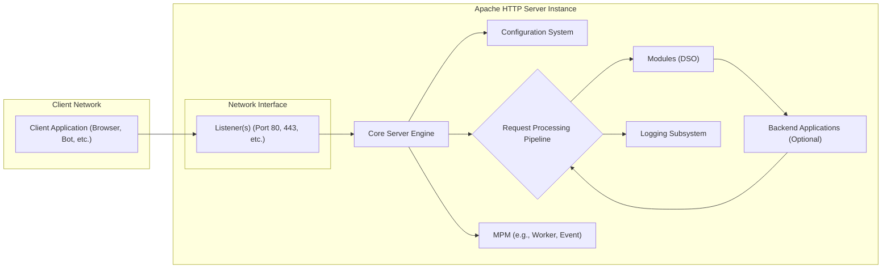

# Project Design Document: Apache HTTP Server for Threat Modeling (Improved)

## 1. Project Overview

**Project Name:** Apache HTTP Server (httpd)

**Project Repository:** [https://github.com/apache/httpd](https://github.com/apache/httpd)

**Project Description:** The Apache HTTP Server, commonly known as Apache, is a robust, open-source, and cross-platform web server software. It is a foundational component of the internet infrastructure, responsible for serving a significant portion of web content. This document provides a detailed design overview of the Apache HTTP Server, specifically tailored for threat modeling and security analysis. It emphasizes architectural components, data flow, and security boundaries to facilitate a comprehensive security assessment.

**Purpose of this Document:** This document is designed to be a practical resource for security professionals conducting threat modeling on the Apache HTTP Server. It offers a structured and detailed representation of the system's architecture, key components, and data interactions. This structured approach enables the systematic identification of potential security vulnerabilities, the assessment of associated risks, and the development of effective security mitigation strategies. This document will be used as input for threat modeling exercises, security audits, and penetration testing activities.

## 2. Architecture Overview

Apache HTTP Server employs a modular, event-driven, and highly configurable architecture. Its core design principles emphasize extensibility and performance. The architecture is structured around a central core server that orchestrates request processing and relies on dynamically loaded modules to provide specific functionalities. Key architectural components include:

*   **Listener(s):**  Manages network interfaces and accepts incoming client connections on configured ports. Apache can have multiple listeners for different ports and protocols.
*   **Core Server Engine:** The central processing unit, responsible for request lifecycle management, configuration parsing, module management, and process/thread management.
*   **Modules (Dynamic Shared Objects - DSO):**  Extend the core server's capabilities. Modules are loaded at runtime and handle diverse tasks, from authentication and authorization to content processing and protocol support.
*   **Configuration System:**  Hierarchical configuration files define server behavior, virtual hosts, security policies, and module parameters. Configuration can be distributed across multiple files and directories.
*   **Logging Subsystem:** Records server events, access attempts, and errors. Logs are essential for security monitoring, auditing, and incident analysis.
*   **Multiplexing Modules (MPMs):**  Determine the process/thread management model used by Apache (e.g., `prefork`, `worker`, `event`). MPM choice impacts performance and resource utilization, and can have security implications.
*   **Backend Application Integration (Optional):** Apache can integrate with backend application servers through various mechanisms like CGI, FastCGI, and reverse proxying.

The following Mermaid flowchart provides a high-level visual representation of the Apache HTTP Server architecture:

## 3. Component Details

This section elaborates on each component, detailing their functionalities, security implications, and interfaces.

### 3.1. Listener(s)

*   **Functionality:**
    *   **Network Interface Binding:** Binds to specified network interfaces and ports (IPv4/IPv6).
    *   **Connection Acceptance:** Accepts incoming TCP connections from clients.
    *   **Protocol Handling:**  Handles initial protocol negotiation (HTTP/1.1, HTTP/2, HTTP/3).
    *   **SSL/TLS Termination (Optional):**  Terminates SSL/TLS connections for HTTPS if configured (typically using `mod_ssl` or `mod_tls`).
    *   **Connection Handover:**  Passes accepted connections to the Core Server Engine for request processing.
*   **Security Relevance:**
    *   **DoS Attack Target:**  Listener is the primary entry point and vulnerable to SYN flood, connection exhaustion, and other DoS attacks.
    *   **Port Exposure:** Open ports are discoverable via port scanning and represent potential attack vectors.
    *   **TLS/SSL Vulnerabilities:** Misconfigured or vulnerable TLS/SSL implementations can lead to man-in-the-middle attacks, data breaches, and protocol downgrade attacks. Weak cipher suites or outdated protocols are common misconfigurations.
    *   **Protocol Downgrade Attacks:** Vulnerabilities in protocol negotiation can be exploited to force clients to use less secure protocols.
*   **Inputs:** Network traffic on configured ports.
*   **Outputs:** Established TCP connections, potentially decrypted data after TLS termination, passed to the Core Server Engine.

### 3.2. Core Server Engine

*   **Functionality:**
    *   **Request Lifecycle Management:** Manages the entire HTTP request lifecycle, from initial reception to final response delivery.
    *   **Configuration Loading & Management:** Loads, parses, and manages server configuration from files and potentially other sources.
    *   **Module Loading & Initialization:** Loads and initializes configured modules (DSOs) at startup and during runtime reconfigurations.
    *   **Request Routing & Dispatch:** Routes incoming requests to appropriate modules or handlers based on URL, virtual host configuration, and other criteria.
    *   **Process/Thread Management (MPM Interaction):**  Interacts with the selected MPM to manage worker processes or threads for concurrent request handling.
    *   **Resource Management:** Manages server resources like memory, file descriptors, and network connections.
*   **Security Relevance:**
    *   **Configuration Vulnerabilities:**  Misconfigurations in core server settings can create significant security holes (e.g., insecure directory listing, exposed server information in headers, weak default settings).
    *   **Request Processing Logic Flaws:**  Vulnerabilities in the core request processing logic can lead to bypasses of security controls, server crashes, or unexpected behavior.
    *   **Resource Exhaustion:**  Improper resource management can lead to resource exhaustion DoS attacks.
    *   **Privilege Management:**  The core server's privilege level and how it manages privileges for worker processes are critical security considerations.
*   **Inputs:** Established TCP connections from Listeners, configuration data, module code.
*   **Outputs:** Processed requests dispatched to modules, responses sent back to Listeners, logging events.

### 3.3. Modules (DSO)

*   **Functionality:**
    *   **Extending Core Functionality:** Modules provide a wide range of functionalities, including:
        *   **Authentication & Authorization:** `mod_auth_basic`, `mod_auth_digest`, `mod_authz_core`, `mod_authz_host`, `mod_authz_user`, `mod_ldap`, `mod_auth_openidc`.
        *   **Content Handling & Generation:** `mod_cgi`, `mod_php`, `mod_proxy_fcgi`, `mod_wsgi`, `mod_lua`, `mod_rewrite`, `mod_autoindex`, `mod_dir`.
        *   **Security Enhancements:** `mod_security`, `mod_evasive`, `mod_qos`, `mod_headers`, `mod_ratelimit`, `mod_session_cookie`.
        *   **Protocol Support:** `mod_http2`, `mod_proxy_http2`, `mod_proxy_wstunnel`, `mod_ssl`, `mod_tls`.
        *   **Logging & Monitoring:** `mod_log_config`, `mod_status`, `mod_dumpio`.
        *   **Compression & Caching:** `mod_deflate`, `mod_cache`, `mod_expires`.
    *   **Request Interception & Modification:** Modules can intercept requests at various stages of the processing pipeline, modify request headers, bodies, or responses.
*   **Security Relevance:**
    *   **Module Vulnerabilities:** Modules are a significant attack surface. Vulnerabilities in modules are a leading cause of Apache security breaches. This includes both first-party and third-party modules.
    *   **Configuration Complexity & Errors:**  Incorrectly configured modules can introduce vulnerabilities or weaken security. Complex module interactions can be difficult to secure.
    *   **Privilege Escalation Risks:**  Vulnerabilities in modules, especially those handling privileged operations or interacting with external systems, can lead to privilege escalation.
    *   **Third-Party Module Risks:**  Modules from untrusted sources can contain malicious code, backdoors, or vulnerabilities. Supply chain security for modules is important.
    *   **Module Interaction Issues:**  Conflicts or unexpected interactions between modules can create security vulnerabilities.
*   **Inputs:** HTTP requests, server configuration, data from other modules, external data sources (databases, LDAP, etc.).
*   **Outputs:** Modified requests, generated responses, authentication decisions, authorization decisions, log entries, actions based on module functionality.

### 3.4. Configuration System

*   **Functionality:**
    *   **Hierarchical Configuration:** Configuration is defined in a hierarchical structure, typically starting with `httpd.conf` or `apache2.conf` and including virtual host configurations and `.htaccess` files.
    *   **Directive Parsing & Interpretation:** Parses configuration directives and applies them to server behavior, module settings, and virtual host configurations.
    *   **Runtime Reconfiguration:** Supports graceful restarts and reconfigurations to apply configuration changes without service interruption.
    *   **Access Control Configuration:** Defines access control policies using directives like `<Directory>`, `<Location>`, `<Files>`, and `.htaccess`.
    *   **Module Configuration:** Configures individual modules and their parameters.
    *   **Virtual Host Configuration:** Defines settings for multiple websites hosted on the same server.
*   **Security Relevance:**
    *   **Misconfiguration as Primary Vulnerability:**  Configuration errors are a major source of Apache vulnerabilities. Examples include:
        *   **Insecure Defaults:** Using default configurations without hardening.
        *   **Directory Listing Enabled:** Exposing directory contents.
        *   **Weak Access Controls:** Overly permissive access rules.
        *   **Information Disclosure:** Exposing server version or internal paths in headers or error messages.
        *   **Insecure TLS/SSL Settings:** Weak cipher suites, outdated protocols, improper certificate management.
        *   **CGI Misconfigurations:** Enabling CGI execution in insecure directories.
        *   **`.htaccess` Overuse/Misuse:**  Incorrectly configured `.htaccess` files can bypass intended security policies.
    *   **Configuration File Security:**  Insecure file permissions on configuration files can allow unauthorized modification, leading to complete server compromise.
    *   **Configuration Injection:**  Vulnerabilities in configuration parsing or processing could potentially allow configuration injection attacks.
*   **Inputs:** Configuration files (e.g., `httpd.conf`, `virtual host files`, `.htaccess`), administrative commands.
*   **Outputs:** Server behavior, module configurations, access control policies, virtual host definitions.

### 3.5. Logging Subsystem

*   **Functionality:**
    *   **Access Logging:** Records details of each client request (IP address, requested resource, status code, user agent, referrer, etc.). Configurable log formats.
    *   **Error Logging:** Records server errors, warnings, and debugging information. Different log levels (debug, info, warn, error, crit, alert, emerg).
    *   **Module-Specific Logging:**  Modules can generate their own log entries and integrate with the logging subsystem.
    *   **Log Rotation & Management:**  Supports log rotation mechanisms to manage log file size and prevent disk space exhaustion.
    *   **Custom Logging:**  Allows for custom log formats and logging destinations.
*   **Security Relevance:**
    *   **Security Auditing & Monitoring:**  Logs are crucial for security auditing, intrusion detection, incident response, and monitoring for suspicious activity.
    *   **Forensics & Incident Analysis:**  Log data is essential for post-incident analysis and forensic investigations.
    *   **Information Disclosure in Logs:**  Logs can inadvertently contain sensitive information (e.g., user credentials, session IDs, internal paths, PII) if not configured carefully. Overly verbose logging can increase this risk.
    *   **Log Injection Vulnerabilities:**  Vulnerabilities in logging mechanisms can allow attackers to inject malicious log entries, potentially misleading security analysis, bypassing security monitoring, or exploiting log processing tools.
    *   **Log Tampering & Integrity:**  If log files are not properly secured (file permissions, access controls), attackers might tamper with them to cover their tracks or manipulate evidence.
    *   **Log Storage Security:**  Secure storage and access control for log files are essential to protect sensitive information and maintain log integrity.
*   **Inputs:** Server events, request processing activities, errors, module-generated log messages.
*   **Outputs:** Log data written to files, syslog, or other configured logging destinations.

### 3.6. Multiplexing Modules (MPMs)

*   **Functionality:**
    *   **Process/Thread Management Model:**  MPMs determine how Apache handles concurrent requests. Different MPMs use different process and threading models:
        *   **`prefork`:**  Multi-process MPM. Creates multiple child processes to handle requests. Stable and compatible with non-thread-safe modules.
        *   **`worker`:** Hybrid multi-process, multi-threaded MPM. Uses fewer processes, each with multiple threads. More resource-efficient than `prefork` for threaded modules.
        *   **`event`:**  Event-driven MPM. Similar to `worker` but designed for handling keep-alive connections more efficiently. Improves performance for high concurrency and keep-alive connections.
    *   **Connection Handling:** MPMs manage the acceptance and distribution of connections to worker processes or threads.
*   **Security Relevance:**
    *   **Resource Exhaustion & DoS:**  MPM choice can impact server resource utilization and resilience to DoS attacks. Incorrect MPM configuration can make the server more vulnerable to resource exhaustion.
    *   **Process Isolation (Prefork):** `prefork` offers better process isolation, which can limit the impact of vulnerabilities in worker processes. If one process crashes due to a vulnerability, other processes are less likely to be affected.
    *   **Thread Safety (Worker, Event):** `worker` and `event` rely on threads, requiring modules to be thread-safe. Non-thread-safe modules can cause crashes or unpredictable behavior in threaded MPMs, potentially leading to security issues.
    *   **Privilege Separation:**  MPMs often handle privilege separation, running worker processes under less privileged user accounts to limit the impact of vulnerabilities.
*   **Inputs:** Server configuration, incoming connections.
*   **Outputs:** Process/thread management, connection distribution to worker processes/threads.

### 3.7. Backend Application Integration (Optional)

*   **Functionality:**
    *   **Reverse Proxying:** Apache can act as a reverse proxy, forwarding requests to backend application servers and returning their responses to clients. Modules like `mod_proxy`, `mod_proxy_http`, `mod_proxy_fcgi`, `mod_proxy_ajp`, `mod_proxy_balancer`.
    *   **CGI (Common Gateway Interface):**  Executes external scripts (e.g., written in Perl, Python, Shell) to generate dynamic content. `mod_cgi`, `mod_cgid`.
    *   **FastCGI:**  A more efficient alternative to CGI, using persistent processes to handle requests. `mod_proxy_fcgi`.
    *   **Application Server Integration:**  Integration with application servers like PHP-FPM (`mod_proxy_fcgi`), WSGI servers for Python (`mod_wsgi`), and Java application servers (using AJP via `mod_proxy_ajp`).
    *   **Load Balancing:**  Distributes requests across multiple backend servers for scalability and redundancy (using `mod_proxy_balancer`).
*   **Security Relevance:**
    *   **Backend Vulnerability Exposure:**  Vulnerabilities in backend applications can be exposed through Apache if not properly secured. Apache acts as a gateway and can amplify the impact of backend vulnerabilities.
    *   **Proxy Misconfiguration Risks:**  Incorrect proxy configurations can lead to:
        *   **Open Proxy Vulnerabilities:**  Turning Apache into an open proxy, allowing attackers to use it to proxy malicious traffic.
        *   **Information Leakage:**  Exposing backend server information or internal network details.
        *   **Bypass of Security Controls:**  Circumventing security checks implemented in Apache or backend applications.
    *   **Request Smuggling & Desync Attacks:**  Vulnerabilities in proxy implementations or protocol handling can lead to request smuggling or HTTP desync attacks, allowing attackers to bypass security checks or access unauthorized resources.
    *   **Data Exposure in Backend Communication:**  If communication between Apache and backend applications is not secured (e.g., using HTTPS for backend connections, especially over untrusted networks), sensitive data can be intercepted.
    *   **CGI/FastCGI Security Risks:**  CGI and FastCGI introduce security risks if not properly managed:
        *   **Code Injection:**  Vulnerabilities in CGI scripts can lead to command injection or code execution vulnerabilities.
        *   **Path Traversal:**  Improperly secured CGI scripts can be exploited for path traversal attacks.
        *   **Resource Exhaustion:**  Poorly written CGI scripts can consume excessive server resources.
*   **Inputs:** HTTP requests from the Core Server, responses from backend applications.
*   **Outputs:** Requests forwarded to backend applications, responses sent back to the Core Server, dynamic content generated by CGI/FastCGI scripts.

## 4. Data Flow (Detailed)

The following Mermaid flowchart provides a more detailed view of the data flow for an HTTP request within Apache HTTP Server, highlighting key processing stages and components:

```mermaid
graph LR
    subgraph "Client"
        A["Client Request (HTTP)"]
    end
    subgraph "Apache HTTP Server"
        B["Listener (Port 80/443)"] --> C["Connection Handling (MPM)"];
        C --> D["Core Server Engine (Request Parsing)"];
        D --> E{"Virtual Host Resolution"};
        E --> F{"<Directory>, <Location> Context"};
        F --> G{"Module Chain (Request Phase)"};
        G --> H{"Authentication/Authorization Modules"};
        H --> I{"Content Handler Module (e.g., mod_php, mod_proxy)"};
        I --> J{"Content Generation/Retrieval"};
        J --> K{"Module Chain (Response Phase)"};
        K --> L["Response Generation"];
        L --> M["Logging Subsystem"];
        M --> N["Connection Handling (MPM)"];
        N --> O["Listener"];
    end
    A --> B;
    O --> A["HTTP Response"];

    style D fill:#ccf,stroke:#333,stroke-width:2px
    style E fill:#ccf,stroke:#333,stroke-width:2px
    style F fill:#ccf,stroke:#333,stroke-width:2px
    style G fill:#ccf,stroke:#333,stroke-width:2px
    style H fill:#ccf,stroke:#333,stroke-width:2px
    style I fill:#ccf,stroke:#333,stroke-width:2px
    style J fill:#ccf,stroke:#333,stroke-width:2px
    style K fill:#ccf,stroke:#333,stroke-width:2px
    style L fill:#ccf,stroke:#333,stroke-width:2px
    style M fill:#ccf,stroke:#333,stroke-width:2px
```

**Detailed Data Flow Description:**

1.  **Client Request:** Client sends an HTTP request to the Listener.
2.  **Listener & Connection Handling:** Listener accepts the connection and hands it over to the MPM for connection management.
3.  **Core Server - Request Parsing:** Core Server Engine parses the HTTP request (headers, method, URI, body).
4.  **Virtual Host Resolution:** Determines the virtual host based on the `Host` header or IP address.
5.  **Context Determination:**  Applies configuration directives based on the request URI and context (`<Directory>`, `<Location>`, etc.).
6.  **Module Chain (Request Phase):** Request passes through a chain of modules configured to process requests. This phase includes modules for request rewriting, header manipulation, security checks, etc.
7.  **Authentication/Authorization:** Authentication modules verify user identity, and authorization modules enforce access control policies.
8.  **Content Handler Module:**  A module responsible for generating or retrieving the requested content (e.g., `mod_php` for PHP scripts, `mod_proxy` for reverse proxying, `mod_autoindex` for directory listing, `mod_cgi` for CGI scripts).
9.  **Content Generation/Retrieval:** The content handler module generates dynamic content, retrieves static files, or proxies the request to a backend application.
10. **Module Chain (Response Phase):** Response passes through another chain of modules for response processing. This phase can include modules for content compression, header modification, adding security headers, etc.
11. **Response Generation:** Core Server Engine generates the final HTTP response (status code, headers, body).
12. **Logging:** Logging Subsystem records the request and response details.
13. **Connection Handling & Listener:** MPM handles sending the response back to the client through the Listener.
14. **HTTP Response:** Listener sends the HTTP response back to the client.

**Sensitive Data Flow (Expanded):**

*   **Client Request Data:**  Includes potentially sensitive data in headers (e.g., `Authorization`, cookies, user-agent), URI (query parameters), and request body (form data, JSON, XML).
*   **Server Configuration Data:** Configuration files contain sensitive settings like TLS/SSL private keys, database credentials, API keys, access control rules, and internal paths.
*   **Authentication Credentials:** Usernames, passwords, API tokens, session IDs, and other authentication credentials are processed and stored (often temporarily in memory or session stores).
*   **Application Data (Backend):** Data exchanged with backend applications can be highly sensitive, depending on the application's purpose (e.g., financial data, personal information, medical records).
*   **Log Data:**  As previously mentioned, logs can contain sensitive information if not carefully managed.
*   **Server Memory & Process Space:** Sensitive data is processed and temporarily stored in server memory during request handling. Memory dumps or vulnerabilities that expose process memory can lead to data breaches.

## 5. Technology Stack (Detailed)

*   **Core Programming Language:** C (for core server and many core modules).
*   **Module Programming Languages:** C, C++, and sometimes other languages depending on the module (e.g., Lua for `mod_lua`, Perl for some older modules). Module API is primarily C-based.
*   **Operating Systems:** Cross-platform: Linux, Unix-like systems (BSD, macOS, Solaris), Windows.
*   **Networking Libraries:** System-provided networking libraries (e.g., POSIX sockets on Unix-like systems, Winsock on Windows).
*   **SSL/TLS Library:** OpenSSL is the most common, but other libraries like LibreSSL or BoringSSL can be used (via `mod_ssl` or `mod_tls`).
*   **Configuration File Format:** Plain text configuration files, typically using a directive-based syntax.
*   **Module API:** C-based Apache Module API (Application Programming Interface) for developing extensions.
*   **Build System:** Autoconf, Automake, Libtool (for building from source).

## 6. Deployment Environment (Expanded)

*   **Deployment Models:**
    *   **Bare Metal Servers:** Direct installation on physical servers.
    *   **Virtual Machines (VMs):**  Deployed on VMs in cloud environments (AWS EC2, Azure VMs, GCP Compute Engine) or on-premise virtualization platforms (VMware, Hyper-V).
    *   **Containers (Docker, Kubernetes):** Containerized deployments using Docker and orchestration with Kubernetes or similar platforms. Enables scalability, portability, and easier management.
    *   **Serverless (Less Common):**  While less typical, Apache could potentially be adapted for serverless environments in limited scenarios, possibly as a reverse proxy in front of serverless functions.
    *   **Embedded Systems (Specialized):**  Adapted for resource-constrained embedded systems in specific use cases.
*   **Typical Network Zones:**
    *   **DMZ (Demilitarized Zone):**  Apache servers are commonly placed in a DMZ, isolated from the internal network by firewalls. DMZ provides a buffer zone to protect internal systems.
    *   **Web Tier (Multi-Tier Architecture):** In multi-tier architectures, Apache often resides in the web tier, handling client requests and interacting with application and data tiers.
    *   **Internal Network (Reverse Proxy Scenario):**  Apache can be deployed within an internal network as a reverse proxy for internal applications.
*   **Network Security Controls:**
    *   **Firewalls (Network & Host-Based):**  Firewalls control network traffic, limiting access to necessary ports and services. Host-based firewalls can further restrict access on the server itself.
    *   **Intrusion Detection/Prevention Systems (IDS/IPS):**  Network-based and host-based IDS/IPS can detect and potentially block malicious traffic and attacks targeting Apache.
    *   **Web Application Firewalls (WAFs):**  WAFs (like ModSecurity or external WAF appliances/services) provide application-layer security, filtering malicious requests and protecting against web application vulnerabilities.
    *   **Load Balancers:**  Distribute traffic across multiple Apache instances, improving availability and potentially providing some DoS mitigation. Load balancers can also offer security features like SSL termination and basic traffic filtering.
    *   **Reverse Proxies (Dedicated):**  Dedicated reverse proxy servers (e.g., Nginx, HAProxy) placed in front of Apache can enhance security by providing an additional layer of defense, handling SSL termination, and offering advanced traffic management and security features.

## 7. Security Features (Expanded)

*   **Core Security Features:**
    *   **User and Group Isolation:** Running worker processes under less privileged user accounts (`User`, `Group` directives) to limit the impact of vulnerabilities.
    *   **Access Control Directives:**  `<Directory>`, `<Location>`, `<Files>`, `.htaccess` directives for defining granular access control rules.
    *   **Directory Listing Control (`Options -Indexes`):** Disabling or customizing directory listings to prevent information disclosure.
    *   **Server Signature Control (`ServerTokens`, `ServerSignature`):**  Reducing information disclosure in server headers and error pages.
    *   **Request Limits and Timeouts (`LimitRequest*`, `Timeout`):**  Mitigating DoS attacks by limiting request sizes, headers, and connection timeouts.
    *   **Hostname Verification (`UseCanonicalName`, `ServerName`):**  Preventing hostname spoofing and ensuring correct virtual host resolution.
*   **Security Modules (Examples):**
    *   **`mod_ssl` / `mod_tls`:**  SSL/TLS encryption for HTTPS. Configuration of protocols, cipher suites, and certificate management.
    *   **`mod_auth_*` modules:**  Authentication (Basic, Digest, Anonymous, LDAP, OpenID Connect) and authorization mechanisms.
    *   **`mod_security`:**  Web Application Firewall (WAF) module. Rule-based request filtering, anomaly detection, virtual patching, OWASP Core Rule Set integration.
    *   **`mod_evasive`:**  DoS and brute-force attack prevention module. Rate limiting, connection limiting, temporary blacklisting.
    *   **`mod_qos`:**  Quality of Service module. Bandwidth limiting, connection limiting, request limiting, priority queuing.
    *   **`mod_headers`:**  Setting security-related HTTP headers (HSTS, X-Frame-Options, CSP, X-XSS-Protection, etc.).
    *   **`mod_ratelimit`:**  Request rate limiting module.
    *   **`mod_session_cookie`:**  Secure session management using cookies.
    *   **`mod_remoteip`:**  Handling X-Forwarded-For headers for accurate client IP address logging in proxy scenarios.
*   **Security Best Practices & Hardening:**
    *   **Regular Security Updates:**  Applying security patches and updates promptly. Subscribing to security advisories from the Apache Software Foundation.
    *   **Principle of Least Privilege:**  Running worker processes with minimal necessary privileges.
    *   **Input Validation & Sanitization:**  Implementing proper input validation and sanitization in modules and backend applications to prevent injection vulnerabilities.
    *   **Secure Configuration Hardening:**  Following security hardening guides and best practices for Apache configuration. Disabling unnecessary modules and features.
    *   **Regular Security Audits & Penetration Testing:**  Conducting periodic security audits and penetration testing to identify vulnerabilities and configuration weaknesses.
    *   **Security Monitoring & Logging:**  Implementing robust security monitoring and logging to detect and respond to security incidents.

## 8. Assumptions and Constraints (Refined)

*   **Assumptions:**
    *   This design document assumes a common deployment scenario of Apache HTTP Server serving web applications and static content over HTTP and HTTPS.
    *   It assumes the use of a relatively recent, actively maintained, and officially supported version of Apache HTTP Server.
    *   It assumes that security is a primary concern and that best practices are intended to be implemented during configuration, deployment, and ongoing maintenance.
    *   It assumes that the threat model will consider both internal and external threats.
*   **Constraints:**
    *   The vast modularity and configurability of Apache make it impossible to cover every possible configuration and module combination in exhaustive detail. This document provides a general framework.
    *   Security effectiveness is highly dependent on proper configuration, module selection, timely updates, and ongoing security management.
    *   Third-party modules introduce additional complexity and potential security risks that are outside the direct control of the Apache Software Foundation.
    *   The document focuses primarily on the Apache HTTP Server itself and provides a general overview of backend application integration. Detailed security analysis of backend applications is outside the scope of this document but is a crucial aspect of overall web application security.

## 9. Threat Modeling Focus Areas (Prioritized & Specific)

Based on the design, component analysis, and security considerations, the following threat modeling focus areas are prioritized for Apache HTTP Server:

1.  **Module Vulnerabilities (High Priority):**
    *   **Threat:** Exploitation of known vulnerabilities in Apache modules (both core and third-party).
    *   **Focus:** Regularly scan for module vulnerabilities, prioritize patching, implement virtual patching (e.g., with ModSecurity), and carefully evaluate the security posture of enabled modules. Pay special attention to modules handling authentication, authorization, content processing, and backend integration.
    *   **Example Threats:**  Buffer overflows, code injection, authentication bypasses in modules like `mod_php`, `mod_proxy`, `mod_rewrite`, `mod_ldap`.

2.  **Configuration Misconfigurations (High Priority):**
    *   **Threat:** Exploitation of insecure server configurations leading to information disclosure, unauthorized access, or service disruption.
    *   **Focus:**  Thoroughly review and harden configurations based on security best practices. Use configuration scanning tools. Pay attention to access control settings, directory listing, server signature, TLS/SSL configuration, and default settings.
    *   **Example Threats:**  Directory listing enabled, weak TLS cipher suites, permissive access rules allowing unauthorized access to sensitive directories, exposed server version information, insecure CGI configurations.

3.  **Input Validation & Injection Attacks (High Priority):**
    *   **Threat:** Injection attacks (SQL injection, command injection, cross-site scripting, log injection) due to insufficient input validation in modules or backend applications.
    *   **Focus:** Analyze request handling logic in modules and backend integrations. Identify potential injection points. Ensure robust input validation and sanitization are implemented. Consider using a WAF (ModSecurity) to mitigate injection attacks.
    *   **Example Threats:**  SQL injection in backend applications accessed via Apache, command injection vulnerabilities in CGI scripts, XSS vulnerabilities in dynamically generated content served by Apache.

4.  **Access Control & Authorization Bypass (Medium Priority):**
    *   **Threat:** Bypassing access control mechanisms, leading to unauthorized access to restricted resources or administrative interfaces.
    *   **Focus:**  Evaluate the effectiveness of access control configurations (`<Directory>`, `<Location>`, `.htaccess`, authentication/authorization modules). Test for potential bypasses. Ensure least privilege principles are enforced.
    *   **Example Threats:**  Bypassing authentication checks due to configuration errors, unauthorized access to administrative interfaces, privilege escalation due to access control flaws.

5.  **Denial of Service (DoS) & Resource Exhaustion (Medium Priority):**
    *   **Threat:** DoS and DDoS attacks targeting Apache, leading to service unavailability.
    *   **Focus:** Assess server resilience to DoS attacks. Implement mitigation measures like request limits, rate limiting (ModEvasive, ModQoS, ModRateLimit), connection limits, and WAF rules. Consider using a CDN or DDoS protection service.
    *   **Example Threats:**  SYN flood attacks, HTTP flood attacks, slowloris attacks, resource exhaustion due to excessive requests or poorly written CGI scripts.

6.  **Logging & Monitoring Deficiencies (Medium Priority):**
    *   **Threat:** Insufficient logging or monitoring hindering security auditing, incident response, and threat detection.
    *   **Focus:** Review logging configurations to ensure comprehensive logging of security-relevant events. Secure log storage and access. Implement security monitoring and alerting based on log data.
    *   **Example Threats:**  Failure to detect security incidents due to inadequate logging, delayed incident response due to lack of log data, log tampering by attackers to cover their tracks.

7.  **TLS/SSL Vulnerabilities & Misconfiguration (Medium Priority):**
    *   **Threat:** Weak TLS/SSL configurations or vulnerabilities in TLS implementations leading to man-in-the-middle attacks, data breaches, or protocol downgrade attacks.
    *   **Focus:**  Ensure strong TLS/SSL configurations are in place. Use up-to-date protocols, strong cipher suites, and proper certificate management. Regularly scan for TLS vulnerabilities.
    *   **Example Threats:**  Man-in-the-middle attacks due to weak cipher suites, data interception due to protocol downgrade attacks, certificate validation errors.

8.  **Backend Application Security (Contextual Priority):**
    *   **Threat:** Vulnerabilities in backend applications exposed through Apache reverse proxy or CGI/FastCGI integration.
    *   **Focus:** If Apache is used as a reverse proxy or for backend integration, consider the security of backend applications and the communication channels between Apache and backend servers. Secure backend communication (HTTPS). Implement appropriate security controls in backend applications.
    *   **Example Threats:**  Backend application vulnerabilities (SQL injection, command injection, etc.) exposed through Apache, insecure communication between Apache and backend servers leading to data interception.

This improved design document provides a more comprehensive and actionable foundation for threat modeling Apache HTTP Server. By focusing on these prioritized threat areas, security professionals can conduct more effective security assessments and develop targeted mitigation strategies.