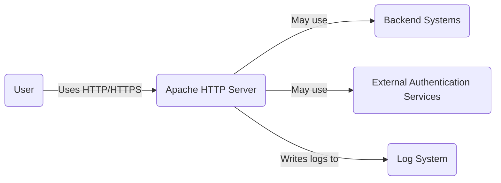
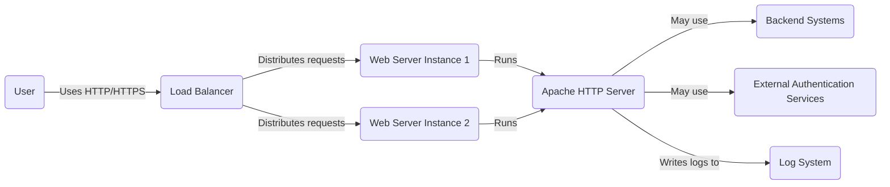
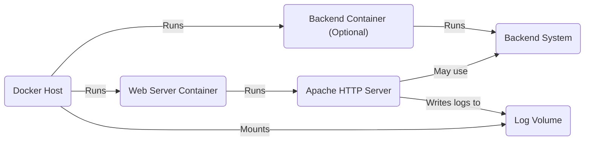
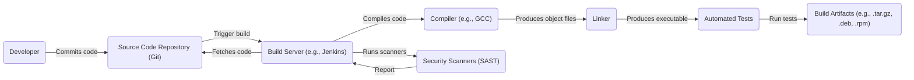

# BUSINESS POSTURE

The Apache HTTP Server project ("httpd") is a foundational piece of internet infrastructure. Its primary business goal is to provide a secure, efficient, and extensible server that implements the HTTP protocol. Given its widespread use, the project's priorities likely revolve around:

*   Maintaining stability and reliability: Downtime or instability in httpd can have cascading effects across the internet.
*   Ensuring security: As a public-facing server, httpd is a constant target for attacks. Security vulnerabilities can lead to data breaches, website defacement, and other serious consequences.
*   Supporting a wide range of use cases: httpd is used in diverse environments, from small personal websites to large-scale enterprise deployments. It needs to be flexible and configurable to meet these varying needs.
*   Maintaining compatibility: Many systems and applications rely on httpd. The project needs to balance innovation with backward compatibility to avoid breaking existing setups.
*   Community-driven development: As an open-source project, httpd relies on contributions from a global community of developers. Fostering a healthy and productive community is crucial.

Most important business risks that need to be addressed:

*   Compromise of the server, leading to data breaches, website defacement, or use of the server for malicious purposes (e.g., botnets, phishing).
*   Denial-of-service attacks that render websites and applications unavailable.
*   Vulnerabilities that allow attackers to execute arbitrary code on the server.
*   Inability to adapt to evolving web standards and security threats.
*   Loss of community support and developer contributions.

# SECURITY POSTURE

The Apache HTTP Server project has a long history and a strong focus on security. The following security controls and accepted risks are likely in place:

*   security control: Secure coding practices: The httpd development team likely follows secure coding guidelines to minimize vulnerabilities. This includes input validation, output encoding, and careful memory management. Described in project documentation and coding style guidelines.
*   security control: Regular security audits and reviews: The codebase is likely subject to regular internal and external security audits to identify and address potential vulnerabilities. Described in project documentation and security advisories.
*   security control: Vulnerability disclosure program: The project likely has a process for handling vulnerability reports from external researchers. Described in project documentation and security advisories.
*   security control: Support for secure communication protocols: httpd supports HTTPS (HTTP over TLS/SSL) to encrypt communication between the server and clients. Described in project documentation.
*   security control: Access control mechanisms: httpd provides various mechanisms for controlling access to resources, such as authentication and authorization modules. Described in project documentation.
*   security control: Regular updates and patches: The project releases regular updates to address security vulnerabilities and other issues. Described in project documentation and release notes.
*   security control: Module architecture: The modular design of httpd allows users to enable only the necessary features, reducing the attack surface. Described in project documentation.
*   security control: Sandboxing and process isolation: Some configurations may involve running httpd processes with limited privileges or in sandboxed environments to contain potential exploits. Described in project documentation.
*   accepted risk: Complexity of configuration: httpd offers a vast array of configuration options, which can lead to misconfigurations and security vulnerabilities if not properly managed.
*   accepted risk: Legacy code and features: Maintaining backward compatibility may require retaining older code and features that are less secure than modern alternatives.
*   accepted risk: Third-party modules: While the core httpd codebase is rigorously reviewed, third-party modules may introduce vulnerabilities.
*   accepted risk: Dependence on external libraries: httpd relies on external libraries (e.g., OpenSSL) for cryptography and other functions. Vulnerabilities in these libraries can impact httpd's security.

Recommended security controls:

*   Implement a Content Security Policy (CSP) to mitigate the risk of cross-site scripting (XSS) attacks.
*   Enable HTTP Strict Transport Security (HSTS) to force clients to use HTTPS.
*   Regularly review and update configuration to ensure best practices are followed.
*   Consider using a Web Application Firewall (WAF) to provide an additional layer of defense against common web attacks.
*   Implement robust logging and monitoring to detect and respond to security incidents.

Security Requirements:

*   Authentication:
    *   Support for various authentication mechanisms (e.g., Basic, Digest, OAuth, OpenID Connect).
    *   Secure storage of credentials (e.g., hashing and salting passwords).
    *   Protection against brute-force attacks.
*   Authorization:
    *   Fine-grained access control to resources based on user roles and permissions.
    *   Support for different authorization models (e.g., role-based access control, attribute-based access control).
*   Input Validation:
    *   Strict validation of all user inputs to prevent injection attacks (e.g., SQL injection, XSS, command injection).
    *   Whitelist-based validation whenever possible.
    *   Proper handling of special characters and encodings.
*   Cryptography:
    *   Use of strong, up-to-date cryptographic algorithms and protocols (e.g., TLS 1.3, AES-256).
    *   Secure key management practices.
    *   Protection against known cryptographic attacks (e.g., padding oracle attacks, timing attacks).

# DESIGN

## C4 CONTEXT

Element Descriptions:

*   Element:
    *   Name: User
    *   Type: Person
    *   Description: A person using a web browser or other client application to access resources served by the Apache HTTP Server.
    *   Responsibilities: Initiates HTTP requests, receives and processes HTTP responses.
    *   Security controls: Browser security settings, antivirus software, firewall.

*   Element:
    *   Name: Apache HTTP Server
    *   Type: Software System
    *   Description: The Apache HTTP Server, a web server application that serves web content and handles HTTP requests.
    *   Responsibilities: Receives and processes HTTP requests, serves static content, interacts with backend systems, performs authentication and authorization, logs activity.
    *   Security controls: Secure coding practices, regular security audits, vulnerability disclosure program, support for HTTPS, access control mechanisms, regular updates, module architecture, sandboxing.

*   Element:
    *   Name: Backend Systems
    *   Type: Software System
    *   Description: Systems that provide data or services to the Apache HTTP Server, such as databases, application servers, or other web services.
    *   Responsibilities: Processes requests from the HTTP server, provides data or performs actions.
    *   Security controls: Dependent on the specific backend system; should include appropriate security measures.

*   Element:
    *   Name: External Authentication Services
    *   Type: Software System
    *   Description: External services used for authentication, such as LDAP servers, OAuth providers, or OpenID Connect providers.
    *   Responsibilities: Authenticates users, provides user information to the HTTP server.
    *   Security controls: Dependent on the specific authentication service; should include strong authentication and secure communication.

*   Element:
    *   Name: Log System
    *   Type: Software System
    *   Description: A system for storing and managing logs generated by the Apache HTTP Server.
    *   Responsibilities: Collects, stores, and potentially analyzes log data.
    *   Security controls: Access control to log data, secure storage, integrity checks.

## C4 CONTAINER

Element Descriptions:

*   Element:
    *   Name: User
    *   Type: Person
    *   Description: A person using a web browser or other client application.
    *   Responsibilities: Initiates HTTP requests, receives and processes HTTP responses.
    *   Security controls: Browser security settings, antivirus software, firewall.

*   Element:
    *   Name: Load Balancer
    *   Type: Container
    *   Description: Distributes incoming requests across multiple web server instances.
    *   Responsibilities: Health checks, request routing, session persistence (optional).
    *   Security controls: SSL/TLS termination, DDoS protection, access control lists.

*   Element:
    *   Name: Web Server Instance 1/2
    *   Type: Container
    *   Description: An instance of the Apache HTTP Server running within a container or virtual machine.
    *   Responsibilities: Handles HTTP requests, serves content, interacts with backend systems.
    *   Security controls: All security controls listed for the Apache HTTP Server in the Context diagram.

*   Element:
    *   Name: Apache HTTP Server
    *   Type: Software System
    *   Description: The Apache HTTP Server, a web server application that serves web content and handles HTTP requests.
    *   Responsibilities: Receives and processes HTTP requests, serves static content, interacts with backend systems, performs authentication and authorization, logs activity.
    *   Security controls: Secure coding practices, regular security audits, vulnerability disclosure program, support for HTTPS, access control mechanisms, regular updates, module architecture, sandboxing.

*   Element:
    *   Name: Backend Systems
    *   Type: Software System
    *   Description: Systems that provide data or services to the Apache HTTP Server.
    *   Responsibilities: Processes requests from the HTTP server, provides data or performs actions.
    *   Security controls: Dependent on the specific backend system.

*   Element:
    *   Name: External Authentication Services
    *   Type: Software System
    *   Description: External services used for authentication.
    *   Responsibilities: Authenticates users, provides user information.
    *   Security controls: Dependent on the specific authentication service.

*   Element:
    *   Name: Log System
    *   Type: Software System
    *   Description: A system for storing and managing logs.
    *   Responsibilities: Collects, stores, and analyzes log data.
    *   Security controls: Access control to log data, secure storage, integrity checks.

## DEPLOYMENT

Possible deployment solutions:

1.  Traditional deployment on bare-metal servers or virtual machines.
2.  Containerized deployment using Docker or other containerization technologies.
3.  Deployment on cloud platforms using services like AWS EC2, Azure VMs, or Google Compute Engine.
4.  Deployment using serverless technologies like AWS Lambda or Azure Functions (for specific use cases).

Chosen solution (Containerized deployment using Docker):

Element Descriptions:

*   Element:
    *   Name: Docker Host
    *   Type: Infrastructure Node
    *   Description: A physical or virtual machine that runs the Docker engine.
    *   Responsibilities: Hosts and manages Docker containers.
    *   Security controls: Operating system hardening, firewall, regular security updates, Docker security best practices.

*   Element:
    *   Name: Web Server Container
    *   Type: Container
    *   Description: A Docker container that runs the Apache HTTP Server.
    *   Responsibilities: Contains the httpd software and its dependencies.
    *   Security controls: Minimal base image, regular image updates, non-root user, limited capabilities, security scanning of the image.

*   Element:
    *   Name: Apache HTTP Server
    *   Type: Software System
    *   Description: The Apache HTTP Server, a web server application that serves web content and handles HTTP requests.
    *   Responsibilities: Receives and processes HTTP requests, serves static content, interacts with backend systems, performs authentication and authorization, logs activity.
    *   Security controls: Secure coding practices, regular security audits, vulnerability disclosure program, support for HTTPS, access control mechanisms, regular updates, module architecture, sandboxing.

*   Element:
    *   Name: Backend Container (Optional)
    *   Type: Container
    *   Description: A Docker container that runs a backend system (e.g., database, application server).
    *   Responsibilities: Provides data or services to the HTTP server.
    *   Security controls: Dependent on the specific backend system; should follow container security best practices.

*   Element:
    *   Name: Backend System
    *   Type: Software System
    *   Description: Systems that provide data or services to the Apache HTTP Server.
    *   Responsibilities: Processes requests from the HTTP server, provides data or performs actions.
    *   Security controls: Dependent on the specific backend system.

*   Element:
    *   Name: Log Volume
    *   Type: Storage
    *   Description: A Docker volume used to store logs generated by the Apache HTTP Server.
    *   Responsibilities: Persistently stores log data.
    *   Security controls: Access control to the volume, encryption at rest (if required).

## BUILD

The Apache HTTP Server build process involves multiple steps, from source code to distributable packages. The process is managed by the Apache Software Foundation's build infrastructure.

Security Controls in the Build Process:

*   Source Code Management: The project uses Git for version control, allowing tracking of changes and facilitating code reviews.
*   Build Automation: The build process is automated using tools like Jenkins, ensuring consistency and repeatability.
*   Compiler Warnings and Errors: The build process is configured to treat compiler warnings as errors, enforcing code quality and preventing potential vulnerabilities.
*   Static Application Security Testing (SAST): SAST tools are integrated into the build process to scan the codebase for potential security vulnerabilities.
*   Dependency Management: The project carefully manages its dependencies to minimize the risk of using vulnerable libraries.
*   Reproducible Builds: Efforts are made to ensure that the build process is reproducible, meaning that the same source code will always produce the same binary output. This helps to verify the integrity of the build artifacts.
*   Signed Releases: Official releases of the Apache HTTP Server are digitally signed, allowing users to verify their authenticity and integrity.

# RISK ASSESSMENT

*   Critical business processes we are trying to protect:
    *   Serving web content reliably and efficiently.
    *   Protecting sensitive data transmitted between clients and the server.
    *   Maintaining the availability of websites and applications that rely on httpd.
    *   Protecting the reputation of the Apache Software Foundation and the httpd project.

*   Data we are trying to protect and their sensitivity:
    *   User credentials (passwords, API keys): Highly sensitive.
    *   Session data: Potentially sensitive, depending on the application.
    *   Website content: Varies in sensitivity, from public information to confidential data.
    *   Configuration files: Potentially sensitive, as they may contain credentials or other secrets.
    *   Logs: Potentially sensitive, as they may contain user IP addresses, request details, and other information.

# QUESTIONS & ASSUMPTIONS

*   Questions:
    *   What specific SAST tools are used in the build process?
    *   What is the process for handling security vulnerabilities found by the SAST tools?
    *   What are the specific criteria for accepting or rejecting contributions to the codebase?
    *   What are the procedures for handling security incidents?
    *   Are there any specific compliance requirements (e.g., PCI DSS, HIPAA) that need to be considered for certain deployments of httpd?

*   Assumptions:
    *   Business Posture: The Apache Software Foundation prioritizes security and stability.
    *   Security Posture: The project follows industry best practices for secure software development.
    *   Design: The provided diagrams are simplified representations of the actual architecture and deployment. The real-world setup may be more complex. The build process is robust and includes security checks.