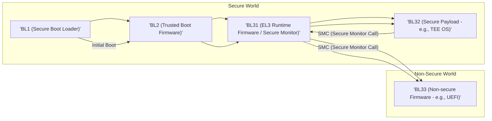
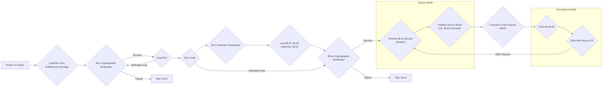

# Project Design Document: ARM Trusted Firmware

**Version:** 1.1
**Date:** October 26, 2023
**Authors:** Gemini AI (as requested)

## 1. Introduction

This document provides a detailed design overview of the ARM Trusted Firmware (ATF) project, based on the information available at [https://github.com/ARM-software/arm-trusted-firmware](https://github.com/ARM-software/arm-trusted-firmware). This document is intended to serve as a foundation for subsequent threat modeling activities by providing a clear understanding of the system's architecture and components.

## 2. Goals and Objectives

The primary goals of the ARM Trusted Firmware project are to:

*   Establish a secure foundation for ARM-based systems, ensuring a measured and trusted boot process.
*   Provide a reference implementation for secure boot, adhering to industry best practices and ARM specifications.
*   Implement essential security services within the secure world, such as secure world management and handling Secure Monitor Calls (SMCs).
*   Facilitate the secure initialization and execution of a Trusted Execution Environment (TEE), protecting sensitive assets.
*   Offer a modular and extensible architecture, allowing adaptation to diverse platform requirements and security policies.

## 3. Scope

This design document focuses on the core components and functionalities of the ARM Trusted Firmware as described in the linked repository. It covers the boot process from power-on reset to the handover to the non-secure world operating system. Specifically, it includes:

*   Detailed descriptions of the different boot loader stages: BL1, BL2, BL31, BL32, and BL33.
*   The mechanisms for transitioning between the secure and non-secure worlds.
*   The role and functionality of the Secure Monitor (implemented in BL31).
*   The interface and interaction with a Trusted Execution Environment (TEE), represented by BL32.
*   Key data structures involved in the boot process and inter-world communication.
*   The overall control flow during the boot sequence.

This document does not delve into platform-specific hardware details or customizations beyond the general architectural principles inherent in ATF.

## 4. High-Level Architecture

The ARM Trusted Firmware employs a layered architecture with distinct boot loader stages executing in different security states. The following diagram illustrates the high-level architecture and the interaction between the secure and non-secure worlds:

**Key Architectural Concepts:**

*   **Secure World and Non-Secure World Separation:** ATF enforces a clear separation between the secure and non-secure execution environments, leveraging hardware features like ARM TrustZone.
*   **Exception Levels (ELs):** ATF utilizes ARM's exception levels to enforce privilege separation. Typically, BL1 and BL31 execute at EL3 (Secure Monitor), BL2 at a lower secure EL (e.g., EL2 or EL1), BL32 within the TEE's secure EL, and BL33 in the non-secure world.
*   **Secure Monitor (BL31):**  A critical component executing at EL3, responsible for managing transitions between the secure and non-secure worlds and handling Secure Monitor Calls (SMCs).
*   **Secure Monitor Calls (SMCs):** The primary mechanism for controlled communication and transitions between the secure and non-secure worlds, mediated by the Secure Monitor.

## 5. Key Components and Interactions

The ARM Trusted Firmware is structured around several key boot loader stages, each with specific responsibilities in establishing a secure boot environment:

1. **BL1 (Secure Boot Loader):**
    *   The very first code executed after the system powers on or resets.
    *   Performs minimal and critical hardware initialization required for subsequent stages.
    *   Authenticates the next stage boot loader, BL2, using cryptographic verification.
    *   Loads BL2 into secure memory and transfers execution to it.
    *   Establishes the initial Root of Trust for Measurement (RTM).

2. **BL2 (Trusted Boot Firmware):**
    *   Performs more comprehensive hardware initialization, including memory configuration and device setup.
    *   Loads and authenticates the subsequent boot loaders: BL31, BL32 (if a TEE is present), and BL33.
    *   May implement firmware update mechanisms, allowing secure updates of the trusted firmware components.
    *   Prepares the execution environment for BL31.

3. **BL31 (EL3 Runtime Firmware / Secure Monitor):**
    *   Executes at the highest privilege level in the secure world (EL3).
    *   Implements the Secure Monitor functionality, handling Secure Monitor Calls (SMCs) from both the secure and non-secure worlds.
    *   Manages context switching between the secure and non-secure worlds.
    *   Provides essential runtime services to both worlds, such as power management for the secure world and access to secure resources.
    *   Initializes and manages the Trusted Execution Environment (TEE), if present.

4. **BL32 (Secure Payload - e.g., TEE OS):**
    *   Represents the Trusted Execution Environment's operating system or a secure application.
    *   Provides an isolated and secure environment for executing sensitive operations and protecting confidential data.
    *   Communicates with the non-secure world indirectly through BL31 via SMCs.
    *   Relies on the secure foundation provided by the earlier boot stages.

5. **BL33 (Non-secure Firmware - e.g., UEFI):**
    *   The firmware that boots the main operating system in the non-secure world. This is often a standard firmware like UEFI.
    *   Receives control from BL31 after the secure world initialization is complete.
    *   May request services from the secure world by issuing Secure Monitor Calls (SMCs) to BL31.

**Interaction Flow:**

*   The boot process begins with the processor executing BL1 from ROM or secure storage.
*   BL1 cryptographically verifies BL2 and, upon successful verification, loads and executes BL2.
*   BL2 performs further initialization and similarly verifies and loads BL31, BL32 (if configured), and BL33.
*   BL31 takes over as the Secure Monitor, managing transitions and providing secure services.
*   If a TEE is present, BL31 initializes and starts BL32.
*   Finally, BL31 transitions execution to BL33 in the non-secure world.
*   The non-secure operating system then boots under the control of BL33.
*   During runtime, the non-secure OS can request secure services by issuing Secure Monitor Calls (SMCs), which are intercepted and handled by BL31. BL32 can also issue SMCs to request services from BL31.

## 6. Data Flow

The primary data flow within ATF involves the sequential loading and execution of different boot stages, along with the communication between the secure and non-secure worlds via Secure Monitor Calls.

**Data Flow Description:**

*   The boot process initiates with the device powering on, causing the processor to fetch and execute BL1 code from a secure, immutable storage location (e.g., ROM).
*   BL1 performs cryptographic verification of BL2 using a pre-provisioned verification key.
*   Upon successful verification, BL1 loads BL2 into secure memory. If verification fails, the system halts or enters an error state.
*   BL2 code is loaded, and BL2 performs necessary hardware initialization.
*   BL2 then loads the subsequent boot loaders (BL31, BL32 if present, and BL33) and performs cryptographic verification on each using their respective verification keys.
*   BL31 is executed, taking on the role of the Secure Monitor.
*   BL31 initializes the secure world components, including loading and starting BL32 if a TEE is configured.
*   BL31 then transitions execution to the non-secure world by jumping to the entry point of BL33.
*   BL33 takes over and initiates the boot process of the non-secure operating system.
*   During runtime, the non-secure OS can request services from the secure world by issuing Secure Monitor Calls (SMCs), which are intercepted and handled by BL31.

## 7. Security Considerations

The ARM Trusted Firmware is fundamentally designed with security as a paramount concern. Key security features and considerations include:

*   **Secure Boot with Cryptographic Verification:** Ensures that only authentic and authorized firmware components are executed. Each boot stage cryptographically verifies the next stage before execution, preventing the execution of tampered or malicious code. Common cryptographic algorithms used include SHA-256 for hashing and RSA or Elliptic Curve Cryptography for digital signatures.
*   **Establishment of a Chain of Trust:**  Each boot stage builds upon the trust established by the previous stage. This chain of trust extends from the initial boot code in ROM to the operating system.
*   **Hardware-Enforced Isolation:** The separation between the secure and non-secure worlds is enforced by hardware mechanisms like ARM TrustZone, preventing unauthorized access or interference between the two environments.
*   **Secure Monitor Functionality:** BL31, acting as the Secure Monitor, is a critical security component. It controls all transitions between the secure and non-secure worlds, ensuring that these transitions are secure and authorized.
*   **Trusted Execution Environment (TEE) Support:** ATF facilitates the secure initialization and management of a TEE, providing an isolated environment for sensitive applications and data.
*   **Secure Key Management:**  ATF handles cryptographic keys securely, ensuring their confidentiality and integrity. This includes keys used for secure boot verification and potentially for other secure services.
*   **Protection Against Rollback Attacks:** Mechanisms may be implemented to prevent the installation of older, potentially vulnerable firmware versions.

## 8. Deployment Considerations

The ARM Trusted Firmware is typically deployed as firmware embedded within the boot ROM or a dedicated secure storage partition of an ARM-based system-on-chip (SoC). The specific deployment details are highly dependent on the target platform and SoC architecture. Key considerations include:

*   **Platform-Specific Configuration:** ATF requires configuration tailored to the specific hardware platform, including memory map definitions, interrupt controller setup, and peripheral initialization.
*   **Secure Storage for Firmware Images:** The integrity and confidentiality of the firmware images (BL1, BL2, BL31, BL32, BL33) are critical. Secure storage solutions are necessary to protect these images from unauthorized modification or access.
*   **Integration with Trusted Execution Environments (TEEs):** If a TEE is utilized, ATF must be configured to correctly load and manage the TEE operating system or secure payload. This involves defining memory regions and communication interfaces.
*   **Secure Firmware Update Mechanisms:** Implementing secure and reliable mechanisms for updating the firmware is crucial for patching vulnerabilities and deploying new features. These mechanisms must ensure the authenticity and integrity of the new firmware.
*   **Boot Mode Configuration:**  The system may support different boot modes (e.g., secure boot, development boot), and ATF needs to handle these modes appropriately.

## 9. Assumptions and Constraints

This design document is based on the following assumptions and constraints:

*   The information presented in the [ARM Trusted Firmware GitHub repository](https://github.com/ARM-software/arm-trusted-firmware) is accurate and reflects the general architecture of the project.
*   The target architecture is a modern ARM-based system supporting security extensions like ARM TrustZone.
*   Standard cryptographic algorithms and established security best practices are employed for security-sensitive functions.
*   Platform-specific hardware details and customizations beyond the general architectural principles are not covered in detail.
*   The document assumes a basic understanding of ARM architecture concepts, including exception levels and security extensions.

This document provides a comprehensive design overview of the ARM Trusted Firmware, intended to facilitate effective threat modeling activities. By understanding the architecture, components, and data flow, potential security vulnerabilities can be identified and mitigated.
