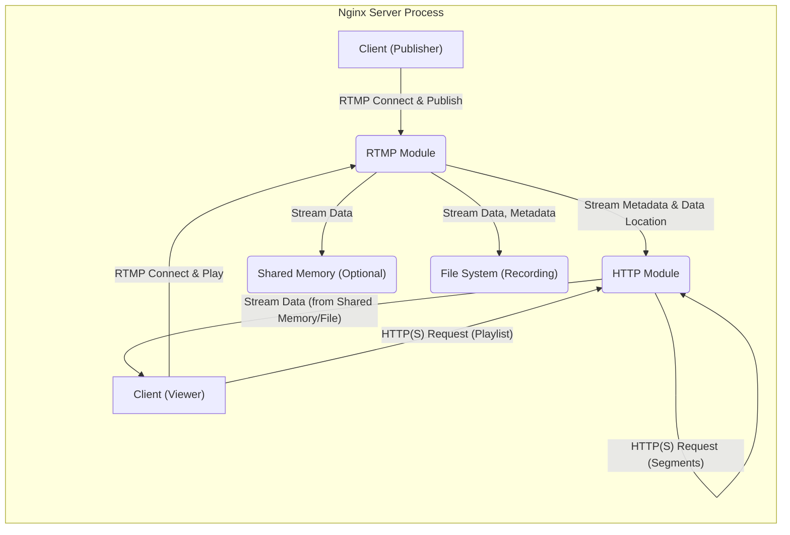

# Project Design Document: nginx-rtmp-module

**Version:** 1.1
**Date:** October 26, 2023
**Author:** AI Software Architect

## 1. Introduction

This document provides an enhanced and more detailed design overview of the `nginx-rtmp-module` project. This document serves as a comprehensive foundation for understanding the system's architecture, components, and data flow, which is crucial for subsequent threat modeling activities. This document focuses on the functional, architectural, and some operational aspects of the module.

## 2. Project Overview

The `nginx-rtmp-module` is a widely adopted, open-source Nginx module that extends the capabilities of the Nginx web server to handle Real-Time Messaging Protocol (RTMP) traffic. This enables Nginx to function as a robust and scalable media streaming server, capable of both receiving (publishing) and broadcasting (playing) live audio and video streams. Beyond its core RTMP functionality, the module also facilitates the delivery of these streams via HTTP-based adaptive streaming protocols like HTTP Live Streaming (HLS) and Dynamic Adaptive Streaming over HTTP (DASH).

The primary goal of this module is to offer a high-performance and efficient solution for live media streaming, leveraging Nginx's non-blocking, event-driven architecture. It empowers users to publish live streams to the server using RTMP and allows viewers to consume these streams through RTMP, HLS, or DASH, catering to a wide range of client devices and network conditions.

## 3. System Architecture

The `nginx-rtmp-module` is tightly integrated within the Nginx server process. Below is a more detailed architectural overview illustrating the key interactions:

**Key Components:**

*   **Client (Publisher):**  Any software or hardware endpoint capable of encoding and transmitting live media streams adhering to the RTMP protocol. Examples include professional broadcasting software like OBS Studio and Wirecast, command-line tools like FFmpeg, and dedicated hardware encoders.
*   **Client (Viewer):** Applications or devices designed to consume live media streams. These can utilize RTMP for direct streaming or HTTP-based protocols like HLS and DASH. Examples include VLC media player, web browsers with HTML5 video players, mobile applications utilizing streaming SDKs, and set-top boxes.
*   **RTMP Module:** The central component of this project. It is responsible for handling all aspects of RTMP communication, including connection management, stream publishing, and playback. It also plays a crucial role in preparing streams for HLS and DASH delivery.
*   **HTTP Module:** Nginx's built-in module, essential for serving static content and handling HTTP and HTTPS requests. The `nginx-rtmp-module` leverages this module to deliver HLS and DASH manifests and media segments.
*   **Shared Memory (Optional):** A memory region that can be accessed by multiple Nginx worker processes. This is often used to store recently ingested stream data, allowing the HTTP module to efficiently serve HLS and DASH segments without repeatedly reading from disk. Its use is configurable.
*   **File System (Recording):** An optional storage mechanism where the module can persist incoming streams to files. This allows for archiving or on-demand playback of recorded content.

## 4. Component Details

This section provides a more in-depth look at the functionalities within each key component.

*   **Nginx Core:**
    *   Provides the foundational event-driven, asynchronous architecture that enables high concurrency and efficient resource utilization.
    *   Manages incoming network connections (including TCP handshakes for RTMP and HTTP/HTTPS).
    *   Routes requests to the appropriate modules based on configuration directives and connection types.
    *   Manages worker processes to handle multiple client connections concurrently.
    *   Provides core functionalities like logging, process management, and configuration parsing.

*   **RTMP Module:**
    *   **RTMP Handshake Processing:** Implements the RTMP handshake sequence to establish a connection with publishers and viewers.
    *   **Connection Management:**  Manages the lifecycle of RTMP connections, including connection establishment, keep-alive mechanisms, and disconnection handling.
    *   **Message Parsing and Processing:**  Parses incoming RTMP messages (e.g., `publish`, `play`, audio/video data) and takes appropriate actions.
    *   **Publishing Workflow:**
        *   Receives incoming audio and video data chunks from publishers.
        *   Manages stream metadata (e.g., codecs, resolution).
        *   Optionally stores stream data in shared memory for HLS/DASH.
        *   Optionally writes stream data to the file system for recording.
        *   Notifies subscribers (viewers) about the availability of the stream.
    *   **Playback Workflow:**
        *   Receives requests from viewers for specific streams.
        *   Retrieves stream data from internal buffers or shared memory.
        *   Sends audio and video data chunks to viewers.
    *   **Stream Management and Metadata Handling:** Maintains a registry of active streams, their metadata, and associated subscribers.
    *   **HLS/DASH Integration:**
        *   Segments the incoming RTMP stream into smaller chunks (typically MPEG-TS for HLS).
        *   Generates and updates HLS playlists (M3U8 files).
        *   Segments the incoming RTMP stream into smaller chunks (fragmented MP4 for DASH).
        *   Generates and updates DASH Media Presentation Description (MPD) files.
    *   **Security Features:** May include mechanisms for authentication and authorization of publishers and viewers (depending on configuration).
    *   **Configuration Handling:** Parses RTMP-specific directives within the Nginx configuration file to customize its behavior.

*   **HTTP Module (Interaction with RTMP Module):**
    *   **Static File Serving:** Serves the generated HLS segment files (.ts) and playlist files (.m3u8), or DASH segment files and MPD files, to viewers via standard HTTP(S) requests.
    *   **Request Handling:** Processes HTTP requests for HLS/DASH resources.
    *   **Caching:**  Leverages Nginx's caching mechanisms (if configured) to improve the delivery of HLS/DASH segments.
    *   **Security Features:** Enforces HTTPS if configured, providing secure delivery of HLS/DASH content.

*   **Shared Memory (Optional):**
    *   Provides a fast and efficient way for the RTMP module to share stream data with the HTTP module.
    *   Reduces disk I/O operations, improving performance for HLS and DASH streaming, especially under high load.
    *   Requires careful management to avoid memory leaks or corruption.

*   **File System (Recording):**
    *   Stores recorded streams as files, typically in formats like FLV or MP4.
    *   Provides options for configuring recording paths, file naming conventions, and segment durations.
    *   Relies on the operating system's file system for storage and access control.

## 5. Data Flow

This section provides a more detailed breakdown of the data flow for different streaming scenarios.

### 5.1. Publishing a Stream (RTMP)

1. A publisher client initiates a TCP connection to the Nginx server on the configured RTMP port (default 1935).
2. The Nginx core accepts the connection and passes it to the `RTMP Module`.
3. The `RTMP Module` performs the RTMP handshake with the client, exchanging control messages to establish the connection.
4. The publisher sends an RTMP `connect` message, providing application-level information.
5. The publisher sends a `createStream` message to request a stream ID.
6. The publisher sends a `publish` message, specifying the stream name and publishing type (e.g., live).
7. The publisher begins sending audio and video data chunks encapsulated in RTMP messages.
8. The `RTMP Module` receives these chunks, potentially:
    *   Storing them in shared memory for immediate HLS/DASH segmentation.
    *   Writing them to the file system if recording is enabled, based on configured settings.
    *   Making the stream available for RTMP playback by registered viewers.

### 5.2. Viewing a Stream (RTMP)

1. A viewer client initiates a TCP connection to the Nginx server on the RTMP port.
2. The Nginx core accepts the connection and passes it to the `RTMP Module`.
3. The `RTMP Module` performs the RTMP handshake with the client.
4. The viewer sends an RTMP `connect` message.
5. The viewer sends a `createStream` message.
6. The viewer sends a `play` message, specifying the stream name to view.
7. The `RTMP Module` retrieves the requested stream data from its internal buffers or shared memory.
8. The `RTMP Module` sends the audio and video data chunks to the viewer in RTMP messages.

### 5.3. Viewing a Stream (HLS)

1. A viewer client sends an HTTP(S) GET request to the Nginx server for the HLS playlist file (e.g., `stream.m3u8`).
2. The Nginx core routes the request to the `HTTP Module`.
3. The `HTTP Module`, upon recognizing the request for a playlist associated with the `nginx-rtmp-module`, either retrieves a pre-generated playlist or dynamically generates one based on the current state of the stream (managed by the RTMP module).
4. The `HTTP Module` sends the M3U8 playlist file to the viewer.
5. The viewer parses the playlist and sends subsequent HTTP(S) GET requests for the individual media segment files (e.g., `stream_0.ts`, `stream_1.ts`).
6. The `HTTP Module` retrieves the requested segment files, potentially from shared memory or the file system, and sends them to the viewer.

### 5.4. Viewing a Stream (DASH)

1. A viewer client sends an HTTP(S) GET request to the Nginx server for the DASH Media Presentation Description (MPD) file (e.g., `stream.mpd`).
2. The Nginx core routes the request to the `HTTP Module`.
3. The `HTTP Module`, in coordination with the `RTMP Module`, retrieves or dynamically generates the MPD file. This file describes the available media segments, encoding profiles, and other relevant information.
4. The `HTTP Module` sends the MPD file to the viewer.
5. The viewer parses the MPD file and sends subsequent HTTP(S) GET requests for the individual media segments, as described in the MPD.
6. The `HTTP Module` retrieves the requested segments and sends them to the viewer.

## 6. Security Considerations (For Threat Modeling)

This section expands on the initial security considerations, providing more context for threat modeling.

*   **Authentication and Authorization:**
    *   **Publisher Authentication:** How does the system verify the identity of publishers to prevent unauthorized stream injection?  Potential weaknesses include lack of authentication, weak credentials, or insecure authentication protocols.
    *   **Viewer Authorization:** How does the system control access to specific streams, preventing unauthorized viewing?  Weaknesses could involve easily guessable stream names or lack of any authorization checks.
    *   **Access Control Mechanisms:** Are there different levels of access control for publishing and viewing?  Insufficient granularity can lead to over-privileged access.
*   **Input Validation:**
    *   **RTMP Message Validation:** How is the module protected against malicious or malformed RTMP messages from publishers that could lead to crashes or unexpected behavior?  Lack of proper validation can expose vulnerabilities.
    *   **Stream Metadata Validation:** Is the metadata provided by publishers validated to prevent injection of malicious content or incorrect information?
    *   **HTTP Request Validation:** Are HTTP requests for HLS/DASH segments validated to prevent path traversal or other attacks?
*   **Access Control to Recorded Files:**
    *   **File System Permissions:** Are the file system permissions for recorded stream files properly configured to prevent unauthorized access or modification?
    *   **Nginx Configuration:** Does the Nginx configuration correctly restrict access to the recording directories?
*   **Denial of Service (DoS) Attacks:**
    *   **RTMP Flood Attacks:** How resilient is the module to DoS attacks targeting the RTMP port with a large number of connection requests or data packets?
    *   **HTTP Flood Attacks:** Can attackers overwhelm the server with HTTP requests for HLS/DASH segments or playlists?
    *   **Rate Limiting:** Are there rate limiting mechanisms in place to mitigate DoS attacks at both the RTMP and HTTP levels?
*   **Secure Transmission:**
    *   **RTMPS Support:** Is there support for secure RTMP over TLS/SSL (RTMPS) to encrypt the communication between publishers/viewers and the server?
    *   **HTTPS Enforcement:** Is HTTPS enforced for the delivery of HLS and DASH content to protect the confidentiality and integrity of the streams?
*   **Configuration Security:**
    *   **Sensitive Data Handling:** How are sensitive configuration parameters, such as authentication credentials or API keys, stored and managed? Are they protected from unauthorized access?
    *   **Default Configurations:** Are the default configurations secure, or do they need hardening?
*   **Vulnerabilities in Dependencies:**
    *   **Nginx Core Vulnerabilities:** Is the deployed version of Nginx up-to-date with security patches to address known vulnerabilities?
    *   **Library Vulnerabilities:** Are there any known vulnerabilities in other libraries that the module depends on?

## 7. Deployment Considerations

The `nginx-rtmp-module` offers flexibility in deployment. Key considerations include:

*   **Bare Metal or Virtual Machines:**
    *   Direct installation on the operating system provides full control over the environment.
    *   Requires manual configuration and management of the operating system and Nginx.
    *   Scaling can be achieved by adding more servers.
*   **Containerized Environments (e.g., Docker):**
    *   Provides a consistent and isolated environment for the application.
    *   Simplifies deployment and management through container orchestration platforms like Kubernetes.
    *   Facilitates scalability and portability.
    *   Requires careful consideration of container image security.
*   **Cloud Platforms (e.g., AWS, Azure, GCP):**
    *   Leverages cloud-provided infrastructure and services for scalability, reliability, and cost-efficiency.
    *   Offers managed services for load balancing, auto-scaling, and monitoring.
    *   Requires understanding of the specific cloud platform's services and configurations.
    *   Examples include deploying on EC2 instances with Elastic Load Balancing or using container services like ECS or GKE.

## 8. Dependencies

The `nginx-rtmp-module` relies on the following key dependencies:

*   **Nginx Web Server:** The core dependency, providing the underlying web server functionality and module framework. A specific version of Nginx might be required for compatibility.
*   **Operating System:** The underlying operating system (typically Linux-based distributions like Ubuntu, CentOS, or Debian) provides the necessary networking, file system, and process management capabilities.
*   **C Compiler and Build Tools:**  Essential for compiling the module from source code. This typically includes `gcc`, `make`, and other development utilities.
*   **PCRE Library (Perl Compatible Regular Expressions):** Used by Nginx for regular expression processing, which might be utilized by the RTMP module for configuration parsing or stream name matching.
*   **zlib Library:** Used for data compression, potentially for handling compressed RTMP messages or HLS/DASH segments.
*   **OpenSSL Library (Optional):** Required for enabling secure communication via RTMPS and HTTPS.

This enhanced document provides a more detailed and comprehensive design overview of the `nginx-rtmp-module`, offering a solid foundation for conducting a thorough threat model and understanding the intricacies of the system.
