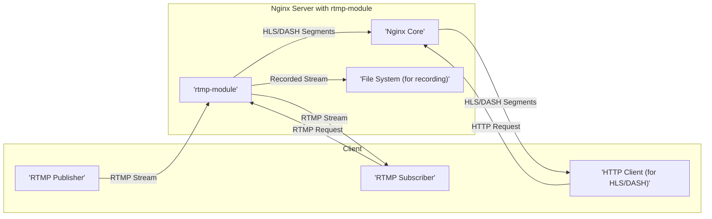
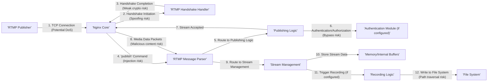
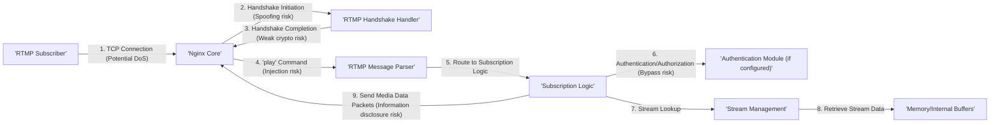
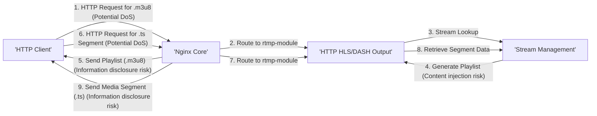

# Project Design Document: nginx-rtmp-module

**Version:** 1.1
**Date:** October 26, 2023
**Author:** AI Software Architect

## 1. Introduction

This document provides an enhanced and more detailed design overview of the `nginx-rtmp-module`, an open-source module for the Nginx web server that provides Real-Time Messaging Protocol (RTMP) functionality. This revised document aims to offer a clearer and more comprehensive understanding of the module's architecture, components, and data flow, specifically tailored for effective threat modeling activities. It builds upon the previous version by providing more granular detail and highlighting potential security implications within the design.

## 2. Goals and Objectives

The primary goals of this design document are to:

*   Provide a highly detailed and accurate understanding of the `nginx-rtmp-module`'s architecture and functionality.
*   Identify all key components and meticulously describe their interactions within the system, with a focus on potential security boundaries.
*   Map the data flow through the module with precision, explicitly highlighting potential points of interest and vulnerabilities for security analysis.
*   Serve as a robust and comprehensive reference point for detailed threat modeling exercises, enabling the identification of a wide range of potential threats.

## 3. System Architecture

The `nginx-rtmp-module` operates as a tightly integrated module within the Nginx web server, leveraging its event-driven architecture. It significantly extends Nginx's capabilities to handle RTMP connections, stream ingestion, various processing steps, and distribution to different types of clients.

### 3.1. High-Level Architecture

### 3.2. Detailed Architecture

The `nginx-rtmp-module` is deeply embedded within the Nginx event loop and utilizes various internal Nginx APIs. Key components within the module, with a focus on their security relevance, include:

*   **RTMP Handshake Handler:**  The initial point of contact for RTMP clients, responsible for establishing a secure connection. Vulnerabilities here can bypass later security checks.
*   **RTMP Message Parser:**  Interprets incoming binary RTMP messages. Improper parsing can lead to buffer overflows or other memory corruption issues.
*   **RTMP Message Dispatcher:** Routes parsed messages to the appropriate handlers. Incorrect routing could lead to unexpected behavior or privilege escalation.
*   **Publishing Logic:** Manages the ingestion of streams from publishers, a critical point for authentication and authorization enforcement.
*   **Subscription Logic:** Handles requests from subscribers to access streams, requiring careful access control implementation.
*   **Stream Management:**  Maintains the state of active streams. Inconsistencies or vulnerabilities here can disrupt stream delivery or allow unauthorized access.
*   **Recording Logic:**  Persists streams to disk. Security considerations include file access permissions and storage location security.
*   **HTTP HLS/DASH Output:** Generates HTTP-based streaming formats. Vulnerabilities in this component could expose stream content or compromise the Nginx server.
*   **Inter-Module Communication:**  Interacts with other Nginx modules. Security depends on the secure interaction and data exchange between modules.
*   **Configuration Parsing:** Reads and interprets RTMP configuration. Improperly secured configuration files or insecure defaults can introduce vulnerabilities.

## 4. Components

This section provides a more detailed breakdown of the key components of the `nginx-rtmp-module`, emphasizing their functionalities and potential security implications.

*   **RTMP Handshake Handler:**
    *   Functionality: Establishes the initial RTMP connection using the C0, C1, S0, S1, C2, S2 handshake sequence.
    *   Security Relevance:  A vulnerable handshake implementation could allow attackers to bypass authentication or inject malicious data early in the connection process. Weak randomness in handshake parameters could be exploited.

*   **RTMP Message Parser:**
    *   Functionality: Decodes incoming binary RTMP messages into a structured format, identifying message types and their associated data.
    *   Security Relevance:  This component is highly sensitive to malformed or oversized messages. Buffer overflows, integer overflows, and format string vulnerabilities are potential risks if input validation is insufficient.

*   **RTMP Message Dispatcher:**
    *   Functionality: Directs parsed RTMP messages to the appropriate processing logic based on the message type (e.g., `publish`, `play`, `audio`, `video`).
    *   Security Relevance:  A flawed dispatcher could route messages to incorrect handlers, potentially leading to unexpected behavior, privilege escalation, or denial of service.

*   **Publishing Logic:**
    *   Functionality: Receives and processes incoming media streams from publishers. Handles authentication and authorization checks based on configured directives.
    *   Security Relevance:  Weak or missing authentication allows unauthorized users to publish streams. Insufficient authorization checks can lead to unauthorized stream overwriting or manipulation.

*   **Subscription Logic:**
    *   Functionality: Manages requests from subscribers to receive specific streams. Enforces access control policies to ensure only authorized users can view streams.
    *   Security Relevance:  Bypassing subscription authorization allows unauthorized access to stream content. Vulnerabilities here can lead to information disclosure.

*   **Stream Management:**
    *   Functionality: Maintains a registry of active streams, including metadata, publisher information, and subscriber lists. Provides mechanisms for locating and accessing stream data.
    *   Security Relevance:  Inconsistencies or vulnerabilities in stream management can lead to denial of service (e.g., by manipulating stream metadata), unauthorized access, or stream hijacking.

*   **Recording Logic:**
    *   Functionality: Persists incoming streams to the file system in various formats (e.g., FLV, MP4). Manages file naming, storage locations, and potential segmentation.
    *   Security Relevance:  Insecure file permissions on recorded files can lead to unauthorized access to sensitive content. Path traversal vulnerabilities in file naming logic could allow writing to arbitrary locations.

*   **HTTP HLS/DASH Output:**
    *   Functionality: Transcodes and segments live RTMP streams into HLS and DASH formats. Generates playlist files (.m3u8, .mpd) and media segments (.ts, .m4s).
    *   Security Relevance:  Vulnerabilities in the segmentation or playlist generation process could lead to content injection or denial of service. Improper handling of HTTP requests could expose the server to web-based attacks.

*   **Inter-Module Communication:**
    *   Functionality: Utilizes Nginx's internal APIs for communication with other modules, such as those handling HTTP requests for HLS/DASH delivery.
    *   Security Relevance:  Security depends on the secure exchange of data and control between modules. Vulnerabilities in other Nginx modules could be exploited through this interface.

*   **Configuration Parsing:**
    *   Functionality: Reads and interprets RTMP-specific directives from the `nginx.conf` file, determining the module's behavior.
    *   Security Relevance:  Insecure default configurations or the ability to inject malicious configuration directives could severely compromise the module's security. Exposure of the configuration file itself is a risk.

## 5. Data Flow

This section provides a more detailed and security-focused description of the data flow through the `nginx-rtmp-module` for different scenarios, highlighting potential attack vectors at each stage.

### 5.1. Publishing an RTMP Stream

**Data Flow Steps and Security Considerations:**

1. The RTMP publisher establishes a TCP connection. **Potential Threat:** Denial of Service attacks at the connection level.
2. Nginx Core forwards the connection. The Handshake Handler initiates the RTMP handshake. **Potential Threat:**  Handshake spoofing or manipulation.
3. The RTMP handshake is completed. **Potential Threat:** Use of weak cryptographic algorithms in the handshake.
4. The publisher sends an RTMP `publish` command. **Potential Threat:**  Command injection or manipulation of parameters.
5. The RTMP Message Parser parses the command.
6. The Publishing Logic performs authentication and authorization. **Potential Threat:**  Bypassing authentication or authorization checks due to flaws in the implementation.
7. If the stream is accepted, the module acknowledges the publisher.
8. The publisher sends media data packets. **Potential Threat:**  Injection of malicious or malformed media data that could exploit vulnerabilities in decoders or processing logic.
9. The RTMP Message Parser parses these packets.
10. The Stream Management component stores the stream data.
11. The Stream Management component may trigger recording.
12. The Recording Logic writes the stream to the file system. **Potential Threat:** Path traversal vulnerabilities allowing writing to arbitrary file system locations. Insecure file permissions on recorded files.

### 5.2. Subscribing to an RTMP Stream

**Data Flow Steps and Security Considerations:**

1. The RTMP subscriber establishes a TCP connection. **Potential Threat:** Denial of Service attacks.
2. Nginx Core forwards the connection. The Handshake Handler initiates the RTMP handshake. **Potential Threat:** Handshake spoofing.
3. The RTMP handshake is completed. **Potential Threat:** Weak cryptography.
4. The subscriber sends an RTMP `play` command. **Potential Threat:** Command injection to access unauthorized streams.
5. The RTMP Message Parser parses the command.
6. The Subscription Logic performs authentication and authorization. **Potential Threat:** Bypassing authorization to access restricted content.
7. The Subscription Logic queries the Stream Management component.
8. The Stream Management component retrieves the stream data.
9. The Subscription Logic sends the media data packets to the subscriber. **Potential Threat:** Information disclosure if access control is not properly enforced.

### 5.3. Accessing Stream via HLS

**Data Flow Steps and Security Considerations:**

1. An HTTP client requests the HLS playlist file (.m3u8). **Potential Threat:** Denial of Service by requesting numerous playlists.
2. Nginx Core routes the request to the HTTP HLS/DASH Output component.
3. The HLS Output component queries the Stream Management component.
4. The HLS Output component generates the playlist file. **Potential Threat:** Content injection vulnerabilities in playlist generation.
5. Nginx Core sends the playlist file to the client. **Potential Threat:** Information disclosure if the playlist reveals unauthorized stream information.
6. The client requests a media segment (.ts). **Potential Threat:** Denial of Service by requesting numerous segments.
7. Nginx Core routes the request to the HTTP HLS/DASH Output component.
8. The HLS Output component retrieves the segment data.
9. Nginx Core sends the media segment to the client. **Potential Threat:** Information disclosure if access control is not properly enforced at the segment level.

## 6. Security Considerations (Detailed)

This section expands on the preliminary security considerations, providing more specific potential vulnerabilities and attack vectors based on the detailed design.

*   **RTMP Handshake Vulnerabilities:**
    *   Weak or predictable key generation can lead to handshake hijacking.
    *   Lack of proper validation of handshake parameters can lead to denial of service or unexpected behavior.
    *   Man-in-the-middle attacks could potentially downgrade encryption or intercept handshake data.

*   **Authentication and Authorization:**
    *   Absence of authentication allows any client to publish or subscribe to streams.
    *   Weak or easily bypassed authentication mechanisms (e.g., simple passwords) can be compromised.
    *   Insufficient authorization checks can allow users to access streams they are not permitted to view or publish.

*   **Input Validation:**
    *   Lack of proper validation of RTMP message types and parameters can lead to buffer overflows, integer overflows, and other memory corruption vulnerabilities.
    *   Failure to sanitize input can lead to command injection or cross-site scripting (if metadata is displayed).

*   **Denial of Service (DoS):**
    *   Susceptible to connection flooding attacks at the TCP level.
    *   Malicious RTMP messages designed to consume excessive resources can lead to resource exhaustion.
    *   Requests for non-existent streams or segments can also contribute to DoS.

*   **Configuration Security:**
    *   Insecure default configurations can expose the module to vulnerabilities.
    *   Storing sensitive credentials directly in the configuration file is a risk.
    *   Lack of proper access control to the configuration file can allow unauthorized modification.

*   **Recording Security:**
    *   Insecure file permissions on recorded files can lead to unauthorized access and disclosure of sensitive content.
    *   Path traversal vulnerabilities in recording file naming logic can allow writing to arbitrary locations on the file system.
    *   Insufficient disk space can lead to denial of service.

*   **HLS/DASH Security:**
    *   Lack of encryption for HLS/DASH segments can lead to unauthorized interception of stream content.
    *   Vulnerabilities in playlist generation can allow for content injection or redirection to malicious content.
    *   Improper handling of HTTP requests can expose the underlying Nginx server to web-based attacks.

## 7. Deployment Considerations

The `nginx-rtmp-module`'s security posture is heavily influenced by its deployment environment. Key considerations include:

*   **Nginx Configuration:** Secure Nginx configuration is crucial, including setting appropriate worker processes, limiting resource usage, and disabling unnecessary modules.
*   **Operating System Security:**  The underlying operating system should be hardened and kept up-to-date with security patches.
*   **Network Security:**  Firewall rules should be configured to restrict access to the RTMP port (default 1935) and other relevant ports.
*   **Resource Limits:**  Setting appropriate resource limits (e.g., connection limits, memory limits) can help mitigate denial-of-service attacks.
*   **Monitoring and Logging:**  Implementing robust monitoring and logging is essential for detecting and responding to security incidents.

## 8. Future Considerations

Future development should prioritize security enhancements:

*   **Enhanced Authentication and Authorization:** Implementing support for more robust authentication mechanisms (e.g., token-based authentication, OAuth) and fine-grained authorization policies.
*   **Secure Communication:** Exploring options for encrypting RTMP communication (e.g., RTMPS).
*   **Input Sanitization and Validation:** Implementing comprehensive input validation and sanitization for all incoming RTMP messages.
*   **Rate Limiting and Throttling:** Implementing mechanisms to limit the rate of incoming connections and requests to mitigate DoS attacks.
*   **Security Audits:** Conducting regular security audits and penetration testing to identify and address potential vulnerabilities.

This enhanced design document provides a more detailed and security-focused overview of the `nginx-rtmp-module`. It serves as a more robust foundation for comprehensive threat modeling and security analysis.