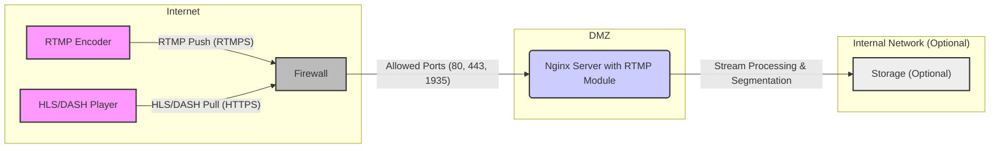
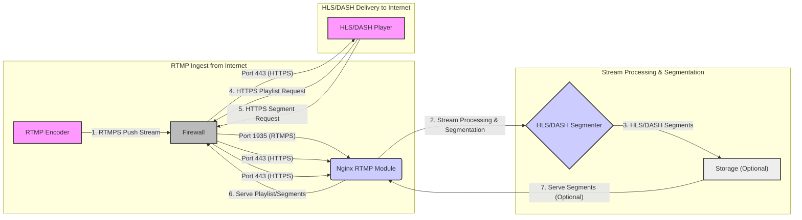

# Project Design Document: nginx-rtmp-module for Threat Modeling

**Document Version:** 1.1
**Date:** 2023-10-27
**Author:** AI Software Architect

## 1. Project Overview

This document outlines the design of a system incorporating the `nginx-rtmp-module` (https://github.com/arut/nginx-rtmp-module). This module extends the capabilities of the popular Nginx web server to act as a media streaming server, supporting Real-Time Messaging Protocol (RTMP) ingest and HTTP Live Streaming (HLS) and Dynamic Adaptive Streaming over HTTP (DASH) delivery.

This document is specifically created to facilitate threat modeling activities. It provides a detailed description of the system architecture, components, data flow, and technology stack, highlighting areas relevant for security considerations. This will enable security professionals and developers to identify potential vulnerabilities and design appropriate security controls for a robust and secure streaming platform.

## 2. System Architecture Diagram

This diagram provides a high-level overview of the system architecture, illustrating the key components and their interactions within a typical network context.

**Diagram Components:**

*   **"RTMP Encoder"**: Represents any software or hardware capable of encoding live video and audio and pushing it as an RTMP stream over the internet. Examples include OBS Studio, FFmpeg, hardware encoders.  **Note:** RTMPS (RTMP over TLS/SSL) is recommended for secure transmission.
*   **"HLS/DASH Player"**: Represents clients (web browsers, mobile apps, media players) on the internet that request and play the HLS or DASH streams served by the Nginx server over HTTPS.
*   **"Firewall"**: Represents a network firewall protecting the Nginx server, typically placed in a DMZ (Demilitarized Zone). It controls network traffic, allowing only necessary ports (e.g., 80, 443, 1935) to reach the Nginx server.
*   **"Nginx Server with RTMP Module"**:  The core component, an Nginx web server with the `nginx-rtmp-module` installed and configured, residing in the DMZ. This server handles RTMP ingest, stream processing, and HLS/DASH segment generation and delivery.
*   **"Storage (Optional)"**:  Represents persistent storage (like disk or cloud storage) within the internal network (or DMZ depending on security requirements) where the Nginx server can optionally record the incoming RTMP streams or store HLS/DASH segments for caching or later playback.

## 3. Component Description

This section provides a detailed description of each component identified in the architecture diagram, focusing on their functionality and security-relevant aspects.

### 3.1. RTMP Encoder

*   **Functionality:**
    *   Encodes live audio and video sources into a compatible format (e.g., H.264 video, AAC audio).
    *   Encapsulates the encoded data into the RTMP protocol.
    *   Establishes an RTMP connection with the Nginx server and pushes the stream to a designated application and stream name.
    *   May support authentication mechanisms (username/password, stream keys) for stream publishing, depending on encoder capabilities and server configuration.
    *   May support RTMPS for encrypted communication.
*   **Security Considerations:**
    *   **Source of Compromise:** A compromised encoder could inject malicious content into the stream, leading to content injection attacks or distribution of malware.
    *   **Authentication:**
        *   **Weak Credentials:**  If authentication is used, weak or default credentials can be easily compromised, allowing unauthorized stream publishing.
        *   **Credential Management:** Insecure storage or transmission of credentials can lead to exposure.
    *   **Protocol Security:**
        *   **RTMP Insecurity:** RTMP itself transmits data in plaintext and is vulnerable to eavesdropping and manipulation.
        *   **RTMPS Recommendation:**  RTMPS (RTMP over TLS/SSL) should be mandatory for secure transmission, especially over untrusted networks like the internet, to ensure confidentiality and integrity.
    *   **Network Security:** The network connection from the encoder to the Nginx server should be secured. Consider VPNs or other network security measures if transmitting over public networks without RTMPS.
    *   **Input Validation (from source):** While primarily the encoder's responsibility, the server should be resilient to malformed or unexpected data within the RTMP stream to prevent crashes or unexpected behavior.

### 3.2. Nginx Server with RTMP Module

*   **Functionality:**
    *   **RTMP Ingest:** Listens for incoming RTMP connections on a configured port (typically 1935), potentially supporting both RTMP and RTMPS.
    *   **Connection Handling:** Manages RTMP connections, including handshakes, stream negotiation, and session management.
    *   **Stream Processing:**  Processes the incoming RTMP stream based on Nginx configuration, potentially applying configurations like:
        *   **Application and Stream Name Routing:** Directing streams based on application and stream names in the RTMP URL for organizational purposes and access control.
        *   **Stream Recording:**  Saving the incoming stream to storage (using `record` directive) for archiving or on-demand playback.
        *   **Static Publishing:**  Serving pre-recorded files as live streams, useful for scheduled content or fallback scenarios.
        *   **Live Streaming to HLS/DASH:**  Segmenting the live stream in real-time into HLS and DASH formats for wider client compatibility.
        *   **Authentication and Authorization:**  Enforcing access control for publishing (using `on_publish`, `allow publish`, `deny publish`) and playback (using `on_play`, `allow play`, `deny play`) based on various criteria (IP address, credentials, etc.).
        *   **GOP Caching:**  Caching Group of Pictures (GOPs) for efficient playback and reduced latency for viewers joining mid-stream.
        *   **Transcoding (with external modules):** While `nginx-rtmp-module` itself doesn't transcode, it can be integrated with external modules or services for transcoding streams to different resolutions and bitrates.
    *   **HLS/DASH Delivery:** Serves HLS playlists (`.m3u8`) and media segments (`.ts`) and DASH manifests (`.mpd`) and segments to clients over HTTP/HTTPS.
    *   **Nginx Core Functionality:** Benefits from all standard Nginx features, including:
        *   **HTTP/HTTPS Serving:**  Serving HLS/DASH content over standard web protocols, with HTTPS being crucial for security.
        *   **Load Balancing:**  Can be used behind a load balancer to distribute traffic across multiple Nginx-RTMP servers for scalability and high availability.
        *   **Caching:**  Nginx caching mechanisms (proxy cache, fastcgi cache, etc.) can be used to cache HLS/DASH segments, reducing server load and improving delivery speed.
        *   **Logging:**  Access logs, error logs, and RTMP-specific logs for monitoring, security auditing, and troubleshooting.
*   **Security Considerations:**
    *   **Nginx Core Security:**  Inherits all security considerations of the Nginx web server itself.
        *   **Regular Updates:** Keep Nginx up-to-date with security patches to address known vulnerabilities.
        *   **Secure Configuration:** Follow Nginx security best practices for configuration.
        *   **Vulnerability Management:** Regularly scan for and remediate Nginx vulnerabilities.
    *   **RTMP Module Vulnerabilities:**
        *   **Module Updates:** Regularly check for updates and security advisories specifically for the `nginx-rtmp-module`.
        *   **Code Review (if possible):** If deploying in highly sensitive environments, consider code review of the module or using well-vetted forks.
    *   **Configuration Security (nginx.conf):** Misconfigurations can introduce significant vulnerabilities.
        *   **Authentication Bypass:** Weak or missing authentication for publishing and playback.
        *   **Directory Traversal:** Incorrectly configured `alias` or `root` directives exposing sensitive files outside the intended webroot.
        *   **Information Disclosure:** Verbose error messages revealing internal server details, exposed server signature.
        *   **Denial of Service (DoS):**
            *   **Resource Exhaustion:** Misconfigured limits or lack of rate limiting leading to CPU, memory, or bandwidth exhaustion.
            *   **Connection Flooding:**  Lack of connection limits allowing attackers to overwhelm the server with connection requests.
        *   **Insecure Defaults:**  Avoid using default configurations without reviewing and hardening them.
    *   **Input Validation (RTMP):**
        *   **Protocol Parsing Vulnerabilities:** Ensure robust parsing of RTMP data to prevent buffer overflows, format string bugs, or other protocol-level vulnerabilities.
        *   **Malicious Stream Data:**  Sanitize or validate data within the RTMP stream to prevent injection attacks or unexpected behavior.
    *   **Access Control:**
        *   **Granular Access Control:** Implement fine-grained access control using `allow`, `deny`, `on_publish`, and `on_play` directives to restrict publishing and playback based on IP addresses, authentication, or other criteria.
        *   **Principle of Least Privilege:** Grant only necessary access rights to publishers and viewers.
    *   **Protocol Security (HLS/DASH):**
        *   **HTTPS Enforcement:**  Mandatory HTTPS for serving HLS/DASH to protect confidentiality and integrity of streamed content, especially sensitive content.
        *   **HSTS (HTTP Strict Transport Security):** Enable HSTS to force clients to always use HTTPS.
    *   **Dependency Security:**
        *   **OS and Library Updates:** Ensure the underlying operating system and all libraries used by Nginx and the RTMP module are up-to-date and free from known vulnerabilities.
        *   **Dependency Scanning:** Regularly scan for vulnerabilities in dependencies.
    *   **Resource Management:**
        *   **Connection Limits:** Configure appropriate connection limits to prevent connection flooding DoS attacks.
        *   **Rate Limiting:** Implement rate limiting for requests to HLS/DASH playlists and segments to mitigate DoS attempts.
        *   **Resource Quotas:** Set resource quotas (CPU, memory) for the Nginx process to prevent resource exhaustion from impacting the entire system.
    *   **Web Application Firewall (WAF):** Consider deploying a WAF in front of the Nginx server to provide an additional layer of security against web-based attacks targeting HLS/DASH delivery.

### 3.3. Storage (Optional)

*   **Functionality:**
    *   **Stream Recording:**  Persistently stores incoming RTMP streams as files (e.g., FLV, MP4) based on the `record` directive in the Nginx configuration, allowing for archiving, video-on-demand, or compliance purposes.
    *   **HLS/DASH Segment Storage:**  Can be used to store generated HLS/DASH segments for caching, CDN integration, or serving pre-segmented content, improving performance and scalability.
*   **Security Considerations:**
    *   **Access Control:**
        *   **Storage Permissions:**  Restrict access to the storage location using appropriate file system permissions or cloud storage access policies to prevent unauthorized access, modification, or deletion of recorded streams or segments.
        *   **Authentication for Storage Access:** If using network-based storage, ensure strong authentication and authorization mechanisms are in place.
    *   **Storage Security:**
        *   **Physical Security:** If using local storage, ensure physical security of the server and storage media.
        *   **Encryption at Rest:**  For sensitive streamed content, consider encryption at rest for recorded streams and segments to protect confidentiality in case of storage breach.
    *   **Data Integrity:**
        *   **Checksums/Integrity Checks:**  Implement mechanisms like checksums or integrity checks to detect data corruption or unauthorized modification of recorded streams and segments.
        *   **Storage Redundancy:** Use RAID or other redundancy mechanisms to protect against data loss due to hardware failures.
    *   **Data Confidentiality:**
        *   **Encryption in Transit (to storage):** If storing data remotely, ensure secure transfer protocols (e.g., HTTPS, SFTP) are used.
        *   **Data Retention Policy:** Implement a clear data retention policy and secure deletion mechanisms to manage storage space and comply with data privacy regulations.

### 3.4. HLS/DASH Player

*   **Functionality:**
    *   Requests HLS playlists (`.m3u8`) or DASH manifests (`.mpd`) from the Nginx server over HTTP/HTTPS.
    *   Parses the playlist/manifest to discover available media segments, resolutions, and bitrates.
    *   Requests and downloads media segments (`.ts` for HLS, segments for DASH) over HTTP/HTTPS, typically in a segmented and adaptive bitrate manner.
    *   Decodes and plays the audio and video content, handling buffering, adaptive bitrate switching, and playback controls.
*   **Security Considerations:**
    *   **Player Vulnerabilities:**
        *   **Software Updates:** Vulnerabilities in the player software itself could be exploited if it processes malicious or crafted HLS/DASH content. Keep player software and libraries up-to-date.
        *   **Input Validation (Playlist/Segments):** Players should properly validate and sanitize playlist and segment data to prevent vulnerabilities like buffer overflows or script injection.
    *   **Protocol Security (HTTPS):**
        *   **HTTPS Requirement:** Players should ideally only access HLS/DASH streams over HTTPS to ensure secure communication and prevent man-in-the-middle attacks, especially on public networks.
        *   **Mixed Content Issues:** Ensure web players do not load insecure (HTTP) resources when accessing HTTPS streams, to avoid mixed content warnings and security risks.
    *   **Content Security (DRM):**
        *   **DRM Implementation:** For protecting premium content, Digital Rights Management (DRM) technologies might be implemented in the player and potentially integrated with backend licensing servers (though `nginx-rtmp-module` itself doesn't directly handle DRM).
        *   **DRM Bypass Vulnerabilities:**  Players implementing DRM can be targets for DRM bypass vulnerabilities.
    *   **Client-Side Security (Web Players):**
        *   **Cross-Site Scripting (XSS):** If the player is a web-based player, ensure it is protected against XSS vulnerabilities, especially if it handles user-supplied data or interacts with other web components.
        *   **Client-Side Data Storage:** If the player stores user data (e.g., playback history, preferences), ensure secure storage mechanisms are used (e.g., browser local storage with appropriate security measures).
    *   **Playback Authorization:**  While server-side authorization is primary, players might need to handle tokens or session IDs for authorized playback, requiring secure handling of these credentials.

## 4. Data Flow Diagram

This diagram illustrates the flow of data through the system, highlighting the different stages, protocols, and security components involved.

**Data Flow Steps:**

1.  **RTMPS Push Stream:** The RTMP Encoder pushes the encoded media stream to the Firewall over RTMPS (RTMP over TLS/SSL) for secure transmission.
2.  **Stream Processing & Segmentation:** The Nginx RTMP Module, after passing through the Firewall, processes the incoming stream. This includes demuxing, and segmenting the stream into HLS and DASH compatible segments.
3.  **HLS/DASH Segments:** The generated HLS/DASH segments are created and potentially stored.
4.  **HTTPS Playlist Request:** The HLS/DASH Player requests the HLS playlist (`.m3u8`) or DASH manifest (`.mpd`) from the Firewall over HTTPS. The Firewall forwards the request to the Nginx server.
5.  **HTTPS Segment Request:** The player, based on the playlist/manifest, requests individual media segments (`.ts` for HLS, segments for DASH) from the Firewall over HTTPS. The Firewall forwards the request to the Nginx server.
6.  **Serve Playlist/Segments:** The Nginx server serves the requested playlist/manifest and media segments back through the Firewall to the player over HTTPS.
7.  **Serve Segments (Optional):** If storage is used, the Nginx server might retrieve segments from storage to serve to the player, potentially for caching or pre-recorded content, still served through the Firewall over HTTPS.

## 5. Technology Stack

*   **Web Server:** Nginx (version should be specified in deployment documentation, ideally latest stable version)
*   **Nginx Module:** `nginx-rtmp-module` (version should be specified in deployment documentation, ideally latest stable version or a well-vetted fork)
*   **Operating System:** Linux-based distribution (e.g., Ubuntu, CentOS, Debian - specific distribution and version should be documented and regularly updated)
*   **Protocols:**
    *   RTMP/RTMPS (Real-Time Messaging Protocol, Secure RTMP) - for secure stream ingest (RTMPS recommended)
    *   HLS (HTTP Live Streaming) - for stream delivery
    *   DASH (Dynamic Adaptive Streaming over HTTP) - for stream delivery
    *   HTTP/HTTPS - for HLS/DASH delivery and management (HTTPS mandatory for production)
*   **Programming Languages:**
    *   C (Nginx core and `nginx-rtmp-module` are written in C)
    *   Nginx configuration language
*   **Optional Components:**
    *   Storage (File system, Network Attached Storage (NAS), Cloud Storage - e.g., AWS S3, Google Cloud Storage, Azure Blob Storage)
    *   Load Balancer (e.g., Nginx Load Balancer, HAProxy) - for distributing load and improving availability
    *   CDN (Content Delivery Network) (e.g., Cloudflare, Akamai, AWS CloudFront) - for geographically distributed content delivery and improved scalability
    *   Monitoring Tools (e.g., Prometheus, Grafana, Zabbix) - for server and application monitoring
    *   Security Tools (e.g., Fail2ban, WAF, Intrusion Detection/Prevention Systems (IDS/IPS)) - for enhancing security posture

## 6. Security Considerations (General)

*   **Principle of Least Privilege:** Apply the principle of least privilege to all components, user accounts, and configurations. Grant only the minimum necessary permissions required for each function.
*   **Regular Security Updates and Patch Management:** Implement a robust patch management process to keep all software components (Nginx, `nginx-rtmp-module`, operating system, libraries, monitoring tools, security tools) up-to-date with the latest security patches. Automate patching where possible.
*   **Secure Configuration Management:** Implement secure configuration management practices for Nginx and the RTMP module. Use infrastructure-as-code (IaC) tools for consistent and auditable configurations. Regularly review and audit configurations for security misconfigurations.
*   **Input Validation and Sanitization:**  Validate and sanitize all inputs, especially from external sources (RTMP encoders, HLS/DASH players, user interfaces). Prevent injection attacks by properly handling user-supplied data.
*   **Strong Authentication and Authorization:** Implement strong authentication and authorization mechanisms for stream publishing and playback. Use strong passwords, multi-factor authentication where applicable, and role-based access control (RBAC).
*   **Network Security:**  Implement robust network security measures:
    *   **Firewall:** Use firewalls to segment networks, control traffic flow, and restrict access to the Nginx server to only necessary ports and services.
    *   **Intrusion Detection/Prevention Systems (IDS/IPS):** Deploy IDS/IPS to detect and prevent malicious network activity.
    *   **Network Segmentation:** Isolate the Nginx server in a DMZ.
*   **Monitoring and Logging:** Implement comprehensive monitoring and logging:
    *   **Security Information and Event Management (SIEM):** Centralize logs and use a SIEM system for security monitoring, alerting, and incident response.
    *   **Real-time Monitoring:** Monitor system performance, resource utilization, and security events in real-time.
    *   **Log Retention:**  Establish appropriate log retention policies for security auditing and incident investigation.
*   **Incident Response Plan:**  Develop and maintain a comprehensive incident response plan to handle security breaches or vulnerabilities. Regularly test and update the plan.
*   **Secure Communication:**  Enforce HTTPS for HLS/DASH delivery and mandate RTMPS for RTMP ingest, especially over untrusted networks. Use TLS 1.3 or later versions.
*   **Security Audits and Penetration Testing:** Conduct regular security audits and penetration testing to identify vulnerabilities and weaknesses in the system. Remediate findings promptly.

## 7. Threat Modeling Focus Areas

Based on the design and component descriptions, the following areas should be prioritized during threat modeling, using methodologies like STRIDE or PASTA:

*   **RTMP Ingest Point Security:**
    *   **Unauthorized Stream Publishing (Spoofing):** Focus on authentication and authorization mechanisms for RTMP publishing to prevent unauthorized users from publishing streams or hijacking legitimate streams.
    *   **Malicious Stream Injection (Tampering, Information Disclosure):**  Consider threats related to injecting malicious content (malware, misleading information) or malformed data through the RTMP stream, potentially exploiting server-side vulnerabilities or impacting viewers.
    *   **Denial of Service (DoS) via RTMP (Denial of Service):**  Analyze potential DoS attacks targeting the RTMP ingest endpoint, such as connection flooding, resource exhaustion attacks, or exploiting protocol weaknesses.
*   **Nginx RTMP Module Processing Security:**
    *   **Nginx Configuration Vulnerabilities (Configuration):**  Investigate potential misconfigurations in Nginx that could lead to security issues, such as directory traversal, information disclosure, or bypass of access controls.
    *   **RTMP Module Configuration Vulnerabilities (Configuration):** Analyze potential misconfigurations specific to the `nginx-rtmp-module` that could expose vulnerabilities or weaken security.
    *   **Vulnerabilities in the RTMP Module Code (Vulnerability):**  Investigate known vulnerabilities or potential coding flaws in the `nginx-rtmp-module` itself, including buffer overflows, injection vulnerabilities, or logic errors.
    *   **Resource Exhaustion during Processing (Denial of Service):**  Assess the risk of resource exhaustion (CPU, memory, bandwidth) due to excessive stream processing, poorly optimized configurations, or malicious stream inputs.
*   **HLS/DASH Delivery Security:**
    *   **Unauthorized Access to Content (Authorization Bypass):**  Focus on access control for HLS/DASH streams to prevent unauthorized viewers from accessing content they are not permitted to see.
    *   **Man-in-the-Middle Attacks (Information Disclosure, Tampering):**  Ensure HLS/DASH is delivered exclusively over HTTPS to prevent interception and modification of content in transit, protecting confidentiality and integrity.
    *   **Content Spoofing/Tampering (Tampering):**  Consider threats related to attackers tampering with HLS/DASH playlists or segments to inject malicious content, redirect viewers, or disrupt playback.
    *   **Denial of Service (DoS) via HLS/DASH Requests (Denial of Service):**  Analyze potential DoS attacks targeting the HLS/DASH delivery endpoints, such as request flooding, playlist manipulation attacks, or segment download attacks.
*   **Storage Security (if used) (Confidentiality, Integrity, Availability):**
    *   **Unauthorized Access to Recorded Streams (Authorization Bypass, Confidentiality):**  Focus on access control to the storage location to prevent unauthorized access to recorded streams, protecting sensitive content.
    *   **Data Breach of Recorded Content (Confidentiality):**  Consider the confidentiality of recorded streams and potential data breaches from storage media, requiring encryption at rest for sensitive content.
    *   **Data Integrity of Recorded Streams (Integrity):**  Assess the risk of data corruption or unauthorized modification of recorded streams, ensuring the integrity and authenticity of archived content.
    *   **Storage Availability (Denial of Service):**  Consider threats to storage availability, such as storage failures or attacks targeting storage infrastructure, which could impact recording and playback capabilities.

This improved document provides a more comprehensive and security-focused design overview for a system using `nginx-rtmp-module`. By thoroughly addressing these threat modeling focus areas, security teams can proactively identify and mitigate potential risks, building a more secure and resilient live streaming platform.