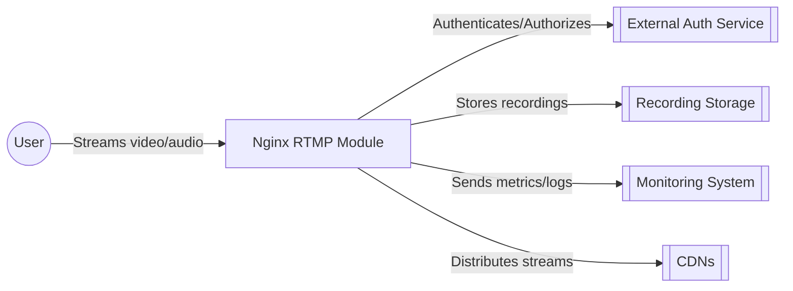
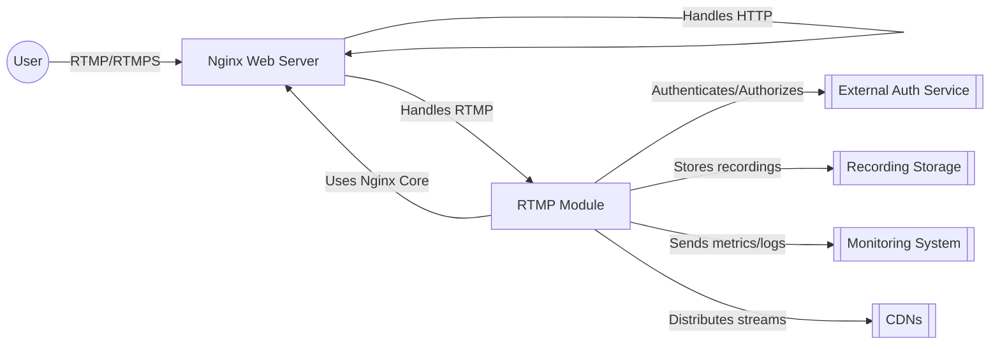
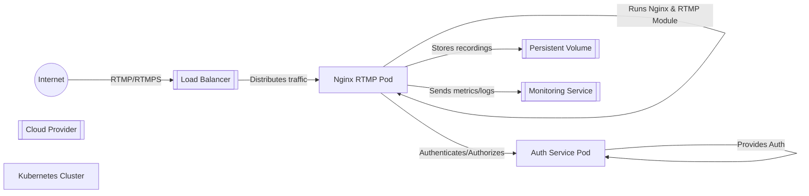
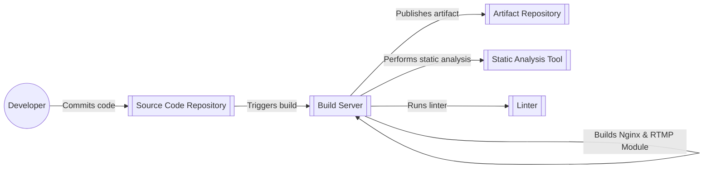

Okay, let's create a design document for the `nginx-rtmp-module` project, focusing on aspects relevant to threat modeling.

# BUSINESS POSTURE

Business Priorities and Goals:

The primary goal of the `nginx-rtmp-module` is to extend Nginx, a widely-used web server, to handle real-time media streaming via the RTMP protocol. This enables users to set up their own streaming servers for live video and audio, potentially reducing reliance on third-party streaming platforms.  Key business priorities likely include:

*   Reliability: The module must provide stable and consistent streaming capabilities. Downtime or stream interruptions directly impact user experience.
*   Performance:  The module should handle a large number of concurrent streams and viewers with minimal latency.  Performance bottlenecks can lead to buffering and poor user experience.
*   Scalability: The architecture should allow for scaling the streaming infrastructure to accommodate growing audiences and increased demand.
*   Cost-Effectiveness:  Leveraging Nginx, an open-source web server, suggests a focus on cost-effective solutions compared to proprietary streaming server software.
*   Ease of Use and Configuration: While not explicitly stated, ease of configuration and management is crucial for adoption. Complex setups can deter users.
*   Extensibility: The module design should be open for future extensions and features.

Most Important Business Risks:

*   Service Disruption:  Outages or instability in the streaming service leading to loss of viewers/users and potential reputational damage.
*   Performance Degradation:  Inability to handle peak loads, resulting in poor stream quality and user dissatisfaction.
*   Security Breaches:  Unauthorized access to streams, server compromise, or denial-of-service attacks disrupting the service.
*   Data Loss: Loss of recorded streams or configuration data.
*   High Operational Costs: Unexpectedly high infrastructure costs due to inefficient resource utilization.

# SECURITY POSTURE

Existing Security Controls:

*   security control: Access Control (Publish/Play): The module provides directives (`allow`, `deny`) to control which clients can publish and play streams based on IP addresses. Implemented in `ngx_rtmp_access_module.c`.
*   security control: Authentication: Basic on-connect authentication is supported using `on_connect` directive and external control applications. Implemented in `ngx_rtmp_notify_module.c`.
*   security control: Secure Link: The module supports RTMP "secure link" feature, which uses a shared secret to generate time-limited URLs, preventing unauthorized access. Implemented in `ngx_rtmp_core_module.c`.
*   security control: Referrer Validation: The `secure_link` feature can also validate the SWF player's URL (referrer), adding another layer of protection. Implemented in `ngx_rtmp_core_module.c`.
*   security control: Exec Module: The `exec` directive allows executing external programs on certain events (e.g., `publish`, `play`), which *could* be used for custom security checks, but this is inherently risky if not carefully managed. Implemented in `ngx_rtmp_exec_module.c`.
*   security control: Nginx Core Security: The module inherits the security features and best practices of the underlying Nginx web server, including its event-driven architecture, which is generally resistant to certain types of attacks.

Accepted Risks:

*   accepted risk: Limited Built-in Authentication: The built-in authentication mechanisms are relatively basic. More robust authentication (e.g., integration with external identity providers) requires custom development or external control applications.
*   accepted risk: Complexity of Configuration: Securely configuring the module, especially features like `exec` and external control applications, requires a good understanding of Nginx and the RTMP protocol. Misconfiguration can lead to vulnerabilities.
*   accepted risk: Reliance on External Applications: Security often depends on the security of external applications used for authentication, authorization, or other control functions.
*   accepted risk: RTMP Protocol Limitations: RTMP itself has some inherent security limitations, and the module's security is ultimately bound by the protocol's capabilities.
*   accepted risk: No built-in encryption: RTMP protocol itself doesn't provide encryption.

Recommended Security Controls:

*   security control: Implement RTMPS support: Add support for RTMPS (RTMP over TLS/SSL) to encrypt the communication between clients and the server, protecting against eavesdropping and man-in-the-middle attacks.
*   security control: Enhanced Authentication: Integrate with more robust authentication systems, such as OAuth 2.0 or OpenID Connect, to provide stronger user authentication and authorization.
*   security control: Input Validation: Thoroughly validate all input received from clients, including stream names, URLs, and any other parameters, to prevent injection attacks.
*   security control: Rate Limiting: Implement rate limiting to mitigate denial-of-service attacks by limiting the number of connections or requests from a single IP address or user.
*   security control: Auditing and Logging: Implement comprehensive logging of all relevant events, including connection attempts, authentication successes/failures, and any errors, to facilitate security monitoring and incident response.
*   security control: Regular Security Audits and Penetration Testing: Conduct regular security audits and penetration testing to identify and address potential vulnerabilities.

Security Requirements:

*   Authentication:
    *   Support for strong authentication mechanisms (e.g., OAuth 2.0, OpenID Connect).
    *   Protection against brute-force attacks on authentication endpoints.
    *   Secure storage of user credentials (if applicable).

*   Authorization:
    *   Fine-grained access control to streams (publish and play).
    *   Ability to restrict access based on user roles or attributes.
    *   Integration with external authorization services.

*   Input Validation:
    *   Strict validation of all client-supplied data.
    *   Prevention of injection attacks (e.g., command injection, path traversal).

*   Cryptography:
    *   Support for RTMPS to encrypt communication.
    *   Secure generation and management of cryptographic keys (for secure link and RTMPS).

# DESIGN

## C4 CONTEXT

C4 Context Element List:

*   Element: User
    *   Name: User
    *   Type: Person
    *   Description: Represents a user who either publishes a stream to the server or watches a stream from the server.
    *   Responsibilities: Initiates streaming sessions, interacts with the streaming server.
    *   Security Controls: Authentication and authorization mechanisms provided by the External Auth Service and enforced by the Nginx RTMP Module.

*   Element: Nginx RTMP Module
    *   Name: Nginx RTMP Module
    *   Type: Software System
    *   Description: The core system, an extension to Nginx, that handles RTMP streaming.
    *   Responsibilities: Receives and processes RTMP streams, manages connections, enforces access control, interacts with external services.
    *   Security Controls: Access control (publish/play), secure link, referrer validation, and integration with external authentication/authorization services.

*   Element: External Auth Service
    *   Name: External Auth Service
    *   Type: Software System
    *   Description: An external service (optional) used for authentication and authorization. This could be a custom application or a standard identity provider.
    *   Responsibilities: Authenticates users, provides authorization information.
    *   Security Controls: Depends on the specific implementation (e.g., OAuth 2.0, OpenID Connect, custom authentication).

*   Element: Recording Storage
    *   Name: Recording Storage
    *   Type: Software System
    *   Description: Storage location for recorded streams. This could be local disk storage, a network file system, or cloud storage.
    *   Responsibilities: Stores and retrieves recorded streams.
    *   Security Controls: Access control to the storage location, encryption of stored data (if applicable).

*   Element: Monitoring System
    *   Name: Monitoring System
    *   Type: Software System
    *   Description: A system for monitoring the performance and health of the Nginx RTMP Module.
    *   Responsibilities: Collects metrics and logs, provides alerts for issues.
    *   Security Controls: Secure communication with the Nginx RTMP Module, access control to monitoring data.

*   Element: CDNs
    *   Name: CDNs
    *   Type: Software System
    *   Description: Content Delivery Networks used to distribute streams to a wider audience with lower latency.
    *   Responsibilities: Cache and deliver streams to users.
    *   Security Controls: Depends on the specific CDN provider.

## C4 CONTAINER

C4 Container Element List:

*   Element: User
    *   Name: User
    *   Type: Person
    *   Description: Represents a user who either publishes a stream to the server or watches a stream from the server.
    *   Responsibilities: Initiates streaming sessions, interacts with the streaming server.
    *   Security Controls: Authentication and authorization mechanisms provided by the External Auth Service and enforced by the RTMP Module.

*   Element: Nginx Web Server
    *   Name: Nginx Web Server
    *   Type: Container (Web Server)
    *   Description: The core Nginx web server, which hosts the RTMP module.
    *   Responsibilities: Handles HTTP requests, manages connections, loads and interacts with the RTMP module.
    *   Security Controls: Nginx's built-in security features, configuration hardening, and security modules.

*   Element: RTMP Module
    *   Name: RTMP Module
    *   Type: Container (Nginx Module)
    *   Description: The `nginx-rtmp-module` itself, which extends Nginx to handle RTMP streaming.
    *   Responsibilities: Processes RTMP streams, manages connections, enforces access control, interacts with external services.
    *   Security Controls: Access control (publish/play), secure link, referrer validation, and integration with external authentication/authorization services.

*   Element: External Auth Service
    *   Name: External Auth Service
    *   Type: Container (Application/Service)
    *   Description: An external service (optional) used for authentication and authorization.
    *   Responsibilities: Authenticates users, provides authorization information.
    *   Security Controls: Depends on the specific implementation (e.g., OAuth 2.0, OpenID Connect, custom authentication).

*   Element: Recording Storage
    *   Name: Recording Storage
    *   Type: Container (Storage)
    *   Description: Storage location for recorded streams.
    *   Responsibilities: Stores and retrieves recorded streams.
    *   Security Controls: Access control to the storage location, encryption of stored data (if applicable).

*   Element: Monitoring System
    *   Name: Monitoring System
    *   Type: Container (Application/Service)
    *   Description: A system for monitoring the performance and health of the RTMP Module.
    *   Responsibilities: Collects metrics and logs, provides alerts for issues.
    *   Security Controls: Secure communication with the RTMP Module, access control to monitoring data.

*   Element: CDNs
    *   Name: CDNs
    *   Type: Container (External Service)
    *   Description: Content Delivery Networks used to distribute streams.
    *   Responsibilities: Cache and deliver streams to users.
    *   Security Controls: Depends on CDN provider.

## DEPLOYMENT

Possible Deployment Solutions:

1.  Single Server Deployment: Nginx and the RTMP module are installed on a single server.  This is the simplest option, suitable for small-scale deployments or testing.
2.  Multi-Server Deployment: Multiple servers run Nginx and the RTMP module, potentially with a load balancer in front. This provides higher capacity and redundancy.
3.  Cloud-Based Deployment:  Deploying on cloud platforms like AWS, Azure, or GCP, using virtual machines or container services (e.g., Kubernetes). This offers scalability and flexibility.
4.  Hybrid Deployment: A combination of on-premise and cloud-based servers.

Chosen Solution (for detailed description): Cloud-Based Deployment using Kubernetes

Deployment Element List:

*   Element: Internet
    *   Name: Internet
    *   Type: External
    *   Description: The public internet.
    *   Responsibilities:  Source of client connections.
    *   Security Controls:  Firewall, DDoS protection (provided by the cloud provider).

*   Element: Cloud Provider
    *   Name: Cloud Provider
    *   Type: Infrastructure
    *   Description:  The cloud platform (e.g., AWS, Azure, GCP).
    *   Responsibilities: Provides the underlying infrastructure (compute, networking, storage).
    *   Security Controls: Cloud provider's security features (e.g., VPC, security groups, IAM).

*   Element: Kubernetes Cluster
    *   Name: Kubernetes Cluster
    *   Type: Infrastructure
    *   Description:  A Kubernetes cluster for managing containerized applications.
    *   Responsibilities: Orchestrates and manages the deployment of the Nginx RTMP module and related services.
    *   Security Controls: Kubernetes RBAC, network policies, pod security policies.

*   Element: Load Balancer
    *   Name: Load Balancer
    *   Type: Infrastructure
    *   Description: A load balancer that distributes incoming traffic across multiple Nginx RTMP pods.
    *   Responsibilities: Distributes traffic, provides high availability.
    *   Security Controls:  SSL termination (if using RTMPS), access control lists.

*   Element: Nginx RTMP Pod
    *   Name: Nginx RTMP Pod
    *   Type: Container Instance
    *   Description: A Kubernetes pod running Nginx and the RTMP module.
    *   Responsibilities: Handles RTMP streaming.
    *   Security Controls:  Container security best practices, network policies, resource limits.

*   Element: Auth Service Pod
    *   Name: Auth Service Pod
    *   Type: Container Instance
    *   Description: A Kubernetes pod running the external authentication/authorization service.
    *   Responsibilities: Provides authentication and authorization services.
    *   Security Controls:  Depends on the specific implementation.

*   Element: Persistent Volume
    *   Name: Persistent Volume
    *   Type: Storage
    *   Description:  Persistent storage for recorded streams.
    *   Responsibilities: Stores recorded streams.
    *   Security Controls:  Access control to the persistent volume, encryption at rest (if applicable).

*   Element: Monitoring Service
    *   Name: Monitoring Service
    *   Type: Application/Service
    *   Description: A service for monitoring the performance and health of the deployment.
    *   Responsibilities: Collects metrics and logs, provides alerts.
    *   Security Controls: Secure communication with the pods, access control to monitoring data.

## BUILD

Build Process Description:

1.  Developer commits code changes to the Source Code Repository (e.g., GitHub).
2.  The commit triggers a build process on the Build Server (e.g., Jenkins, GitHub Actions).
3.  The Build Server checks out the code from the repository.
4.  The Build Server runs automated tests (unit tests, integration tests).
5.  The Build Server performs static analysis using a Static Analysis Tool (e.g., SonarQube) to identify potential security vulnerabilities and code quality issues.
6.  The Build Server runs a Linter to enforce coding style and best practices.
7.  The Build Server compiles Nginx and the RTMP module, creating the necessary binaries and configuration files.
8.  The Build Server packages the build artifacts (e.g., a Docker image or a tarball).
9.  The Build Server publishes the artifact to an Artifact Repository (e.g., Docker Hub, a private registry).

Security Controls in Build Process:

*   security control: Source Code Management: Using a version control system (e.g., Git) with proper access controls and branching strategies.
*   security control: Automated Build: Using a CI/CD system to automate the build process, ensuring consistency and repeatability.
*   security control: Static Analysis: Employing static analysis tools to identify potential vulnerabilities early in the development lifecycle.
*   security control: Dependency Management: Managing dependencies securely, using tools to scan for known vulnerabilities in third-party libraries.
*   security control: Artifact Signing: Signing build artifacts to ensure their integrity and authenticity.
*   security control: Secure Build Environment: Ensuring the build server itself is secure and protected from unauthorized access.

# RISK ASSESSMENT

Critical Business Processes:

*   Live Stream Delivery: The core process of delivering live video and audio streams to viewers.
*   Stream Recording: The process of recording streams for later playback or archival.
*   User Authentication and Authorization: Managing user access to streams and server resources.

Data to Protect and Sensitivity:

*   Stream Content: The actual video and audio data being streamed. Sensitivity depends on the content (e.g., public broadcast vs. private event).
*   User Credentials: Usernames, passwords, or other authentication tokens. High sensitivity.
*   Stream Metadata: Information about streams, such as titles, descriptions, and schedules. Moderate sensitivity.
*   Configuration Data: Server configuration files, including access control settings and secrets. High sensitivity.
*   Access Logs: Logs of user activity, including IP addresses and timestamps. Moderate to high sensitivity, depending on privacy regulations.

# QUESTIONS & ASSUMPTIONS

Questions:

*   What are the specific performance requirements (e.g., number of concurrent streams, expected latency)?
*   What are the target deployment environments (e.g., specific cloud providers, on-premise infrastructure)?
*   What are the existing security policies and compliance requirements (e.g., GDPR, CCPA)?
*   What is the budget for security tools and infrastructure?
*   What level of user experience is required for configuration and management?
*   Are there any plans for future features or integrations?
*   What external authentication/authorization services are currently in use or planned?
*   What are the requirements for stream recording (e.g., storage capacity, retention period)?
*   What are the monitoring and alerting requirements?

Assumptions:

*   BUSINESS POSTURE: Assumes a focus on cost-effectiveness and scalability, given the use of open-source software.
*   BUSINESS POSTURE: Assumes a moderate risk appetite, balancing the need for security with the desire for rapid development and deployment.
*   SECURITY POSTURE: Assumes that basic security practices are followed for the underlying Nginx web server.
*   SECURITY POSTURE: Assumes that external authentication/authorization services, if used, are properly secured.
*   DESIGN: Assumes a cloud-based deployment using Kubernetes, as it provides flexibility and scalability.
*   DESIGN: Assumes that a monitoring system is in place to track the health and performance of the deployment.
*   DESIGN: Assumes that recording storage will be handled separately, either by local disk, network storage, or cloud storage.
*   DESIGN: Assumes that build process will be automated using CI/CD system.