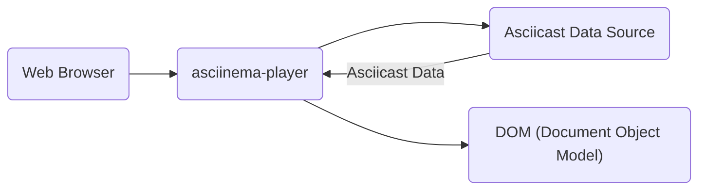
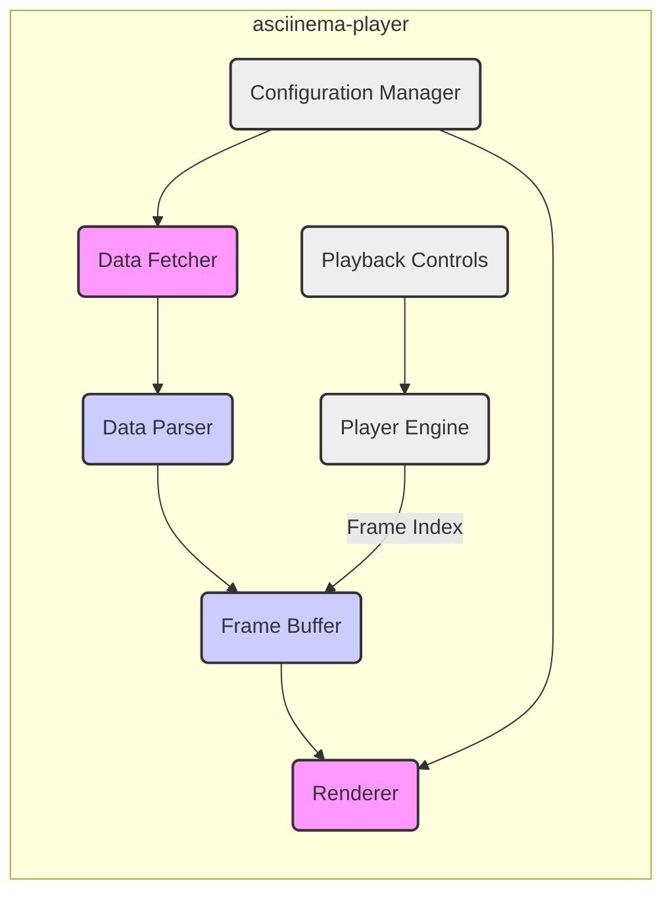
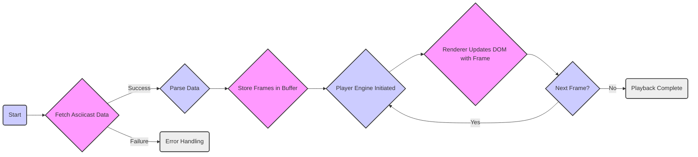

# Project Design Document: asciinema-player

**Version:** 1.1
**Date:** October 26, 2023
**Author:** Gemini (AI Language Model)

## 1. Introduction

This document provides a detailed design overview of the asciinema-player project, a JavaScript-based web player for asciicasts (recorded terminal sessions). This document aims to clearly articulate the architecture, components, and data flow of the player to facilitate future threat modeling activities. This revision incorporates feedback to improve clarity and formatting.

## 2. Goals and Objectives

The primary goals of this design document are:

*   To provide a comprehensive understanding of the asciinema-player's architecture and functionality.
*   To identify key components and their interactions.
*   To illustrate the data flow within the player.
*   To serve as a foundation for subsequent threat modeling exercises.
*   To document the design in a clear and accessible manner using valid markdown and mermaid syntax.

## 3. High-Level Architecture

The asciinema-player operates primarily within a web browser environment. It fetches asciicast data and renders it visually, simulating a terminal session.

*   **Web Browser:** The environment where the asciinema-player executes.
*   **asciinema-player:** The core JavaScript library responsible for fetching, parsing, and rendering asciicast data.
*   **Asciicast Data Source:**  The location from which the asciicast data is retrieved (e.g., a remote URL, embedded JSON).
*   **DOM (Document Object Model):** The player manipulates the browser's DOM to display the terminal output.

## 4. Detailed Architecture

The asciinema-player can be broken down into several key components:

*   **Data Fetcher:** Responsible for retrieving the asciicast data from the specified source (URL or embedded data).
*   **Data Parser:** Parses the fetched asciicast data (typically JSON) into a structured format that the player can understand.
*   **Frame Buffer:** Stores the parsed asciicast frames, representing the state of the terminal at different points in time.
*   **Renderer:**  Takes frames from the Frame Buffer and updates the DOM to visually represent the terminal output. This includes handling text, colors, and cursor positioning.
*   **Playback Controls:** User interface elements (e.g., play, pause, seek bar) that allow users to interact with the playback.
*   **Player Engine:** Manages the playback timing, frame progression, and synchronization based on user interactions and the timing information within the asciicast data.
*   **Configuration Manager:** Handles player settings and options, such as font, theme, and playback speed.

## 5. Data Flow

The flow of data within the asciinema-player can be visualized as follows:

1. The player starts by attempting to fetch the asciicast data.
2. If fetching is successful, the data is parsed into a structured format.
3. The parsed frames are stored in the Frame Buffer.
4. The Player Engine is initiated, controlling the playback.
5. The Renderer takes frames from the buffer and updates the DOM to display the terminal output.
6. The Player Engine determines if there are more frames to display.
7. This process continues until all frames have been rendered, or the user stops the playback.
8. Error handling is in place to manage issues during data fetching.

## 6. Components Description

This section provides a more detailed description of each component:

*   **Data Fetcher:**
    *   **Responsibility:** Retrieves asciicast data.
    *   **Details:** Makes HTTP requests (typically GET) to retrieve asciicast data from a URL. May handle different data formats or protocols in the future. Needs to handle potential network errors and timeouts.
*   **Data Parser:**
    *   **Responsibility:** Parses fetched asciicast data.
    *   **Details:** Specifically designed to parse the asciicast JSON format. Extracts timing information and terminal output for each frame. Needs to be robust against malformed or unexpected data.
*   **Frame Buffer:**
    *   **Responsibility:** Stores parsed asciicast frames.
    *   **Details:** An in-memory data structure (e.g., an array) to store the parsed frames. Allows for efficient access to frames based on their index or timestamp. May implement optimizations for memory usage with large asciicasts.
*   **Renderer:**
    *   **Responsibility:** Visually represents the terminal output.
    *   **Details:** The core component responsible for visually representing the terminal. Manipulates DOM elements (e.g., `
`, ``) to display text with appropriate formatting (colors, styles). Handles cursor positioning and visibility. May utilize a virtual DOM or similar techniques for performance optimization.
*   **Playback Controls:**
    *   **Responsibility:** Provides user interface for playback control.
    *   **Details:** Provides a user interface for controlling playback (play, pause, stop, seek). Interacts with the Player Engine to trigger actions. May include visual indicators of playback progress.
*   **Player Engine:**
    *   **Responsibility:** Manages playback timing and frame progression.
    *   **Details:** The central orchestrator of the playback process. Uses timing information from the asciicast data to advance through frames. Responds to user interactions from the Playback Controls. Manages the current playback state (playing, paused, stopped).
*   **Configuration Manager:**
    *   **Responsibility:** Handles player settings and options.
    *   **Details:** Allows users or developers to customize the player's appearance and behavior. Stores and retrieves configuration settings (e.g., from local storage or URL parameters). Applies configurations to other components (e.g., Renderer for theming).

## 7. Security Considerations (Preliminary)

While a full threat model will be developed separately, some initial security considerations include:

*   **Cross-Site Scripting (XSS):** If the asciicast data source is untrusted, malicious scripts could be injected into the rendered output. Input sanitization and output encoding are crucial.
*   **Data Injection:**  Maliciously crafted asciicast data could potentially exploit vulnerabilities in the parser or renderer.
*   **Content Security Policy (CSP):** Implementing a strong CSP can help mitigate XSS risks.
*   **Dependency Management:** Ensuring that third-party libraries used by the player are up-to-date and free of known vulnerabilities.
*   **Data Source Integrity:** Verifying the integrity and authenticity of the asciicast data source.

## 8. Dependencies

The asciinema-player likely depends on standard web technologies and potentially some third-party libraries.

| Dependency Type | Specific Technology/Library | Purpose                                                                 |
|-----------------|-----------------------------|-------------------------------------------------------------------------|
| Language        | JavaScript                  | Core programming language for the player.                               |
| Markup          | HTML                        | Structuring the player's user interface.                                |
| Styling         | CSS                         | Styling the player's appearance and layout.                             |
| Potential       | DOM Manipulation Libraries  | Simplifying DOM interactions (e.g., if not using vanilla JavaScript). |
| Potential       | Event Handling Libraries    | Managing user interactions and events.                                  |
| Potential       | UI Component Libraries      | Providing pre-built UI elements.                                        |

## 9. Deployment

The asciinema-player is typically deployed as a JavaScript library that can be embedded within other web pages. The deployment process involves:

*   Including the `asciinema-player.js` file (and potentially CSS) in the `<head>` or `<body>` of an HTML page.
*   Providing the URL or embedded data of the asciicast to be played, often through a `<script>` tag or JavaScript initialization.
*   Initializing the player on a designated HTML element, typically a `
` element.

## 10. Future Considerations

Potential future enhancements or changes that could impact the design include:

*   Support for different asciicast formats or versions.
*   Advanced rendering features (e.g., ligatures, custom fonts).
*   Improved performance optimizations for large asciicasts, potentially using techniques like Web Workers.
*   Accessibility improvements, adhering to WCAG guidelines.
*   Integration with other web frameworks or libraries (e.g., React, Vue, Angular) through wrappers or components.

This document provides a solid foundation for understanding the architecture and components of the asciinema-player, which will be invaluable for conducting a thorough threat model.