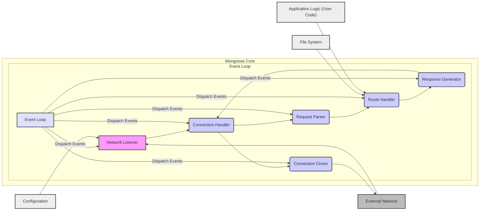
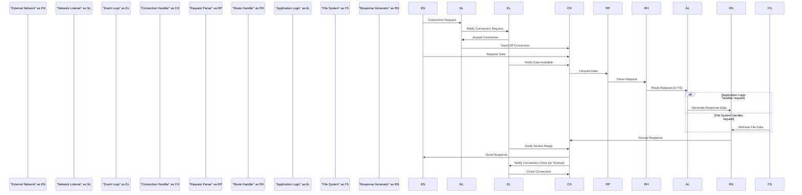

# Project Design Document: Mongoose Embedded Web Server Library

**Version:** 1.1
**Date:** October 26, 2023
**Prepared By:** Gemini (AI Language Model)

## 1. Introduction

This document provides an enhanced and more detailed design overview of the Mongoose embedded web server library (as found at [https://github.com/cesanta/mongoose](https://github.com/cesanta/mongoose)). This document is intended to serve as a robust foundation for subsequent threat modeling activities. It elaborates on the key components, data flows, and technologies involved in the Mongoose library, providing a deeper understanding of its architecture.

## 2. Goals and Objectives

The primary goal of this document is to provide a comprehensive and refined architectural understanding of the Mongoose library specifically tailored for security analysis and threat modeling. The objectives are to:

*   Clearly identify and describe the core components of the Mongoose library and their functionalities.
*   Detail the interactions and data flow between these components, including different protocol handling.
*   Outline the key technologies, protocols, and architectural patterns utilized by Mongoose.
*   Highlight potential areas of security concern based on a more in-depth understanding of the design.

## 3. High-Level Architecture

Mongoose employs an event-driven, single-threaded architecture, making it lightweight and efficient. It relies on a central event loop to handle network events and process requests concurrently.

## 4. Detailed Component Descriptions

*   **Network Listener:**
    *   Core responsibility is to establish and manage network connections.
    *   Listens on configured network interfaces and ports (TCP and/or UDP).
    *   Handles initial connection handshakes for various protocols.
    *   Creates new socket descriptors for incoming connections.
    *   Configuration dictates the protocols supported (e.g., HTTP, WebSocket, MQTT).

*   **Connection Handler:**
    *   Manages the lifecycle of individual client connections.
    *   Handles socket read and write operations, often using non-blocking I/O within the event loop.
    *   Responsible for protocol-specific connection management (e.g., TLS handshake for HTTPS).
    *   May implement connection keep-alive mechanisms.
    *   Buffers incoming data until a complete request can be parsed.

*   **Request Parser:**
    *   Interprets the raw data stream received from the Connection Handler according to the detected protocol.
    *   For HTTP: Parses headers, methods, URIs, and body. Handles different HTTP versions.
    *   For WebSocket: Handles framing and control messages.
    *   For MQTT: Parses topic, payload, and QoS levels.
    *   Performs initial validation of request syntax and structure.

*   **Route Handler:**
    *   Maps incoming requests to the appropriate processing logic based on defined routes and handlers.
    *   Supports various routing mechanisms (e.g., exact path matching, wildcard matching, regular expressions).
    *   May perform authentication and authorization checks before delegating the request.
    *   Delegates request processing to user-defined handlers or internal modules (e.g., file serving).

*   **Response Generator:**
    *   Constructs responses based on the output of the Route Handler.
    *   Sets appropriate status codes, headers, and body content according to the protocol.
    *   Handles content encoding and compression.
    *   May utilize templating engines for dynamic content generation.
    *   Ensures responses adhere to protocol specifications.

*   **Connection Closer:**
    *   Manages the termination of client connections.
    *   Performs graceful closure of sockets.
    *   Handles connection timeouts and errors.
    *   Releases resources associated with the connection.

*   **Event Loop:**
    *   The central control mechanism of Mongoose.
    *   Monitors file descriptors (sockets) for events (readiness to read, readiness to write, errors).
    *   Dispatches events to the appropriate handlers (e.g., Network Listener for new connections, Connection Handler for data).
    *   Ensures non-blocking operation and concurrency.

*   **Configuration:**
    *   Manages all configurable aspects of the Mongoose server.
    *   Can be loaded from configuration files (e.g., `mongoose.conf`), command-line arguments, or programmatically.
    *   Includes settings for listening ports, security parameters (TLS certificates), logging levels, and protocol-specific options.

*   **File System:**
    *   Provides functionality for serving static files from the local file system.
    *   Handles file access, directory listing (if enabled), and caching.
    *   May implement security checks to prevent access to unauthorized files.

*   **Application Logic (User Code):**
    *   Represents the custom application code that leverages the Mongoose library.
    *   Registers request handlers with the Route Handler to implement specific application functionalities.
    *   Interacts with Mongoose's API to access request data and generate responses.

## 5. Data Flow

The typical data flow for an incoming HTTP request is as follows:

1. A client on the **External Network** initiates a connection to the **Network Listener**.
2. The **Network Listener**, upon receiving a connection request event from the **Event Loop**, accepts the connection and creates a new socket, handing it off to the **Connection Handler**.
3. The **Event Loop** notifies the **Connection Handler** when data is available on the socket.
4. The **Connection Handler** reads data from the socket and passes it to the **Request Parser**.
5. The **Request Parser** interprets the data as an HTTP request.
6. The **Route Handler** receives the parsed request and matches it against defined routes, potentially invoking **Application Logic (User Code)** or accessing the **File System**.
7. The invoked handler generates a response.
8. The **Response Generator** formats the response according to HTTP specifications.
9. The **Event Loop** notifies the **Connection Handler** when the socket is ready for writing.
10. The **Connection Handler** sends the formatted response back to the client on the **External Network**.
11. The **Connection Closer**, potentially triggered by the **Event Loop** or the **Connection Handler**, terminates the connection.

## 6. Key Technologies and Protocols

*   **Core Language:** C (for performance and portability)
*   **Networking:** TCP/IP, UDP sockets (using OS-specific APIs like POSIX sockets or Windows sockets)
*   **Application Layer Protocols:**
    *   HTTP/1.1, HTTP/2
    *   WebSocket
    *   MQTT
    *   DNS (for client-side DNS resolution if needed)
*   **Security Protocols:** TLS/SSL (via libraries like OpenSSL or mbed TLS, configurable)
*   **Data Formats:**  Plain text, JSON, XML (depending on application usage and libraries linked)
*   **Concurrency Model:** Event-driven, non-blocking I/O with a single thread (or a small number of threads for specific tasks).
*   **Configuration Management:**  Plain text configuration files, command-line arguments, programmatic configuration via API.

## 7. Deployment Considerations

Mongoose's embeddable nature allows for diverse deployment scenarios:

*   **Resource-Constrained Environments:** Ideal for embedded systems and IoT devices due to its small footprint and efficiency.
*   **Operating Systems:** Cross-platform compatibility across various operating systems (Linux, Windows, macOS, etc.).
*   **Integration with Applications:** Can be easily integrated into existing applications written in C or other languages through its API.
*   **Microservices Architecture:** Suitable as a lightweight web server for individual microservices.
*   **Firmware and Embedded Software:** Commonly used in firmware for device management and control interfaces.

## 8. Security Considerations (Pre-Threat Modeling)

This section provides a more detailed breakdown of potential security concerns:

*   **Input Validation Vulnerabilities:**
    *   **HTTP Request Parsing:**  Susceptibility to malformed headers, excessively long URIs, or invalid characters leading to buffer overflows or unexpected behavior.
    *   **WebSocket Frame Handling:**  Improper validation of frame sizes or control codes could lead to vulnerabilities.
    *   **MQTT Message Parsing:**  Lack of validation of topic names or payload sizes.
*   **Authentication and Authorization Weaknesses:**
    *   **Implementation Flaws:**  Vulnerabilities in custom authentication or authorization logic implemented by the user.
    *   **Insecure Storage of Credentials:**  Storing passwords or API keys in plaintext within configuration files or code.
    *   **Lack of Rate Limiting:**  Susceptibility to brute-force attacks on authentication endpoints.
*   **Network Security Concerns:**
    *   **Denial of Service (DoS) Attacks:**
        *   **SYN Floods:**  Potential vulnerability if the Network Listener doesn't handle connection requests efficiently.
        *   **Slowloris Attacks:**  Susceptibility to attacks that slowly send partial requests to exhaust server resources.
    *   **Man-in-the-Middle (MitM) Attacks:**  If TLS/SSL is not properly configured or used.
*   **File System Access Issues:**
    *   **Path Traversal Vulnerabilities:**  Allowing access to files outside the intended directory due to improper input sanitization.
    *   **Information Disclosure:**  Exposing sensitive files or directory structures.
*   **Memory Management Vulnerabilities:**
    *   **Buffer Overflows:**  Potential issues in handling large requests, headers, or file content if memory is not managed correctly.
    *   **Use-After-Free Errors:**  If memory is freed prematurely, leading to crashes or exploitable conditions.
*   **Configuration Security:**
    *   **Exposure of Sensitive Information:**  Storing secrets (API keys, database credentials) directly in configuration files.
    *   **Insecure Default Configurations:**  Default settings that are not secure.
*   **TLS/SSL Implementation Issues:**
    *   **Weak Cipher Suites:**  Using outdated or insecure encryption algorithms.
    *   **Improper Certificate Validation:**  Not verifying the authenticity of client or server certificates.
    *   **Downgrade Attacks:**  Susceptibility to attacks that force the use of weaker encryption.
*   **Cross-Site Scripting (XSS):**  If Mongoose is used to serve dynamic content and output is not properly sanitized.

## 9. Assumptions and Constraints

*   This design document is based on the general architecture and common usage patterns of the Mongoose library. Specific implementations and configurations may vary.
*   The security of applications built with Mongoose is highly dependent on the developer's practices and the specific security measures implemented.
*   This document assumes a basic understanding of networking and web server concepts.
*   The focus is on the architectural aspects relevant to security analysis and threat modeling.

This improved design document provides a more comprehensive and detailed understanding of the Mongoose embedded web server library, enhancing its value for subsequent threat modeling activities. The added details about the event loop, protocol handling, and more granular security considerations will contribute to a more thorough security analysis.