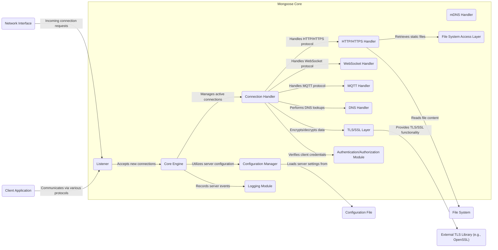

# Project Design Document: Mongoose Embedded Web Server Library

**Document Version:** 1.1
**Date:** October 26, 2023
**Prepared By:** Gemini (AI Language Model)

## 1. Introduction

This document provides a refined and detailed architectural design of the Mongoose embedded web server library. It serves as a comprehensive reference for understanding the system's components, their interactions, and key design decisions. This document is intended to be used as a primary input for subsequent threat modeling activities, enabling the identification of potential security vulnerabilities and risks with greater precision.

## 2. Project Overview

Mongoose is a lightweight, cross-platform, and embeddable web server library implemented in C. Its core design principle is ease of integration into existing applications, providing robust networking capabilities without introducing significant dependencies. Mongoose offers broad support for various network protocols and functionalities, making it a versatile solution for applications ranging from resource-constrained embedded systems to desktop applications requiring networking features.

**Key Features:**

*   Comprehensive HTTP/HTTPS server functionality, including support for various HTTP methods and features.
*   Robust WebSocket support, facilitating real-time bidirectional communication.
*   Versatile MQTT client and broker capabilities, enabling integration with IoT ecosystems.
*   Integrated DNS client functionality for resolving domain names.
*   mDNS responder for local network service discovery.
*   Flexible TLS/SSL support, leveraging external libraries like OpenSSL or mbed TLS for secure communication.
*   Support for dynamic content generation through CGI and SSI.
*   Efficient static file serving capabilities with options for caching and content negotiation.
*   Asynchronous, non-blocking I/O architecture for handling concurrent connections efficiently.
*   Exceptional cross-platform compatibility, supporting a wide range of operating systems including Windows, macOS, Linux, and various embedded platforms.
*   Flexible configuration options via a dedicated configuration file or programmatically through its API.
*   A well-defined and easy-to-use C API for seamless integration into applications.

**Target Use Cases:**

*   Providing intuitive web-based user interfaces for embedded devices and appliances.
*   Implementing secure and scalable RESTful APIs within applications.
*   Building interactive real-time communication applications leveraging WebSockets.
*   Creating intelligent IoT gateways and edge devices utilizing the MQTT protocol.
*   Enhancing existing C applications with networking capabilities without the overhead of full-fledged web servers.

## 3. System Architecture

Mongoose employs an event-driven, single-threaded architecture. This model leverages the operating system's efficient event notification mechanisms (such as `select`, `poll`, `epoll`, or `kqueue`) to manage multiple concurrent connections without the complexities of multi-threading.

**Major Components:**

*   **Core Engine:** The central component of Mongoose, responsible for managing all active connections, processing incoming events from the operating system, and dispatching requests to the appropriate protocol handlers. It orchestrates the overall operation of the server.
*   **Listener:**  Dedicated to listening for incoming connection requests on the configured network interfaces and ports. Upon receiving a connection request, it accepts the connection and hands it off to a Connection Handler.
*   **Connection Handler:** Manages the lifecycle of individual client connections. This includes reading incoming requests from the client, buffering data, invoking the appropriate protocol handler for processing, and sending the generated response back to the client.
*   **Protocol Handlers:** Specialized modules responsible for interpreting and processing data according to specific network protocols:
    *   **HTTP/HTTPS Handler:**  Parses incoming HTTP requests, interprets headers and body, serves static files from the designated document root, executes CGI scripts, processes SSI directives, and generates appropriate HTTP responses. It also handles HTTPS by interacting with the TLS/SSL Layer.
    *   **WebSocket Handler:** Manages the WebSocket handshake process, handles framing and de-framing of WebSocket messages, and facilitates bidirectional communication between the server and clients.
    *   **MQTT Handler:** Implements both MQTT client and broker functionalities, handling connection management, topic subscriptions, message publishing, and quality of service (QoS) levels.
    *   **DNS Handler:**  Performs DNS lookups to resolve domain names into IP addresses, typically used for outgoing connections or when required by other handlers.
    *   **mDNS Handler:** Responds to mDNS queries on the local network, advertising the services offered by the Mongoose instance.
*   **Configuration Manager:** Responsible for loading, parsing, and managing the server's configuration settings. This can be done from a configuration file (typically `mongoose.conf`) or programmatically through the Mongoose API.
*   **TLS/SSL Layer:** Provides secure communication channels using the TLS/SSL protocols. This component acts as an interface to an external TLS/SSL library (e.g., OpenSSL, mbed TLS), handling encryption and decryption of data.
*   **File System Access Layer:**  Handles requests for serving static files. It interacts with the underlying file system to retrieve file content based on the requested URI, respecting configured access permissions.
*   **Logging Module:** Records significant server events, errors, and access logs. The logging level and format are typically configurable.
*   **Authentication/Authorization Module:** Enforces security policies by verifying user credentials and determining access rights to specific resources. Mongoose supports various authentication methods, and this module handles their implementation.

**Component Diagram:**

## 4. Data Flow

The following describes the typical data flow for an incoming HTTPS request, illustrating the interaction between different components:

1. **Secure Connection Establishment:** A client application initiates a secure connection to the Mongoose server on the configured HTTPS port. The **Listener** component accepts the incoming TCP connection.
2. **TLS Handshake:** The **Connection Handler** initiates a TLS handshake with the client, leveraging the **TLS/SSL Layer** and the underlying **External TLS Library**. This establishes a secure, encrypted communication channel.
3. **Request Reception:** Once the TLS handshake is complete, the **Connection Handler** begins receiving the encrypted data stream from the client. The **TLS/SSL Layer** decrypts the incoming data.
4. **HTTP Request Parsing:** The **HTTP/HTTPS Handler** parses the decrypted HTTP request, extracting headers, the request method, the requested URI, and the message body (if present).
5. **Authentication and Authorization (Optional):** Based on the server configuration and the requested resource, the **Authentication/Authorization Module** may be invoked to verify the client's identity and permissions. If authentication fails, an appropriate HTTP error response is generated.
6. **Request Processing:** Based on the parsed request URI and headers, the **HTTP/HTTPS Handler** determines the appropriate action:
    *   **Static File Serving:** If the request maps to a static file within the configured document root, the **File System Access Layer** retrieves the file content. The **HTTP/HTTPS Handler** then constructs an HTTP response containing the file content and appropriate headers (e.g., `Content-Type`, `Content-Length`).
    *   **CGI Execution:** If the request targets a CGI script, the **HTTP/HTTPS Handler** spawns a new process to execute the script, passing environment variables and the request data. The output from the CGI script is captured and used to construct the HTTP response.
    *   **SSI Processing:** If the requested file contains Server Side Includes (SSI), the **HTTP/HTTPS Handler** parses the file content, processes the SSI directives (e.g., including other files, executing commands), and dynamically generates the response content.
7. **Response Generation:** The **HTTP/HTTPS Handler** constructs the HTTP response, including appropriate status codes, headers, and the response body.
8. **TLS/SSL Encryption:** Before sending the response, the **TLS/SSL Layer** encrypts the response data using the established secure connection.
9. **Response Transmission:** The **Connection Handler** sends the encrypted response data back to the client through the network interface.
10. **Logging:** The **Logging Module** records details about the request and response, including timestamps, client IP address, requested resource, and response status code.
11. **Connection Handling (Keep-Alive or Close):** Depending on the HTTP headers (e.g., `Connection: keep-alive`), the connection may be kept open for subsequent requests, or it may be closed.

Similar data flows exist for other protocols like WebSocket (involving a handshake and subsequent bidirectional message exchange) and MQTT (involving connection establishment, topic subscriptions, and message publishing/receiving).

## 5. Security Considerations

This section details critical security considerations inherent in Mongoose's design and operation. These points will be central to the subsequent threat modeling process.

*   **Insufficient Input Validation:** Lack of rigorous validation of all incoming data streams (HTTP headers, URL parameters, request bodies, WebSocket frames, MQTT payloads) represents a significant vulnerability. This could be exploited through various attack vectors, including:
    *   Buffer overflow attacks due to excessively long input strings.
    *   Cross-site scripting (XSS) attacks via injected malicious scripts in HTTP headers or parameters.
    *   SQL injection or command injection vulnerabilities if input is used to construct database queries or system commands without proper sanitization.
*   **Weak Authentication and Authorization Mechanisms:**  Inadequate or improperly implemented authentication and authorization can lead to unauthorized access to sensitive resources and functionalities. Specific concerns include:
    *   Use of default or easily guessable credentials.
    *   Lack of proper session management, potentially leading to session hijacking.
    *   Insufficient role-based access control, granting excessive privileges to users.
*   **Misconfigured TLS/SSL:** Improperly configured TLS/SSL settings can severely compromise the confidentiality and integrity of communication. Key areas of concern include:
    *   Use of weak or deprecated cryptographic ciphers.
    *   Failure to enforce the use of HTTPS, allowing communication over insecure HTTP.
    *   Incorrect certificate validation, potentially leading to man-in-the-middle attacks.
    *   Use of outdated TLS protocols with known vulnerabilities.
*   **File System Access Vulnerabilities:** Flaws in the logic for serving static files can expose sensitive data or allow unauthorized file access. This includes:
    *   Directory traversal vulnerabilities, allowing access to files outside the intended webroot.
    *   Exposure of sensitive metadata or backup files.
    *   Lack of proper access controls on served files.
*   **CGI Script Security Risks:** Executing external CGI scripts introduces inherent security risks if not handled carefully:
    *   Command injection vulnerabilities if user-supplied input is directly incorporated into shell commands.
    *   Exposure of sensitive environment variables to the CGI script.
    *   Resource exhaustion if CGI scripts are poorly written or malicious.
*   **Memory Management Errors:** As a C-based application, Mongoose is susceptible to memory management errors if not implemented with extreme care. These can lead to critical vulnerabilities:
    *   Buffer overflows due to writing beyond allocated memory boundaries.
    *   Use-after-free errors, where memory is accessed after it has been deallocated.
    *   Memory leaks, potentially leading to denial of service over time.
*   **Denial of Service (DoS) Vulnerabilities:**  Mongoose's ability to handle a high volume of requests and malicious traffic needs careful consideration to prevent DoS attacks:
    *   Susceptibility to SYN flood attacks.
    *   Resource exhaustion due to excessive connection attempts or large requests.
    *   Slowloris attacks that keep connections open for extended periods.
*   **Insecure Logging Practices:** Improper logging can expose sensitive information or create opportunities for attackers:
    *   Logging of sensitive data like passwords or API keys.
    *   Insufficient protection of log files, allowing unauthorized access.
    *   Lack of log rotation, potentially leading to disk space exhaustion.
*   **Configuration Security Weaknesses:**  The configuration file itself is a critical asset that needs protection:
    *   Storing sensitive information like passwords in plaintext within the configuration file.
    *   Insufficient access controls on the configuration file, allowing unauthorized modification.
*   **Third-Party Dependency Vulnerabilities:**  The security of external libraries used by Mongoose (e.g., OpenSSL, mbed TLS) is paramount. Vulnerabilities in these dependencies can directly impact Mongoose's security.

## 6. Deployment Considerations

Deploying Mongoose typically involves embedding the library within a larger application. Key considerations include:

*   **Compilation and Linking:** The Mongoose library needs to be compiled and linked with the application code. This often involves configuring the build system to include the Mongoose source files or linking against a pre-compiled library.
*   **Configuration Management:**  Deciding how the Mongoose server will be configured is crucial. Options include:
    *   Providing a `mongoose.conf` file alongside the application executable.
    *   Using the Mongoose API to programmatically set configuration options during application startup.
    *   A combination of both methods.
*   **Integration with Application Logic:**  The application needs to interact with the Mongoose API to start the server, define request handlers, and manage the server's lifecycle. This typically involves integrating Mongoose's event loop with the application's main loop or using a separate thread for Mongoose.
*   **Resource Allocation:**  The application must allocate sufficient resources (memory, file descriptors, network ports) for Mongoose to operate efficiently, especially under heavy load.
*   **Security Hardening:**  Deploying Mongoose securely requires careful consideration of the security considerations outlined in Section 5. This includes configuring TLS/SSL properly, implementing robust authentication, and ensuring proper input validation.
*   **Platform-Specific Considerations:**  Deployment may involve platform-specific configurations or adaptations, especially when targeting embedded systems with limited resources.

## 7. Assumptions and Dependencies

*   **Operating System Networking Support:** Mongoose relies on the underlying operating system's networking stack for functionalities like socket creation, listening, and data transmission.
*   **Standard C Library:** A compliant implementation of the standard C library is a fundamental requirement for compiling and running Mongoose.
*   **Optional External Libraries:**  Certain features of Mongoose have optional dependencies on external libraries:
    *   TLS/SSL functionality requires a library like OpenSSL or mbed TLS.
    *   Other features might have dependencies depending on the specific build configuration.
*   **Configuration Driven Behavior:**  Mongoose's behavior is significantly influenced by its configuration settings. Incorrect or insecure configuration can lead to vulnerabilities or unexpected behavior.

## 8. Glossary

*   **API:** Application Programming Interface
*   **CGI:** Common Gateway Interface
*   **DoS:** Denial of Service
*   **HTTP:** Hypertext Transfer Protocol
*   **HTTPS:** HTTP Secure
*   **IoT:** Internet of Things
*   **MQTT:** Message Queuing Telemetry Transport
*   **mDNS:** Multicast DNS
*   **REST:** Representational State Transfer
*   **SSI:** Server Side Includes
*   **TLS:** Transport Layer Security
*   **SSL:** Secure Sockets Layer (the predecessor to TLS)
*   **URI:** Uniform Resource Identifier
*   **WebSocket:** A communication protocol enabling persistent, bidirectional communication channels over a single TCP connection.
*   **XSS:** Cross-Site Scripting
*   **SYN Flood:** A type of denial-of-service attack that exploits the TCP handshake process.
*   **Slowloris:** A type of denial-of-service attack that attempts to monopolize a web server's connections by sending partial HTTP requests.
