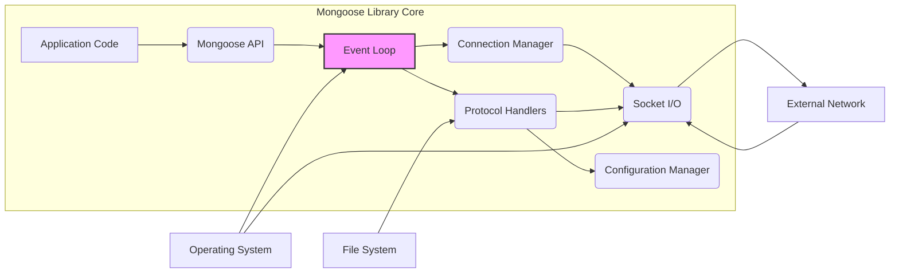
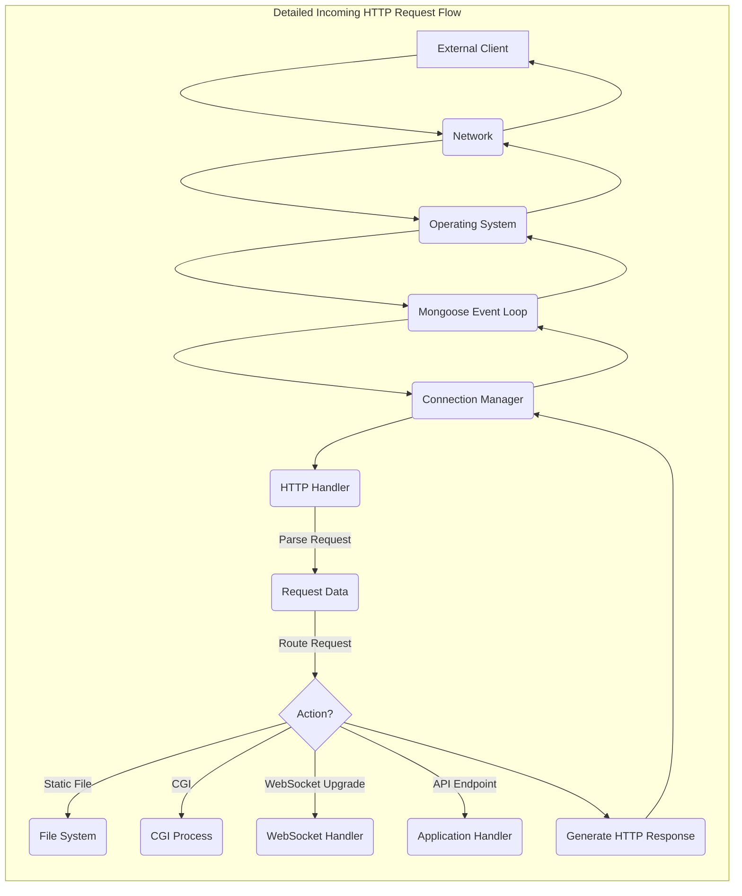

## Project Design Document: Mongoose Embedded Web Server Library (Improved)

**1. Introduction**

This document provides an enhanced and detailed design overview of the Mongoose embedded web server library (hereafter referred to as "Mongoose"). This document is specifically crafted to serve as a robust foundation for subsequent threat modeling activities. It aims to provide a comprehensive and granular understanding of Mongoose's architecture, core components, intricate data flow mechanisms, and all external interfaces. This detailed view is crucial for identifying potential attack vectors and vulnerabilities.

**2. Goals and Objectives**

The primary goals underpinning the design of the Mongoose library are:

* To offer a highly lightweight and easily embeddable web server and versatile networking library suitable for resource-constrained environments.
* To provide comprehensive support for a diverse range of networking protocols, prominently including HTTP/1.1, HTTP/2, WebSocket, MQTT, and potentially others like DNS client/server, SMTP client.
* To present a simple, intuitive, and developer-friendly API for seamless integration into a wide array of applications and systems.
* To maintain a minimal memory footprint and exhibit low resource consumption, making it particularly well-suited for embedded systems and IoT devices.
* To establish a flexible and highly configurable platform for diverse network communication needs, allowing customization for specific use cases.

**3. Architectural Overview**

Mongoose employs an efficient event-driven, single-threaded, non-blocking architecture. It centers around a core event loop that diligently monitors various file descriptors (representing network sockets, timers, and potentially file system events) for activity. Upon the occurrence of an event, the event loop dispatches it to the appropriate registered handler. This architecture maximizes resource utilization and responsiveness.

**4. Component Details**

* **Event Loop:** The central orchestrator, continuously monitoring registered file descriptors using mechanisms like `select`, `poll`, or `epoll`. When an event is detected (e.g., data arrival on a socket, timer expiration), it invokes the associated callback function.
* **Connection Manager:** Responsible for the lifecycle management of all active network connections. This includes:
    * Accepting new incoming connections.
    * Tracking the state of each connection (e.g., connecting, established, closing).
    * Associating connections with the appropriate protocol handler based on negotiation or configuration.
    * Managing connection timeouts and keep-alive mechanisms.
* **Protocol Handlers:**  Modular components dedicated to implementing the logic for specific network protocols. Key examples include:
    * **HTTP Handler:**  Parses incoming HTTP requests (including headers and body), performs routing based on URI and configured handlers (e.g., static file serving, CGI execution, proxying), constructs and sends HTTP responses, and manages HTTP/2 streams.
    * **WebSocket Handler:** Manages persistent bidirectional WebSocket connections, handles the framing and deframing of WebSocket messages according to RFC 6455, and provides callbacks to the application for message processing.
    * **MQTT Handler:** Implements the MQTT protocol (typically versions 3.1.1 and 5.0) for publish/subscribe messaging, handling connection management, topic subscriptions, message publishing, and quality of service (QoS) levels.
    * **Other Protocol Handlers:**  May include handlers for DNS client/server functionality, SMTP client capabilities, or custom protocol implementations.
* **Socket I/O:**  Provides an abstraction layer over the operating system's socket API. This component handles the raw sending and receiving of data over network sockets, potentially including buffering and error handling. It interacts directly with system calls like `send`, `recv`, `accept`, and `connect`.
* **Configuration Manager:**  Responsible for loading, parsing, and managing Mongoose's configuration parameters. Configuration can be sourced from:
    * Configuration files (e.g., `mongoose.conf`).
    * Environment variables.
    * Programmatic settings through the Mongoose API.
    Configuration options govern aspects like listening ports, document roots, security settings (e.g., TLS configuration), and protocol-specific parameters.
* **Mongoose API:**  The primary interface through which application code interacts with the Mongoose library. This C/C++ API provides functions for:
    * Initializing and starting the Mongoose server instance.
    * Registering event handlers for various events (e.g., incoming HTTP requests, WebSocket messages, MQTT messages).
    * Sending data over established connections.
    * Managing connections programmatically.
    * Accessing and modifying configuration settings.
    * Stopping the Mongoose server instance.

**5. Data Flow (Detailed HTTP Request)**

A more detailed breakdown of the data flow for a typical incoming HTTP request:

* An external client initiates a TCP connection to the server's listening port.
* The **Operating System** accepts the connection.
* The **Mongoose Event Loop**, monitoring the listening socket, detects the new connection event.
* The **Connection Manager** creates a new connection object to represent this connection and associates it with the listening socket.
* The **Event Loop** detects incoming data on the newly established connection socket.
* The **Connection Manager** receives the raw data and identifies the appropriate **Protocol Handler** (based on the listening port or protocol negotiation, e.g., TLS handshake for HTTPS).
* The **HTTP Handler** receives the raw byte stream and begins parsing the HTTP request:
    * Parses the request line (method, URI, HTTP version).
    * Parses HTTP headers.
    * Reads the request body (if present), potentially handling different encoding schemes.
* Based on the parsed request URI and the configured routes and handlers, the **HTTP Handler** determines the appropriate action:
    * **Static File Serving:** If the URI maps to a static file, the **HTTP Handler** interacts with the **File System** to retrieve the file content.
    * **CGI Execution:** If configured, the **HTTP Handler** may spawn a separate **CGI Process**, passing request information via environment variables and standard input.
    * **WebSocket Upgrade:** If the request is a WebSocket upgrade request, the **HTTP Handler** negotiates the upgrade and hands over the connection to the **WebSocket Handler**.
    * **API Endpoint Handling:**  The application code, through the **Mongoose API**, may have registered custom handlers for specific URIs. The **HTTP Handler** invokes the appropriate registered callback function.
    * **Proxying:** If configured as a reverse proxy, the **HTTP Handler** may initiate a new connection to an upstream server and forward the request.
* The designated handler (or the **HTTP Handler** itself) generates the HTTP response, including:
    * The status line (HTTP version, status code, reason phrase).
    * Response headers.
    * The response body.
* The **HTTP Handler** passes the response data to the **Socket I/O** component.
* The **Socket I/O** component sends the response data back to the client over the network.
* The connection may remain open (for HTTP keep-alive or HTTP/2) or be closed, managed by the **Connection Manager**.

**6. External Interfaces (Comprehensive)**

Mongoose interacts with the external environment through a well-defined set of interfaces:

* **Network Interface:**
    * **Listening Sockets:**  Binds to and listens for incoming connections on specified TCP and/or UDP ports. Configuration determines the protocols handled on each port (e.g., HTTP on port 80, HTTPS on port 443).
    * **Outgoing Connections:** Establishes outgoing TCP or UDP connections when acting as a client for protocols like HTTP (for proxying), MQTT, DNS, or SMTP.
    * **Protocol Communication:**  Exchanges data using various network protocols, including HTTP/1.1, HTTP/2, WebSocket (over TCP), MQTT (over TCP), and potentially others.
* **File System Interface:**
    * **Static File Serving:** Reads files from configured document root directories to serve as static web content.
    * **Configuration File Access:** Reads configuration parameters from files (e.g., `mongoose.conf`).
    * **CGI Script Execution:** Executes CGI scripts located in designated directories.
    * **Logging:** Writes log messages to files, if logging is enabled.
    * **TLS Certificate Loading:** Loads TLS/SSL certificates and private keys from files for secure connections.
* **Operating System Interface:**
    * **Socket Management:** Utilizes system calls for core networking operations: `socket`, `bind`, `listen`, `accept`, `connect`, `send`, `recv`, `close`.
    * **Timer Management:** Employs system timers (e.g., `timerfd`, `setitimer`) for managing timeouts, keep-alive intervals, and scheduled events.
    * **Process Management:** Uses system calls like `fork` and `exec` for executing CGI scripts.
    * **File I/O:** Interacts with the file system through standard file I/O operations: `open`, `read`, `write`, `close`.
    * **Memory Management:** Allocates and deallocates memory using system calls (e.g., `malloc`, `free`).
    * **Signal Handling:** May handle signals for graceful shutdown or other purposes.
* **Application Interface (Mongoose API):**
    * **Initialization and Configuration:** Functions to initialize the Mongoose library and configure its behavior.
    * **Event Handler Registration:** Mechanisms for application code to register callback functions to handle specific events (e.g., new connections, incoming requests, WebSocket messages, MQTT messages).
    * **Data Transmission:** Functions for sending data over established connections.
    * **Connection Management:**  APIs for programmatically managing connections.
    * **Configuration Access:** Functions to access and potentially modify configuration settings at runtime.

**7. Security Considerations (Detailed)**

This section provides a more in-depth look at potential security considerations relevant for threat modeling:

* **Input Validation Vulnerabilities:**
    * **HTTP Request Smuggling:** Improper handling of Content-Length and Transfer-Encoding headers can lead to request smuggling.
    * **Header Injection:** Failure to sanitize HTTP headers can allow attackers to inject malicious headers.
    * **Path Traversal:** Inadequate validation of requested file paths can allow access to files outside the intended document root.
    * **SQL Injection (Indirect):** If Mongoose interacts with a database based on user input, vulnerabilities in the application logic can lead to SQL injection.
    * **Command Injection (CGI):** Improper sanitization of input passed to CGI scripts can allow attackers to execute arbitrary commands on the server.
* **Memory Safety Issues:**
    * **Buffer Overflows:**  Vulnerabilities in parsing network data or handling strings can lead to buffer overflows, potentially allowing arbitrary code execution.
    * **Use-After-Free:** Incorrect memory management can result in use-after-free vulnerabilities.
    * **Integer Overflows:**  Overflows in integer calculations, especially when dealing with sizes or lengths, can lead to unexpected behavior and potential vulnerabilities.
* **Denial of Service (DoS) Attacks:**
    * **SYN Flood:**  Susceptible to SYN flood attacks if not properly mitigated at the network level or within the OS.
    * **Slowloris:**  Vulnerable to slow HTTP request attacks that exhaust server resources.
    * **Resource Exhaustion:**  Handling of large requests or excessive connections without proper limits can lead to resource exhaustion.
    * **WebSocket Bomb:**  Receiving a large number of WebSocket messages or a single very large message can overwhelm the server.
* **Cross-Site Scripting (XSS):**
    * If Mongoose is used to serve dynamic content, improper output encoding can allow attackers to inject malicious scripts into web pages viewed by other users.
* **Cross-Site Request Forgery (CSRF):**
    * Applications built on top of Mongoose need to implement CSRF protection mechanisms to prevent unauthorized actions on behalf of authenticated users.
* **Authentication and Authorization Weaknesses:**
    * Mongoose provides basic authentication mechanisms, but the security of these mechanisms depends on proper configuration and implementation by the application developer.
    * Weak or default credentials can be a significant vulnerability.
    * Lack of proper authorization checks can allow unauthorized access to resources.
* **TLS/SSL Vulnerabilities:**
    * Using outdated TLS versions or weak cipher suites.
    * Improper certificate validation.
    * Vulnerabilities in the underlying TLS library (e.g., OpenSSL).
* **Configuration Security:**
    * Storing sensitive configuration information (e.g., API keys, database credentials) in plaintext.
    * Allowing unauthorized access to the configuration file.
* **CGI Security Risks:**
    * Running CGI scripts with elevated privileges.
    * Lack of input sanitization in CGI scripts.
    * Information disclosure through CGI errors.
* **Dependency Vulnerabilities:**
    * Using outdated versions of Mongoose or its dependencies with known security vulnerabilities.

**8. Deployment Considerations (Security Impact)**

The deployment environment significantly influences Mongoose's security posture:

* **Exposure to the Internet:**  Direct exposure to the internet increases the attack surface and the likelihood of encountering various threats.
* **Network Segmentation:**  Deploying Mongoose within a segmented network can limit the impact of a potential breach.
* **Firewall Configuration:**  Properly configured firewalls can restrict access to Mongoose's listening ports and limit outbound connections.
* **Resource Constraints:**  Limited resources on embedded systems can make it challenging to implement robust security measures.
* **Update Mechanisms:**  The ability to update Mongoose and its dependencies is crucial for addressing security vulnerabilities.
* **Physical Security:**  In embedded systems, physical access to the device can pose a security risk.
* **Co-existence with other software:** Interactions with other software on the same system can introduce new attack vectors.

**9. Conclusion**

This improved design document provides a more detailed and comprehensive understanding of the Mongoose embedded web server library, specifically tailored for effective threat modeling. By outlining the architecture, components, data flow, and external interfaces in detail, and by elaborating on potential security considerations, this document serves as a valuable resource for identifying and mitigating potential security risks associated with the use of Mongoose in diverse applications and deployment scenarios. This detailed information is crucial for building secure systems that leverage the capabilities of the Mongoose library.