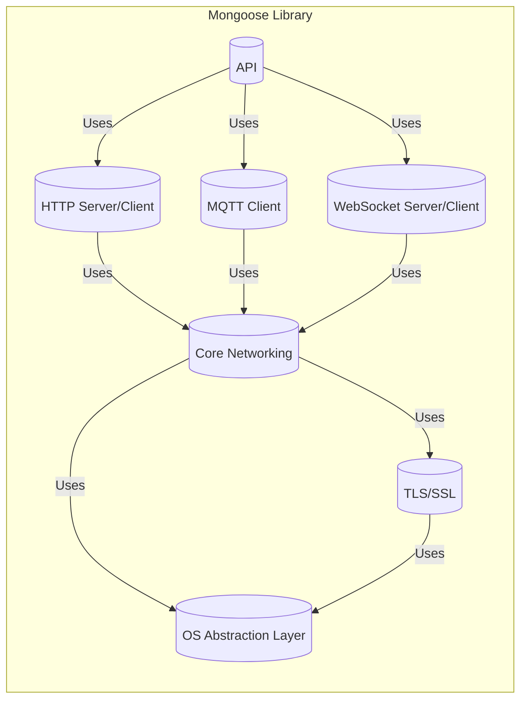
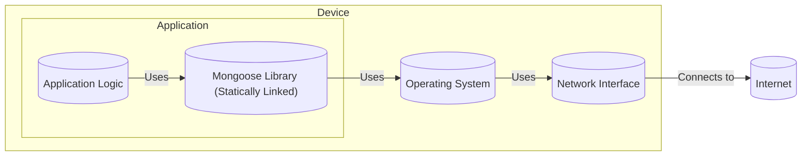
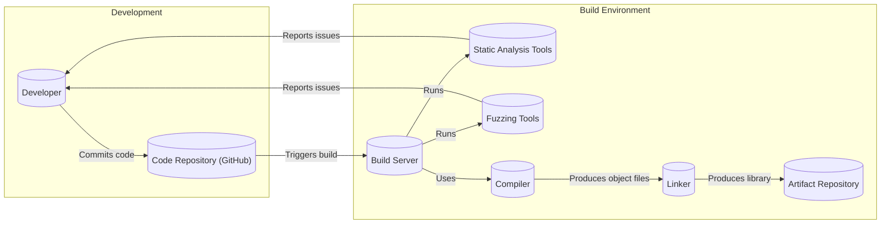

# BUSINESS POSTURE

Business Priorities and Goals:

*   Provide a lightweight, easy-to-use, and versatile networking library suitable for embedded systems and other resource-constrained environments.
*   Offer a cross-platform solution that simplifies network programming for developers, reducing development time and effort.
*   Maintain a small footprint to ensure compatibility with systems having limited memory and processing power.
*   Provide a stable and reliable networking stack that can handle various network protocols and scenarios.
*   Support a wide range of applications, from simple IoT devices to more complex networked systems.
*   Foster an active open-source community to encourage contributions, feedback, and continuous improvement.

Most Important Business Risks:

*   Security vulnerabilities in the library could expose users to attacks, potentially leading to data breaches, system compromise, or denial-of-service. This is a critical risk given the library's use in embedded systems, which often control physical devices or handle sensitive data.
*   Instability or bugs in the library could lead to application crashes, malfunctions, or unpredictable behavior, impacting the reliability of systems that depend on it.
*   Lack of support for essential networking protocols or features could limit the library's applicability and adoption, hindering its growth and competitiveness.
*   Difficulty of use or integration could deter developers from choosing the library, impacting its market share and community engagement.
*   Licensing issues or unclear intellectual property rights could create legal risks for users and the project itself.
*   Inadequate documentation or support could lead to user frustration and hinder the library's adoption and effective use.

# SECURITY POSTURE

Existing Security Controls:

*   security control: Regular code reviews and audits. (Mentioned on the GitHub page and implied by good development practices).
*   security control: Use of static analysis tools (implied, common practice for C/C++ projects).
*   security control: Fuzz testing (mentioned in documentation).
*   security control: Support for TLS/SSL encryption (mentioned in documentation and features).
*   security control: API designed to prevent common vulnerabilities like buffer overflows (implied by design goals and documentation).

Accepted Risks:

*   accepted risk: The library is written in C, which is inherently memory-unsafe. While efforts are made to mitigate risks, memory safety vulnerabilities are always a possibility.
*   accepted risk: The library supports a wide range of platforms and configurations, increasing the attack surface and the potential for platform-specific vulnerabilities.
*   accepted risk: The library relies on third-party dependencies (e.g., for cryptography), which may introduce their own vulnerabilities.
*   accepted risk: The library is open-source, meaning the code is publicly available for scrutiny, but also for potential exploitation by attackers.

Recommended Security Controls:

*   security control: Implement a comprehensive Software Bill of Materials (SBOM) to track all dependencies and their versions, facilitating vulnerability management.
*   security control: Integrate dynamic analysis tools (e.g., sanitizers) into the build and testing process to detect runtime errors.
*   security control: Establish a clear vulnerability disclosure and response process to handle reported security issues promptly and effectively.
*   security control: Provide security hardening guides and best practices for developers using the library.
*   security control: Consider memory safe language for new features or modules.

Security Requirements:

*   Authentication:
    *   The library should support secure authentication mechanisms for relevant protocols (e.g., HTTP, MQTT, WebSockets).
    *   Implementations should protect against common authentication attacks (e.g., brute-force, credential stuffing).
    *   Support for secure storage and management of credentials (e.g., API keys, certificates) should be provided where applicable.

*   Authorization:
    *   The library should provide mechanisms for enforcing access control policies, where applicable (e.g., URI-based authorization for HTTP).
    *   Authorization checks should be performed consistently and securely to prevent unauthorized access to resources.

*   Input Validation:
    *   All input received from the network should be strictly validated to prevent injection attacks (e.g., SQL injection, command injection).
    *   Input validation should be performed based on a whitelist approach, accepting only known-good input.
    *   The library should provide helper functions or APIs for secure input handling.

*   Cryptography:
    *   The library should use strong, well-vetted cryptographic algorithms and libraries for encryption, hashing, and digital signatures.
    *   Cryptographic keys should be managed securely, following best practices for key generation, storage, and rotation.
    *   The library should support up-to-date TLS/SSL versions and cipher suites, and provide options for configuring security parameters.
    *   Avoid using deprecated or weak cryptographic primitives.

# DESIGN

## C4 CONTEXT

```mermaid
graph LR
    subgraph Mongoose Users
        User[("User/Device")]
    end
    subgraph Mongoose
        Mongoose[("Mongoose Library")]
    end
     subgraph External Systems
        Internet[("Internet")]
        ExternalService[("External Service")]
        MQTTBroker[("MQTT Broker")]
    end

    User -- "Uses" --> Mongoose
    Mongoose -- "Communicates with" --> Internet
    Mongoose -- "Uses" --> ExternalService
    Mongoose -- "Uses" --> MQTTBroker
```

Element Descriptions:

*   Element:
    *   Name: User/Device
    *   Type: User/External System
    *   Description: Represents a user or device that utilizes the Mongoose library to implement network functionality in their application.
    *   Responsibilities: Initiates network connections, sends and receives data, handles application-specific logic.
    *   Security controls: Implements application-level security measures, such as authentication, authorization, and data validation.

*   Element:
    *   Name: Mongoose Library
    *   Type: Software System
    *   Description: The Mongoose networking library itself, providing a simplified API for network programming.
    *   Responsibilities: Handles low-level network communication, provides protocol implementations (HTTP, MQTT, etc.), manages connections, and offers utility functions.
    *   Security controls: Implements TLS/SSL encryption, provides input validation helpers, follows secure coding practices, and undergoes regular security audits.

*   Element:
    *   Name: Internet
    *   Type: External System
    *   Description: The global network infrastructure, representing the medium over which network communication occurs.
    *   Responsibilities: Transports data packets between the Mongoose library and other network endpoints.
    *   Security controls: Relies on underlying network security protocols (e.g., IPsec, TLS) and infrastructure security measures.

*   Element:
    *   Name: External Service
    *   Type: External System
    *   Description: Represents an external service that the Mongoose-based application interacts with, such as a web server or API endpoint.
    *   Responsibilities: Provides specific services or data to the application.
    *   Security controls: Implements its own security measures, such as authentication, authorization, and input validation.

*   Element:
    *   Name: MQTT Broker
    *   Type: External System
    *   Description: Represents an MQTT broker, a message broker that facilitates communication between MQTT clients.
    *   Responsibilities: Receives and forwards messages between MQTT clients.
    *   Security controls: Implements its own security measures, such as authentication, authorization, and potentially TLS encryption.

## C4 CONTAINER



Element Descriptions:

*   Element:
    *   Name: API
    *   Type: Container
    *   Description: The public API of the Mongoose library, providing a simplified interface for developers.
    *   Responsibilities: Exposes functions for creating connections, sending/receiving data, configuring settings, and handling events.
    *   Security controls: Input validation, parameter sanitization, error handling.

*   Element:
    *   Name: HTTP Server/Client
    *   Type: Container
    *   Description: Implementation of the HTTP protocol, supporting both server and client functionality.
    *   Responsibilities: Parsing HTTP requests/responses, handling headers, managing connections, supporting different HTTP methods.
    *   Security controls: Input validation, protection against HTTP-specific attacks (e.g., request smuggling, header injection), secure handling of cookies and sessions.

*   Element:
    *   Name: MQTT Client
    *   Type: Container
    *   Description: Implementation of the MQTT client protocol.
    *   Responsibilities: Connecting to MQTT brokers, publishing and subscribing to topics, handling messages.
    *   Security controls: Authentication with MQTT brokers, secure handling of MQTT credentials, support for TLS encryption.

*   Element:
    *   Name: WebSocket Server/Client
    *   Type: Container
    *   Description: Implementation of the WebSocket protocol, supporting both server and client functionality.
    *   Responsibilities: Establishing and maintaining WebSocket connections, handling framing, sending/receiving messages.
    *   Security controls: Input validation, protection against WebSocket-specific attacks, secure handling of WebSocket handshakes.

*   Element:
    *   Name: Core Networking
    *   Type: Container
    *   Description: Core networking functionality, including socket management, event handling, and data buffering.
    *   Responsibilities: Provides a platform-independent layer for network operations.
    *   Security controls: Secure socket handling, protection against buffer overflows, proper resource management.

*   Element:
    *   Name: TLS/SSL
    *   Type: Container
    *   Description: Implementation of TLS/SSL encryption for secure communication.
    *   Responsibilities: Handling encryption/decryption, certificate verification, key exchange.
    *   Security controls: Uses well-vetted cryptographic libraries, supports up-to-date TLS versions and cipher suites, provides options for configuring security parameters.

*   Element:
    *   Name: OS Abstraction Layer
    *   Type: Container
    *   Description: Abstraction layer for interacting with the underlying operating system.
    *   Responsibilities: Provides platform-specific implementations for networking functions (e.g., socket creation, I/O operations).
    *   Security controls: Follows secure coding practices for interacting with the OS, minimizes the risk of vulnerabilities due to OS-specific issues.

## DEPLOYMENT

Possible Deployment Solutions:

1.  Statically linked library within an application.
2.  Dynamically linked library used by an application.
3.  Embedded within firmware on a microcontroller.

Chosen Deployment Solution (Statically Linked):



Element Descriptions:

*   Element:
    *   Name: Application
    *   Type: Deployment Node
    *   Description: The user's application that utilizes the Mongoose library.
    *   Responsibilities: Contains the main application logic and uses Mongoose for network communication.
    *   Security controls: Implements application-level security measures.

*   Element:
    *   Name: Mongoose Library (Statically Linked)
    *   Type: Software Component
    *   Description: The Mongoose library, compiled and linked directly into the application executable.
    *   Responsibilities: Provides network functionality to the application.
    *   Security controls: Inherits security controls from the build process and the library's internal design.

*   Element:
    *   Name: Application Logic
    *   Type: Software Component
    *   Description: The core logic of the user's application.
    *   Responsibilities: Handles application-specific tasks and utilizes the Mongoose library for network communication.
    *   Security controls: Implements application-specific security measures.

*   Element:
    *   Name: Operating System
    *   Type: Deployment Node
    *   Description: The operating system on which the application runs.
    *   Responsibilities: Provides system resources and services to the application, including network stack access.
    *   Security controls: Relies on OS-level security features and configurations.

*   Element:
    *   Name: Network Interface
    *   Type: Deployment Node
    *   Description: The hardware interface that connects the device to the network.
    *   Responsibilities: Handles physical transmission and reception of data.
    *   Security controls: May implement hardware-level security features (e.g., MAC address filtering).

*   Element:
    *   Name: Internet
    *   Type: External System
    *   Description: The external network to which the device connects.
    *   Responsibilities: Provides network connectivity.
    *   Security controls: Relies on network-level security protocols and infrastructure.

## BUILD



Build Process Description:

1.  Developer commits code changes to the GitHub repository.
2.  The commit triggers a build process on a build server (e.g., using GitHub Actions, Travis CI, or a similar CI/CD system).
3.  The build server checks out the code from the repository.
4.  Static analysis tools (e.g., linters, code analyzers) are run on the code to identify potential vulnerabilities and coding errors. Results are reported back to the developer.
5.  Fuzzing tools are used to test the library with a wide range of inputs, including malformed or unexpected data, to identify potential crashes or vulnerabilities. Results are reported back to the developer.
6.  The compiler compiles the source code into object files.
7.  The linker links the object files together to create the Mongoose library (either a static or dynamic library, depending on the configuration).
8.  The resulting library artifact is stored in an artifact repository.

Security Controls in Build Process:

*   security control: Code reviews are performed before merging code changes into the main branch.
*   security control: Static analysis tools are used to identify potential vulnerabilities and coding errors.
*   security control: Fuzzing is used to test the library with a wide range of inputs.
*   security control: The build process is automated, reducing the risk of manual errors and ensuring consistency.
*   security control: The build environment is secured to prevent unauthorized access and tampering.
*   security control: Dependencies are managed and tracked (though a formal SBOM is recommended).
*   security control: Compiler warnings and errors are treated seriously and addressed.

# RISK ASSESSMENT

Critical Business Processes to Protect:

*   Network communication: Ensuring the confidentiality, integrity, and availability of network communication is paramount, as this is the core function of the library.
*   Application functionality: Protecting the applications that rely on Mongoose from compromise or malfunction is crucial, as these applications may control critical systems or handle sensitive data.
*   Reputation: Maintaining the reputation of the Mongoose project and its developers is essential for continued adoption and community support.

Data to Protect and Sensitivity:

*   Network traffic: The data transmitted and received by Mongoose may contain sensitive information, such as user credentials, personal data, or proprietary business data. Sensitivity: High.
*   Configuration data: Configuration settings for Mongoose and the applications that use it may contain sensitive information, such as API keys or access tokens. Sensitivity: High.
*   Source code: The Mongoose source code itself is valuable intellectual property. While it is open-source, unauthorized modification or distribution could be damaging. Sensitivity: Medium.
*   Logs: Logs generated by Mongoose or the applications that use it may contain sensitive information, such as IP addresses, timestamps, or error messages that could be used to exploit vulnerabilities. Sensitivity: Medium to High.

# QUESTIONS & ASSUMPTIONS

Questions:

*   What specific operating systems and platforms are considered highest priority for support?
*   What are the expected performance requirements (e.g., throughput, latency) for the library?
*   Are there any specific regulatory or compliance requirements that need to be considered (e.g., GDPR, HIPAA)?
*   What is the process for managing and updating dependencies?
*   What level of support and maintenance is planned for the library?
*   What is the expected usage of different protocols (HTTP, MQTT, WebSockets)?
*   Are there any plans for hardware security module (HSM) integration?

Assumptions:

*   BUSINESS POSTURE: The primary goal is to provide a secure and reliable networking library, prioritizing security and stability over adding new features rapidly.
*   BUSINESS POSTURE: The project has a moderate risk appetite, accepting some inherent risks (e.g., C language) while actively mitigating others.
*   SECURITY POSTURE: Developers using Mongoose are expected to have a basic understanding of network security principles.
*   SECURITY POSTURE: The build environment is reasonably secure, but further hardening is always beneficial.
*   DESIGN: The library is primarily used in embedded systems and resource-constrained environments.
*   DESIGN: The most common deployment model is static linking.
*   DESIGN: The library is designed to be modular and extensible.