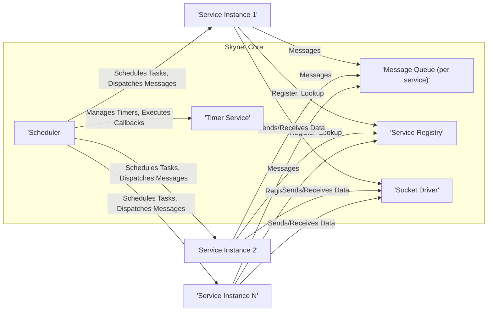
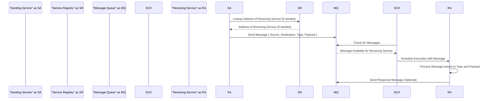

# Project Design Document: Skynet - Improved

**Version:** 1.1
**Date:** October 26, 2023
**Author:** AI Software Architect

## 1. Introduction

This document provides an enhanced design overview of the Skynet project, a lightweight and performant concurrency framework implemented in C and Lua. Based on the source code available at [https://github.com/cloudwu/skynet](https://github.com/cloudwu/skynet), this document aims to provide a more detailed and nuanced understanding of its architecture, components, and data flow. This improved design document is specifically tailored to facilitate a more effective and comprehensive threat modeling exercise, offering deeper insights for developers, security analysts, and anyone seeking a thorough understanding of Skynet's internal mechanisms.

## 2. Goals

The primary goals of this improved design document are to:

*   Provide a more in-depth and precise description of Skynet's architecture, highlighting key interactions.
*   Elaborate on the functionalities and responsibilities of each key component within the framework.
*   Offer a clearer and more detailed illustration of the data flow, including message types and routing.
*   Serve as a robust and comprehensive foundation for subsequent threat modeling activities, enabling more targeted analysis.
*   Document the design in a structured, easily understandable, and maintainable format, adhering to specified guidelines.

## 3. Architectural Overview

Skynet's architecture is centered around a microkernel design, emphasizing minimal core functionalities and delegating most features to independent, message-passing services. This promotes a highly modular, scalable, and fault-tolerant system. The core manages the scheduling and message delivery, while services encapsulate specific functionalities.

**Refined Architectural Principles:**

*   **Asynchronous Message Passing:**  Services communicate exclusively through asynchronous messages, decoupling senders and receivers and enhancing responsiveness.
*   **Actor-Based Concurrency:** Each service instance operates as an independent actor, processing messages sequentially within its own context, simplifying concurrency management.
*   **Centralized, Cooperative Scheduling:** The central scheduler manages the execution of service coroutines in a cooperative manner, relying on services to yield control.
*   **Dynamic Service Discovery:** The service registry enables dynamic discovery and communication between services without requiring prior knowledge of their locations.
*   **Event-Driven I/O:** The framework leverages non-blocking I/O and event notification mechanisms for efficient handling of network operations and external events.

## 4. Key Components

This section provides a more detailed explanation of the core components within the Skynet framework:

*   **Scheduler:**
    *   The central orchestrator, responsible for managing the execution of all service coroutines.
    *   Continuously monitors service message queues and dispatches messages to the appropriate service for processing.
    *   Implements a cooperative scheduling algorithm, relying on services to voluntarily yield control to the scheduler.
    *   Manages the overall fairness and responsiveness of the system.
*   **Message Queue (per service):**
    *   A dedicated queue for each service instance, holding incoming messages awaiting processing.
    *   Messages are typically enqueued by other services or external entities.
    *   The scheduler retrieves messages from these queues based on scheduling priorities and availability.
    *   The implementation details of the queue (e.g., FIFO) can influence message processing order.
*   **Service Instance:**
    *   Represents an active execution unit of a service, typically implemented as a lightweight Lua coroutine.
    *   Encapsulates the service's state and logic.
    *   Processes messages from its assigned message queue sequentially.
    *   Can send messages to other services by referencing their addresses.
*   **Service Registry:**
    *   A crucial component for service discovery and inter-service communication.
    *   Maintains a mapping between service names (or aliases) and their unique addresses (numeric identifiers).
    *   Allows services to dynamically locate and communicate with each other without hardcoded dependencies.
    *   The registry itself is a service and can be queried by other services.
*   **Timer Service:**
    *   Provides a mechanism for services to schedule events or actions to occur after a specified delay.
    *   Services can register timers with the timer service, specifying a callback function or message to be sent upon expiration.
    *   The scheduler manages the execution of timer callbacks.
*   **Socket Driver:**
    *   Handles all network-related operations for Skynet services.
    *   Provides an abstraction layer over underlying socket APIs (e.g., TCP, UDP).
    *   Manages the creation, connection, sending, and receiving of data over network sockets.
    *   Typically employs non-blocking I/O with event notifications (e.g., `epoll`, `select`).
*   **Lua VM (per service or shared):**
    *   Provides the runtime environment for executing the Lua code that defines service logic.
    *   Each service instance typically runs within its own isolated Lua VM for better isolation, although shared VMs are possible in certain configurations.
    *   Manages memory allocation, garbage collection, and execution of Lua scripts.
*   **Bootstrap Service:**
    *   The initial service launched when the Skynet process starts.
    *   Responsible for initializing core services (like the Service Registry and Timer Service) and potentially launching other user-defined services based on configuration.
    *   Plays a critical role in the initial setup and configuration of the Skynet environment.

## 5. Data Flow

This section provides a more detailed breakdown of the data flow within Skynet, including different message types and routing mechanisms:

1. **Message Origination:** A service instance (e.g., 'Game Server') needs to send information or a command to another service (e.g., 'Database Service').
2. **Address Resolution (if needed):** The sending service may need to look up the address of the target service using the Service Registry, providing the target service's name.
3. **Message Construction:** The sending service constructs a message, which is typically a Lua table containing relevant data. This message includes:
    *   **Source Address:** The address of the sending service.
    *   **Destination Address:** The address of the target service.
    *   **Message Type/ID:**  An identifier indicating the purpose or type of the message.
    *   **Message Payload:** The actual data being transmitted.
4. **Message Sending:** The sending service uses the `skynet.send` function (or similar) to send the message.
5. **Message Enqueueing:** The Skynet core routes the message to the message queue of the destination service based on the destination address.
6. **Scheduler Activity:** The Scheduler continuously monitors the message queues of all services.
7. **Message Dispatch:** When the Scheduler finds a message in the destination service's queue and the service is ready to process, it dispatches the message to the service's coroutine.
8. **Message Processing:** The destination service's coroutine receives the message and executes the corresponding logic based on the message type and payload.
9. **Response (Optional):** The destination service may send a response message back to the original sender, following a similar process.

**Key Data Structures and Concepts:**

*   **Message Structure:**  Messages are typically Lua tables, providing a flexible way to structure data.
*   **Service Addresses:** Unique integer identifiers assigned to each service instance by the Skynet core.
*   **Message Routing:** The Skynet core uses the destination address in the message header to route messages to the correct service queue.
*   **System Messages:**  Skynet also uses internal system messages for managing services and communication within the core framework.

## 6. Deployment Considerations

Skynet's lightweight nature and minimal dependencies allow for flexible deployment options:

*   **Single-Process Deployment:** All services run within a single operating system process, suitable for smaller applications or development environments. Communication between services is highly efficient in this mode.
*   **Multi-Process Deployment (Single Machine):** Services can be distributed across multiple OS processes on the same machine, providing better isolation and fault tolerance. Inter-process communication relies on shared memory or other IPC mechanisms.
*   **Distributed Deployment (Multiple Machines):** Services can be deployed across multiple physical or virtual machines, communicating over a network using TCP or UDP sockets. This enables horizontal scalability and resilience.
*   **Containerized Deployment:** Skynet services can be easily containerized using Docker or similar technologies, facilitating deployment and management in modern cloud environments. Orchestration platforms like Kubernetes can manage and scale Skynet deployments.

**Network Communication Details:**

*   Skynet's `socket driver` handles the complexities of network communication, abstracting away low-level socket operations.
*   Services interact with the socket driver through a message-passing interface.
*   For distributed deployments, service addresses typically include network information (IP address and port).
*   Considerations for network security (e.g., TLS encryption) are crucial in distributed environments.

## 7. Security Considerations (For Threat Modeling)

This section provides a more detailed breakdown of potential security concerns, categorized for clarity during threat modeling:

**Message-Related Threats:**

*   **Message Spoofing/Forgery:**
    *   Can a malicious actor send messages with a forged source address, impersonating a legitimate service?
    *   Lack of inherent message authentication mechanisms makes this a potential vulnerability.
    *   Consider the impact of a malicious service sending commands on behalf of another.
*   **Message Tampering:**
    *   Can an attacker intercept and modify messages in transit, especially in distributed deployments without encryption?
    *   The integrity of message content cannot be guaranteed without additional security measures.
*   **Replay Attacks:**
    *   Can an attacker capture and resend legitimate messages to trigger unintended actions?
    *   Lack of message sequencing or unique identifiers makes Skynet susceptible to replay attacks.
*   **Denial of Service (DoS) via Message Flooding:**
    *   Can an attacker overwhelm a service's message queue with a large volume of messages, preventing it from processing legitimate requests?
    *   Lack of built-in rate limiting or queue management mechanisms can exacerbate this.

**Service and Registry Threats:**

*   **Service Impersonation/Registration Hijacking:**
    *   Can a malicious actor register a service with the same name as a legitimate service, intercepting messages intended for the real service?
    *   The security of the service registration process is critical.
*   **Service Registry Manipulation:**
    *   Can an attacker modify the Service Registry to redirect messages to malicious services or disrupt communication?
    *   Access control and integrity of the Service Registry are important security considerations.
*   **Unauthorized Service Interaction:**
    *   Can a service send messages to other services without proper authorization?
    *   Skynet lacks built-in access control mechanisms for inter-service communication.

**Network and Infrastructure Threats:**

*   **Man-in-the-Middle (MITM) Attacks:**
    *   In distributed deployments, communication between nodes is vulnerable to interception and manipulation if not encrypted (e.g., using TLS).
*   **Network Sniffing:**
    *   Sensitive information within messages can be exposed if network traffic is not encrypted.
*   **Compromised Nodes:**
    *   If a node running Skynet services is compromised, attackers can gain control over those services and potentially the entire system.

**Code and Execution Threats:**

*   **Lua Code Injection:**
    *   If service logic directly uses untrusted input in Lua `loadstring` or similar functions, it can lead to arbitrary code execution.
*   **Dependency Vulnerabilities:**
    *   Vulnerabilities in the underlying C libraries or the Lua interpreter can be exploited.
*   **Resource Exhaustion:**
    *   Malicious services can consume excessive CPU, memory, or network resources, impacting other services or the entire system.

**Timer Service Abuse:**

*   **Malicious Timer Scheduling:**
    *   Can an attacker schedule timers to trigger actions at inappropriate times or overload the system with timer events?

## 8. Future Considerations

*   **Implementation of Authentication and Authorization:** Adding mechanisms to verify the identity of services and control access to resources and communication channels.
*   **Message Encryption:** Implementing encryption for inter-service communication, especially in distributed environments, to protect message confidentiality and integrity.
*   **Rate Limiting and Flow Control:** Introducing mechanisms to prevent message flooding and ensure fair resource allocation.
*   **Secure Service Registration:** Enhancing the security of the service registration process to prevent unauthorized registration or hijacking.
*   **Input Validation and Sanitization Framework:** Providing tools and guidelines for services to validate and sanitize external input to prevent code injection vulnerabilities.
*   **Security Auditing and Logging:** Implementing comprehensive logging of security-related events for monitoring and incident response.

This improved design document provides a more comprehensive and detailed understanding of the Skynet project, specifically tailored to facilitate a more effective and targeted threat modeling process. By understanding the architecture, components, and data flow in detail, potential security vulnerabilities can be identified and mitigated more effectively.