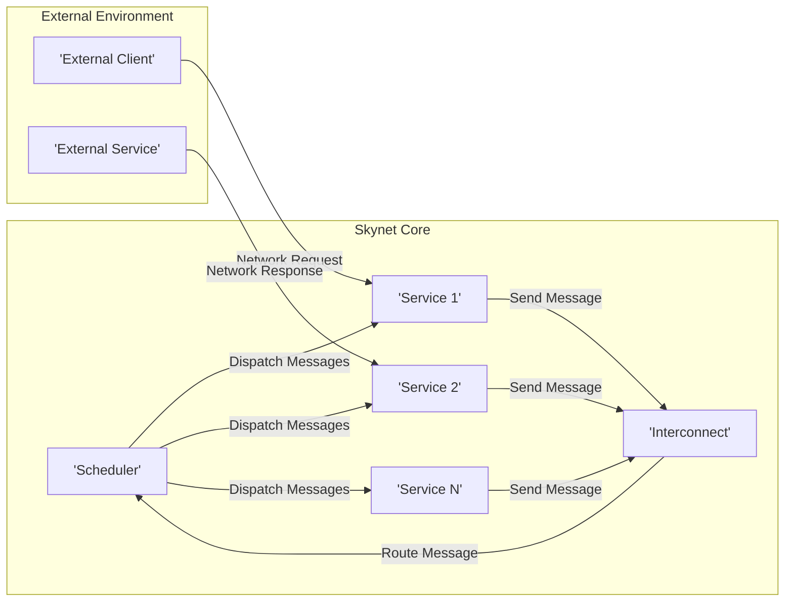
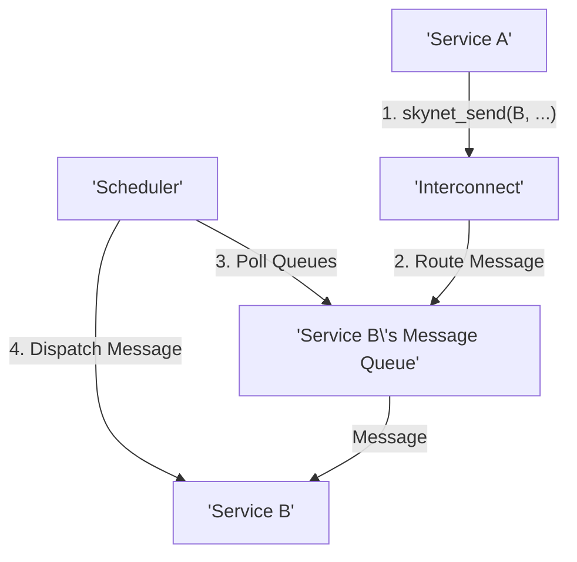

# Project Design Document: Skynet (Improved)

**Project Name:** Skynet

**Project Repository:** [https://github.com/cloudwu/skynet](https://github.com/cloudwu/skynet)

**Document Version:** 1.1

**Date:** October 26, 2023

**Author:** AI Software Architect

## 1. Introduction

This document provides an enhanced design overview of the Skynet project, a lightweight concurrency framework implemented in C. Skynet employs a message-passing architecture inspired by the actor model found in Erlang. This detailed design serves as a crucial input for subsequent threat modeling activities, providing a comprehensive understanding of Skynet's structure and interactions.

## 2. Project Overview

Skynet is engineered as a lean and efficient platform for constructing network services. It offers a core scheduler and a robust mechanism for creating and managing independent entities known as "services." These services communicate asynchronously via message passing. Key characteristics include:

* **Actor-Based Concurrency:** Services operate as isolated actors, communicating solely through asynchronous messages.
* **Lightweight Threads (Coroutines):**  Facilitates efficient context switching between services, minimizing overhead.
* **Asynchronous Message Passing:** The primary communication paradigm between services, ensuring non-blocking operations.
* **Service Addressing and Discovery:** A system for uniquely identifying and locating services within the framework.
* **Extensible Architecture:**  Accommodates custom services developed in either C or Lua.
* **Core Functionality via Built-in Services:** Provides essential capabilities such as timers, network socket management, and logging.

## 3. Architectural Overview

Skynet's architecture is centered around a core scheduler responsible for managing a pool of lightweight threads (coroutines). The fundamental units of execution are "services," each possessing its own isolated message queue.

**Key Components:**

* **Scheduler:** The central orchestrator, responsible for managing the lifecycle and execution of all services. It actively polls message queues and dispatches messages to the appropriate service's coroutine.
* **Services:**  The fundamental building blocks of an application built on Skynet. Each service is characterized by:
    * **Unique Address (Integer ID):**  A distinct identifier for message routing.
    * **Dedicated Message Queue:**  A buffer for incoming messages.
    * **Coroutine for Execution:**  The unit of execution for the service's logic.
    * **Implementation Language (C or Lua):** Services can be written in either language.
* **Interconnect:**  The logical representation of the message passing infrastructure. It handles the routing of messages between services based on their addresses.
* **Built-in Services:** Core services provided as part of the Skynet framework:
    * **`logger`:**  Centralizes and manages logging activities within the system.
    * **`timer`:**  Provides mechanisms for scheduling events and triggering actions after specified delays.
    * **`socketdriver`:**  Manages network socket operations, enabling communication with external systems.
    * **`console`:**  Offers a command-line interface for interacting with and monitoring the Skynet instance.
    * **`snlua`:**  Hosts the Lua virtual machine, enabling the execution of Lua-based services.
* **External Interfaces:** Points of interaction between the Skynet system and the outside world:
    * **Network Sockets:**  The primary mechanism for services to communicate over network connections.
    * **Console Interface:** Allows for administrative control and monitoring of the Skynet instance.

## 4. Component Details

### 4.1. Scheduler

* **Responsibilities:**
    * Maintains the registry of all active services within the Skynet instance.
    * Continuously monitors the message queues of all services for incoming messages.
    * Dispatches messages to the appropriate service's coroutine for processing.
    * Manages the pool of underlying worker threads responsible for executing coroutines.
    * Oversees the creation and termination of service instances.
* **Key Functionality:**
    * `skynet_poll()`: The main event loop that iteratively checks for and dispatches messages.
    * `skynet_send()`: The function used by services to transmit messages to other services.
    * `skynet_context_new()`:  Creates and initializes a new service instance.
    * `skynet_context_kill()`:  Terminates a running service.

### 4.2. Service

* **Responsibilities:**
    * Implements the specific business logic and functionality of the application.
    * Receives and processes messages from other services or external sources.
    * Sends messages to other services to coordinate actions or exchange data.
    * Interacts with external systems via network sockets or other available mechanisms.
* **Key Functionality:**
    * `skynet_callback()`: The designated entry point for a service's execution logic.
    * `skynet_receive()`:  Retrieves the next message from the service's incoming message queue.
    * `skynet_send()`: Transmits a message to a specified target service.
    * Access to APIs of built-in services (e.g., for timer management or socket operations).
* **Service Types:**
    * **C Services:**  Implemented using C functions and leveraging the Skynet C API. These offer closer-to-the-metal performance.
    * **Lua Services:** Implemented using Lua scripts and the Skynet Lua API. These provide rapid development and flexibility.

### 4.3. Interconnect

* **Responsibilities:**
    * Acts as the message router within the Skynet framework.
    * Directs messages to the correct destination service based on the service's address.
    * Manages the individual message queues associated with each service.
* **Key Functionality:**
    * Maintains the mapping between service addresses and their respective message queues.
    * Implements efficient message delivery mechanisms to minimize latency.

### 4.4. Built-in Services

* **`logger`:**
    * Receives logging messages from various services within the system.
    * Writes log messages to a designated output (e.g., file, console).
    * Provides configuration options for controlling the verbosity and format of log messages.
* **`timer`:**
    * Enables services to schedule events to occur after a specified duration.
    * Sends timer expiry notifications as messages back to the requesting service.
* **`socketdriver`:**
    * Provides a low-level interface for services to interact with network sockets.
    * Handles socket creation, binding, listening, connection establishment, sending, and receiving of data.
    * Employs asynchronous I/O operations to avoid blocking the service's execution.
* **`console`:**
    * Offers a basic command-line interface for interacting with the Skynet runtime.
    * Allows for sending commands to specific services for debugging or management purposes.
* **`snlua`:**
    * Embeds and manages the Lua virtual machine within the Skynet process.
    * Executes Lua service scripts, providing the runtime environment for Lua-based services.
    * Exposes the Skynet Lua API to Lua services, enabling them to interact with the framework.

## 5. Data Flow

The fundamental data flow pattern in Skynet revolves around asynchronous message passing between services.

1. **Message Initiation:** A service (referred to as Service A) intends to communicate with another service (Service B).
2. **Message Transmission:** Service A invokes the `skynet_send()` function, specifying the target service's address, the message type or identifier, and the message data itself.
3. **Interconnect Routing:** The message is then passed to the Interconnect component, which determines the appropriate destination based on the target service address.
4. **Message Queuing:** The Interconnect places the message into the dedicated message queue associated with Service B.
5. **Scheduler Notification:** The Scheduler, during its regular polling cycle, detects the presence of a new message in Service B's queue.
6. **Message Delivery:** The Scheduler dispatches the message to the currently active coroutine of Service B.
7. **Message Processing:** Service B's coroutine receives the message and executes the corresponding logic to process the received data.

## 6. Security Considerations (Pre-Threat Modeling)

This section outlines potential security considerations derived from the architectural design. These points will serve as a starting point for a more in-depth threat modeling exercise.

* **Inter-Service Communication Security:**
    * **Message Spoofing:**  A malicious service could potentially forge messages, impersonating another service and potentially gaining unauthorized access or triggering unintended actions.
    * **Message Tampering:**  While messages are generally internal to the process, vulnerabilities could exist that allow for interception and modification of messages in transit, leading to data corruption or manipulation.
    * **Denial of Service (DoS):** A compromised or malicious service could flood another service with a large volume of messages, overwhelming its message queue and hindering its ability to process legitimate requests.
* **External Interface Security:**
    * **Network Vulnerabilities:** Services interacting with external networks via the `socketdriver` are susceptible to common network-based attacks such as buffer overflows, injection flaws (e.g., SQL injection if interacting with databases), and man-in-the-middle attacks if communication is not encrypted.
    * **Input Validation Failures:** Insufficient validation of data received from external sources can lead to vulnerabilities like command injection or cross-site scripting (if the service generates web content).
* **Resource Management and Security:**
    * **Resource Exhaustion:** A malicious service could consume excessive CPU time, memory, or network bandwidth, potentially impacting the performance and stability of other services and the overall Skynet instance.
    * **Deadlock Scenarios:**  Careless message passing patterns or resource contention could lead to deadlocks, where services become blocked indefinitely, halting critical operations.
* **Built-in Service Security:**
    * **Vulnerabilities in Core Components:** Security flaws within the implementation of built-in services like `socketdriver` or `timer` could be exploited to compromise the entire Skynet instance.
    * **Privilege Escalation via Built-in Services:** A malicious service might attempt to leverage the capabilities of built-in services to perform actions beyond its intended scope, such as accessing sensitive files or making unauthorized network connections.
* **Lua Integration Security:**
    * **Lua Code Injection:** If Lua service code is dynamically loaded from untrusted sources or accepts user-provided input that is not properly sanitized, it could lead to arbitrary code execution within the Lua VM.
    * **Lua Sandbox Escapes:**  While Lua provides a sandbox environment, vulnerabilities might exist that allow malicious Lua code to escape the sandbox and access underlying system resources or the Skynet C API directly.
* **Logging Security:**
    * **Information Disclosure in Logs:** Log messages might inadvertently contain sensitive information (e.g., API keys, passwords, personal data), which could be exposed if log files are not properly secured.
    * **Log Tampering or Erasure:**  If log files can be modified or deleted by unauthorized entities, it can hinder forensic investigations and obscure malicious activity.

## 7. Assumptions and Constraints

* **Deployment in a Reasonably Secure Environment:** It is assumed that the Skynet instance will be deployed within an environment with basic security measures in place, such as network firewalls and access controls.
* **Lack of Native Authentication/Authorization:** Skynet, as a core framework, does not provide built-in mechanisms for user authentication or authorization. These functionalities are expected to be implemented within the application logic of individual services.
* **Reliance on Operating System Security Features:** Skynet depends on the underlying operating system for fundamental security features like process isolation, memory protection, and user permissions.
* **Typically Deployed as a Single Process:** A Skynet instance is generally run as a single operating system process, which has implications for isolation and resource sharing.

## 8. Diagrams

The architectural and data flow diagrams presented earlier offer a visual representation of the system's structure and message flow. These diagrams are essential for understanding the relationships between components and identifying potential points of interaction for threat analysis.

This improved design document provides a more detailed and nuanced understanding of the Skynet project's architecture, explicitly highlighting potential security considerations. This information is critical for conducting a thorough and effective threat modeling exercise to identify and mitigate potential vulnerabilities.