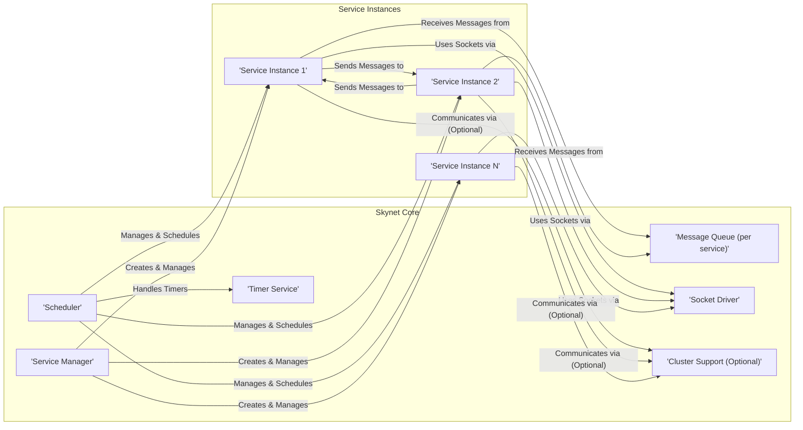
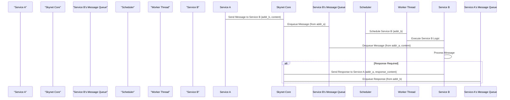

## Project Design Document: Skynet

**Project Name:** Skynet

**Project Repository:** https://github.com/cloudwu/skynet

**Document Version:** 1.1

**Date:** October 26, 2023

**Author:** AI Software Architect

### 1. Introduction

This document provides a detailed architectural design of the Skynet project, a lightweight concurrency framework in C. This document aims to provide a comprehensive understanding of Skynet's components, their interactions, and data flow, which will serve as the foundation for subsequent threat modeling activities. This revision includes more detailed explanations and clarifies certain aspects of the system.

### 2. Goals of Skynet

*   Provide a simple and efficient way to build concurrent applications.
*   Offer a message-passing based concurrency model.
*   Support dynamic service creation and management.
*   Be lightweight and have minimal dependencies.
*   Facilitate the development of scalable and robust applications.
*   Enable the creation of applications using Lua for service logic.

### 3. Architectural Overview

Skynet employs an actor-based concurrency model where independent services communicate via asynchronous message passing. The core of Skynet is a scheduler that manages these services and facilitates message delivery. Services are typically implemented in Lua, leveraging Skynet's C core for concurrency and communication. Each service has a unique address within the Skynet instance.

### 4. Detailed Component Description

*   **Scheduler:**
    *   **Functionality:** The central component responsible for managing the execution of services. It maintains a queue of runnable services and dispatches them to available worker threads. The scheduler is event-driven, reacting to messages in service queues, timer expirations, and socket events. It employs a cooperative multitasking approach, where services voluntarily yield control back to the scheduler.
    *   **Inputs:** Messages destined for services, timer events from the Timer Service, socket events from the Socket Driver.
    *   **Outputs:** Execution of service logic on worker threads, triggering the sending of messages to other services.
    *   **Key Technologies:** C, Thread management (pthreads or similar), likely uses a priority queue or similar mechanism for scheduling.

*   **Service Manager:**
    *   **Functionality:** Responsible for creating, destroying, and managing the lifecycle of service instances. It loads service code (typically Lua scripts or C modules), initializes them, and assigns them unique addresses. The Service Manager also keeps track of all active services.
    *   **Inputs:** Requests to create new services (specifying the service type/code), requests to terminate services (by address).
    *   **Outputs:** New service instances with assigned addresses, termination signals to services, service lookup information.
    *   **Key Technologies:** C, Dynamic loading of libraries (dlopen/dlsym for C modules), Lua C API for interacting with Lua services, management of service address space.

*   **Message Queue (per service):**
    *   **Functionality:** Each service instance has its own dedicated message queue where incoming messages are stored until the service processes them. This ensures asynchronous communication and decouples senders from receivers. The queue typically operates on a FIFO (First-In, First-Out) basis.
    *   **Inputs:** Messages sent from other services or the core system, including internal messages.
    *   **Outputs:** Messages consumed by the service instance when it's scheduled to run.
    *   **Key Technologies:** C, Lock-free queue implementation (likely to minimize contention and improve performance).

*   **Timer Service:**
    *   **Functionality:** Provides a mechanism for services to schedule events to occur after a specified delay. Services register timers with a callback function (within the service's Lua code) and a delay. The Timer Service notifies the requesting service when the timer expires.
    *   **Inputs:** Requests from services to set timers, including the delay and the service's address.
    *   **Outputs:** Timer expiration events delivered as messages to the requesting service's message queue.
    *   **Key Technologies:** C, System timers (e.g., `timerfd` on Linux, or similar platform-specific mechanisms), management of timer events.

*   **Socket Driver:**
    *   **Functionality:** Handles network communication for services. It provides an asynchronous, non-blocking interface for services to send and receive data over sockets (TCP, UDP). It manages the underlying socket operations and notifies services of relevant events (e.g., data received, connection established, connection closed).
    *   **Inputs:** Requests from services to send data to specific network addresses, incoming network data from established connections, connection requests.
    *   **Outputs:** Outgoing network data sent over sockets, received data delivered as messages to the appropriate service, notifications about socket events.
    *   **Key Technologies:** C, Socket programming (e.g., `socket`, `bind`, `listen`, `accept`, `send`, `recv`, `epoll`/`select` for event notification), management of socket states.

*   **Cluster Support (Optional):**
    *   **Functionality:** Enables communication between Skynet nodes running on different machines. This allows for building distributed applications where services can reside on different physical hosts. It handles message routing between nodes.
    *   **Inputs:** Messages destined for services on remote nodes (identified by a node ID and service address), messages received from remote nodes.
    *   **Outputs:** Messages sent to remote nodes over the network.
    *   **Key Technologies:** C, Network communication (likely TCP for reliable communication), serialization/deserialization of messages (e.g., `lua-seri` or a similar mechanism) for transmission across the network, node discovery and management.

*   **Service Instances:**
    *   **Functionality:** Independent units of execution that perform specific tasks within the application. They communicate with each other by sending and receiving messages. Typically implemented in Lua, they contain the application-specific logic. Each service has a unique address within the Skynet instance, allowing other services to target messages to it.
    *   **Inputs:** Messages from other services or the core system (e.g., timer events, socket data).
    *   **Outputs:** Messages sent to other services or the core system, actions performed based on received messages (e.g., interacting with external systems, updating internal state).
    *   **Key Technologies:** Lua, potentially C for performance-critical parts wrapped as modules.

### 5. Data Flow

The primary mode of interaction in Skynet is asynchronous message passing between services, identified by their unique addresses.

1. **Message Sending:** A service (Service A, with address `addr_a`) wants to communicate with another service (Service B, with address `addr_b`). Service A calls a Skynet API function (provided by the C core) to send a message. This call includes the destination service's address (`addr_b`), the sender's address (`addr_a`), the message type, and the message content (typically a Lua string or table).
2. **Message Routing:** The Skynet core, specifically the Scheduler or a related component, uses the destination address (`addr_b`) to identify the correct message queue.
3. **Message Enqueueing:** The message is added to the message queue of the destination service (Service B).
4. **Scheduler Activity:** The Skynet scheduler continuously monitors the message queues of all services. When a service has messages in its queue and is ready to run (has yielded previously or is newly created), the scheduler assigns it to an available worker thread.
5. **Message Processing:** The worker thread executes the logic of Service B. Service B retrieves messages from its queue one by one. The Skynet core provides the message content, sender address, and message type to the service's message handler function (typically a Lua function).
6. **Response (Optional):** Service B may send a response message back to Service A. It follows the same message-passing mechanism, calling the Skynet API to send a message with the destination address set to `addr_a`.

### 6. Deployment Model

Skynet applications are typically deployed as a single operating system process containing the Skynet core and all its services. For larger, more complex applications requiring higher availability or scalability, multiple Skynet nodes can be deployed and interconnected using the optional cluster support.

*   **Single Node Deployment:** All services run within a single Skynet process on one machine. This is the simplest deployment model, suitable for many applications.
*   **Multi-Node Deployment (Clustered):** Multiple Skynet processes run on different machines, communicating with each other over a network. This allows for horizontal scaling, increased resilience (if one node fails, others can continue operating), and distribution of workload. Cluster communication relies on network connections and message serialization.

### 7. Security Considerations (Initial)

This section outlines initial security considerations that will be further explored during threat modeling. These are potential areas of vulnerability that need careful examination.

*   **Inter-Service Communication:**
    *   **Message Forgery/Spoofing:** Can a malicious service send messages appearing to originate from a different, trusted service? This could lead to unauthorized actions.
    *   **Message Snooping/Eavesdropping:** Can a service intercept and read messages intended for other services within the same Skynet instance?
    *   **Denial of Service (DoS):** Can a malicious service flood another service with a large number of messages, overwhelming its message queue and preventing it from processing legitimate requests?
    *   **Message Injection:** Can a malicious service inject crafted messages that exploit vulnerabilities in the receiving service's message processing logic?

*   **External Communication (Sockets):**
    *   **Input Validation Vulnerabilities:** Are data received from external sources (via the Socket Driver) properly validated to prevent injection attacks (e.g., buffer overflows, command injection) in the receiving service?
    *   **Unauthorized Access/Exposure:** Can external entities communicate with services that should not be publicly accessible, potentially exposing sensitive data or functionality?
    *   **Man-in-the-Middle (MITM) Attacks:** If cluster communication or external socket communication is not encrypted, can an attacker intercept and potentially modify messages?

*   **Service Management:**
    *   **Unauthorized Service Creation/Destruction:** Can a malicious actor or compromised service create or destroy other services without proper authorization, disrupting the application's functionality?
    *   **Code Injection during Service Loading:** Could a vulnerability in the service loading mechanism (e.g., if service code paths are not properly sanitized) allow for the execution of arbitrary code when a new service is created?

*   **Resource Management:**
    *   **Resource Exhaustion:** Can a malicious or poorly written service consume excessive resources (CPU, memory, network bandwidth), impacting the performance and stability of other services or the entire Skynet instance?
    *   **Infinite Loops/Deadlocks:** Can a service enter an infinite loop or a deadlock state, tying up resources and potentially causing the Skynet instance to become unresponsive?

*   **Cluster Communication:**
    *   **Authentication and Authorization:** How are nodes in the cluster authenticated to prevent unauthorized nodes from joining? How is access to services on remote nodes controlled?
    *   **Data Integrity and Confidentiality:** Is communication between cluster nodes encrypted to prevent eavesdropping and tampering of messages exchanged between nodes?

### 8. Diagrams

The diagrams provided throughout this document illustrate the architecture and data flow of Skynet.

### 9. Conclusion

This document provides an improved and more detailed design overview of the Skynet project. It elaborates on the key components, their functionalities, and their interactions, offering a clearer understanding of the system's architecture. This enhanced information will be valuable for conducting a thorough threat model to identify potential security vulnerabilities and design appropriate mitigation strategies.