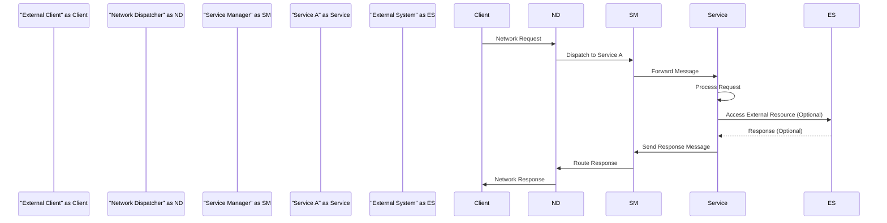
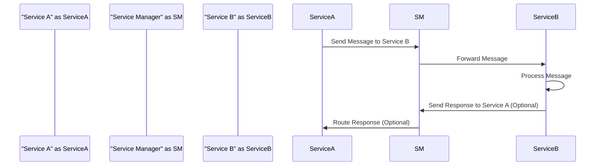

# Project Design Document: Skynet Framework for Threat Modeling

**Project Name:** Skynet Framework

**Project Repository:** [https://github.com/cloudwu/skynet](https://github.com/cloudwu/skynet)

**Document Version:** 1.1

**Date:** 2023-10-27

**Author:** Gemini (AI Expert in Software, Cloud and Cybersecurity Architecture)

**Changes from Version 1.0:**

*   Enhanced Security Considerations section with more granular threat categorization and examples.
*   Expanded Deployment Model section with details on containerization and orchestration.
*   Refined Security Recommendations for better actionability.
*   Improved clarity and conciseness throughout the document.
*   Verified and corrected Mermaid diagrams.

## 1. Project Overview

### 1.1. Introduction

Skynet is a lightweight, open-source game server framework written in C and Lua, designed for high concurrency, scalability, and ease of use in building network services. While its origins are in game server development, Skynet's architecture is versatile and applicable to a broad spectrum of real-time applications, distributed systems, and backend services.  It leverages an actor-based concurrency model, where services communicate via message passing, simplifying the development of complex concurrent applications. This design document provides a detailed architectural overview of Skynet to facilitate effective threat modeling.

### 1.2. Project Goals

The core objectives of Skynet are:

*   **High Concurrency:** To efficiently manage a large volume of concurrent connections and operations.
*   **Scalability:** To enable horizontal scaling by easily adding nodes to a cluster, accommodating increasing workloads.
*   **Simplicity:** To offer a clear and intuitive API for service development, reducing complexity.
*   **Performance:** To achieve high performance with minimal overhead, ensuring responsiveness and efficiency.
*   **Flexibility:** To support diverse network protocols and application types, catering to varied use cases.

### 1.3. Target Audience

This document is intended for:

*   **Security Architects and Engineers:** To gain the necessary architectural understanding for conducting thorough threat modeling and security assessments.
*   **Software Developers:** To acquire a deep understanding of the system's design for effective development, debugging, and maintenance of Skynet-based applications.
*   **DevOps and Operations Teams:** To understand the deployment architecture, operational considerations, and security implications for managing Skynet environments.

## 2. Architecture Overview

### 2.1. High-Level Architecture Diagram

```mermaid
graph LR
    subgraph "Skynet Node"
        direction TB
        "External Clients" -->|"Network Requests"| "Network Dispatcher"
        "Network Dispatcher" -->|"Service Messages"| "Service Manager"
        "Service Manager" -->|"Service Messages"| "Service A"
        "Service Manager" -->|"Service Messages"| "Service B"
        "Service Manager" -->|"Service Messages"| "Service N"
        "Service A" -->|"Service Messages"| "Service Manager"
        "Service B" -->|"Service Messages"| "Service Manager"
        "Service N" -->|"Service Messages"| "Service Manager"
        "Service A" -->|"External Resources (DB, Cache, etc.)"| "External Systems"
        "Service B" -->|"External Resources (DB, Cache, etc.)"| "External Systems"
        "Service N" -->|"External Resources (DB, Cache, etc.)"| "External Systems"
        "Service Manager" -->|"Scheduler Tasks"| "Scheduler"
        "Scheduler" --> "Service A"
        "Scheduler" --> "Service B"
        "Scheduler" --> "Service N"
    end
    subgraph "External Environment"
        "External Clients"
        "External Systems"
    end
    "Skynet Node" -- "Inter-Node Communication (Optional)" --> "Skynet Node (Cluster)"
    classDef internal fill:#f9f,stroke:#333,stroke-width:2px
    classDef external fill:#ccf,stroke:#333,stroke-width:2px
    class "Skynet Node" internal;
    class "External Environment" external;
```

### 2.2. Architectural Components

Skynet's architecture is composed of these key components:

*   **Scheduler:** The core component responsible for orchestrating service execution. It manages a cooperative multitasking environment, ensuring fair allocation of CPU time and handling system events.
*   **Service Manager (Agent):**  The central management unit for services within a Skynet node. It handles service registration, discovery, message routing, and lifecycle management (creation, termination).
*   **Services:** Independent, actor-like computational units. Implemented in Lua or C, services encapsulate application logic and state, communicating asynchronously via message passing. Each service has its own message queue and execution context.
*   **Network Dispatcher:** The network I/O handler, responsible for accepting external connections, managing network protocols, and dispatching network messages to the appropriate services after deserialization.
*   **Message Queue:**  Each service is equipped with a message queue to buffer incoming messages. This facilitates asynchronous communication and decouples services, enhancing system responsiveness.
*   **Cluster Manager (Optional):** For distributed deployments, this component (which can be a service or external module) manages inter-node communication and coordination, enabling service discovery and management across a Skynet cluster.
*   **External Systems Interface:** Services can interact with external resources such as databases, caches, message queues, and other external services, extending Skynet's capabilities.

### 2.3. Concurrency Model

Skynet's concurrency model is based on the actor pattern, characterized by:

*   **Services as Actors:** Services are treated as actors, encapsulating their state and behavior.
*   **Asynchronous Message Passing:** Communication between services is exclusively through asynchronous message passing, promoting loose coupling and concurrency.
*   **Single-Threaded (or Coroutine-based) Services:**  Each service typically operates within a single thread or Lua coroutine. Concurrency is achieved by the scheduler efficiently switching between multiple services.
*   **Non-Blocking I/O:** Skynet utilizes non-blocking I/O operations to efficiently handle network events and service messages, preventing blocking of the scheduler and maintaining responsiveness.

## 3. Component Details

### 3.1. Scheduler

*   **Functionality:**
    *   Core scheduling and execution of services.
    *   Implements cooperative multitasking for fair resource allocation.
    *   Handles system timers and events.
*   **Implementation:** Primarily in C for performance and low-level system interaction.
*   **Security Considerations:**
    *   **DoS Vulnerability:** Scheduler performance bottlenecks or resource exhaustion can lead to system-wide Denial of Service.
    *   **Scheduler Bugs:** Errors in the scheduler logic can cause unpredictable service behavior or system crashes.
    *   **Unfair Scheduling:**  Potential for malicious services to exploit scheduling algorithms to gain disproportionate resources, starving other services.

### 3.2. Service Manager (Agent)

*   **Functionality:**
    *   Service registration and discovery within a node.
    *   Message routing between services based on addresses.
    *   Service lifecycle management (creation, termination, monitoring).
*   **Implementation:** A combination of C for core functions and Lua for management logic.
*   **Security Considerations:**
    *   **Service Spoofing:**  Vulnerable service registration can allow malicious entities to register services under false identities.
    *   **Unauthorized Service Interaction:** Lack of access control in message routing can lead to unauthorized services intercepting or sending messages to other services.
    *   **Agent Compromise:**  Compromise of the Service Manager can lead to full control over the Skynet node and all its services.

### 3.3. Services

*   **Functionality:**
    *   Implementation of application-specific business logic.
    *   Processing of messages from other services and external clients.
    *   State management specific to the service's purpose.
    *   Interaction with external systems and resources.
*   **Implementation:** Primarily in Lua for flexibility and rapid development, with C for performance-critical modules.
*   **Security Considerations:**
    *   **Application Logic Vulnerabilities:** Standard application security vulnerabilities (injection flaws, authentication/authorization bypasses, business logic errors) within service code.
    *   **Input Validation Failures:** Insufficient input validation in services can lead to injection attacks and data corruption.
    *   **Lua Sandbox Escapes (Lua Services):**  If using Lua services, potential vulnerabilities in Lua code or sandbox escapes could allow malicious code execution.
    *   **Dependency Vulnerabilities:** Vulnerabilities in Lua libraries or C modules used by services.
    *   **Data Breaches:** Services handling sensitive data require appropriate data protection measures (encryption, access control).

### 3.4. Network Dispatcher

*   **Functionality:**
    *   Handles network protocols (TCP, UDP, WebSocket, custom).
    *   Manages network connections and socket lifecycle.
    *   Receives and deserializes network data.
    *   Dispatches network messages to services.
    *   Serializes and sends responses back to clients.
*   **Implementation:** Primarily in C for performance and efficient network I/O.
*   **Security Considerations:**
    *   **Network Protocol Vulnerabilities:** Exploitable vulnerabilities in network protocol implementations (e.g., buffer overflows, format string bugs).
    *   **DoS Attacks:** Network Dispatcher is a prime target for DoS attacks aimed at overwhelming network resources or processing capacity.
    *   **Injection Attacks:** Improper handling of network input can lead to injection attacks (e.g., command injection, SQL injection if passed to backend databases).
    *   **Connection Hijacking/Spoofing:** Vulnerabilities allowing attackers to hijack or spoof client connections.
    *   **Unencrypted Communication:** Lack of encryption (e.g., TLS) exposes data in transit to eavesdropping and tampering.

### 3.5. Message Queue

*   **Functionality:**
    *   Asynchronous message buffering for services.
    *   Ensures reliable message delivery within a node.
    *   Decouples message sending and processing.
*   **Implementation:** Typically lock-free queues in C for high performance and concurrency.
*   **Security Considerations:**
    *   **Message Queue Overflow:**  Unbounded message queues can lead to memory exhaustion and DoS if flooded with messages.
    *   **Message Queue Tampering (Less likely in memory queues, more relevant in persistent queues if used):** In scenarios where message queues are persisted (not typical in core Skynet but possible in extensions), vulnerabilities could allow tampering with queued messages.
    *   **Queue Starvation:**  Prioritization mechanisms (if any) in message queues could be exploited to starve certain services of messages.

### 3.6. Cluster Manager (Optional)

*   **Functionality:**
    *   Manages a cluster of Skynet nodes.
    *   Inter-node communication and service discovery across the cluster.
    *   Distributed service deployment and management.
    *   Load balancing and fault tolerance in clustered environments.
*   **Implementation:** Varies depending on the clustering strategy; can be a Skynet service or an external component.
*   **Security Considerations:**
    *   **Insecure Inter-Node Communication:** Lack of encryption and authentication for inter-node communication exposes cluster to eavesdropping and node spoofing.
    *   **Cluster Management Protocol Vulnerabilities:** Exploitable flaws in cluster management protocols can lead to cluster-wide compromise.
    *   **Distributed DoS:** Attacks targeting cluster management can disrupt the entire cluster.
    *   **Node Impersonation:**  Malicious nodes joining or impersonating legitimate nodes in the cluster.
    *   **Data Consistency Issues:** Security vulnerabilities could lead to data inconsistencies across the cluster.

## 4. Data Flow

### 4.1. Typical Request Flow



### 4.2. Internal Service Communication Flow



## 5. Security Considerations for Threat Modeling

This section details potential threat areas for threat modeling, categorized by component and attack type.

### 5.1. Threat Landscape by Component

| Component          | Threat Category                  | Example Threats                                                                 |
|----------------------|-----------------------------------|---------------------------------------------------------------------------------|
| **Scheduler**        | Availability, Integrity          | Scheduler overload (DoS), unfair scheduling, scheduler bugs leading to crashes. |
| **Service Manager**  | Confidentiality, Integrity, Availability | Service spoofing, unauthorized service interaction, agent compromise.           |
| **Services**         | Confidentiality, Integrity, Availability | Application logic flaws, injection vulnerabilities, Lua sandbox escapes, dependency vulnerabilities, data breaches. |
| **Network Dispatcher**| Confidentiality, Integrity, Availability | Protocol exploits, DoS attacks, injection attacks, connection hijacking, unencrypted communication. |
| **Message Queue**    | Availability, Integrity          | Message queue overflow (DoS), message tampering (in persistent queues), queue starvation. |
| **Cluster Manager**  | Confidentiality, Integrity, Availability | Insecure inter-node communication, cluster management protocol flaws, distributed DoS, node impersonation, data inconsistency. |

### 5.2. Common Attack Vectors

*   **Denial of Service (DoS/DDoS):** Overwhelming any component (Network Dispatcher, Scheduler, specific Services) with requests to exhaust resources and disrupt service availability.
*   **Injection Attacks:** Exploiting vulnerabilities in input handling in Network Dispatcher or Services to inject malicious code or commands (e.g., command injection, Lua injection, SQL injection).
*   **Authentication and Authorization Failures:** Bypassing or exploiting weaknesses in authentication and authorization mechanisms to gain unauthorized access to services or data.
*   **Data Breaches:** Exploiting vulnerabilities to access or exfiltrate sensitive data handled by Services or during inter-node communication.
*   **Code Execution:** Exploiting vulnerabilities (e.g., buffer overflows, Lua sandbox escapes) to execute arbitrary code on the Skynet node.
*   **Man-in-the-Middle (MitM):** Intercepting unencrypted network traffic to eavesdrop or tamper with communications between clients, Skynet nodes, or services.
*   **Supply Chain Attacks:** Compromising dependencies (Lua libraries, C modules) used by Skynet or Services.

### 5.3. Initial Security Recommendations (Actionable)

*   **Prioritize Input Validation:** Implement rigorous input validation and sanitization at all entry points, especially in the Network Dispatcher and within Services, to mitigate injection attacks.
*   **Enforce Secure Communication:**  Mandate encryption (TLS/SSL) for all external network communication and strongly consider it for inter-node communication in clusters to protect data confidentiality and integrity.
*   **Implement Service Authentication and Authorization:** Develop and enforce mechanisms for service authentication and authorization to control message exchanges and prevent unauthorized service interactions. Consider mutual TLS for service-to-service communication within the cluster.
*   **Apply Resource Limits and Quotas:** Configure resource limits (CPU, memory, message queue sizes) for Services and the Scheduler to prevent resource exhaustion and DoS attacks.
*   **Conduct Regular Security Audits and Penetration Testing:** Perform periodic security audits and penetration testing of Skynet components and deployed applications to proactively identify and remediate vulnerabilities.
*   **Adopt Least Privilege Principle:** Grant Services and components only the minimum necessary permissions and access to resources required for their function.
*   **Harden Deployment Environment:** Secure the underlying operating system, network infrastructure, and cloud platform (if applicable) where Skynet is deployed, following security best practices.
*   **Implement Comprehensive Monitoring and Logging:** Deploy robust monitoring and logging systems to detect suspicious activities, security incidents, and performance anomalies. Centralize logs for analysis and incident response.
*   **Secure Dependency Management:** Implement secure dependency management practices for Lua libraries and C modules used by Skynet and Services, including vulnerability scanning and timely updates.
*   **Consider Containerization and Orchestration Security:** If deploying Skynet in containers (e.g., Docker, Kubernetes), apply container security best practices, including image scanning, least privilege containers, and network policies.

## 6. Deployment Model

### 6.1. Typical Deployment Scenarios

*   **Single Server Deployment:** All Skynet components and Services reside on a single server instance. Suitable for development, testing, and small-scale applications.
*   **Clustered Deployment:** Multiple Skynet nodes are interconnected to form a cluster, providing horizontal scalability, high availability, and fault tolerance for larger, production-grade applications.
*   **Cloud Deployment (VMs/Containers):** Skynet can be deployed on cloud platforms using virtual machines (VMs) or containerized environments (e.g., Docker, Kubernetes on AWS, Azure, GCP). Cloud deployments leverage cloud provider infrastructure and managed services for scalability and resilience.
*   **On-Premise Deployment (Bare Metal/Virtualized):** Skynet can be deployed on physical servers or within a private cloud environment using virtualization technologies, offering control over infrastructure and data location.

### 6.2. Deployment Considerations

*   **Operating System Compatibility:** Skynet is primarily developed for Linux-based systems. While portability to other Unix-like systems is possible, Linux is the most well-supported and tested platform. Windows deployment may require significant effort and is not a primary focus.
*   **Dependency Management:** Skynet's core dependencies are minimal (Lua and standard C libraries). However, Services may introduce additional dependencies. Ensure proper management and security of all dependencies.
*   **Network Infrastructure:**  Robust and properly configured network infrastructure is critical, especially for clustered deployments. Consider network latency, bandwidth, and security zones. Firewalls and network security groups must be configured to allow necessary communication while restricting unauthorized access.
*   **Resource Provisioning:**  Adequately provision CPU, memory, storage, and network resources for Skynet nodes based on anticipated workload and scalability requirements. Monitor resource utilization and adjust as needed.
*   **Monitoring and Management Tools:** Integrate Skynet deployments with monitoring and management tools for real-time visibility into system health, performance metrics, resource utilization, and security events. Consider using tools for centralized logging, alerting, and performance analysis.
*   **Containerization and Orchestration (Advanced):** For scalable and resilient deployments, consider containerizing Skynet nodes using Docker and orchestrating them with Kubernetes or similar platforms. Containerization simplifies deployment, scaling, and management. Kubernetes provides features like automated scaling, self-healing, and service discovery, enhancing the operational robustness of Skynet clusters. When using containers, pay close attention to container security best practices.

This improved design document provides a more detailed and actionable foundation for threat modeling the Skynet framework. It emphasizes security considerations across different components and deployment scenarios, offering concrete recommendations for enhancing the security posture of Skynet-based systems. Further threat modeling exercises should build upon this document, considering specific application contexts and deployment environments.