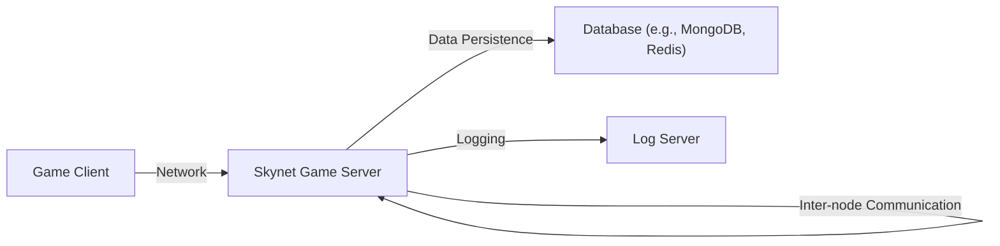
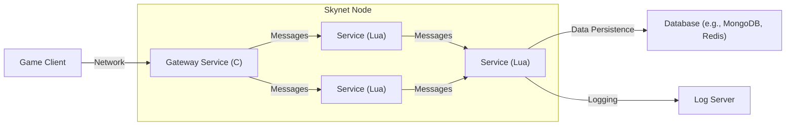
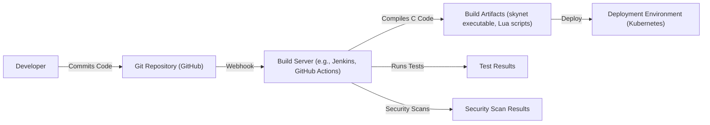

Okay, let's create a design document for the Skynet project.

# BUSINESS POSTURE

Skynet is a lightweight, open-source, actor-model based, multi-threaded, distributed, and fault-tolerant framework primarily designed for online game servers. It's written in C and Lua. The business priorities seem to be:

*   Performance: Minimize latency and maximize throughput for real-time interactions.
*   Scalability: Handle a large number of concurrent users and game sessions.
*   Reliability: Ensure the game server remains operational even in the face of individual component failures.
*   Maintainability: Provide a simple and understandable codebase for easier modification and extension.
*   Cost-Effectiveness: Minimize operational costs by using resources efficiently.

Business risks that need to be addressed:

*   Service Downtime: Any interruption in service can lead to player dissatisfaction and potential revenue loss.
*   Data Loss/Corruption: Loss or corruption of game state data can severely impact the player experience.
*   Security Breaches: Unauthorized access or manipulation of the server could compromise player data and game integrity.
*   Scalability Bottlenecks: Inability to handle peak player loads can lead to performance degradation and player churn.
*   Development/Maintenance Overhead: Complex or poorly designed code can increase development time and costs.

# SECURITY POSTURE

Based on the provided GitHub repository, here's an assessment of the existing security posture:

*   security control: The framework uses an actor model, which inherently provides some level of isolation between different parts of the system. This can help contain the impact of vulnerabilities. (Implemented in the core design of Skynet)
*   security control: Skynet uses Lua scripting, which, when properly sandboxed, can limit the potential damage from malicious scripts. (Implemented in the Lua integration)
*   accepted risk: The project is primarily focused on performance and functionality, and security considerations may not be as comprehensive as in a system designed specifically for high-security environments.
*   accepted risk: The project relies on external libraries (e.g., Lua, jemalloc), which could introduce vulnerabilities if not kept up-to-date.
*   accepted risk: The documentation doesn't explicitly detail secure coding practices or security testing procedures.

Recommended security controls (high priority):

*   Implement robust input validation for all messages passed between actors and from external sources.
*   Introduce a comprehensive security review and testing process, including static and dynamic analysis.
*   Establish a clear policy for managing dependencies and keeping them updated.
*   Develop detailed security documentation and guidelines for developers contributing to the project.
*   Consider implementing network-level security measures, such as firewalls and intrusion detection systems, in the deployment environment.

Security Requirements:

*   Authentication:
    *   The system should have a mechanism to authenticate clients connecting to the server. This could involve unique identifiers, session tokens, or other authentication methods. The current system does not appear to have a built-in authentication mechanism.
*   Authorization:
    *   Once authenticated, clients should only be authorized to perform actions and access data relevant to their role or permissions. The actor model provides a basic level of authorization, but more granular controls may be needed.
*   Input Validation:
    *   All input received from clients or other external sources must be rigorously validated to prevent injection attacks, buffer overflows, and other common vulnerabilities. This is crucial for any network-facing service.
*   Cryptography:
    *   Sensitive data, such as player credentials or game state information, should be encrypted both in transit (using protocols like TLS) and at rest (using appropriate encryption algorithms). The current system does not appear to have built-in encryption.

# DESIGN

## C4 CONTEXT



Element Descriptions:

*   Element:
    *   Name: Game Client
    *   Type: User
    *   Description: Represents the game client application running on the player's device.
    *   Responsibilities: Sends player input to the server, receives and renders game state updates.
    *   Security controls: Input validation, secure communication (TLS).

*   Element:
    *   Name: Skynet Game Server
    *   Type: System
    *   Description: The core Skynet framework, responsible for managing game logic, player sessions, and communication.
    *   Responsibilities: Handling client connections, processing messages, managing game state, coordinating with other Skynet nodes.
    *   Security controls: Actor model isolation, Lua sandboxing, input validation (recommended), authentication (recommended), authorization (recommended).

*   Element:
    *   Name: Database
    *   Type: System
    *   Description: External database system used for persistent data storage.
    *   Responsibilities: Storing player data, game state, and other persistent information.
    *   Security controls: Database security best practices (access controls, encryption, etc.).

*   Element:
    *   Name: Log Server
    *   Type: System
    *   Description: Centralized logging server for collecting and analyzing logs from Skynet nodes.
    *   Responsibilities: Receiving and storing log data, providing tools for log analysis.
    *   Security controls: Secure log transmission, access controls to log data.

## C4 CONTAINER



Element Descriptions:

*   Element:
    *   Name: Game Client
    *   Type: User
    *   Description: Represents the game client application.
    *   Responsibilities: Sends player input, receives game state.
    *   Security controls: Input validation, secure communication.

*   Element:
    *   Name: Gateway Service (C)
    *   Type: Container (C)
    *   Description: Handles network connections and initial message routing.
    *   Responsibilities: Accepting client connections, forwarding messages to appropriate services.
    *   Security controls: Input validation, rate limiting, potentially TLS termination.

*   Element:
    *   Name: Service (Lua)
    *   Type: Container (Lua)
    *   Description: Represents a Lua script running within the Skynet framework, implementing specific game logic.
    *   Responsibilities: Processing messages, updating game state, interacting with other services.
    *   Security controls: Lua sandboxing, input validation within the Lua script.

*   Element:
    *   Name: Database
    *   Type: System
    *   Description: External database system.
    *   Responsibilities: Persistent data storage.
    *   Security controls: Database security best practices.

*   Element:
    *   Name: Log Server
    *   Type: System
    *   Description: Centralized logging server.
    *   Responsibilities: Log collection and analysis.
    *   Security controls: Secure log transmission, access controls.

## DEPLOYMENT

Possible deployment solutions:

1.  Bare-metal servers: Skynet nodes can be deployed directly onto physical servers.
2.  Virtual machines: Skynet nodes can be deployed within virtual machines (VMs) on a cloud provider (e.g., AWS, Azure, GCP) or on-premises infrastructure.
3.  Containers (Docker): Skynet nodes can be containerized using Docker and deployed on a container orchestration platform like Kubernetes.
4.  Hybrid: A combination of the above.

Chosen solution (for detailed description): Containers (Docker) with Kubernetes.

```mermaid
graph LR
    Internet["Internet"] -- Load Balancer --> K8sCluster["Kubernetes Cluster"]
    K8sCluster -- Node1["Node 1"]
    K8sCluster -- Node2["Node 2"]
    K8sCluster -- NodeN["Node N"]
    Node1 -- SkynetPod1["Skynet Pod"]
    Node2 -- SkynetPod2["Skynet Pod"]
    NodeN -- SkynetPodN["Skynet Pod"]
    SkynetPod1 -- DatabaseService["Database Service"]
    SkynetPod2 -- DatabaseService
    SkynetPodN -- DatabaseService
    SkynetPod1 -- LogService["Log Service"]
    SkynetPod2 -- LogService
    SkynetPodN -- LogService

```

Element Descriptions:

*   Element:
    *   Name: Internet
    *   Type: External
    *   Description: The public internet.
    *   Responsibilities: Routing traffic to the game server.
    *   Security controls: Firewall, DDoS protection.

*   Element:
    *   Name: Load Balancer
    *   Type: Infrastructure
    *   Description: Distributes incoming traffic across multiple Kubernetes nodes.
    *   Responsibilities: Load balancing, health checks.
    *   Security controls: TLS termination, DDoS protection.

*   Element:
    *   Name: Kubernetes Cluster
    *   Type: Infrastructure
    *   Description: The Kubernetes cluster managing the Skynet deployments.
    *   Responsibilities: Orchestrating containers, managing resources, scaling.
    *   Security controls: Kubernetes RBAC, network policies, pod security policies.

*   Element:
    *   Name: Node (1, 2, N)
    *   Type: Infrastructure
    *   Description: A worker node within the Kubernetes cluster.
    *   Responsibilities: Running Skynet pods.
    *   Security controls: Node-level security hardening.

*   Element:
    *   Name: Skynet Pod (1, 2, N)
    *   Type: Container
    *   Description: A Kubernetes pod running a Skynet node (including the Gateway and Lua services).
    *   Responsibilities: Hosting Skynet services.
    *   Security controls: Container image security, resource limits.

*   Element:
    *   Name: Database Service
    *   Type: External System
    *   Description: The database service (e.g., managed MongoDB or Redis).
    *   Responsibilities: Providing persistent data storage.
    *   Security controls: Database security best practices.

*   Element:
    *   Name: Log Service
    *   Type: External System
    *   Description: The logging service (e.g., Elasticsearch, Splunk).
    *   Responsibilities: Collecting and analyzing logs.
    *   Security controls: Secure log transmission, access controls.

## BUILD

The Skynet build process involves compiling C code and potentially packaging Lua scripts. The repository uses a Makefile for building.



Security Controls in Build Process:

*   security control: Code Review: All code changes should be reviewed by another developer before merging. (Implemented through GitHub pull requests)
*   security control: Static Analysis: A static analysis tool (e.g., a C/C++ linter, or a dedicated security scanner) should be integrated into the build process to identify potential vulnerabilities in the C code. (Not explicitly present, but recommended)
*   security control: Dependency Management: The build process should track and manage dependencies (e.g., Lua libraries) to ensure they are up-to-date and free of known vulnerabilities. (Partially addressed by the Makefile, but could be improved)
*   security control: Build Automation: The build process is automated using a Makefile, which reduces the risk of manual errors. (Implemented)
*   security control: Test: The build process includes running tests. (Implemented)

# RISK ASSESSMENT

*   Critical Business Processes:
    *   Maintaining a stable and responsive game server environment.
    *   Ensuring the integrity and availability of game state data.
    *   Protecting player accounts and personal information.

*   Data Sensitivity:
    *   Player Account Data: Usernames, passwords (hashed), email addresses, potentially payment information (if handled by Skynet, which is unlikely). Sensitivity: High.
    *   Game State Data: Player positions, inventory, game progress, etc. Sensitivity: Medium (impacts gameplay, but not typically PII).
    *   Communication Data: In-game chat logs. Sensitivity: Medium (potential for privacy concerns).
    *   Logs: System and application logs. Sensitivity: Low to Medium (depending on what's logged).

# QUESTIONS & ASSUMPTIONS

*   Questions:
    *   What specific database system is intended to be used with Skynet?
    *   What is the expected scale of deployment (number of concurrent users, nodes)?
    *   Are there any existing security policies or compliance requirements that need to be considered?
    *   What is the mechanism for inter-node communication between Skynet instances?
    *   How are Lua scripts managed and deployed? Are they bundled with the Skynet executable or loaded dynamically?
    *   What level of logging is required, and what information should be logged?
    *   Is there a plan for handling configuration management and secrets (e.g., database credentials)?

*   Assumptions:
    *   BUSINESS POSTURE: The primary goal is to provide a high-performance, scalable game server framework. Cost-effectiveness is a consideration, but performance and reliability are prioritized.
    *   SECURITY POSTURE: Security is important, but the project may not have undergone extensive security hardening. The development team is open to implementing security improvements.
    *   DESIGN: The deployment environment will be a Kubernetes cluster. The database and logging systems are external services. The build process will be automated using a CI/CD pipeline.