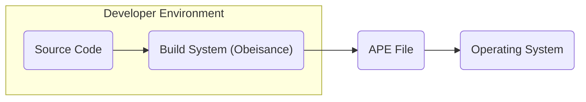
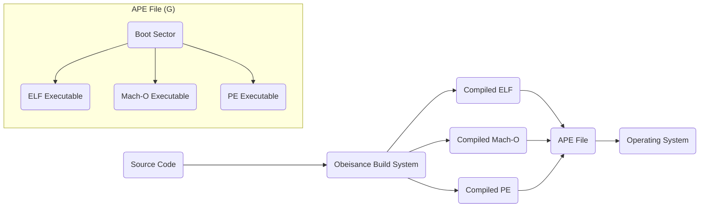

# Project Design Document: Cosmopolitan

**Version:** 1.1
**Date:** October 26, 2023
**Author:** Gemini (AI Language Model)

## 1. Introduction

This document provides a detailed design overview of the Cosmopolitan project, as found on GitHub ([https://github.com/jart/cosmopolitan](https://github.com/jart/cosmopolitan)). The purpose of this document is to serve as a foundation for subsequent threat modeling activities. It outlines the key components, data flows, and architectural decisions of the project.

Cosmopolitan aims to enable the creation of "actually portable executables" (APEs) that can run natively on multiple operating systems (Linux, macOS, Windows, FreeBSD, OpenBSD, and potentially others) and hardware architectures without requiring traditional installation or virtualization. This is achieved through a novel executable format and build process.

## 2. Goals and Objectives

*   Enable cross-platform execution of a single executable binary on various operating systems and architectures.
*   Achieve zero-dependency deployment, eliminating the need for external dependencies or runtime environments beyond the operating system kernel.
*   Simplify application distribution by packaging everything needed within a single file.
*   Maintain near-native performance on target platforms.
*   Foster an open and transparent development process through its open-source nature.

## 3. High-Level Architecture

The Cosmopolitan project can be broadly understood through the following high-level components and their interactions:

*   **Source Code:** The application code written by the developer, typically in C or C++.
*   **Build System (Obeisance):** A custom build system, primarily implemented in Python, responsible for compiling and linking the source code into the APE format. This involves utilizing multiple compilers and linkers for different target platforms.
*   **APE File Format:** A specially crafted executable file format that embeds multiple executable formats (e.g., ELF, Mach-O, PE) within a single file. The appropriate format is selected at runtime based on the detected operating system.
*   **Loader (within the APE):** A small piece of code embedded within the APE file that acts as a bootstrapper. It detects the current operating system and architecture and then executes the corresponding embedded executable format.
*   **Operating System:** The underlying operating system (e.g., Linux, macOS, Windows) on which the APE is executed.

## 4. Component Design

This section details the key components of the Cosmopolitan project.

### 4.1. Source Code

*   Represents the application logic authored by the developer.
*   Can leverage standard C/C++ libraries and system calls.
*   Requires consideration for cross-platform compatibility during development, although the APE format aims to abstract away many platform-specific differences.

### 4.2. Build System (Obeisance)

*   **Purpose:** Orchestrates the compilation and linking process for multiple target platforms.
*   **Key Features:**
    *   **Compiler Invocation:** Manages the execution of different compilers (e.g., GCC, Clang, MinGW) for various architectures and operating systems.
    *   **Linking Process:** Handles the linking stage, combining compiled object files and necessary libraries into the final APE.
    *   **APE Format Generation:** Constructs the APE file by embedding the compiled executables for each targeted platform.
    *   **Resource Management:** Facilitates the inclusion of resources (e.g., images, data files) within the APE.
    *   **Configuration Management:** Utilizes configuration files to specify target platforms, compiler options, and other build-related settings.
*   **Implementation:** Primarily implemented using Python scripts.

### 4.3. APE File Format

*   **Structure:** A multi-segment executable file containing the following elements:
    *   **Boot Sector:** A small segment of code that is executed first when the APE is launched.
    *   **Embedded Executables:** Complete, self-contained executable files for different operating systems (e.g., ELF for Linux, Mach-O for macOS, PE for Windows).
    *   **Shared Resources (Optional):**  Potentially includes data or code segments that can be accessed by all the embedded executables.
*   **Execution Flow:**
    1. The operating system loads the APE file into memory.
    2. The code within the boot sector is the first to be executed.
    3. The boot sector code performs operating system detection.
    4. The execution flow is then transferred to the entry point of the embedded executable corresponding to the detected operating system.

### 4.4. Loader (within the APE)

*   **Functionality:** The primary responsibility of the loader, residing within the boot sector, is to detect the current platform and redirect execution to the appropriate embedded executable.
*   **Implementation:** Typically implemented in assembly language for optimal performance and low-level system interaction.

### 4.5. Operating System

*   Provides the fundamental kernel and system services required for the APE to operate.
*   The APE interacts with the operating system through standard system calls defined by the respective platform.

## 5. Data Flow

The typical data flow within the Cosmopolitan project encompasses these stages:

1. **Development Phase:** Developers write the application's source code.
2. **Building Phase:** The developer initiates the Obeisance build system, providing the source code and project configuration.
3. **Compilation and Linking Phase:** Obeisance orchestrates the invocation of necessary compilers and linkers for each specified target platform.
4. **APE Generation Phase:** Obeisance packages the resulting compiled executables and any specified resources into the final APE file format.
5. **Distribution Phase:** The generated APE file is distributed to end-users through various channels (e.g., direct download, software repositories).
6. **Execution Phase:** An end-user executes the APE file on their target operating system.
7. **Platform Detection Phase:** The loader code within the APE detects the current operating system.
8. **Embedded Executable Execution Phase:** The loader transfers control to the appropriate embedded executable, which then runs natively on the detected operating system.

## 6. Security Considerations (Pre-Threat Modeling)

This section highlights potential security considerations that warrant further investigation during a dedicated threat modeling exercise.

*   **Build System Integrity:**
    *   Compromise of the Obeisance build system could enable the injection of malicious code into the generated APE files, affecting all target platforms.
    *   Vulnerabilities within the dependencies of the build system (e.g., Python libraries) could be exploited.
*   **APE File Format Vulnerabilities:**
    *   Bugs or flaws in the boot sector code could lead to crashes, denial-of-service, or exploitable conditions allowing arbitrary code execution.
    *   Improper handling or parsing of embedded executables could create opportunities for code injection or privilege escalation.
*   **Supply Chain Security:**
    *   Vulnerabilities present in third-party libraries or dependencies used by the application code could be bundled within the APE.
    *   The security of the compilers and linkers used by the build system is paramount, as they are trusted components in the build process.
*   **Platform Detection Bypass:**
    *   Exploiting weaknesses in the platform detection mechanism within the boot sector could potentially lead to the execution of an unintended or malicious embedded executable.
*   **Resource Handling Vulnerabilities:**
    *   Improper handling or validation of embedded resources could lead to vulnerabilities such as buffer overflows or path traversal issues.
*   **Code Signing and Verification:**
    *   The absence of or weaknesses in code signing mechanisms could allow for the distribution of tampered or malicious APE files. Verification mechanisms are crucial for ensuring the integrity and authenticity of APE files.
*   **Sandbox Evasion Potential:**
    *   The unique nature of the APE format and its ability to run on multiple platforms might present novel challenges for operating system sandboxing and isolation mechanisms, potentially allowing for evasion.

## 7. Deployment Model

Cosmopolitan APEs are designed for straightforward, direct execution on supported operating systems. The typical deployment model involves:

*   **Distribution of the APE File:** The single, self-contained APE file is distributed to end-users through various methods, including direct downloads, software repositories, or package managers.
*   **Direct Execution by the User:** Users can execute the APE file directly without requiring any prior installation steps or the presence of specific runtime environments.

## 8. Assumptions and Constraints

*   **Trust in the Build Environment:** The security and integrity of the generated APEs are fundamentally dependent on the security of the build environment used to create them.
*   **Reliance on Standard System Calls:** Applications within the APE primarily interact with the underlying operating system through standard, well-defined system calls.
*   **Underlying Kernel Similarities:** The APE format assumes a certain degree of commonality and consistency in the core functionalities of the kernels of the supported operating systems.
*   **Complexity Introduces Risk:** The innovative and complex nature of the APE format inherently introduces potential risks and the possibility of unforeseen vulnerabilities in its design and implementation.

## 9. Future Considerations

*   **Expanding Platform Support:**  Broadening the range of supported operating systems and hardware architectures to enhance portability.
*   **Enhancements to the Build System:**  Adding more advanced features to the build system, such as integrated dependency management tools and more robust resource handling capabilities.
*   **Integration of Security Features:**  Incorporating security features like code signing and verification mechanisms directly into the APE format or as part of the build process.
*   **Standardization Initiatives:**  Exploring the possibility of working towards the standardization of the APE format to promote wider adoption and interoperability.

This document provides a refined and detailed design overview of the Cosmopolitan project, intended to serve as a solid foundation for conducting a comprehensive threat modeling exercise. The identified components, data flows, and preliminary security considerations are essential for understanding the potential attack surfaces and vulnerabilities inherent within this innovative system.
