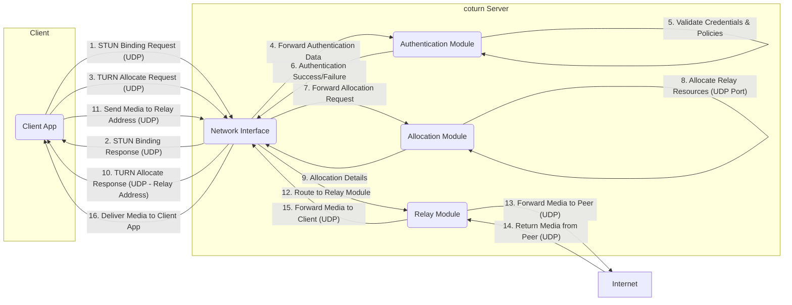

## Project Design Document: coturn (Improved)

**1. Project Overview**

The coturn project, located at [https://github.com/coturn/coturn](https://github.com/coturn/coturn), is a mature, open-source implementation of a TURN (Traversal Using Relays around NAT) and STUN (Session Traversal Utilities for NAT) server. Its primary function is to enable real-time communication (RTC) applications, such as video and audio conferencing, to establish connections and exchange media streams even when clients are located behind Network Address Translators (NATs). This document provides a detailed design overview of coturn specifically for the purpose of facilitating threat modeling activities.

**2. Goals and Objectives**

*   Provide a highly reliable and performant TURN and STUN server implementation adhering to relevant standards.
*   Offer a range of configurable authentication mechanisms to secure access and prevent unauthorized relay usage.
*   Support diverse deployment scenarios with flexible configuration options.
*   Maintain scalability to accommodate a significant number of concurrent users and media sessions.
*   Strictly adhere to IETF standards (RFCs) defining the STUN and TURN protocols.
*   Provide sufficient detail in this document to enable comprehensive threat modeling of coturn deployments.

**3. Target Audience**

This document is primarily intended for:

*   Cybersecurity architects and engineers tasked with performing threat modeling and security assessments of systems incorporating coturn.
*   Software developers who are integrating coturn into their applications and need to understand its security architecture.
*   System administrators responsible for the secure deployment, configuration, and maintenance of coturn servers.
*   Anyone requiring a deep understanding of coturn's internal architecture and operational flow from a security perspective.

**4. Scope**

This design document focuses on the architectural components and operational workflows of the coturn server that are relevant for identifying potential security threats. The scope includes:

*   A detailed breakdown of the core components within the coturn server and their interactions.
*   Analysis of key data flows, including signaling and media traffic processing.
*   Examination of authentication, authorization, and access control mechanisms.
*   Description of network interfaces, supported protocols, and their security implications.
*   Overview of critical configuration parameters that impact security posture.

This document explicitly excludes:

*   In-depth analysis of the coturn codebase at a granular level.
*   Specific deployment instructions or configurations beyond general architectural considerations.
*   Detailed design of client-side STUN/TURN implementations.

**5. High-Level Architecture**

```mermaid
graph LR
    subgraph "Client (Behind NAT)"
        A("Client Application")
    end
    B("Internet")
    subgraph "coturn Server"
        C("Network Interface (UDP/TCP/TLS/DTLS)")
        D("Authentication Module")
        E("Allocation Module")
        F("Relay Module")
        G("Configuration Management")
        H("Logging and Monitoring")
        I("Management Interface (Optional - CLI/API)")
    end

    A -- "STUN/TURN Requests & Media" --> C
    C -- "STUN/TURN Responses & Relayed Media" --> A
    C -- "Relayed Media Traffic" --> B
    D <--. "Configuration Data" .--> G
    E <--. "Configuration Data" .--> G
    F <--. "Configuration Data" .--> G
    C --> D
    D --> E
    E --> F
    C --> H
    I -- "Management Commands/Queries" --> G
```

**6. Detailed Component Design**

*   **Network Interface (UDP/TCP/TLS/DTLS):**
    *   Listens for incoming STUN and TURN requests on configured IP addresses and ports.
    *   Supports multiple transport protocols: UDP, TCP, TLS over TCP, and DTLS over UDP.
    *   Manages connection state for TCP and TLS connections.
    *   Handles multiplexing of STUN/TURN messages and media streams.
    *   Responsible for initial packet processing and routing to appropriate internal modules.
    *   May implement basic rate limiting or connection limiting to mitigate DoS attacks.

*   **Authentication Module:**
    *   Verifies the identity of clients attempting to establish TURN allocations.
    *   Supports various authentication mechanisms, including:
        *   Long-term credentials (username and password stored locally or via external database).
        *   Short-term credentials (using a shared secret and message integrity checks).
        *   OAuth 2.0 or similar token-based authentication (integration with external authorization servers).
        *   Pre-shared keys.
    *   Manages user databases or interfaces with external authentication providers (e.g., RADIUS, LDAP).
    *   Enforces authorization policies to control which clients can allocate relay resources.
    *   Protects against brute-force attacks on authentication endpoints (e.g., through lockout mechanisms).

*   **Allocation Module:**
    *   Manages the allocation of relay transport addresses (IP address and port) for clients.
    *   Assigns unique relay addresses for each client's TURN allocation.
    *   Tracks allocated resources (relay addresses, ports, bandwidth) and reclaims them upon session termination or timeout.
    *   May implement different port allocation strategies (e.g., symmetric, non-symmetric) based on configuration.
    *   Enforces limits on the number of allocations per client or globally.

*   **Relay Module:**
    *   The core component responsible for relaying media traffic between peers.
    *   Receives data packets from clients destined for their peers via the allocated relay address.
    *   Performs NAT traversal by forwarding packets from the relay address to the peer's destination.
    *   Maintains mappings between client transport addresses and their allocated relay addresses and peer addresses.
    *   Enforces data integrity and confidentiality when TLS/DTLS is used for relay connections.
    *   May implement checks to prevent relaying of non-media traffic or traffic to unauthorized destinations.

*   **Configuration Management:**
    *   Loads and manages the coturn server's configuration parameters.
    *   Configuration sources can include:
        *   Configuration files (e.g., `turnserver.conf`).
        *   Command-line arguments.
        *   Environment variables.
    *   Key configuration parameters relevant to security include:
        *   Listening IP addresses and ports.
        *   Enabled transport protocols (UDP, TCP, TLS, DTLS).
        *   Authentication mechanisms and associated credentials/secrets.
        *   Relay address ranges and port allocation policies.
        *   Logging levels and output destinations.
        *   TLS/DTLS certificate paths and private keys.
        *   User database configuration.
        *   Rate limiting and connection limits.
        *   Management interface settings.

*   **Logging and Monitoring:**
    *   Records significant server events, including:
        *   Successful and failed authentication attempts.
        *   Allocation requests and responses.
        *   Session start and end times.
        *   Error conditions and warnings.
        *   Potentially relayed traffic statistics.
    *   Provides valuable data for security auditing, troubleshooting, and performance monitoring.
    *   Supports different logging levels (e.g., debug, info, warning, error).
    *   Can output logs to various destinations (e.g., files, syslog).
    *   May expose metrics via protocols like Prometheus for integration with monitoring systems.

*   **Management Interface (Optional - CLI/API):**
    *   Provides an interface for administrators to manage the coturn server.
    *   May offer functionalities such as:
        *   Viewing active TURN allocations and sessions.
        *   Revoking or terminating specific allocations.
        *   Updating server configuration (requires careful security considerations).
        *   Retrieving server status and statistics.
    *   Typically secured with strong authentication and authorization to prevent unauthorized access and control.
    *   Can be implemented as a command-line interface (CLI) or a RESTful API.

**7. Data Flow (Detailed)**

The following illustrates a more detailed data flow for a client establishing a TURN allocation and relaying media using UDP:



**Data Flow Description:**

1. The client sends a STUN Binding Request over UDP to discover its public IP address and port.
2. The coturn server's Network Interface responds with the client's mapped address.
3. The client sends a TURN Allocate Request over UDP to the coturn server, requesting a relay address.
4. The Network Interface forwards relevant authentication data from the request to the Authentication Module.
5. The Authentication Module validates the client's credentials and authorization policies.
6. The Authentication Module informs the Network Interface about the authentication outcome.
7. If authentication is successful, the Network Interface forwards the allocation request to the Allocation Module.
8. The Allocation Module allocates relay resources, including a UDP port.
9. The Allocation Module provides the allocation details to the Network Interface.
10. The Network Interface sends the TURN Allocate Response containing the allocated relay address and port to the client.
11. The client sends media data packets to the allocated relay address on the coturn server.
12. The Network Interface routes the incoming media packets to the Relay Module.
13. The Relay Module forwards the media packet to the intended peer on the Internet.
14. The peer's response media traffic arrives at the coturn server.
15. The Relay Module forwards the received media back to the client.
16. The Network Interface delivers the media to the client application.

**8. Deployment Architecture (Security Focused)**

coturn servers are commonly deployed in these architectures, with specific security considerations:

*   **Publicly Accessible (Single Instance):**
    *   coturn server directly exposed to the internet with a public IP address.
    *   **Security Considerations:** Requires robust firewall rules, strong authentication, TLS/DTLS enforcement, and protection against DoS attacks. Regular security updates are crucial.

*   **Behind a Load Balancer (High Availability):**
    *   Multiple coturn instances behind a load balancer distributing client traffic.
    *   **Security Considerations:** Secure communication between the load balancer and coturn instances. Ensure the load balancer itself is secure. Consistent configuration across all instances is vital.

*   **Within a Private Network (Internal Relay):**
    *   coturn server deployed within a private network to facilitate communication between internal clients.
    *   **Security Considerations:** While internet exposure is limited, internal security is still important. Control access to the coturn server within the private network. Authentication is still recommended.

**Key Security Considerations for Deployment:**

*   **Network Segmentation:** Isolate the coturn server in a Demilitarized Zone (DMZ) or a separate network segment with restricted access.
*   **Firewall Configuration:** Implement strict firewall rules allowing only necessary traffic to and from the coturn server on required ports. Block all other traffic.
*   **TLS/DTLS Enforcement:** Mandate the use of TLS for TCP and DTLS for UDP connections to encrypt signaling and media traffic, protecting against eavesdropping and tampering.
*   **Rate Limiting and Connection Limits:** Configure appropriate limits to prevent resource exhaustion and DoS attacks.
*   **Regular Security Audits and Penetration Testing:** Conduct periodic security assessments to identify and address potential vulnerabilities.
*   **Secure Configuration Management:** Protect configuration files and secrets. Use secure methods for managing and deploying configurations.
*   **Monitoring and Alerting:** Implement monitoring to detect suspicious activity and security incidents.

**9. Security Considerations (Detailed)**

This section expands on potential security threats and vulnerabilities:

*   **Authentication and Authorization Weaknesses:**
    *   Use of default or weak credentials.
    *   Vulnerabilities in the authentication protocols themselves (e.g., replay attacks).
    *   Insufficient authorization checks allowing unauthorized access to relay resources.
    *   Bypassing authentication mechanisms due to misconfiguration or vulnerabilities.
    *   Brute-force attacks targeting authentication endpoints.

*   **Confidentiality and Integrity Breaches:**
    *   Eavesdropping on signaling or media traffic if TLS/DTLS is not enforced or properly configured.
    *   Man-in-the-middle attacks if encryption is weak or compromised.
    *   Tampering with media streams or signaling messages.

*   **Denial of Service (DoS) Attacks:**
    *   SYN floods or UDP floods targeting the network interface.
    *   Resource exhaustion by overwhelming the server with allocation requests.
    *   Exploiting vulnerabilities that cause excessive CPU or memory consumption.

*   **Relay Abuse and Open Relay Vulnerabilities:**
    *   Unauthorized clients using the coturn server to relay malicious traffic (e.g., spam, attacks).
    *   Misconfiguration allowing the server to act as an open relay.

*   **Configuration Security Flaws:**
    *   Storing sensitive configuration data (e.g., authentication secrets, TLS keys) in plaintext or insecurely.
    *   Unprotected management interfaces allowing unauthorized configuration changes.

*   **Software Vulnerabilities:**
    *   Exploitable bugs in the coturn codebase (e.g., buffer overflows, injection vulnerabilities).
    *   Dependencies with known vulnerabilities.

*   **Management Interface Security:**
    *   Weak authentication or authorization for the management interface.
    *   Exposure of the management interface to unauthorized networks.

**10. Assumptions and Constraints**

*   The underlying operating system and network infrastructure are assumed to be reasonably secure and patched.
*   Clients interacting with the coturn server are expected to adhere to STUN and TURN protocol specifications.
*   The primary focus is on the security of the coturn server itself, not the security of the end-user applications utilizing it.
*   This document reflects the general understanding of coturn's architecture and functionality and may not encompass every specific implementation detail or future change.

**11. Future Considerations (Security Enhancements)**

*   Integration with more advanced authentication and authorization frameworks (e.g., SAML).
*   Implementation of more sophisticated DoS protection mechanisms.
*   Enhanced logging and auditing capabilities with more granular detail.
*   Support for secure multi-tenancy to isolate resources between different users or organizations.
*   Regular security code reviews and penetration testing as part of the development lifecycle.
*   Adoption of security best practices for software development and deployment.
