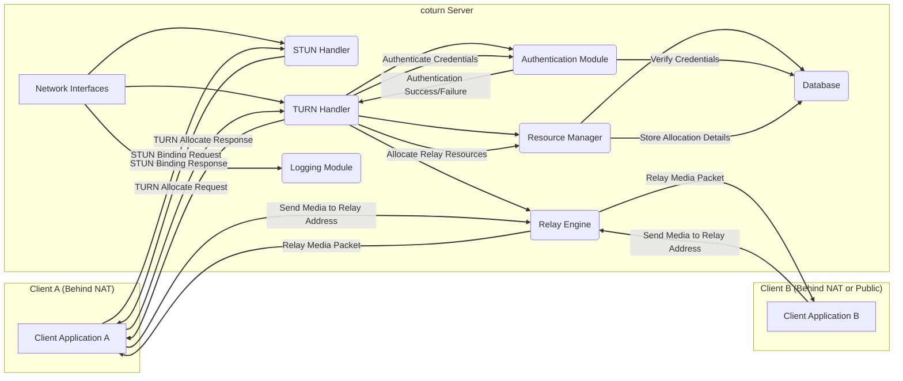

## Project Design Document: coturn - Open Source TURN and STUN Server

**1. Introduction**

This document provides an in-depth design overview of the coturn project, a robust and widely-used open-source implementation of a TURN (Traversal Using Relays around NAT) and STUN (Session Traversal Utilities for NAT) server. This detailed description of the system's architecture, core components, and data flow is essential for conducting thorough threat modeling and security assessments.

coturn plays a crucial role in enabling real-time communication (RTC) for applications operating behind Network Address Translation (NAT) firewalls. It facilitates NAT traversal by allowing clients to discover their public IP address and port (STUN) and, when direct peer-to-peer connections are not feasible, to relay media streams through the coturn server (TURN).

**2. Goals and Objectives**

*   To offer a highly reliable and performant implementation of the TURN and STUN protocols, adhering to relevant standards.
*   To provide comprehensive support for various transport protocols, including UDP, TCP, TLS (for secure TCP), and DTLS (for secure UDP).
*   To implement flexible and robust authentication mechanisms to ensure secure access and prevent unauthorized relaying.
*   To enable efficient allocation, management, and recycling of relay resources (IP addresses and ports).
*   To provide detailed and configurable logging and monitoring capabilities for operational insights and troubleshooting.
*   To maintain a secure, well-documented, and actively developed codebase, addressing security vulnerabilities promptly.

**3. Target Audience**

This document is specifically intended for:

*   Security engineers tasked with performing threat modeling, penetration testing, and security audits of systems incorporating coturn.
*   Software architects and developers responsible for integrating coturn into their communication platforms and applications.
*   System administrators and DevOps engineers who deploy, configure, manage, and monitor coturn server instances in production environments.

**4. Scope**

This document comprehensively covers the core functionalities and internal workings of the coturn server, including:

*   Implementation of the STUN protocol for NAT type discovery and endpoint mapping.
*   Implementation of the TURN protocol for allocating relay addresses and relaying media traffic.
*   Mechanisms for user authentication and authorization to control access to TURN relay services.
*   Management of relay resources, including allocation, deallocation, and tracking of active sessions.
*   Handling of network interfaces and processing of incoming and outgoing network packets.
*   Detailed logging of server activities, including authentication attempts, allocation requests, and error conditions.

This document explicitly excludes details related to:

*   Specific client-side implementations, libraries, or Software Development Kits (SDKs) that interact with coturn.
*   Infrastructure-as-Code (IaC) scripts or configuration management tools used for deploying and managing coturn.
*   In-depth performance benchmarking data or specific optimization techniques for high-load scenarios.

**5. High-Level Architecture**

The coturn server acts as a crucial intermediary, situated on the public internet, facilitating communication between clients that are often located behind NAT firewalls. Clients initially utilize STUN to ascertain their externally visible IP address and port. When direct peer-to-peer connectivity is not possible due to NAT restrictions, clients request the coturn server to allocate relay resources, enabling media traffic to be routed through the server.

**6. Component Design**

*   **Network Interfaces ("Network Interfaces"):**
    *   Responsible for listening for incoming network connections on configured IP addresses and ports.
    *   Supports multiple protocols concurrently, including UDP, TCP, TLS (wrapping TCP), and DTLS (wrapping UDP).
    *   Manages separate listeners for different protocols and port combinations.
    *   Handles the initial reception and processing of incoming network packets.

*   **STUN Handler ("STUN Handler"):**
    *   Implements the STUN protocol as specified in RFC 5389 and various extensions.
    *   Processes STUN Binding Requests from clients to help them discover their public IP address and port as seen from the internet.
    *   Supports a range of STUN attributes and message types required for NAT discovery.

*   **TURN Handler ("TURN Handler"):**
    *   Implements the TURN protocol as defined in RFC 5766 and its extensions.
    *   Handles TURN Allocate Requests from clients seeking to obtain relay addresses and ports for media transmission.
    *   Manages permissions associated with allocated relays, controlling which peers can send data.
    *   Processes various TURN message types, including Allocate, Send, Data, CreatePermission, and Refresh.

*   **Authentication Module ("Authentication Module"):**
    *   Responsible for verifying the identity of clients attempting to use TURN relay services.
    *   Supports multiple authentication mechanisms, including:
        *   Long-term credentials (username and password stored in a database or configuration file).
        *   Short-term authentication tokens (often used for session-based authentication).
        *   Realm-based authentication, allowing for different authentication domains.
        *   Potential integration with external authentication providers via plugins or APIs.

*   **Resource Manager ("Resource Manager"):**
    *   Manages the pool of available relay addresses (IP addresses and ports) that can be allocated to clients.
    *   Tracks active TURN allocations, associating them with the requesting clients and their permissions.
    *   Enforces resource limits and quotas to prevent abuse and ensure fair resource allocation.
    *   Interacts with the Database to persist allocation information and potentially user credentials.
    *   Handles the deallocation and recycling of relay resources when they are no longer needed.

*   **Relay Engine ("Relay Engine"):**
    *   The core component responsible for forwarding media packets between clients through the allocated relay addresses.
    *   Supports relaying over both UDP and TCP.
    *   Implements mechanisms for efficient packet forwarding and handling of network congestion.
    *   Enforces the permissions associated with each relay allocation, ensuring that only authorized peers can communicate.

*   **Database ("Database"):**
    *   Used for persistent storage of critical data, including:
        *   User credentials (usernames, passwords, and potentially other authentication-related information).
        *   Active TURN allocations, including the allocated relay addresses, associated clients, and permissions (optional, can be in-memory).
        *   Potentially other configuration settings or runtime state.
    *   Supports various database backends, such as Redis, PostgreSQL, and MySQL, offering flexibility in deployment.

*   **Logging Module ("Logging Module"):**
    *   Records significant events and activities occurring within the coturn server.
    *   Provides logs for:
        *   Authentication attempts (both successful and failed).
        *   TURN allocation requests and their outcomes.
        *   Relay activity, including the flow of media packets.
        *   Error conditions, warnings, and informational messages.
    *   Supports configurable logging levels and output destinations (e.g., files, syslog).

**7. Data Flow**

A typical data flow scenario for a client utilizing coturn involves the following sequence of interactions:

*   **STUN Binding Request:** A client behind a NAT sends a STUN Binding Request to the coturn server to determine its external IP address and port as seen by the public internet.
*   **STUN Binding Response:** The coturn server responds with a STUN Binding Response containing the client's mapped public IP address and port.
*   **TURN Allocate Request:** If a direct peer-to-peer connection is not possible, the client sends a TURN Allocate Request to the coturn server, requesting the allocation of a relay address. This request includes the client's authentication credentials.
*   **Authentication Process:** The coturn server's Authentication Module verifies the client's identity using the provided credentials against the configured authentication mechanism and the data stored in the Database.
*   **Resource Allocation:** Upon successful authentication, the Resource Manager allocates a relay address (an IP address and port) and associates it with the requesting client.
*   **TURN Allocate Response:** The coturn server sends a TURN Allocate Response back to the client, containing the details of the allocated relay address.
*   **Create Permission (Optional):** The client may send CreatePermission requests to authorize specific peer clients to send data to its allocated relay address. This adds a layer of security and control.
*   **Sending Media to Relay:** Clients send their media packets to the allocated relay address on the coturn server.
*   **Relaying Media:** The coturn server's Relay Engine receives the media packets and forwards them to the intended recipient(s) based on the established permissions associated with the relay allocation.

**8. Security Considerations (Detailed)**

*   **Authentication and Authorization:**
    *   Employing strong and well-vetted authentication mechanisms is paramount to prevent unauthorized access and relay usage.
    *   Proper authorization controls are necessary to ensure that only authenticated clients can allocate and use relay resources.
    *   Consideration should be given to protecting the credentials stored in the database against unauthorized access.
*   **Transport Security (TLS and DTLS):**
    *   Enforcing TLS for TCP-based communication and DTLS for UDP-based communication is crucial to protect the confidentiality and integrity of STUN and TURN control messages, as well as relayed media.
    *   Proper configuration of TLS/DTLS certificates and cipher suites is essential.
*   **Denial of Service (DoS) and Distributed Denial of Service (DDoS) Protection:**
    *   Implementing rate limiting on incoming requests can help mitigate DoS attacks.
    *   Consideration should be given to strategies for handling large volumes of malicious traffic.
    *   Deployment behind a DDoS mitigation service can provide additional protection.
*   **Data Confidentiality and Integrity:**
    *   While coturn primarily relays end-to-end encrypted media streams (e.g., using SRTP), the security of the TURN control channel itself is vital.
    *   Ensuring the integrity of relayed data is important, although typically handled by the end-to-end encryption.
*   **Input Validation:**
    *   Strict validation of all incoming data, including STUN and TURN messages, is necessary to prevent vulnerabilities such as buffer overflows, format string bugs, and other injection attacks.
*   **Secure Configuration Practices:**
    *   Default configurations should be secure, and administrators should be provided with clear guidance on hardening the server.
    *   Regular security audits of the configuration are recommended.
*   **Regular Updates and Patching:**
    *   Maintaining the coturn server and its dependencies with the latest security patches is crucial to address known vulnerabilities promptly.
    *   A robust vulnerability management process is essential.
*   **Resource Exhaustion:**
    *   Mechanisms should be in place to prevent malicious actors from exhausting server resources (e.g., by allocating a large number of relays).
    *   Implementing resource quotas and limits per user or session can help mitigate this.

**9. Deployment Considerations**

*   coturn exhibits cross-platform compatibility and can be deployed on various operating systems, including Linux, macOS, and Windows.
*   Deployment options include running as a standalone system service or within containerized environments such as Docker and Kubernetes, facilitating scalability and management.
*   Extensive configuration options allow for customization of listening ports, authentication methods, database connection details, logging configurations, and resource limits.
*   Scalability can be achieved by deploying multiple coturn instances behind a load balancer, distributing traffic and ensuring high availability.
*   Monitoring tools and techniques should be implemented to track server performance, resource utilization, and identify potential issues.

**10. Assumptions and Constraints**

*   It is assumed that client implementations of the STUN and TURN protocols adhere strictly to the specifications outlined in the relevant RFC documents.
*   The underlying network infrastructure is assumed to permit UDP and TCP traffic on the configured ports, and that firewalls are configured appropriately to allow necessary communication.
*   The host operating system and hardware are assumed to provide sufficient resources (CPU, memory, network bandwidth) to handle the anticipated load on the coturn server.
*   Best practices for system security are assumed to be followed during the deployment, configuration, and ongoing maintenance of the coturn server.

**11. Glossary**

*   **STUN (Session Traversal Utilities for NAT):** A standardized protocol (RFC 5389) used by applications to discover their public IP address and port when operating behind a Network Address Translation (NAT) device.
*   **TURN (Traversal Using Relays around NAT):** A protocol (RFC 5766) that allows clients behind NAT to relay network traffic, particularly media streams, through a publicly accessible server when direct peer-to-peer connections are not possible.
*   **NAT (Network Address Translation):** A networking technique where a network device re-writes the source and/or destination IP addresses of network packets as they pass through it, often used to allow multiple devices on a private network to share a single public IP address.
*   **RFC (Request for Comments):** A formal document published by the Internet Engineering Task Force (IETF) that describes standards, protocols, procedures, and informational topics related to the Internet and networking.
*   **TLS (Transport Layer Security):** A cryptographic protocol that provides secure communication over a network, offering encryption, authentication, and data integrity. Commonly used with TCP.
*   **DTLS (Datagram Transport Layer Security):** A version of the TLS protocol designed to provide security for datagram-based protocols, such as UDP.
*   **WebRTC (Web Real-Time Communication):** A free, open-source project that provides web browsers and mobile applications with real-time communication capabilities via simple APIs, often relying on STUN and TURN for NAT traversal.
*   **SRTP (Secure Real-time Transport Protocol):** An extension of the Real-time Transport Protocol (RTP) that adds security features such as encryption, authentication, and message authentication and integrity to RTP data.

This enhanced design document provides a more detailed and comprehensive understanding of the coturn project. This information will be invaluable for conducting a thorough and effective threat model, enabling the identification of potential security vulnerabilities and the design of appropriate mitigation strategies.
