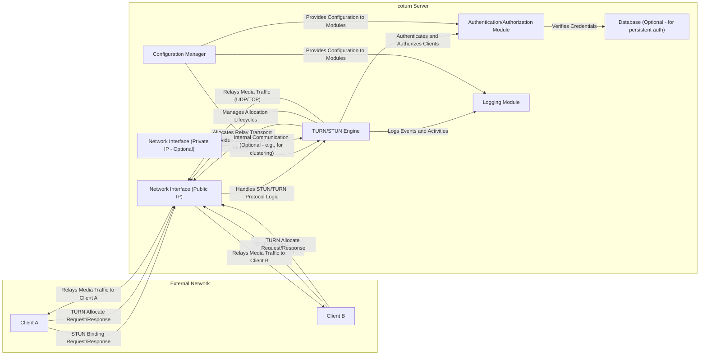

## Project Design Document: coturn (Improved)

**1. Introduction**

This document provides an enhanced and more detailed design overview of the coturn project, an open-source implementation of a TURN and STUN server. This document is intended to serve as a robust foundation for subsequent threat modeling activities. It elaborates on the key components, data flows, and technologies involved in the coturn project, providing a deeper understanding of its architecture and potential attack surfaces.

**2. Project Overview**

The coturn project offers a robust and widely used server implementation for Traversal Using Relays around NAT (TURN) and Session Traversal Utilities for NAT (STUN) protocols. These protocols are fundamental for enabling reliable real-time communication (RTC) applications, such as video conferencing, VoIP, and online gaming, to function correctly when clients are situated behind Network Address Translators (NATs) or firewalls. coturn acts as a crucial intermediary, relaying media traffic (audio, video, data) between clients that cannot establish direct peer-to-peer connections due to network constraints.

**3. System Architecture**

The following diagram illustrates the high-level architecture of a typical coturn deployment, highlighting key interactions and components.

**4. Component Descriptions**

*   **Client A & Client B:** These represent the end-user applications, devices, or browsers that require NAT traversal capabilities to establish real-time communication sessions. They initiate STUN requests to discover their external IP address and port, and TURN requests to allocate relay resources on the coturn server.
*   **Network Interface (Public IP):** This is the primary network interface of the coturn server, directly exposed to the public internet. It listens for incoming STUN and TURN requests on well-known ports (e.g., 3478 for STUN/TURN over UDP/TCP, 5349 for TURN/TLS over TCP). This interface is crucial for external clients to reach the server.
*   **Network Interface (Private IP - Optional):** In certain deployment scenarios, the coturn server might possess an additional network interface connected to a private or internal network. This can be utilized for internal communication within a cluster of coturn servers or when the server itself resides behind another NAT or firewall.
*   **TURN/STUN Engine:** This is the core processing unit of the coturn server. It implements the STUN and TURN protocol specifications, handling critical functionalities such as:
    *   Processing STUN binding requests to help clients discover their public IP address and port mapping.
    *   Authenticating and authorizing incoming TURN allocate requests based on configured mechanisms.
    *   Allocating relay transport addresses (IP address and port pairs) on the server for clients to use for relaying media.
    *   Managing the lifecycle of these allocations, including refreshing and expiring them.
    *   Relaying media traffic (audio, video, data) between connected peers using the allocated relay addresses.
    *   Enforcing permissions and restrictions on relay usage.
    *   Handling different transport protocols (UDP, TCP, TLS).
*   **Authentication/Authorization Module:** This module is responsible for verifying the identity of clients attempting to utilize the TURN server's relay capabilities. It supports various authentication methods, including:
    *   **Username/Password:** Traditional long-term credentials stored locally or in a database.
    *   **Shared Secret:** Pre-configured secrets shared between the client and the server.
    *   **OAuth 2.0 (or similar token-based authentication):** Integration with external authorization servers for more sophisticated authentication flows.
    *   **HMAC-SHA1/SHA256:**  Used in conjunction with shared secrets for message integrity and authentication.
*   **Database (Optional - for persistent auth):** For deployments requiring persistent storage and management of user credentials, access control lists, or other authorization data, a database system (e.g., PostgreSQL, MySQL, Redis) can be integrated. This allows for more scalable and manageable authentication.
*   **Logging Module:** This component handles the recording of significant events and activities within the coturn server. This includes:
    *   Successful and failed authentication attempts, providing audit trails.
    *   Creation and deletion of allocations, tracking resource usage.
    *   Error conditions and exceptions, aiding in troubleshooting.
    *   Potentially, details about relayed traffic for monitoring and analysis (depending on configuration).
*   **Configuration Manager:** This module is responsible for loading, managing, and providing configuration parameters to other modules within the coturn server. Configuration can be sourced from files, environment variables, or other configuration management systems. It dictates the server's behavior, including listening ports, authentication methods, logging levels, and resource limits.

**5. Data Flow**

The following outlines the typical data flow scenarios for STUN and TURN usage:

*   **STUN Binding Request/Response:**
    *   A client sends a STUN binding request to the coturn server (typically over UDP).
    *   The coturn server receives the request and reflects the client's perceived public IP address and port (as seen from the server's perspective) back to the client in a STUN binding response. This helps the client understand how it is seen from the outside.
*   **TURN Allocate Request/Response:**
    *   A client sends an authenticated TURN allocate request to the coturn server (over UDP, TCP, or TLS).
    *   The Authentication/Authorization Module verifies the client's credentials.
    *   If authentication is successful, the TURN/STUN Engine allocates a relay transport address (a unique IP address and port combination) on the server.
    *   The server sends the allocated relay address back to the client in a TURN allocate response.
*   **TURN Send Indication (Client A to Client B):**
    *   Client A sends media data to the coturn server, addressing it to the relay transport address that was allocated for communication with Client B.
    *   The coturn server receives the data packet.
    *   The TURN/STUN Engine verifies that the packet originates from a client authorized to use this allocation.
    *   The server then relays the data packet to Client B, using the connection established with Client B's allocated relay address.
*   **TURN Send Indication (Client B to Client A):**
    *   Client B sends media data to the coturn server, addressing it to the relay transport address that was allocated for communication with Client A.
    *   The coturn server receives the data packet.
    *   The TURN/STUN Engine verifies the source and destination.
    *   The server relays the data packet to Client A.

**6. Key Technologies**

*   **Programming Language:** Primarily C.
*   **Networking Libraries:** Standard POSIX socket libraries.
*   **Operating System:** Typically Linux-based distributions, but also supports other Unix-like systems.
*   **Configuration:** Text-based configuration files (e.g., `turnserver.conf`).
*   **Authentication Mechanisms:** Pluggable authentication modules (PAM), custom authentication backends.
*   **Database (Optional):** Support for various SQL (e.g., PostgreSQL, MySQL) and NoSQL (e.g., Redis) databases through specific modules or integrations.
*   **Logging:** System logs (syslog), file-based logging, integration with logging frameworks.
*   **Transport Protocols:** UDP, TCP, TLS (for secure communication).
*   **Build System:** Autoconf, Automake.

**7. Deployment Model**

coturn offers flexibility in deployment, catering to various needs and scales:

*   **Standalone Server:** A single coturn instance running on a dedicated virtual machine or bare-metal server. This is suitable for smaller deployments or testing environments. Security considerations include properly securing the host OS and the coturn configuration.
*   **Clustered Deployment:** Multiple coturn instances working in concert to provide high availability and scalability. This typically involves a load balancer distributing traffic across the instances and a mechanism for sharing state (e.g., session information, allocations) between them. Security considerations include securing inter-node communication and ensuring consistent configuration across the cluster.
*   **Cloud Deployment:** Deployment on cloud platforms (e.g., AWS, Azure, GCP) using virtual machines, containers (e.g., Docker, Kubernetes), or managed services. Security considerations involve leveraging cloud-native security features, securing access to cloud resources, and properly configuring network security groups.
*   **Containerized Deployment:** Packaging coturn and its dependencies into Docker containers for easier deployment, management, and scaling. Orchestration platforms like Kubernetes can manage containerized coturn deployments. Security considerations include securing the container images, the container runtime environment, and the orchestration platform.

**8. Security Considerations (Detailed)**

This section expands on the initial security considerations, providing more specific examples and potential threats:

*   **Authentication and Authorization Vulnerabilities:**
    *   **Weak Credentials:** Use of default or easily guessable usernames and passwords.
    *   **Credential Stuffing/Brute-Force Attacks:** Attackers attempting to gain unauthorized access by trying numerous username/password combinations.
    *   **Insecure Credential Storage:** If a database is used, ensuring proper encryption and access control for stored credentials.
    *   **Lack of Rate Limiting:** Allowing excessive failed authentication attempts, potentially leading to account lockout bypass or resource exhaustion.
*   **Denial of Service (DoS) and Distributed Denial of Service (DDoS) Attacks:**
    *   **SYN Flood Attacks:** Exhausting server resources by sending a high volume of connection requests.
    *   **UDP Flood Attacks:** Overwhelming the server with a large number of UDP packets.
    *   **TURN Allocation Exhaustion:** Attackers requesting a large number of allocations to consume server resources.
    *   **Amplification Attacks:** Exploiting the TURN protocol to amplify traffic towards a victim.
*   **Man-in-the-Middle (MitM) Attacks:**
    *   **Unencrypted Communication:** If TLS is not used for TURN connections, attackers could intercept and potentially modify communication between clients and the server.
    *   **Certificate Vulnerabilities:** Improperly configured or expired TLS certificates.
*   **Data Confidentiality and Integrity Risks:**
    *   **Eavesdropping on Relayed Media:** While coturn primarily relays traffic, ensuring the integrity of control messages is crucial. For sensitive media, end-to-end encryption (e.g., using SRTP) is recommended, but the TURN server itself should be secured to prevent tampering with relay instructions.
    *   **Replay Attacks:** Attackers capturing and retransmitting valid TURN messages to perform unauthorized actions.
*   **Resource Exhaustion and Abuse:**
    *   **Unbounded Allocation Limits:** Allowing clients to create an unlimited number of allocations, potentially leading to resource exhaustion.
    *   **Long-Lived Allocations:** Allocations remaining active for extended periods without being used, tying up resources.
*   **Vulnerabilities in Dependencies:**
    *   Outdated libraries or components with known security flaws. Regularly updating coturn and its dependencies is crucial.
*   **Logging and Monitoring Deficiencies:**
    *   Insufficient logging making it difficult to detect and respond to security incidents.
    *   Lack of real-time monitoring and alerting for suspicious activity.
*   **Configuration Security Weaknesses:**
    *   Insecure default configurations.
    *   Storing configuration files with overly permissive access controls.
    *   Exposing sensitive configuration parameters.

This enhanced design document provides a more in-depth understanding of the coturn project's architecture and potential security considerations. This detailed information will serve as a valuable foundation for conducting a thorough threat model to identify specific vulnerabilities and develop appropriate mitigation strategies.