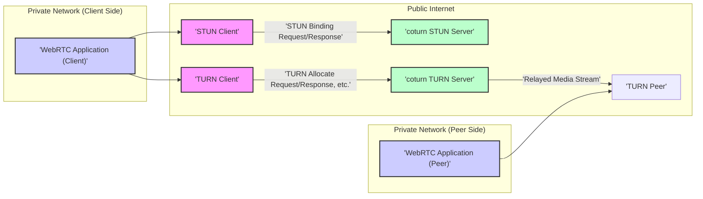
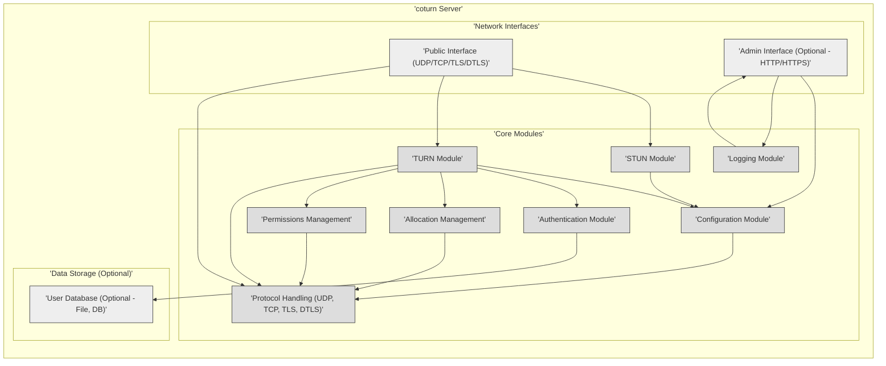
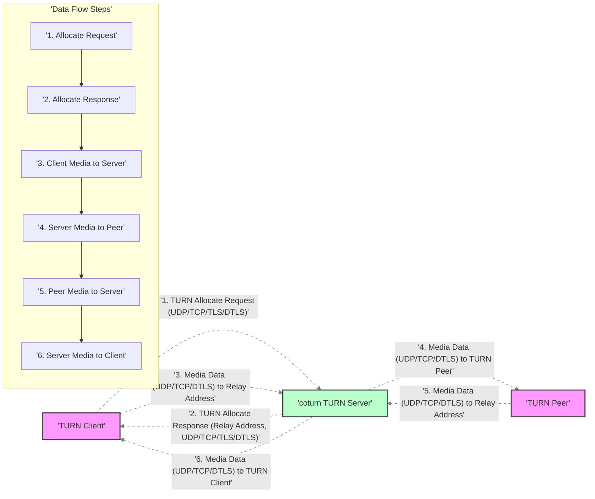

# Project Design Document: coturn TURN/STUN Server

**Version:** 1.1
**Date:** 2023-10-27
**Author:** Gemini (AI Expert in Software, Cloud and Cybersecurity Architecture)

## 1. Introduction

This document provides a detailed design overview of the coturn TURN/STUN server project, available at [https://github.com/coturn/coturn](https://github.com/coturn/coturn). This document is intended to serve as a foundation for threat modeling and security analysis. It outlines the system architecture, components, data flow, technology stack, deployment model, operational aspects, and key security considerations. This document aims to provide a comprehensive understanding of coturn's design for security stakeholders.

## 2. Project Overview

coturn is a robust, open-source implementation of the TURN (Traversal Using Relays around NAT) and STUN (Session Traversal Utilities for NAT) protocols. It is a critical component for enabling real-time communication (RTC) applications, most notably WebRTC, by facilitating connectivity for clients situated behind Network Address Translators (NATs) and firewalls. coturn allows these clients to establish communication with peers even when direct peer-to-peer connections are hindered by network address translation.

**Key functionalities of coturn:**

*   **STUN Server Functionality:** Implements the STUN protocol (RFC 5389 and related RFCs) to assist clients in discovering their external IP address and port as seen from the public internet, and to determine the type of NAT they are behind.
*   **TURN Server Functionality:** Implements the TURN protocol (RFC 5766 and related RFCs) to act as a relay for media streams (audio, video, data) when direct connections are not feasible. This includes allocation of relay ports, managing permissions, and relaying data between peers.
*   **Protocol Support:** Supports UDP, TCP, TLS (over TCP), and DTLS (over UDP) for both STUN and TURN protocols, offering flexibility in deployment and security.
*   **Authentication and Authorization:** Provides various mechanisms for securing TURN server access, including:
    *   Username/Password authentication (long-term and short-term credentials).
    *   Realm-based authentication.
    *   Integration with external authentication mechanisms via plugins (e.g., OAuth, LDAP - though plugin support needs verification in the codebase).
    *   Permissions management for controlling access to specific relay resources.
*   **Configuration and Management:** Offers extensive configuration options via configuration files and command-line arguments, allowing administrators to tailor server behavior, security policies, and resource limits. Includes basic monitoring and logging capabilities.
*   **Extensibility (Limited):** While primarily a C application, coturn has some degree of modularity and potentially supports plugins for authentication (needs codebase verification for plugin architecture details).

## 3. System Architecture

The following diagram illustrates the high-level architecture of the coturn system in a typical WebRTC context.

**Description of Components (Detailed):**

*   **"'STUN Client'"**:  A software component, typically embedded within a WebRTC application or RTC client, responsible for utilizing the STUN protocol. It sends STUN Binding Requests to a STUN server to discover its public IP address and port, and to infer the NAT type present in the network. This information is crucial for establishing direct peer-to-peer connections when possible.
*   **"'coturn STUN Server'"**: The STUN server component of coturn. It listens for STUN Binding Requests on UDP and/or TCP ports (typically 3478 or 5349). Upon receiving a valid request, it responds with a STUN Binding Response containing the client's perceived public IP address and port. It does not relay media traffic.
*   **"'TURN Client'"**: A software component, also typically part of a WebRTC application, that implements the TURN client protocol. When direct peer-to-peer communication fails or is deemed unreliable, the TURN client requests relay resources from a TURN server. It handles TURN protocol signaling (Allocate, Refresh, Send, Data, ChannelBind, ChannelData requests) to establish and maintain relay sessions.
*   **"'coturn TURN Server'"**: The core component of coturn, acting as the TURN server. It listens for TURN requests on UDP, TCP, TLS, and DTLS ports (typically 3478, 5349, or configurable). It authenticates TURN clients, allocates relay ports and IP addresses, and relays media streams between TURN clients and their peers. It manages relay sessions, enforces resource limits, and handles security policies.
*   **"'TURN Peer'"**: The communication endpoint that the TURN client is trying to reach. This could be another WebRTC application, a media server, or any other entity participating in the RTC session. The TURN server relays media between the TURN client and this peer.
*   **"'WebRTC Application (Client)'"**: An example of a real-world application that integrates STUN and TURN clients. This application resides behind a NAT in a private network and relies on coturn to establish communication with peers outside its network.
*   **"'WebRTC Application (Peer)'"**: The peer application that the client application intends to communicate with. This peer could be on the public internet, in a different private network, or even behind another NAT.

## 4. Component Details (Internal Architecture)

This section provides a more granular view of the components within the coturn server process.

**Component Descriptions (Detailed):**

*   **"'Network Interfaces'"**:
    *   **"'Public Interface (UDP/TCP/TLS/DTLS)'"**:  The primary network interface of the coturn server, exposed to the public internet or client networks. It listens on configurable UDP and TCP ports for incoming STUN and TURN requests. Supports secure communication via TLS over TCP and DTLS over UDP, utilizing OpenSSL for cryptographic operations. Configuration includes specifying listening IP addresses, ports, and enabled protocols.
    *   **"'Admin Interface (Optional - HTTP/HTTPS)'"**: An optional interface for administrative tasks. It *may* (implementation dependent and needs codebase verification) provide HTTP/HTTPS endpoints for server monitoring, configuration management, statistics retrieval, or potentially even dynamic configuration updates.  Its presence and functionality are configuration-dependent.
*   **"'Core Modules'"**:
    *   **"'STUN Module'"**:  Implements the core logic of the STUN protocol. Parses STUN Binding Requests, performs NAT discovery related operations, and constructs STUN Binding Responses. Handles STUN-specific attributes and error codes.
    *   **"'TURN Module'"**:  The central module responsible for TURN server functionality. Implements the TURN protocol state machine, handling all TURN message types: Allocate, Refresh, Send, Data, ChannelBind, ChannelData, CreatePermission, etc. Manages the lifecycle of TURN allocations, including creation, refreshing, and termination. Enforces permissions and resource limits.
    *   **"'Authentication Module'"**:  Handles client authentication for TURN requests, ensuring only authorized clients can obtain relay allocations. Supports various authentication methods, including username/password (long-term and short-term), realm-based authentication, and potentially pluggable authentication mechanisms. Interacts with the User Database (if configured) or configuration files to verify credentials.
    *   **"'Configuration Module'"**:  Loads, parses, and manages the server's configuration. Reads configuration from files (typically `turnserver.conf`) and command-line arguments. Provides configuration parameters to other modules, controlling server behavior, security settings, network interfaces, logging, and resource limits.
    *   **"'Logging Module'"**:  Handles all server logging activities. Configurable logging levels (e.g., debug, info, warning, error), logging destinations (e.g., console, files, syslog), and log formats. Logs events such as server startup, shutdown, client connections, authentication attempts, errors, and potentially traffic statistics.
    *   **"'Allocation Management'"**:  Manages the pool of relay resources (UDP/TCP ports and IP addresses) available for TURN allocations. Tracks active allocations, enforces resource limits (e.g., maximum allocations, bandwidth limits), and reclaims resources when allocations expire or are terminated.
    *   **"'Permissions Management'"**:  Manages permissions associated with TURN allocations. Controls which peers a TURN client is allowed to communicate with. Implements mechanisms like TURN permissions (RFC 5766) and potentially more granular access control policies.
    *   **"'Protocol Handling (UDP, TCP, TLS, DTLS)'"**:  Handles the low-level details of network protocol processing for UDP, TCP, TLS, and DTLS. Manages socket creation, listening, connection handling, and data transmission/reception using libevent and OpenSSL. Provides abstraction for other modules to interact with different transport protocols.
*   **"'Data Storage (Optional - File, DB)'"**:
    *   **"'User Database (Optional - File, DB)'"**:  Optional persistent storage for user credentials used for authentication. Can be implemented using flat files (e.g., text files with username/password pairs) or external database systems (e.g., via database connector libraries - needs codebase verification for supported DB types). If no external database is configured, user credentials might be stored directly in configuration files or managed in memory.

## 5. Data Flow Diagram (TURN Allocation and Media Relay - Detailed)

This diagram provides a more detailed data flow for a TURN allocation and subsequent media relay, including protocol details.

**Data Flow Steps (Detailed Protocol View):**

1.  **"'TURN Allocate Request (UDP/TCP/TLS/DTLS)'"**: The TURN client initiates a TURN session by sending an Allocate Request to the coturn TURN server. This request is sent over UDP, TCP, TLS, or DTLS, depending on the client and server configuration. The request includes authentication credentials and desired transport protocols.
2.  **"'TURN Allocate Response (Relay Address, UDP/TCP/TLS/DTLS)'"**: The coturn TURN server receives the Allocate Request, authenticates the client, and if successful, allocates relay resources (IP address and port). It then sends an Allocate Response back to the client, containing the allocated relay address and the transport protocol to be used for media relaying.
3.  **"'Media Data (UDP/TCP/DTLS) to Relay Address'"**: The TURN client encapsulates media data (e.g., RTP packets for audio/video) within TURN Data or ChannelData messages and sends them to the allocated relay address on the coturn TURN server, using the agreed-upon transport protocol (UDP, TCP, or DTLS).
4.  **"'Media Data (UDP/TCP/DTLS) to TURN Peer'"**: The coturn TURN server receives the TURN Data or ChannelData messages from the client. It extracts the media data and relays it to the intended TURN peer. The destination peer address is determined from the TURN messages (e.g., from the `XOR-PEER-ADDRESS` attribute in Data indications or ChannelData messages). The relaying is done using the same transport protocol as the client-to-server connection or potentially a different protocol based on configuration and peer capabilities.
5.  **"'Media Data (UDP/TCP/DTLS) to Relay Address'"**: The TURN peer sends media data back to the coturn TURN server, addressing it to the relay address allocated to the TURN client. The peer also encapsulates the media data within TURN Data or ChannelData messages.
6.  **"'Media Data (UDP/TCP/DTLS) to TURN Client'"**: The coturn TURN server receives the TURN Data or ChannelData messages from the peer. It extracts the media data and relays it to the original TURN client, sending it to the client's IP address and port that was used to establish the TURN allocation.

## 6. Technology Stack (Detailed)

*   **Core Programming Language:** C (for performance and low-level network access)
*   **Event-Driven Networking Library:** libevent (for efficient, non-blocking I/O operations, handling multiple concurrent connections)
*   **Security and Cryptography Library:** OpenSSL (for TLS and DTLS protocol implementation, encryption, decryption, hashing, and certificate management)
*   **Configuration Parsing:** Likely uses custom C code for parsing configuration files (e.g., `turnserver.conf`). Configuration format is text-based, likely with sections and key-value pairs.
*   **Database Support (Optional):**  Potentially supports various database systems for user authentication and authorization.  Needs codebase verification for specific supported databases and database connector libraries used (e.g., MySQL Connector/C, libpq for PostgreSQL, hiredis for Redis). File-based user databases (e.g., text files) are also supported.
*   **Operating System Compatibility:** Designed for cross-platform compatibility, primarily targeting Unix-like systems (Linux, macOS, FreeBSD, other POSIX-compliant systems). Also supports Windows, although Windows support might have some limitations or require specific build configurations.
*   **Build System:** Autotools (autoconf, automake, libtool) for cross-platform build configuration and management.

## 7. Deployment Model (Expanded)

coturn offers flexible deployment options to suit various infrastructure needs and scalability requirements:

*   **"'Standalone TURN/STUN Server (Single Instance)'"**: The simplest deployment model, suitable for small to medium-sized deployments or development/testing environments. A single coturn instance runs on a dedicated server (physical or virtual) in the cloud or on-premises. All STUN and TURN functionalities are provided by this single instance.
*   **"'High Availability TURN/STUN Cluster (Load Balanced)'"**: For large-scale deployments requiring high availability and scalability, coturn can be deployed in a cluster behind a load balancer. Multiple coturn instances run in parallel, and a load balancer distributes client requests across these instances. This ensures service continuity even if one or more instances fail and allows for horizontal scaling to handle increased traffic. Load balancing can be achieved using hardware load balancers or software load balancers like HAProxy, Nginx, or cloud provider load balancers.
*   **"'Co-located with Media Server (SFU/MCU)'"**: In certain RTC architectures, especially those using Selective Forwarding Units (SFUs) or Multipoint Control Units (MCUs), deploying coturn on the same server or within the same infrastructure as the media server can be advantageous. This reduces network latency between the TURN server and the media server, potentially improving media quality and simplifying network topology.
*   **"'Containerized Deployment (Docker/Kubernetes)'"**: coturn is well-suited for containerization using Docker and orchestration with Kubernetes. Containerized deployments simplify deployment, management, and scaling. Docker images for coturn are readily available, and Kubernetes can be used to manage and scale coturn instances in a cloud-native environment.
*   **"'Cloud-Based TURN/STUN Service (IaaS/PaaS)'"**: coturn can be deployed on cloud infrastructure (IaaS - Infrastructure as a Service) like AWS EC2, Google Compute Engine, Azure VMs, or on cloud platforms (PaaS - Platform as a Service) that support containerized applications or virtual machines. Cloud deployment offers scalability, elasticity, and reduced operational overhead.

## 8. Security Considerations (Categorized and Expanded)

Security is paramount for a TURN/STUN server, as it handles network traffic and potentially sensitive media data. Key security considerations are categorized below:

**8.1. Authentication and Authorization Vulnerabilities:**

*   **Weak Authentication Mechanisms:** Using easily guessable passwords or relying solely on short-term credentials without proper rotation can lead to unauthorized access to TURN relay resources.
*   **Brute-Force Attacks:**  Authentication endpoints are susceptible to brute-force password guessing attacks. Lack of rate limiting or account lockout mechanisms can exacerbate this risk.
*   **Insecure Credential Storage:** Storing user credentials in plaintext configuration files or using weak hashing algorithms in user databases can compromise security if the server is compromised.
*   **Authorization Bypass:** Vulnerabilities in the authorization logic could allow unauthorized clients to obtain relay allocations or access resources they are not permitted to.
*   **Lack of Multi-Factor Authentication (MFA):** Absence of MFA for administrative access or even for TURN client authentication (if supported) weakens security posture.

**8.2. Confidentiality and Integrity Threats:**

*   **Eavesdropping (Man-in-the-Middle Attacks):** If TLS or DTLS is not properly configured or used, media streams and signaling traffic can be intercepted and eavesdropped upon by attackers.
*   **Data Tampering:** Without encryption and integrity checks (provided by TLS/DTLS), media data and signaling messages can be modified in transit, potentially leading to service disruption or security breaches.
*   **Downgrade Attacks:** Attackers might attempt to force clients and servers to downgrade to less secure protocols (e.g., from TLS to plain TCP) to facilitate eavesdropping or tampering.
*   **Certificate Validation Issues:** Improper certificate validation in TLS/DTLS implementations or configurations can lead to man-in-the-middle attacks.

**8.3. Denial of Service (DoS) and Resource Exhaustion Attacks:**

*   **Allocation Flooding:** Attackers can flood the server with TURN Allocate Requests, exhausting server resources (CPU, memory, ports, bandwidth) and preventing legitimate clients from obtaining service.
*   **Media Data Flooding:** Attackers can send large volumes of media data to the TURN server, overwhelming its processing capacity and network bandwidth, leading to service degradation or outage.
*   **Amplification Attacks:**  TURN servers, if misconfigured or vulnerable, could be exploited for amplification attacks, where attackers send small requests to the server, which then generates much larger responses towards a victim, causing DoS.
*   **State Exhaustion:** Attackers might try to create a large number of TURN allocations without sending media, exhausting server state resources (memory, connection tracking tables) and impacting performance.

**8.4. Relay Abuse and Misuse:**

*   **Open Relay Exploitation:**  If a TURN server is not properly secured with authentication and authorization, it can become an open relay, allowing attackers to relay arbitrary traffic through it, potentially for malicious purposes (e.g., spam, DDoS attacks, bypassing network restrictions).
*   **Traffic Amplification:** Attackers could use a vulnerable TURN server to amplify malicious traffic, making it harder to trace back to the original source.
*   **Data Exfiltration:** In compromised environments, attackers might use a TURN server to exfiltrate sensitive data by relaying it through the TURN server to external destinations.

**8.5. Configuration and Operational Security Risks:**

*   **Insecure Default Configurations:** Default configurations might have weak security settings (e.g., disabled authentication, weak encryption ciphers, excessive resource limits).
*   **Misconfigurations:** Incorrectly configured security parameters (e.g., weak TLS ciphers, permissive access control lists, inadequate logging) can introduce vulnerabilities.
*   **Insufficient Logging and Monitoring:** Lack of comprehensive logging and monitoring makes it difficult to detect security incidents, identify attacks, and perform security audits.
*   **Unpatched Vulnerabilities:** Failure to promptly apply security patches and updates to coturn and its dependencies (libevent, OpenSSL) leaves the server vulnerable to known exploits.
*   **Insecure Administrative Access:** If the optional admin interface is enabled and not properly secured (e.g., using weak passwords, unencrypted HTTP), it can become an attack vector.

**8.6. Input Validation and Code Vulnerabilities:**

*   **Buffer Overflow Vulnerabilities:**  Vulnerabilities in C code related to buffer handling could lead to buffer overflows, potentially allowing attackers to execute arbitrary code on the server.
*   **Format String Vulnerabilities:**  Improper handling of format strings in logging or other parts of the code could be exploited for information disclosure or code execution.
*   **Injection Attacks:**  Although less likely in a TURN server context, vulnerabilities related to input validation could potentially lead to injection attacks if input is not properly sanitized.

## 9. Assumptions and Constraints (Refined)

*   **Security of Underlying Infrastructure:** It is assumed that the network infrastructure on which coturn is deployed (network devices, firewalls, operating system) is reasonably secure and properly configured.
*   **Competent System Administration:**  It is assumed that system administrators responsible for deploying and managing coturn possess the necessary expertise and will follow security best practices for configuration, patching, and monitoring.
*   **Trust in Clients and Peers (Contextual):** The level of trust in clients and peers using coturn depends on the specific application context. In some scenarios, clients and peers might be considered relatively trusted, while in others, a zero-trust approach might be more appropriate. Security policies should be adapted accordingly.
*   **Regular Security Updates and Patching:**  It is assumed that organizations deploying coturn will establish a process for regularly monitoring security advisories and applying security updates and patches promptly to mitigate known vulnerabilities.
*   **Performance and Scalability Trade-offs:** Security measures (e.g., strong encryption, authentication) can sometimes introduce performance overhead. Deployment configurations need to balance security requirements with performance and scalability needs.
*   **Complexity of NAT and Firewalls:**  The inherent complexity of NAT traversal and firewall configurations can still pose challenges to connectivity even with TURN. Misconfigurations in firewalls or NAT devices can hinder TURN functionality and potentially introduce security vulnerabilities.
*   **Dependencies on External Libraries:** coturn's reliance on external libraries like libevent and OpenSSL introduces dependencies and potential vulnerabilities in those libraries. Security vulnerabilities in these dependencies can indirectly affect coturn's security.

This improved design document provides a more detailed and structured foundation for threat modeling the coturn project. The expanded security considerations section, categorized threats, and refined component descriptions should facilitate a more comprehensive and effective threat modeling exercise. The next step is to use this document to systematically identify threats, vulnerabilities, and attack vectors, and then develop appropriate mitigation strategies and security controls.