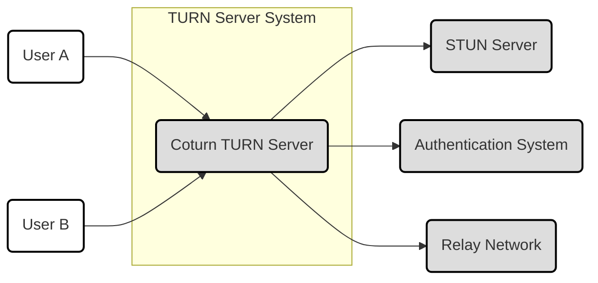
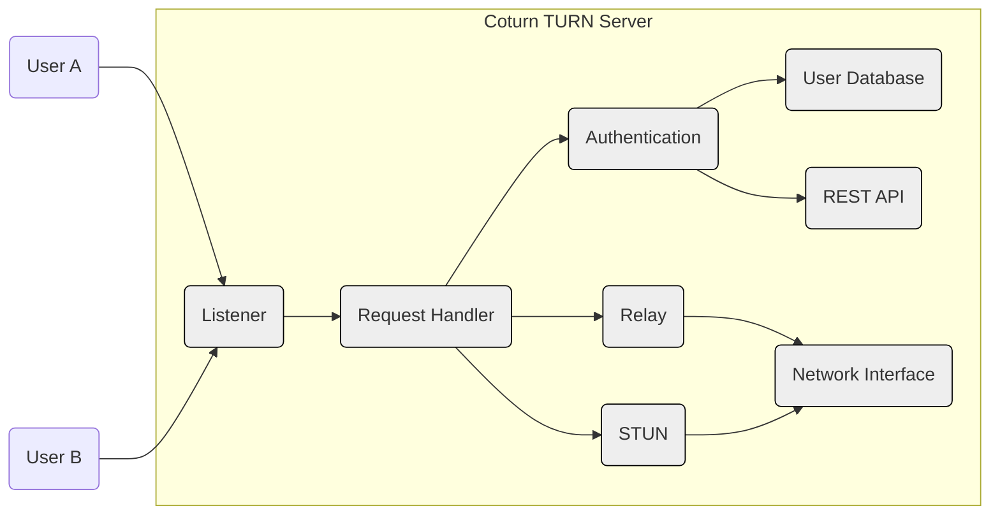
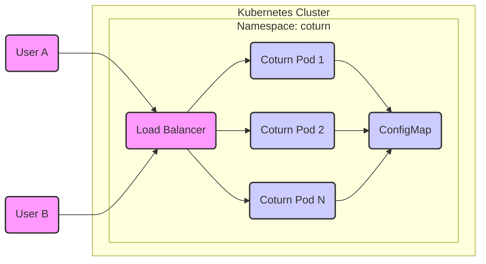
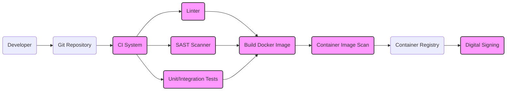

# BUSINESS POSTURE

TURN server is a crucial component for real-time communication applications, especially in scenarios with restrictive firewalls or NATs. Business priorities likely revolve around:

*   Reliability: Ensuring the TURN server is highly available and can handle a large volume of concurrent connections. Downtime directly impacts users' ability to communicate.
*   Performance: Minimizing latency and maximizing throughput for media relay. Users expect real-time communication to be seamless.
*   Scalability: The ability to easily scale the TURN server infrastructure to accommodate growing user demand.
*   Cost-Effectiveness: Optimizing infrastructure costs while maintaining performance and reliability.
*   Security: Protecting user data and preventing unauthorized access or abuse of the TURN server.
*   Compliance: Meeting any relevant regulatory requirements for data privacy and security (e.g., GDPR, HIPAA if applicable).

Most important business risks:

*   Service disruption due to server overload or failure, leading to user dissatisfaction and potential business loss.
*   Security breaches resulting in unauthorized access to user data or the TURN server itself.
*   High operational costs due to inefficient resource utilization or scaling issues.
*   Performance bottlenecks causing delays in media relay, impacting user experience.
*   Inability to scale the infrastructure to meet growing demand.

# SECURITY POSTURE

Existing security controls (based on the Coturn GitHub repository and general knowledge of TURN servers):

*   security control: Authentication: Coturn supports multiple authentication mechanisms, including long-term credentials, time-limited credentials, and integration with external authentication systems (e.g., REST API, database). Implemented in the Coturn server configuration and code.
*   security control: Authorization: Access control lists (ACLs) and user roles can be configured to restrict access to TURN server resources. Implemented in the Coturn server configuration.
*   security control: TLS/DTLS: Encryption of communication between clients and the TURN server using TLS (for TCP) and DTLS (for UDP). Implemented in the Coturn server configuration and relies on external libraries like OpenSSL.
*   security control: IP Address Filtering: Coturn can be configured to allow or deny relay traffic based on IP addresses. Implemented in the Coturn server configuration.
*   security control: Rate Limiting: Mechanisms to prevent abuse and denial-of-service attacks by limiting the number of requests from a single client or IP address. Implemented in the Coturn server code.
*   security control: Anti-DoS features: Multiple features to prevent DoS attacks. Implemented in the Coturn server code.
*   security control: Logging and Monitoring: Coturn logs various events, which can be used for auditing and security monitoring. Implemented in the Coturn server code.

Accepted risks:

*   accepted risk: Complexity of configuration: Coturn offers a wide range of configuration options, which can be complex to manage and potentially lead to misconfigurations.
*   accepted risk: Dependence on external libraries: Coturn relies on external libraries (e.g., OpenSSL) for cryptographic functions. Vulnerabilities in these libraries could impact the security of the TURN server.
*   accepted risk: Potential for misconfiguration: Incorrectly configured TURN server can expose organization to security risks.

Recommended security controls:

*   Regular security audits and penetration testing of the Coturn deployment.
*   Implement a robust monitoring and alerting system to detect and respond to security incidents.
*   Keep Coturn and its dependencies (especially OpenSSL) up to date with the latest security patches.
*   Use a Web Application Firewall (WAF) to protect against common web-based attacks.
*   Implement intrusion detection/prevention systems (IDS/IPS) to monitor network traffic for malicious activity.
*   Harden the operating system and network infrastructure on which Coturn is deployed.

Security Requirements:

*   Authentication:
    *   Strong password policies for user accounts.
    *   Support for multi-factor authentication (MFA).
    *   Secure storage of user credentials (e.g., hashing and salting).
*   Authorization:
    *   Fine-grained access control to restrict user permissions based on roles.
    *   Regular review and updates of access control policies.
*   Input Validation:
    *   Validate all input from clients to prevent injection attacks and other vulnerabilities.
    *   Sanitize data before using it in database queries or other sensitive operations.
*   Cryptography:
    *   Use strong, up-to-date cryptographic algorithms and protocols (e.g., TLS 1.3, DTLS 1.2).
    *   Securely manage cryptographic keys.
    *   Regularly review and update cryptographic configurations.

# DESIGN

## C4 CONTEXT

Element Descriptions:

*   Element:
    1.  Name - User A
    2.  Type - Person
    3.  Description - A user attempting to establish a real-time communication session.
    4.  Responsibilities - Initiates and participates in communication sessions.
    5.  Security controls - Authentication with the TURN server, encryption of communication (TLS/DTLS).

*   Element:
    1.  Name - User B
    2.  Type - Person
    3.  Description - Another user attempting to establish a real-time communication session.
    4.  Responsibilities - Initiates and participates in communication sessions.
    5.  Security controls - Authentication with the TURN server, encryption of communication (TLS/DTLS).

*   Element:
    1.  Name - Coturn TURN Server
    2.  Type - System
    3.  Description - The Coturn TURN server instance.
    4.  Responsibilities - Relays media traffic between clients when direct connections are not possible, provides STUN services.
    5.  Security controls - Authentication, authorization, TLS/DTLS, IP address filtering, rate limiting, logging, and monitoring.

*   Element:
    1.  Name - STUN Server
    2.  Type - System
    3.  Description - A STUN server (potentially Coturn itself or a separate instance).
    4.  Responsibilities - Provides STUN services to clients, allowing them to discover their public IP addresses and NAT types.
    5.  Security controls - Potentially TLS/DTLS, IP address filtering.

*   Element:
    1.  Name - Authentication System
    2.  Type - System
    3.  Description - An external system used for user authentication (e.g., REST API, database).
    4.  Responsibilities - Authenticates users and provides credentials to Coturn.
    5.  Security controls - Secure authentication protocols, secure storage of user credentials.

*   Element:
    1.  Name - Relay Network
    2.  Type - System
    3.  Description - The network through which relayed media traffic flows.
    4.  Responsibilities - Transports media data between clients.
    5.  Security controls - Network-level security controls (e.g., firewalls, intrusion detection/prevention systems).

## C4 CONTAINER

Element Descriptions:

*   Element:
    1.  Name - Listener
    2.  Type - Container
    3.  Description - Listens for incoming client connections (TCP/UDP).
    4.  Responsibilities - Accepts incoming connections, handles TLS/DTLS handshakes.
    5.  Security controls - TLS/DTLS configuration, IP address filtering.

*   Element:
    1.  Name - Request Handler
    2.  Type - Container
    3.  Description - Processes incoming requests from clients.
    4.  Responsibilities - Parses requests, determines request type (STUN or TURN), routes requests to appropriate modules.
    5.  Security controls - Input validation.

*   Element:
    1.  Name - Authentication
    2.  Type - Container
    3.  Description - Handles user authentication.
    4.  Responsibilities - Verifies user credentials, interacts with external authentication systems (DB, REST API).
    5.  Security controls - Authentication mechanisms (long-term, time-limited), secure communication with external systems.

*   Element:
    1.  Name - Relay
    2.  Type - Container
    3.  Description - Manages TURN relay functionality.
    4.  Responsibilities - Allocates relay addresses, relays media traffic between clients.
    5.  Security controls - Authorization, rate limiting.

*   Element:
    1.  Name - STUN
    2.  Type - Container
    3.  Description - Handles STUN requests.
    4.  Responsibilities - Processes STUN requests, determines client's public IP address and NAT type.
    5.  Security controls - Input validation.

*   Element:
    1.  Name - DB
    2.  Type - Container
    3.  Description - Database for storing user credentials (optional).
    4.  Responsibilities - Stores user information.
    5.  Security controls - Secure database configuration, access controls, encryption of sensitive data.

*   Element:
    1.  Name - REST API
    2.  Type - Container
    3.  Description - REST API for external authentication (optional).
    4.  Responsibilities - Provides an interface for authenticating users.
    5.  Security controls - Secure API design, authentication, and authorization.

*   Element:
    1.  Name - Network Interface
    2.  Type - Container
    3.  Description - Network interface for sending and receiving data.
    4.  Responsibilities - Handles network communication.
    5.  Security controls - Operating system-level network security controls.

*   Element:
    1.  Name - User A
    2.  Type - Person
    3.  Description - A user attempting to establish a real-time communication session.
    4.  Responsibilities - Initiates and participates in communication sessions.
    5.  Security controls - Authentication with the TURN server, encryption of communication (TLS/DTLS).

*   Element:
    1.  Name - User B
    2.  Type - Person
    3.  Description - Another user attempting to establish a real-time communication session.
    4.  Responsibilities - Initiates and participates in communication sessions.
    5.  Security controls - Authentication with the TURN server, encryption of communication (TLS/DTLS).

## DEPLOYMENT

Possible deployment solutions:

1.  Single server deployment: Coturn is installed and runs on a single virtual machine or physical server.
2.  Multiple server deployment (load balanced): Multiple Coturn instances are deployed behind a load balancer.
3.  Containerized deployment (Docker, Kubernetes): Coturn is deployed as a container using Docker or Kubernetes.
4.  Cloud provider-specific deployment (e.g., AWS EC2, Google Compute Engine, Azure VMs): Coturn is deployed on virtual machines within a cloud provider's infrastructure.

Chosen solution (for detailed description): Containerized deployment (Kubernetes).

Element Descriptions:

*   Element:
    1.  Name - User A
    2.  Type - Person
    3.  Description - A user attempting to establish a real-time communication session.
    4.  Responsibilities - Initiates and participates in communication sessions.
    5.  Security controls - Authentication with the TURN server, encryption of communication (TLS/DTLS).

*   Element:
    1.  Name - User B
    2.  Type - Person
    3.  Description - Another user attempting to establish a real-time communication session.
    4.  Responsibilities - Initiates and participates in communication sessions.
    5.  Security controls - Authentication with the TURN server, encryption of communication (TLS/DTLS).

*   Element:
    1.  Name - Load Balancer
    2.  Type - Node
    3.  Description - Kubernetes Service of type LoadBalancer.
    4.  Responsibilities - Distributes incoming traffic across multiple Coturn pods.
    5.  Security controls - Network-level security controls (e.g., firewalls), TLS termination (optional).

*   Element:
    1.  Name - Coturn Pod 1
    2.  Type - Kubernetes Pod
    3.  Description - A Kubernetes pod running a Coturn container.
    4.  Responsibilities - Handles TURN and STUN requests.
    5.  Security controls - All Coturn security controls (authentication, authorization, TLS/DTLS, etc.).

*   Element:
    1.  Name - Coturn Pod 2
    2.  Type - Kubernetes Pod
    3.  Description - A Kubernetes pod running a Coturn container.
    4.  Responsibilities - Handles TURN and STUN requests.
    5.  Security controls - All Coturn security controls (authentication, authorization, TLS/DTLS, etc.).

*   Element:
    1.  Name - Coturn Pod N
    2.  Type - Kubernetes Pod
    3.  Description - A Kubernetes pod running a Coturn container.  Represents additional pods for scalability.
    4.  Responsibilities - Handles TURN and STUN requests.
    5.  Security controls - All Coturn security controls (authentication, authorization, TLS/DTLS, etc.).

*   Element:
    1.  Name - ConfigMap
    2.  Type - Kubernetes ConfigMap
    3.  Description - Kubernetes ConfigMap containing Coturn configuration.
    4.  Responsibilities - Provides configuration data to Coturn pods.
    5.  Security controls - Kubernetes RBAC, secrets management (for sensitive configuration).

## BUILD

The Coturn build process can vary, but a typical secure build process would involve the following:

1.  Developer commits code to a Git repository (e.g., GitHub).
2.  A Continuous Integration (CI) system (e.g., GitHub Actions, Jenkins) is triggered.
3.  The CI system checks out the code.
4.  Static analysis tools (linters, code formatters) are run to enforce code style and identify potential issues.
5.  Static Application Security Testing (SAST) tools are run to scan the code for security vulnerabilities.
6.  Unit tests and integration tests are executed.
7.  If all tests and scans pass, a Docker image is built.
8.  The Docker image is scanned for vulnerabilities using a container image scanning tool.
9.  The Docker image is pushed to a container registry (e.g., Docker Hub, Amazon ECR, Google Container Registry).
10. The image in registry is digitally signed.

Security Controls in Build Process:

*   security control: Code review: Manual review of code changes before merging to the main branch.
*   security control: Static analysis: Automated code analysis to identify potential issues and enforce coding standards.
*   security control: SAST: Scanning the code for security vulnerabilities.
*   security control: Software Composition Analysis (SCA): Identifying and analyzing open-source dependencies for known vulnerabilities.
*   security control: Container image scanning: Scanning the Docker image for vulnerabilities.
*   security control: Automated testing: Running unit and integration tests to ensure code quality and functionality.
*   security control: Least privilege: Running build processes with minimal necessary permissions.
*   security control: Immutable infrastructure: Building new Docker images for each deployment, rather than modifying existing ones.
*   security control: Digital Signing: Signing the final image to ensure integrity.

# RISK ASSESSMENT

*   Critical business processes we are trying to protect:
    *   Real-time communication between users.
    *   Availability and reliability of the TURN service.
    *   User data privacy and confidentiality.

*   Data we are trying to protect and their sensitivity:
    *   User credentials (usernames, passwords, API keys): Highly sensitive.
    *   IP addresses of clients and the TURN server: Moderately sensitive.
    *   Communication metadata (timestamps, connection information): Moderately sensitive.
    *   Relayed media data (audio, video): Sensitivity depends on the content of the communication; potentially highly sensitive.  Coturn itself does *not* inspect this data, but its compromise could allow an attacker to.

# QUESTIONS & ASSUMPTIONS

*   Questions:
    *   What is the expected scale of the TURN server deployment (number of concurrent users, bandwidth requirements)?
    *   What are the specific compliance requirements (if any) that need to be met?
    *   What is the existing infrastructure and tooling used for deployment and management?
    *   What is the budget for security controls and infrastructure?
    *   Are there any specific performance requirements or constraints?
    *   What external authentication systems are currently in use, if any?
    *   What level of logging and monitoring is required?
    *   What is the process for handling security incidents?

*   Assumptions:
    *   The organization has a basic understanding of security best practices.
    *   The organization has a process for managing software updates and patches.
    *   The organization has a network infrastructure that can support the TURN server deployment.
    *   The organization is willing to invest in security controls to protect the TURN server and user data.
    *   The primary use case is for WebRTC-based communication.
    *   The organization will use a secure container registry.
    *   The organization will implement Kubernetes RBAC.
    *   The organization will monitor Kubernetes cluster.