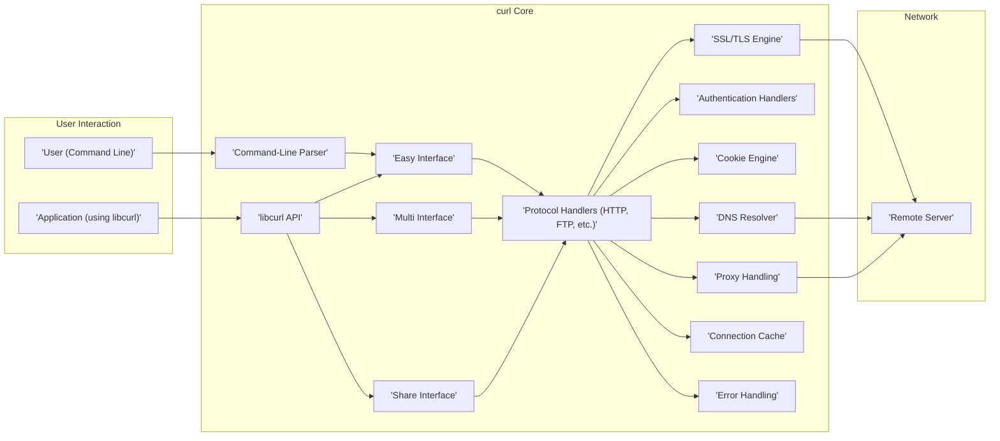
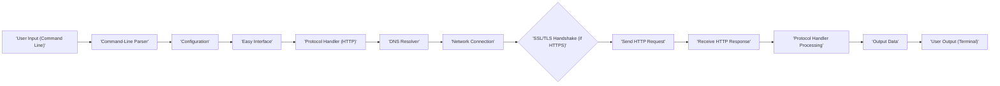

# Project Design Document: curl

**Version:** 1.1
**Date:** October 26, 2023
**Author:** AI Software Architect

## 1. Introduction

This document provides a detailed design overview of the `curl` project, encompassing both its command-line tool and library functionalities for transferring data with URLs. This document aims to provide a comprehensive understanding of the system's architecture, key components, data flow, and security considerations. It will serve as the foundation for subsequent threat modeling activities.

## 2. Goals and Objectives

* **Primary Goal:** Provide a clear and detailed architectural description of the `curl` project suitable for threat modeling.
* **Objectives:**
    * Describe the high-level architecture of `curl`, highlighting the interaction between the command-line tool and the library.
    * Identify key components and their specific responsibilities within the data transfer process.
    * Illustrate the typical data flow during a data transfer initiated via the command-line interface.
    * Highlight important security considerations relevant for threat modeling, providing concrete examples.
    * Provide visual representations of the architecture and data flow using Mermaid diagrams.

## 3. Scope

This document covers the core functionality of `curl` as both a command-line tool and its underlying library (`libcurl`). The focus is on the data transfer process across various protocols and the associated security aspects. While it touches upon various protocols, it does not provide an exhaustive analysis of every supported protocol's intricacies or every possible command-line option.

## 4. High-Level Architecture

`curl` operates in two primary modes, both leveraging a shared core for data transfer:

* **Command-Line Tool (`curl` executable):**  Enables users to perform data transfers directly from the command line by parsing arguments and utilizing `libcurl`.
* **Library (`libcurl`):** Provides a programmatic API for other applications to integrate data transfer capabilities.

The following diagram illustrates the high-level architecture:

## 5. Key Components

* **Command-Line Parser:** Responsible for interpreting command-line arguments provided by the user, validating them, and configuring the data transfer parameters for `libcurl`.
* **libcurl API:** The public Application Programming Interface exposed by the `libcurl` library. This API allows applications to initiate and manage data transfers, set options, and handle callbacks.
* **Easy Interface:** A synchronous, blocking interface within `libcurl` designed for simple data transfers. It's the most straightforward way to perform a single transfer.
* **Multi Interface:** An asynchronous, non-blocking interface within `libcurl`. It allows applications to manage multiple concurrent data transfers efficiently using a single thread.
* **Share Interface:** Enables the sharing of data between multiple `easy` or `multi` handles. This includes sharing things like cookies, DNS cache, SSL session IDs, and connection pools, improving performance and resource utilization.
* **Protocol Handlers:** Modular components responsible for implementing the specific logic for each supported network protocol (e.g., HTTP, HTTPS, FTP, SMTP, etc.). Each handler manages protocol-specific request formatting, response parsing, and error handling.
* **SSL/TLS Engine:** Handles the establishment of secure connections using protocols like TLS and SSL. This component typically interfaces with external cryptographic libraries such as OpenSSL, BoringSSL, or NSS.
* **Authentication Handlers:** Manages various authentication mechanisms required by different protocols and servers. Examples include Basic, Digest, NTLM, Kerberos, and OAuth.
* **Cookie Engine:** Responsible for managing HTTP cookies, including parsing `Set-Cookie` headers, storing cookies, and including relevant cookies in subsequent requests.
* **Proxy Handling:** Manages communication through intermediary proxy servers. This includes support for different proxy types like HTTP, SOCKS4, and SOCKS5, and handling proxy authentication.
* **DNS Resolver:** Resolves domain names to IP addresses. `curl` can be configured to use the system's resolver or its own internal asynchronous resolver.
* **Connection Cache:** Maintains a cache of established network connections for reuse in subsequent requests to the same server, reducing connection setup overhead and improving performance.
* **Error Handling:** Manages and reports errors encountered during the data transfer process, providing informative error codes and messages.

## 6. Data Flow

The following diagram illustrates a typical data transfer initiated by the `curl` command-line tool for an HTTP request:

**Detailed Data Flow Steps:**

1. **User Input (Command Line):** The user enters a `curl` command with options and a target URL in the terminal.
2. **Command-Line Parser:** The `curl` executable's parser analyzes the command-line arguments, extracting the URL, headers, request method, and other specified options.
3. **Configuration:** Based on the parsed arguments, the parser configures the `libcurl` `easy` handle with the necessary parameters for the data transfer.
4. **Easy Interface:** The command-line tool utilizes the `easy` interface of `libcurl` to initiate a synchronous data transfer.
5. **Protocol Handler (HTTP):** The HTTP protocol handler is selected based on the `https://` or `http://` scheme in the URL.
6. **DNS Resolver:** The DNS resolver translates the hostname in the URL to an IP address. This might involve querying local caches or remote DNS servers.
7. **Network Connection:** A TCP connection is established with the remote server at the resolved IP address and the appropriate port (usually 80 for HTTP, 443 for HTTPS).
8. **SSL/TLS Handshake (if HTTPS):** If the protocol is HTTPS, the SSL/TLS engine performs a handshake with the server to establish a secure, encrypted connection. This involves certificate exchange and key agreement.
9. **Send HTTP Request:** The HTTP protocol handler formats the HTTP request (including headers, method, and body if applicable) and sends it to the server over the established connection.
10. **Receive HTTP Response:** The server sends back an HTTP response, which is received by `curl`. This includes status codes, headers, and the response body.
11. **Protocol Handler Processing:** The HTTP protocol handler parses the received HTTP response, handling headers, checking the status code, and extracting the response body.
12. **Output Data:** The received data (the response body) is processed according to the command-line options (e.g., displayed on the terminal, saved to a file, piped to another command).
13. **User Output (Terminal):** The output is presented to the user in the terminal.

For applications using `libcurl` directly, the application code interacts with the `libcurl` API (either the `easy` or `multi` interface) to configure and initiate the data transfer, bypassing the command-line parsing stage.

## 7. Security Considerations

This section outlines key security considerations relevant for threat modeling the `curl` project:

* **Input Validation:**
    * **URL Parsing Vulnerabilities:** Improper parsing of URLs can lead to various attacks. For example, specially crafted URLs might bypass security checks or cause buffer overflows. Consider scenarios with unusual characters or excessively long URLs.
    * **Command-Line Argument Injection:**  While less common in direct usage, if `curl` commands are constructed dynamically based on user input without proper sanitization, it could lead to command injection vulnerabilities.
    * **Header Injection:**  Allowing users to specify arbitrary headers can be dangerous if not handled correctly by the server. Attackers might inject malicious headers to bypass security measures or manipulate server behavior (e.g., HTTP Response Splitting).
* **Protocol Vulnerabilities:**
    * **HTTP-Specific Attacks:** `curl` is susceptible to vulnerabilities inherent in the HTTP protocol, such as Cross-Site Scripting (XSS) if it renders untrusted content, HTTP Request Smuggling, and header injection attacks targeting the server.
    * **FTP Bounce Attacks:**  If using FTP, `curl` could be vulnerable to FTP bounce attacks where an attacker can scan ports on internal networks.
    * **SMTP Injection:** When sending emails via SMTP, improper handling of input could lead to SMTP injection attacks, allowing attackers to send unauthorized emails.
* **SSL/TLS Security:**
    * **Vulnerable Cryptographic Libraries:** `curl` relies on external libraries like OpenSSL. Vulnerabilities in these libraries directly impact `curl`'s security. Regular updates are crucial.
    * **Insufficient Certificate Validation:**  If certificate validation is disabled or improperly configured, it can lead to Man-in-the-Middle (MITM) attacks where an attacker intercepts and potentially modifies communication.
    * **Protocol Downgrade Attacks:** Attackers might try to force the use of older, less secure TLS versions (e.g., SSLv3) to exploit known vulnerabilities.
    * **Improper Handling of TLS Features:**  Misconfiguration or improper use of TLS features like session resumption or OCSP stapling can introduce vulnerabilities.
* **Authentication Security:**
    * **Credential Storage and Handling:**  Storing authentication credentials insecurely (e.g., in plain text in configuration files) or transmitting them over unencrypted connections can lead to credential theft.
    * **Authentication Bypass Vulnerabilities:**  Flaws in the authentication handling logic within `curl` or the underlying protocols could allow attackers to bypass authentication.
* **Cookie Security:**
    * **Cookie Injection and Manipulation:** Attackers might try to inject or manipulate cookies stored by `curl` or sent by the server to gain unauthorized access or impersonate users.
    * **Lack of Secure and HttpOnly Flags:** If `curl` doesn't respect or properly handle the `Secure` and `HttpOnly` flags on cookies, it can increase the risk of cross-site scripting (XSS) and other attacks.
* **Proxy Security:**
    * **Proxy Vulnerabilities:**  Issues in the proxy handling logic within `curl` could be exploited.
    * **Proxy Credential Leakage:**  Improper handling of proxy authentication credentials could lead to their exposure.
    * **Man-in-the-Middle Attacks via Proxies:** If the connection to the proxy itself is not secure, it can become a point for MITM attacks.
* **DNS Security:**
    * **DNS Spoofing:** If `curl` relies on a vulnerable DNS resolver, it could be directed to malicious servers, leading to phishing or malware distribution.
* **Buffer Overflows and Memory Safety:**
    * As `curl` is written in C, there's a potential for buffer overflow vulnerabilities and other memory safety issues if input is not carefully validated and handled.
* **Dependency Vulnerabilities:**
    * `curl` relies on various third-party libraries. Vulnerabilities in these dependencies can indirectly affect `curl`'s security. Regular updates and security audits of dependencies are important.
* **Configuration Security:**
    * Insecure default configurations or allowing users to specify insecure options (e.g., disabling certificate verification) can create significant vulnerabilities.
* **Information Disclosure:**
    * Verbose error messages or debug output might inadvertently reveal sensitive information about the system or the data being transferred.

## 8. Deployment

`curl` is widely deployed in various environments:

* **Command-Line Tool:** Pre-installed on many operating systems (Linux, macOS) and readily available for installation on others (Windows). Used by developers, system administrators, and end-users for ad-hoc data transfers and scripting.
* **Library (libcurl):** Embedded within a vast array of applications, including:
    * **Web Browsers:** Used for downloading resources and handling network requests.
    * **Scripting Languages:**  Provides network capabilities for scripts written in Python, PHP, Ruby, etc.
    * **Mobile Applications:**  Used for network communication in mobile apps.
    * **IoT Devices:**  Enables network connectivity for embedded systems.
    * **Software Development Kits (SDKs):**  Integrated into SDKs for various services and platforms.
    * **Version Control Systems:** Used by tools like Git for fetching and pushing data.
    * **Email Clients:**  For sending and receiving emails.

## 9. Technologies Used

* **Programming Language:** C
* **SSL/TLS Libraries:** OpenSSL, BoringSSL, NSS, mbed TLS, wolfSSL, Secure Transport (macOS/iOS) - the specific library used depends on the build configuration.
* **Operating Systems:**  Highly portable and runs on a wide range of operating systems, including Linux, macOS, Windows, iOS, Android, and various embedded systems.
* **Network Protocols:**  Supports a vast array of protocols, including HTTP, HTTPS, FTP, FTPS, SCP, SFTP, TFTP, SMTP, SMTPS, POP3, POP3S, IMAP, IMAPS, DICT, LDAP, LDAPS, MQTT, TELNET, GOPHER, RTMP, RTSP, Metalink, and more.

## 10. Future Considerations

* **Enhanced Security Features:** Continuously improving security measures to address emerging threats, such as incorporating more robust defenses against protocol downgrade attacks, improving certificate handling, and exploring memory-safe alternatives for critical components.
* **Improved Protocol Support:** Adding support for new and evolving network protocols and standards.
* **Performance Optimizations:**  Further optimizing the efficiency and speed of data transfers, potentially through better connection pooling, more efficient data handling, and leveraging new network technologies.
* **Modularity and Extensibility:**  Potentially further modularizing the architecture to make it easier to add new protocol handlers or authentication mechanisms.
* **Standardization Efforts:**  Actively participating in standardization efforts related to network protocols and security.
* **Addressing Memory Safety:** Exploring options for mitigating memory safety vulnerabilities, potentially through static analysis tools, fuzzing, or adopting memory-safe languages for certain components in the future.

This improved document provides a more detailed and comprehensive understanding of the `curl` project's architecture, components, and security considerations, making it a more effective foundation for threat modeling activities.