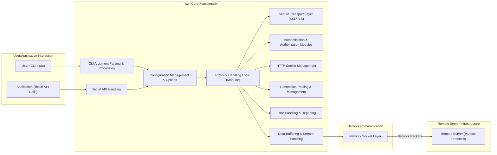
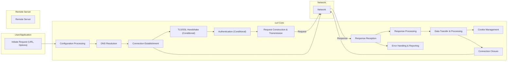

# Project Design Document: curl

**Version:** 1.1
**Date:** October 26, 2023
**Author:** AI Software Architect

## 1. Introduction

This document provides an enhanced and more detailed design overview of the `curl` project, encompassing both the command-line tool and the `libcurl` library. This document is intended to serve as a comprehensive foundation for subsequent threat modeling activities, offering a clear and in-depth understanding of the system's architecture, components, interactions, and data flow.

## 2. Goals and Objectives

The fundamental goals of the `curl` project are:

* **Robust and Reliable Data Transfer:** To offer a dependable and resilient mechanism for transferring data across various network protocols, handling network interruptions and errors gracefully.
* **Extensive Protocol Support:** To support a broad spectrum of internet protocols, including but not limited to HTTP, HTTPS, FTP, SFTP, SCP, SMTP, POP3, IMAP, and potentially less common protocols.
* **High Degree of Flexibility and Customization:** To provide a rich set of options and configurations, allowing users and developers to tailor data transfer behavior to specific needs and intricate scenarios.
* **Broad Cross-Platform Compatibility:** To ensure seamless operation across a wide range of operating systems (Windows, macOS, Linux, *BSD, etc.) and hardware architectures.
* **Reusable Library Functionality:** To offer a well-defined and stable library (`libcurl`) that can be easily integrated into diverse applications, providing network transfer capabilities without requiring developers to implement low-level networking logic.

## 3. High-Level Architecture

The `curl` project operates in two primary modes, sharing core functionalities: as a command-line tool for direct user interaction and as a library (`libcurl`) integrated into other software applications.

## 4. Key Components

The `curl` project is built upon several interconnected key components:

* **Command-Line Interface (CLI) Argument Parsing & Processing:** This component is responsible for interpreting command-line arguments provided by the user when executing the `curl` binary. It validates, parses, and translates these arguments into internal configuration settings that govern the data transfer operation.
* **Library Interface (libcurl API Handling):** This component exposes the programmatic interface of `libcurl`. It receives function calls from applications, validates parameters, and orchestrates the underlying `curl` functionalities to fulfill the requested network operations.
* **Protocol Handling Logic (Modular):** This set of modules implements the specific logic for interacting with different network protocols (e.g., HTTP, FTP, SMTP). Each module is responsible for constructing protocol-compliant requests, interpreting server responses, and handling protocol-specific nuances. This modular design allows for easier addition of new protocol support.
* **Secure Transport Layer (SSL/TLS):** This component provides secure communication channels using SSL/TLS protocols. It handles tasks such as certificate verification (using configured CA bundles), encryption and decryption of data, and negotiation of secure connection parameters. It often interfaces with external libraries like OpenSSL, BoringSSL, or NSS.
* **Authentication & Authorization Modules:** These modules manage various authentication methods required by different protocols and servers (e.g., Basic, Digest, NTLM, Kerberos, OAuth 2.0). They handle credential storage (when necessary), secure transmission of credentials, and authorization challenges.
* **HTTP Cookie Management:** This component is responsible for storing, retrieving, and transmitting HTTP cookies according to HTTP specifications. It manages cookie persistence (in-memory or file-based), cookie attributes (domain, path, expiration), and ensures proper cookie handling during HTTP requests and responses.
* **Connection Pooling & Management:** This component optimizes network performance by managing persistent connections. It maintains a pool of open connections to frequently accessed servers, reducing the overhead of establishing new connections for subsequent requests. It handles connection reuse, keep-alive mechanisms, and connection timeouts.
* **Error Handling & Reporting:** This component manages errors that arise during the data transfer process. It captures errors from various stages (network errors, protocol errors, SSL/TLS errors), provides informative error messages to the user or application, and allows for error recovery or handling through API callbacks.
* **Configuration Management & Options:** This component manages the extensive set of configuration options available in `curl`. These options can be set via command-line arguments, environment variables, configuration files (`.curlrc`), or programmatically through `libcurl`'s API. It ensures that the configured options are applied correctly to the data transfer process.
* **Data Buffering & Stream Handling:** This component manages the flow of data between the network and the user or application. It handles buffering of data for efficient transmission and reception, and provides mechanisms for streaming data, allowing for the transfer of large files without loading the entire content into memory.

## 5. Data Flow

A typical data transfer operation with `curl` follows these steps:

* **Request Initiation:** The user (via CLI) provides a command with a URL and options, or an application using `libcurl` calls relevant API functions with a URL and configuration parameters.
* **Configuration Processing:** The CLI parser or `libcurl` API handler processes the provided input and sets up the internal configuration for the data transfer, including protocol selection, authentication details, headers, and other options.
* **DNS Resolution:** If the URL's hostname is not an IP address, `curl` performs a DNS lookup to resolve the hostname to an IP address.
* **Connection Establishment:** Based on the protocol, `curl` establishes a network connection to the remote server's IP address and port. For secure protocols (HTTPS, SFTP, etc.), this involves a TLS/SSL handshake.
    * **TLS/SSL Handshake (if applicable):** This involves negotiation of encryption algorithms, exchange of certificates, and establishment of a secure, encrypted channel.
* **Authentication (if required):** If the server requires authentication, the appropriate authentication module constructs and sends authentication credentials to the server. This may involve multiple request-response exchanges.
    * **Credential Handling:** Secure storage and transmission of credentials according to the chosen authentication method.
* **Request Construction & Transmission:** The appropriate protocol handler constructs the request message according to the specified protocol (e.g., HTTP GET/POST request with headers, FTP commands). This request is then transmitted over the established network connection.
    * **Header Processing:** Inclusion of relevant headers based on user configuration and protocol requirements.
    * **Body Handling (for uploads):**  Transmission of request body data.
* **Response Reception:** The remote server sends a response, which includes status codes, headers, and potentially a response body. `curl` receives and buffers this data.
* **Response Processing:** The protocol handler parses the response headers and determines the appropriate action based on the response code and headers.
    * **Redirection Handling:** If the server redirects the request, `curl` can automatically follow the redirection.
* **Data Transfer & Processing:** The response body data is transferred from the server to `curl`.
    * **Data Streaming:**  Data can be processed and outputted incrementally without loading the entire response into memory.
* **Cookie Management:** If the response includes `Set-Cookie` headers, the cookie management component stores the cookies. For subsequent requests to the same domain, relevant cookies are included in the request headers.
* **Error Handling & Reporting:** If any errors occur during the process (e.g., network timeout, server error), the error handling component captures the error and provides feedback.
* **Connection Closure:** After the data transfer is complete, the connection to the remote server is closed, although connection pooling might keep the connection open for potential reuse.

## 6. Security Considerations (Detailed)

Security is a paramount concern for the `curl` project due to its widespread use and interaction with potentially untrusted remote servers. Key security considerations include:

* **Input Validation Vulnerabilities:**
    * **URL Injection:** Maliciously crafted URLs could lead to unintended requests to internal resources or arbitrary servers. Mitigation involves strict URL parsing and validation.
    * **Command Injection (CLI):** Improper handling of shell escapes or command-line arguments could allow attackers to execute arbitrary commands on the user's system. Mitigation involves careful sanitization of inputs passed to shell commands (though ideally avoiding shell execution altogether).
    * **Header Injection:**  Attackers might inject malicious headers into requests, potentially leading to HTTP response splitting or other vulnerabilities on the server-side. Mitigation involves careful filtering and encoding of user-provided headers.
* **Protocol-Specific Vulnerabilities:**
    * **HTTP:** Vulnerabilities like cross-site scripting (XSS) through reflected data, HTTP response smuggling, and request smuggling need to be considered in how `curl` handles HTTP interactions.
    * **FTP:**  Insecure FTP implementations or configurations can expose credentials or allow for arbitrary file access. `curl`'s secure FTP modes (FTPS) mitigate some of these risks.
    * **SMTP:**  Potential for email spoofing or abuse if `curl` is used to send emails without proper security measures.
* **SSL/TLS and Cryptographic Vulnerabilities:**
    * **Man-in-the-Middle (MITM) Attacks:**  Ensuring proper certificate verification and using strong TLS versions are crucial to prevent MITM attacks. Vulnerabilities in underlying SSL/TLS libraries (like OpenSSL) can directly impact `curl`.
    * **Downgrade Attacks:**  Attackers might try to force the use of older, less secure TLS versions. `curl` should resist such attempts.
    * **Weak Cipher Suites:**  Configuration should favor strong and modern cipher suites.
* **Authentication and Authorization Weaknesses:**
    * **Credential Exposure:**  Storing or transmitting authentication credentials insecurely (e.g., in plain text) is a major risk. `curl` should encourage secure credential handling practices.
    * **Bypass Vulnerabilities:**  Flaws in authentication logic could allow attackers to bypass authentication.
* **Cookie Security Issues:**
    * **Cookie Theft:**  Cookies transmitted over unencrypted connections can be intercepted. Encouraging HTTPS usage and proper cookie attributes (Secure, HttpOnly) is important.
    * **Cookie Injection/Manipulation:**  Vulnerabilities in how `curl` handles cookies could allow attackers to inject or modify cookies.
* **Dependency Management and Supply Chain Security:**
    * **Vulnerable Dependencies:**  `curl` relies on external libraries. Vulnerabilities in these dependencies (e.g., OpenSSL, zlib) can directly impact `curl`'s security. Regularly updating dependencies and verifying their integrity is crucial.
* **Memory Safety and Buffer Overflows:**
    *  Vulnerabilities in `curl`'s code (or its dependencies) could lead to buffer overflows or other memory corruption issues, potentially allowing for arbitrary code execution. Secure coding practices and memory safety tools are essential.
* **Denial of Service (DoS) Considerations:**
    * **Resource Exhaustion:**  Maliciously crafted requests could consume excessive resources (CPU, memory, network), leading to DoS. Rate limiting and input validation can help mitigate this.
* **Secure Defaults and Configuration:**
    *  Default settings should prioritize security. Users should be guided towards secure configurations.

## 7. Deployment Environment

`curl`'s versatility allows for deployment in a wide array of environments:

* **Desktop Operating Systems:**  Commonly used by developers and system administrators on Windows, macOS, and Linux distributions.
* **Server Environments:**  Extensively used in server-side scripting, automation tasks, and within web servers and application servers for making outbound requests.
* **Embedded Systems and IoT Devices:**  Its small footprint and portability make it suitable for resource-constrained embedded systems.
* **Cloud Environments:**  A fundamental tool within cloud infrastructure for interacting with APIs, downloading resources, and managing cloud services.
* **Mobile Platforms:**  While less common directly, `libcurl` is often integrated into mobile applications.

## 8. Assumptions and Constraints

The design and operation of `curl` are based on the following assumptions and constraints:

* **Underlying Network Infrastructure:**  Assumes a functioning TCP/IP network infrastructure.
* **Remote Server Compliance:**  Assumes that remote servers adhere to relevant protocol specifications.
* **User/Developer Awareness:**  Assumes that users and developers integrating `libcurl` understand basic networking concepts and security best practices.
* **Resource Availability:**  Performance is dependent on available system resources (CPU, memory, network bandwidth).
* **Third-Party Library Security:**  Relies on the security of underlying third-party libraries (e.g., for SSL/TLS).

## 9. Future Considerations

Ongoing development and future enhancements for `curl` may include:

* **Enhanced Security Audits and Penetration Testing:**  Regular and thorough security assessments are crucial for identifying and mitigating potential vulnerabilities.
* **Support for Emerging Protocols and Standards:**  Adapting to new internet protocols and security standards as they evolve.
* **Improved Error Reporting and Debugging Capabilities:**  Providing more granular and actionable error information for users and developers.
* **Enhanced Performance and Efficiency:**  Optimizing performance for high-throughput scenarios and resource-constrained environments.
* **Strengthened Security Defaults and Guidance:**  Making secure configurations the default and providing clearer guidance on security best practices.
* **Formal Security Certifications:**  Pursuing formal security certifications to demonstrate commitment to security.

This revised document provides a more in-depth and comprehensive design overview of the `curl` project, offering a stronger foundation for threat modeling and security analysis.