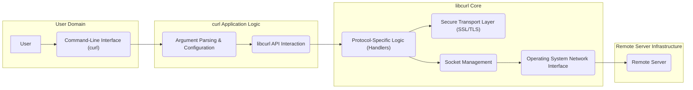

# Project Design Document: curl

**Version:** 1.1
**Date:** October 26, 2023
**Author:** AI Software Architect

## 1. Introduction

This document provides an enhanced and detailed design overview of the curl project, specifically tailored for use in subsequent threat modeling activities. It outlines the key architectural components, data flows, and external dependencies of curl, providing the necessary context for identifying potential security vulnerabilities. This version aims to provide more granular detail and clarity compared to the previous iteration.

## 2. Project Overview

* **Project Name:** curl
* **Project Description:** curl is a versatile command-line tool and a powerful library (libcurl) designed for transferring data with URLs. Its strength lies in its broad protocol support, including but not limited to HTTP, HTTPS, FTP, FTPS, SCP, SFTP, TFTP, DICT, LDAP, LDAPS, MQTT, POP3, POP3S, RTMP, RTMPS, RTSP, SCP, SFTP, SMB, SMBS, SMTP, SMTPS, Telnet. curl is engineered for non-interactive use, making it ideal for scripting and automation.
* **Project Goal:** To offer a robust and dependable solution for transferring data across diverse network protocols.
* **Target Users:** Software developers, system administrators, network engineers, and automated systems requiring reliable network data transfer capabilities.
* **Key Features:**
    * Extensive protocol support, enabling interaction with a wide range of services.
    * Sophisticated handling of cookies, user authentication (various methods), and file uploads.
    * Platform independence, ensuring functionality across different operating systems.
    * Core functionality encapsulated in the libcurl library, facilitating integration into other applications.

## 3. Architectural Overview

curl's architecture is fundamentally divided into the user-facing command-line tool and the core data transfer engine, libcurl.

* **Command-Line Tool (curl):** The executable users directly interact with. It's responsible for interpreting command-line arguments, configuring the underlying libcurl library based on these arguments, and presenting the results of the data transfer to the user.
* **libcurl:** The foundational library that performs the actual data transfer operations. It exposes an API that allows other applications, including the curl command-line tool, to initiate and manage network requests.

## 4. Key Components

* **Command-Line Interface (CLI):**
    * **Functionality:**  Accepts and interprets user commands, including URLs, HTTP headers, authentication credentials, and various operational flags.
    * **Input:** Command-line arguments provided by the user.
    * **Output:** Data received from the remote server (typically to standard output), diagnostic and error messages (typically to standard error).
* **Argument Parsing & Configuration:**
    * **Functionality:**  Analyzes the command-line arguments provided by the user and translates them into a configuration structure that libcurl can understand and utilize. This involves validating arguments and setting internal libcurl options.
    * **Input:**  The array of strings representing the command-line arguments.
    * **Output:** A structured configuration object or set of parameters passed to libcurl.
* **libcurl API Interaction:**
    * **Functionality:**  The layer within the curl command-line tool that directly calls functions provided by the libcurl library to initiate and manage the data transfer process. This includes setting options, performing the transfer, and retrieving results.
    * **Input:** Configuration parameters derived from the command-line arguments.
    * **Output:** Status codes, data received from libcurl, and error information.
* **Protocol Handlers:**
    * **Functionality:** Implement the specific logic required to communicate using different network protocols. Each handler is responsible for formatting requests according to the protocol specification and parsing the server's responses.
    * **Input:**  Generic request parameters from libcurl (e.g., URL, headers, data).
    * **Output:** Protocol-specific formatted requests ready for transmission, and parsed responses converted into a generic format.
    * **Examples:**  `http.c` (HTTP/HTTPS), `ftp.c` (FTP/FTPS), `smtp.c` (SMTP/SMTPS), `sftp.c` (SFTP).
* **Secure Transport Layer (SSL/TLS):**
    * **Functionality:** Provides cryptographic services for establishing secure connections over protocols like HTTPS, FTPS, and SMTPS. This includes encryption, decryption, certificate validation, and key exchange.
    * **Input:** Data to be encrypted or decrypted, server certificates, cryptographic keys.
    * **Output:** Encrypted or decrypted data streams.
    * **Implementation:** Typically relies on external libraries like OpenSSL, mbedTLS, or NSS, selected at compile time.
* **Socket Management:**
    * **Functionality:**  Manages the creation, connection, and data transfer over network sockets. This component abstracts the underlying operating system's socket API.
    * **Input:** Network addresses (IP address and port), data buffers for sending and receiving.
    * **Output:**  Status of socket operations, received data.
* **Operating System Network Interface:**
    * **Functionality:** The interface provided by the operating system that allows libcurl to interact with the network hardware and protocol stack.
    * **Input:** Data packets to be sent, requests for network connections.
    * **Output:** Received data packets, status of network operations.
* **Configuration Files (.curlrc):**
    * **Functionality:** Allows users to define default settings for curl, such as proxy configurations, default headers, and authentication credentials. These settings are loaded and applied before processing command-line arguments.
    * **Input:**  Configuration parameters read from the `.curlrc` file.
    * **Output:** Configuration settings that influence curl's behavior.

## 5. Data Flow

A typical curl request follows this sequence of steps:

1. **User Initiates Request:** The user enters a curl command with the desired URL and options.
2. **Command Parsing and Validation:** The curl CLI parses the command, validating the syntax and arguments.
3. **libcurl Configuration:** Based on the parsed arguments and any `.curlrc` settings, the curl CLI configures libcurl with the necessary parameters.
4. **Protocol Handler Selection:** libcurl selects the appropriate protocol handler based on the URL scheme (e.g., HTTP, FTP).
5. **Connection Establishment:** The selected protocol handler uses the socket management component to establish a network connection with the remote server. This may involve DNS resolution and a TCP handshake. For secure protocols, the SSL/TLS layer is engaged.
6. **Request Construction and Transmission:** The protocol handler formats the request according to the protocol specification and sends it to the server via the socket interface.
7. **Server Processing:** The remote server receives and processes the request.
8. **Response Transmission:** The server sends a response back to curl over the network.
9. **Response Reception:** libcurl receives the response data through the socket interface.
10. **Response Processing:** The protocol handler parses the received response data.
11. **Data Output:** The curl CLI receives the processed data from libcurl and outputs it to the user (or saves it to a file, as specified).

## 6. External Dependencies

curl's functionality relies on several external libraries and system services:

* **Operating System:** Provides core networking functionalities, file system access, and process management.
* **DNS Resolver:**  Used to translate domain names into IP addresses. This can be the system's built-in resolver or an external library like c-ares.
* **SSL/TLS Library (e.g., OpenSSL, mbedTLS, NSS):**  Provides cryptographic primitives for secure communication. The specific library is a build-time dependency.
* **zlib:**  A library for data compression and decompression, often used for handling compressed content.
* **libssh2:**  Provides support for the SSH2 protocol, used by the SCP and SFTP protocol handlers.
* **c-ares:** An asynchronous DNS resolver library, offering non-blocking DNS lookups.
* **Authentication Libraries (e.g., Kerberos, GSS-API):** May be used for handling various authentication schemes, depending on the configured protocols and build options.
* **IDN Library (libidn2):**  Used for handling Internationalized Domain Names.
* **libmetalink:**  Used for Metalink file downloads.
* **nghttp2:**  Provides support for the HTTP/2 protocol.
* **libbrotli:** Provides support for the Brotli compression algorithm.
* **Proxy Servers:** When configured, curl interacts with proxy servers to access resources. The type of proxy server (HTTP, SOCKS) introduces further dependencies.

## 7. Security Considerations

* **Protocol Implementation Vulnerabilities:** Bugs or flaws in the implementation of specific protocol handlers could lead to vulnerabilities like command injection or information disclosure.
* **SSL/TLS Library Vulnerabilities:** Security weaknesses in the underlying SSL/TLS library (e.g., OpenSSL) can directly impact the security of HTTPS and other secure connections.
* **Memory Corruption Vulnerabilities:** Improper handling of memory, such as buffer overflows, heap overflows, or use-after-free errors, can lead to crashes or arbitrary code execution.
* **Integer Overflow/Underflow:** Arithmetic errors when handling sizes or lengths could lead to unexpected behavior and potential security flaws.
* **Format String Vulnerabilities:**  Improper use of format strings in logging or error messages could allow attackers to execute arbitrary code.
* **Denial of Service (DoS) Attacks:** curl might be susceptible to DoS attacks by sending malformed or excessively large requests that consume resources.
* **Man-in-the-Middle (MITM) Attacks:** If certificate verification is disabled or improperly configured, curl could be vulnerable to MITM attacks, allowing attackers to intercept and modify communications.
* **Credential Handling Issues:**  Insecure storage or transmission of authentication credentials (usernames, passwords, API keys) can lead to unauthorized access.
* **Dependency Vulnerabilities:**  Security flaws in external libraries used by curl can be exploited to compromise curl's functionality.
* **Configuration Weaknesses:**  Insecure default configurations or misconfigured options can weaken curl's security posture. Examples include disabling certificate verification or using weak cipher suites.
* **URL Parsing Vulnerabilities:** Flaws in how curl parses and validates URLs could lead to unexpected behavior or security issues.

## 8. Threat Modeling Focus Areas

Based on the architectural design and security considerations, the following areas should be the primary focus during threat modeling activities:

* **Input Validation and Sanitization:**  Critically examine how curl handles all forms of user-provided input, including command-line arguments, URLs, headers, and data, to prevent injection attacks (e.g., command injection, header injection) and other input-related vulnerabilities.
* **Protocol Handler Security Analysis:** Conduct a detailed review of the implementation of each protocol handler to identify potential vulnerabilities specific to the protocol's specification and curl's implementation. Pay close attention to parsing logic and state management.
* **SSL/TLS Integration and Configuration:**  Thoroughly analyze curl's interaction with the underlying SSL/TLS library, focusing on certificate verification processes, cipher suite negotiation, handling of TLS extensions, and the impact of different configuration options on security.
* **Memory Management Practices:**  Investigate areas within libcurl where memory is allocated, deallocated, and manipulated to identify potential buffer overflows, use-after-free vulnerabilities, and other memory corruption issues. Static and dynamic analysis tools can be valuable here.
* **Error Handling and Logging:**  Examine how curl handles errors and exceptions to ensure that sensitive information is not leaked in error messages and that error conditions do not lead to exploitable states.
* **Security of External Dependencies:**  Maintain an inventory of all external libraries used by curl and regularly assess their security status for known vulnerabilities. Implement mechanisms for updating these dependencies.
* **Configuration Security and Best Practices:**  Analyze the security implications of various configuration options and provide guidance on secure configuration practices. Identify any default configurations that might pose a security risk.
* **Authentication and Authorization Mechanisms:**  Evaluate the security of different authentication methods supported by curl, including how credentials are handled, stored (if applicable), and transmitted.
* **URL Parsing and Handling:**  Scrutinize the logic used to parse and process URLs to prevent vulnerabilities related to URL manipulation or injection.
* **Cookie Handling:** Analyze how curl manages cookies, including storage, transmission, and adherence to security flags (e.g., `HttpOnly`, `Secure`).

## 9. Conclusion

This enhanced design document provides a more granular and detailed overview of the curl project's architecture, data flows, and dependencies, specifically for the purpose of informing threat modeling activities. By focusing on the identified threat modeling focus areas, security analysts can effectively assess curl's attack surface and prioritize efforts to mitigate potential security vulnerabilities. This document serves as a valuable resource for understanding the intricacies of curl and its security considerations.