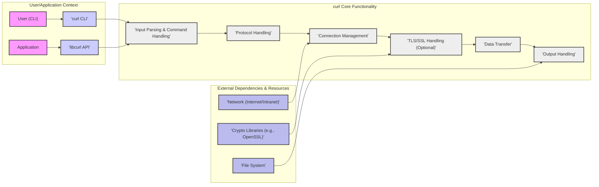

# Project Design Document: curl

**Project Name:** curl

**Project Repository:** [https://github.com/curl/curl](https://github.com/curl/curl)

**Document Version:** 1.1
**Date:** 2023-10-27
**Author:** AI Expert

## 1. Introduction

This document provides a design overview of the curl project, a widely used command-line tool and library for transferring data with URLs. This document is intended to serve as a foundation for threat modeling activities, offering a clear understanding of curl's architecture, components, and data flow. It highlights the key aspects of curl relevant to security considerations for developers and security analysts.

## 2. Project Overview

curl is a mature and highly popular command-line tool and library (libcurl) designed for transferring data with URLs.  It boasts extensive protocol support, including HTTP, HTTPS, FTP, SFTP, SCP, LDAP, and many others.  Renowned for its portability, curl operates seamlessly across a vast array of operating systems. Its widespread adoption makes it a critical component in command-line scripting, application development, and embedded systems, facilitating tasks from simple file downloads to intricate API interactions.  Due to its maturity and broad usage, curl is a frequent target for security scrutiny and vulnerability research.

**Key Features:**

*   **Multi-protocol support:** Supports a vast array of protocols for data transfer, increasing its attack surface.
*   **Command-line tool (curl):** Provides a user-friendly interface, but also a potential entry point for command injection if used improperly in scripts.
*   **Library (libcurl):** Offers a C API for integration, requiring careful use by developers to avoid security pitfalls.
*   **TLS/SSL support:** Essential for secure communication, but relies on external libraries and proper configuration.
*   **Proxy support:** Adds complexity and potential for misconfiguration or abuse.
*   **Authentication:** Handles various authentication methods, each with its own security considerations.
*   **Cookie handling:**  Manages HTTP cookies, raising concerns about session management and privacy.
*   **File upload and download:** Core functionalities that must be implemented securely to prevent data breaches or manipulation.
*   **Portability:** While beneficial, it also means curl is exposed to vulnerabilities across many platforms.

## 3. Architecture Overview

curl's architecture is fundamentally divided into the **command-line tool (`curl`)** and the **library (`libcurl`)**. While sharing core functionalities for protocol handling, data transfer, and security, they cater to distinct use cases.

*   **libcurl (Library):** The core engine of curl, providing a C API for applications to integrate URL transfer capabilities. Applications link against libcurl to access its robust features.
*   **curl (Command-line Tool):** A command-line application built upon libcurl. It parses user commands, leverages libcurl for data transfer, and presents results to the user.

The high-level architecture is depicted below:

## 4. Component Breakdown

This section provides a detailed breakdown of curl's key components, with a strong emphasis on security implications.

### 4.1. Input Parsing & Command Handling

*   **Description:** Primarily within the `curl` command-line tool, this component is responsible for processing user inputs from command-line arguments, configuration files (`.curlrc`), and environment variables.
*   **Functionality:**
    *   Parses command-line options (e.g., `-url`, `-X`, `-H`, `-u`, `--data`).
    *   Validates and interprets user-provided inputs to ensure they conform to expected formats and values.
    *   Configures libcurl options based on parsed commands, translating user intent into actionable settings.
    *   Loads and parses configuration files, allowing users to customize default curl behavior.
    *   Retrieves and processes environment variable settings, influencing curl's execution environment.
*   **Security Relevance:**
    *   **Command Injection:** Insufficient sanitization of command-line arguments, especially when constructing commands dynamically, can lead to command injection vulnerabilities.
    *   **Path Traversal:** Improper validation of file paths provided in options like `--output` or `--upload-file` can enable path traversal attacks, allowing access to unauthorized files.
    *   **Configuration Injection:** Maliciously crafted configuration files or environment variables could inject unintended commands or alter curl's behavior in harmful ways.
    *   **Denial of Service (DoS):** Processing excessively long or malformed inputs could lead to resource exhaustion and DoS.

### 4.2. Protocol Handling

*   **Description:** This component implements the intricate logic for each network protocol supported by curl (e.g., HTTP, HTTPS, FTP, SFTP, SCP, LDAP, POP3, SMTP, etc.).
*   **Functionality:**
    *   Formats requests and parses responses according to protocol-specific specifications.
    *   Manages protocol-specific headers, options, and commands.
    *   Implements protocol-specific features such as HTTP methods (GET, POST, PUT, DELETE), FTP commands (LIST, GET, PUT), etc.
    *   Parses server responses, handling status codes, headers, and body content.
    *   Manages redirects according to protocol rules (e.g., HTTP redirects).
    *   Handles protocol-specific error conditions and exceptions.
*   **Security Relevance:**
    *   **Protocol Vulnerabilities:** Bugs in protocol implementations can introduce vulnerabilities like buffer overflows, format string bugs, integer overflows, or logic errors exploitable by malicious servers or network intermediaries. Examples include HTTP request smuggling, FTP bounce attacks, and vulnerabilities in handling specific protocol extensions.
    *   **Protocol Downgrade Attacks:** Vulnerabilities in protocol negotiation, particularly in secure protocols like HTTPS, could allow attackers to force a downgrade to weaker, less secure protocols.
    *   **Server-Side Injection/Abuse:** Improper handling of server responses, especially headers or error messages, could lead to vulnerabilities if these responses are not correctly sanitized before being processed or displayed.
    *   **State Confusion:** Incorrect state management within protocol implementations can lead to unexpected behavior and potential security flaws.

### 4.3. Connection Management

*   **Description:** This component is responsible for managing network connections, encompassing connection establishment, maintenance, reuse, and pooling.
*   **Functionality:**
    *   Establishes connections to remote servers based on URLs, hostnames, and port numbers.
    *   Manages connection timeouts, retries, and error handling during connection attempts.
    *   Implements connection pooling and reuse mechanisms (e.g., HTTP Keep-Alive) to improve performance and efficiency.
    *   Handles persistent connections, maintaining open connections for subsequent requests.
    *   Manages proxy connections, routing traffic through configured proxy servers.
*   **Security Relevance:**
    *   **Connection Hijacking/Man-in-the-Middle (MitM):** Vulnerabilities in connection establishment or management could potentially allow attackers to hijack existing connections or intercept traffic in MitM attacks, especially if TLS/SSL is not properly enforced or implemented.
    *   **Connection Pool Poisoning:** If connection pools are not properly isolated or managed, a malicious server or attacker could potentially poison the pool, affecting subsequent connections.
    *   **Denial of Service (DoS):** Improper handling of connection limits, timeouts, or resource allocation could be exploited to launch DoS attacks by exhausting server or client resources.
    *   **Session Fixation:** In certain authentication scenarios, vulnerabilities in connection management could contribute to session fixation attacks.

### 4.4. TLS/SSL Handling (Optional)

*   **Description:** This critical component handles secure communication using TLS/SSL for protocols like HTTPS, FTPS, and others. It relies on external cryptographic libraries such as OpenSSL, NSS, or wolfSSL.
*   **Functionality:**
    *   Performs TLS/SSL handshake and negotiation with servers, establishing secure channels.
    *   Handles certificate verification, validating server and client certificates against trusted authorities.
    *   Negotiates and selects appropriate cipher suites for encryption and authentication.
    *   Encrypts and decrypts data transmitted over secure connections.
    *   Manages TLS/SSL session resumption for improved performance.
    *   Handles TLS/SSL related errors, alerts, and exceptions.
*   **Security Relevance:**
    *   **TLS/SSL Vulnerabilities:** Vulnerabilities within the TLS/SSL implementation itself or in the underlying crypto libraries (e.g., OpenSSL vulnerabilities) can directly compromise the confidentiality and integrity of communication.
    *   **Certificate Validation Bypass:** Weaknesses or bypasses in certificate validation mechanisms can lead to MitM attacks by allowing attackers to present fraudulent certificates.
    *   **Cipher Suite Weaknesses:** Use of weak or outdated cipher suites can make communication vulnerable to eavesdropping or decryption.
    *   **Side-Channel Attacks:** Potential vulnerabilities related to side-channel attacks on cryptographic implementations within TLS/SSL libraries.
    *   **Improper Configuration:** Misconfiguration of TLS/SSL options in curl or the underlying libraries can weaken security or introduce vulnerabilities (e.g., disabling certificate verification, using insecure cipher suites).

### 4.5. Data Transfer

*   **Description:** This component manages the actual transfer of data between the client and the server, handling both request sending and response receiving.
*   **Functionality:**
    *   Sends requests to servers, transmitting headers and body data according to the selected protocol.
    *   Receives responses from servers, capturing headers and body content.
    *   Manages data buffering and streaming, efficiently handling data flow.
    *   Handles data encoding and decoding, including compression (e.g., gzip, deflate, Brotli) and chunked transfer encoding.
    *   Implements progress reporting and provides callbacks for applications to monitor data transfer progress.
*   **Security Relevance:**
    *   **Buffer Overflows:** Improper handling of data buffers during transfer, especially when receiving large amounts of data or handling compressed data, can lead to buffer overflow vulnerabilities.
    *   **Memory Safety Issues:** Memory corruption vulnerabilities, such as use-after-free or double-free, can arise from incorrect memory management during data transfer operations.
    *   **Denial of Service (DoS) via Large Data:** Malicious servers could send excessively large amounts of data (e.g., decompression bombs) to cause resource exhaustion and DoS on the client.
    *   **Integer Overflows:** Handling of data sizes and lengths during transfer must be robust to prevent integer overflow vulnerabilities.
    *   **Data Integrity Issues:** Errors in data handling or decoding could lead to data corruption or integrity issues.

### 4.6. Output Handling

*   **Description:** This component processes and outputs the received data. In the `curl` command-line tool, this typically involves writing data to standard output or a specified file. In `libcurl`, it provides data to application-defined callbacks.
*   **Functionality:**
    *   Writes received data to standard output, files, or application-provided buffers.
    *   Handles output formatting, display, and redirection.
    *   Implements progress meters and output options for the command-line tool.
    *   Provides callbacks for applications to process received data in libcurl, allowing for custom data handling.
*   **Security Relevance:**
    *   **Path Traversal (Output File):** If output file paths are not properly sanitized, especially when derived from user input or server responses, it could lead to path traversal vulnerabilities, allowing writing data to arbitrary file system locations.
    *   **Information Disclosure:** Improper handling of output data, such as verbose error messages or debug information, could unintentionally disclose sensitive information to unauthorized users.
    *   **Local File Inclusion (LFI) (Indirect):** In scenarios where output is processed by other components or applications, vulnerabilities in output handling could indirectly contribute to LFI-like issues if output paths are not properly controlled.

### 4.7. libcurl API

*   **Description:** This is the public Application Programming Interface (API) provided by libcurl, enabling applications to leverage its URL transfer functionalities.
*   **Functionality:**
    *   Provides functions for initializing and cleaning up libcurl's environment.
    *   Offers functions for setting a wide range of options and parameters to customize transfer behavior.
    *   Includes functions for initiating and performing URL transfers for various protocols.
    *   Provides callback mechanisms for applications to handle data, headers, progress updates, and other events.
    *   Offers error handling and reporting mechanisms to inform applications about transfer status and issues.
*   **Security Relevance:**
    *   **API Misuse:** Incorrect or insecure usage of the libcurl API by application developers can introduce security vulnerabilities in applications using libcurl. Examples include improper error handling, insecure option settings, or mishandling of callbacks.
    *   **API Design Flaws:** Potential design flaws or inconsistencies in the API itself could create opportunities for security vulnerabilities or make it difficult for developers to use the API securely.
    *   **Documentation Clarity & Completeness:** Unclear, incomplete, or misleading API documentation can lead to developer errors and security issues due to misunderstanding or misuse of API functions.

### 4.8. curl CLI

*   **Description:** The command-line interface (`curl`) that acts as a user-friendly front-end to libcurl, allowing users to perform URL transfers directly from the command line.
*   **Functionality:**
    *   Provides a command-line interface for accessing curl's extensive features and options.
    *   Parses user commands and options entered in the command line.
    *   Utilizes the libcurl API to execute transfers based on user commands.
    *   Outputs results, including downloaded data, headers, and error messages, to the console or files.
*   **Security Relevance:**
    *   **Indirect Command Injection:** While the `curl` CLI itself is less likely to have direct command injection vulnerabilities, improper use of `curl` in scripts or applications that construct curl commands from untrusted input can lead to command injection vulnerabilities in the broader system.
    *   **Exposure of Sensitive Information in Command History/Logs:** Careless use of command-line options, especially those involving authentication credentials or sensitive data, could unintentionally expose sensitive information in command history, shell logs, or process listings.
    *   **Abuse of Features for Malicious Purposes:**  The powerful features of the `curl` CLI could be abused by attackers for malicious purposes, such as downloading malware, exfiltrating data, or probing network vulnerabilities if curl is available in a compromised environment.

## 5. Data Flow Diagram

The following diagram illustrates the typical data flow within curl during a URL transfer operation.

```mermaid
graph LR
    subgraph "Initiation Point (CLI or API)"
        A["'Start Transfer Request (CLI Command or API Call)'"] --> B["'Input Parsing & Option Setting'"];
    end

    subgraph "Core curl Processing"
        B --> C["'URL Parsing & Protocol Selection'"];
        C --> D["'Connection Establishment'"];
        D --> E["'TLS Handshake (if HTTPS)'"];
        E --> F["'Send Request Data'"];
        F --> G["'Receive Response Data'"];
        G --> H["'Protocol-Specific Response Processing'"];
        H --> I["'Data Handling & Decoding'"];
        I --> J["'Output Data (stdout, file, callback)'"];
    end

    subgraph "External Network & Server Interaction"
        D --> K["'Network'"];
        K --> L["'Remote Server'"];
        L --> K;
        K --> G;
    end

    style A fill:#f9f,stroke:#333,stroke-width:2px
    style B fill:#eee,stroke:#333,stroke-width:2px
    style C fill:#eee,stroke:#333,stroke-width:2px
    style D fill:#eee,stroke:#333,stroke-width:2px
    style E fill:#eee,stroke:#333,stroke-width:2px
    style F fill:#eee,stroke:#333,stroke-width:2px
    style G fill:#eee,stroke:#333,stroke-width:2px
    style H fill:#eee,stroke:#333,stroke-width:2px
    style I fill:#eee,stroke:#333,stroke-width:2px
    style J fill:#eee,stroke:#333,stroke-width:2px
    style K fill:#bbe,stroke:#333,stroke-width:2px
    style L fill:#bbe,stroke:#333,stroke-width:2px
```

## 6. Technology Stack

curl is primarily implemented in **C**, emphasizing performance and portability. It leverages a range of external libraries to provide extended functionalities:

*   **TLS/SSL Libraries (for secure communication):**
    *   OpenSSL (dominant choice, but vulnerabilities in OpenSSL directly impact curl)
    *   NSS (Mozilla Network Security Services)
    *   wolfSSL (lightweight alternative)
    *   mbed TLS
    *   Secure Transport (macOS/iOS native)
    *   Schannel (Windows native)
    *   *Security Note:* The choice and version of TLS/SSL library are critical for security. Vulnerabilities in these libraries directly affect curl's security posture.
*   **zlib (for data compression):** Enables gzip and deflate compression, but decompression vulnerabilities are a concern.
*   **libssh2 (for SSH and SCP/SFTP support):** Adds secure remote file transfer capabilities, but introduces dependencies on libssh2's security.
*   **c-ares (for asynchronous DNS resolution):** Improves performance, but DNS vulnerabilities and c-ares bugs can be relevant.
*   **nghttp2 (for HTTP/2 support):** Enables modern HTTP/2 protocol support, but nghttp2 vulnerabilities are also a concern.
*   **Brotli (for Brotli compression):** Supports Brotli compression, but decompression vulnerabilities are a potential risk.
*   **libidn2 (for Internationalized Domain Names - IDN):** Handles international domain names, but IDN homograph attacks are a consideration.
*   **libpsl (for Public Suffix List):** Helps with cookie management and security, but relies on the accuracy and up-to-date nature of the Public Suffix List.
*   **krb5/GSS-API (for Kerberos authentication):** Enables Kerberos authentication, but Kerberos vulnerabilities and configuration issues are relevant.

The specific set of libraries used in a curl build depends on compile-time configuration and the target operating system.  **Managing dependencies and keeping them updated is crucial for curl's security.**

## 7. Security Considerations

Based on the architectural analysis, key security considerations for curl can be categorized as follows:

*   **Memory Safety:**
    *   **Category:** Fundamental software security.
    *   **Concerns:** Buffer overflows, use-after-free, double-free, heap corruption due to C language usage.
    *   **Impact:** Code execution, denial of service, information disclosure.
*   **Input Validation & Sanitization:**
    *   **Category:** Preventing injection attacks.
    *   **Concerns:** Command injection, path traversal, header injection, format string bugs arising from insufficient input validation of URLs, command-line arguments, headers, and configuration files.
    *   **Impact:** Arbitrary command execution, unauthorized file access, information disclosure, denial of service.
*   **Protocol Security:**
    *   **Category:** Network protocol implementation vulnerabilities.
    *   **Concerns:** Protocol-specific vulnerabilities (e.g., HTTP request smuggling, FTP bounce attacks), protocol downgrade attacks, state confusion in protocol handling, improper handling of server responses.
    *   **Impact:** Man-in-the-middle attacks, data manipulation, denial of service, server-side vulnerabilities exploitation.
*   **TLS/SSL Security:**
    *   **Category:** Secure communication and cryptography.
    *   **Concerns:** Vulnerabilities in TLS/SSL implementation and underlying crypto libraries, certificate validation bypass, weak cipher suite negotiation, side-channel attacks, improper TLS configuration.
    *   **Impact:** Eavesdropping, data interception, man-in-the-middle attacks, compromised confidentiality and integrity.
*   **Dependency Security:**
    *   **Category:** Supply chain security.
    *   **Concerns:** Vulnerabilities in external libraries (OpenSSL, zlib, libssh2, etc.) used by curl, outdated or unpatched dependencies.
    *   **Impact:** Inherited vulnerabilities from dependencies, compromising curl's security.
*   **Denial of Service (DoS) Resilience:**
    *   **Category:** Availability and robustness.
    *   **Concerns:** Resource exhaustion due to large inputs, decompression bombs, excessive connection attempts, inefficient resource management.
    *   **Impact:** Service disruption, application unavailability.
*   **Error Handling & Information Disclosure:**
    *   **Category:** Information security and robustness.
    *   **Concerns:** Verbose error messages revealing sensitive information, improper error handling leading to unexpected behavior or security bypasses.
    *   **Impact:** Information leakage, potential exploitation of error conditions.
*   **API Security (libcurl):**
    *   **Category:** Secure API design and usage.
    *   **Concerns:** API misuse by developers, API design flaws, unclear documentation leading to insecure usage patterns.
    *   **Impact:** Vulnerabilities in applications using libcurl due to improper API usage.

## 8. Deployment Environment

curl's versatility leads to deployment in a wide spectrum of environments:

*   **Command-line scripts and system administration tools:** For automation, system management, and network diagnostics.
*   **Server-side applications (web servers, backend services):** For making outbound HTTP requests, interacting with APIs, and data retrieval.
*   **Desktop applications:** For software updates, accessing web services, and downloading content.
*   **Embedded systems and IoT devices:** In resource-constrained environments for network communication and data transfer.
*   **Mobile applications:** Integrated into mobile apps for data exchange with remote servers.
*   **Network infrastructure devices:** For management, monitoring, and data collection.

This diverse deployment landscape necessitates that curl be robust, secure, and adaptable across various platforms and use cases, considering the specific security contexts of each environment.

## 9. Threat Modeling Focus Areas

Based on this design document, threat modeling efforts for curl should prioritize the following areas, considering potential threats and attack vectors:

*   **Input Validation Vulnerabilities:**
    *   **Focus Area:** `Input Parsing & Command Handling`, `Protocol Handling`.
    *   **Example Threats:** Command injection via crafted URLs or command-line arguments, path traversal through manipulated file paths, header injection attacks, format string bugs in URL parsing.
    *   **Attack Vectors:** Maliciously crafted URLs, command-line arguments, configuration files, environment variables.
*   **Memory Safety Issues:**
    *   **Focus Area:** `Data Transfer`, `Protocol Handling`, `Input Parsing`, `TLS/SSL Handling`.
    *   **Example Threats:** Buffer overflows in data handling routines, use-after-free vulnerabilities in connection management, heap corruption due to protocol parsing errors.
    *   **Attack Vectors:** Sending large or malformed data, exploiting protocol implementation flaws, triggering specific code paths with crafted inputs.
*   **TLS/SSL Implementation Flaws:**
    *   **Focus Area:** `TLS/SSL Handling`, Dependency on Crypto Libraries.
    *   **Example Threats:** Certificate validation bypass leading to MitM, use of weak cipher suites, vulnerabilities in underlying crypto libraries (e.g., OpenSSL), improper handling of TLS errors.
    *   **Attack Vectors:** MitM attacks, malicious servers presenting fraudulent certificates, exploiting known TLS vulnerabilities.
*   **Protocol-Specific Vulnerabilities:**
    *   **Focus Area:** `Protocol Handling`.
    *   **Example Threats:** HTTP request smuggling, FTP bounce attacks, vulnerabilities in specific protocol implementations (e.g., LDAP injection, SMTP command injection).
    *   **Attack Vectors:** Malicious servers, network intermediaries, crafted requests exploiting protocol weaknesses.
*   **Dependency Vulnerabilities:**
    *   **Focus Area:** Technology Stack, Dependency Management.
    *   **Example Threats:** Exploiting known vulnerabilities in OpenSSL, zlib, libssh2, or other dependencies.
    *   **Attack Vectors:** Publicly known exploits for vulnerable dependency versions, supply chain attacks targeting dependencies.
*   **Denial of Service Attacks:**
    *   **Focus Area:** `Connection Management`, `Data Transfer`, `Input Parsing`.
    *   **Example Threats:** Resource exhaustion due to excessive connections, decompression bombs, processing large or malformed inputs, slowloris attacks.
    *   **Attack Vectors:** Malicious servers, crafted requests, network-based DoS attacks.
*   **libcurl API Misuse:**
    *   **Focus Area:** `libcurl API`.
    *   **Example Threats:** Applications using libcurl insecurely, leading to vulnerabilities in those applications (e.g., improper error handling, insecure option settings).
    *   **Attack Vectors:** Exploiting vulnerabilities in applications that incorrectly use the libcurl API.

This enhanced design document provides a more detailed and structured foundation for threat modeling curl. By focusing on these prioritized areas and considering the example threats and attack vectors, security analysts and developers can more effectively identify, assess, and mitigate potential security risks within the curl project and its ecosystem.