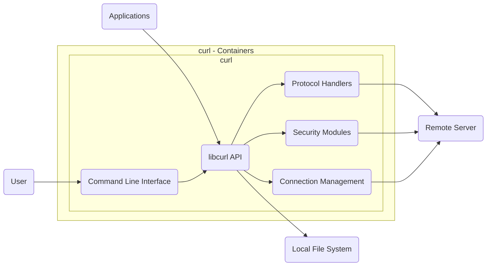
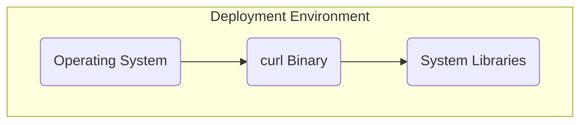

# BUSINESS POSTURE

Business Priorities and Goals:

*   Provide a reliable and versatile command-line tool and library for transferring data with URLs.
*   Support a wide range of protocols and features to accommodate diverse use cases.
*   Maintain a high level of security and stability to ensure user trust and data integrity.
*   Foster a vibrant open-source community to encourage contributions and continuous improvement.
*   Ensure cross-platform compatibility to reach a broad user base.
*   Maintain backward compatibility where possible, to avoid breaking existing scripts and integrations.

Most Important Business Risks:

*   Compromise of the curl tool or library, leading to widespread data breaches or system compromise.
*   Introduction of vulnerabilities through third-party dependencies or supply chain attacks.
*   Inability to adapt to evolving protocols and security standards, rendering curl obsolete or insecure.
*   Loss of community trust due to mishandling of security issues or lack of transparency.
*   Legal challenges related to misuse of the tool or violations of terms of service.
*   Reputational damage from security incidents or negative publicity.

# SECURITY POSTURE

Existing Security Controls:

*   security control: Fuzzing: Continuous fuzzing is employed to identify potential vulnerabilities. (Described in docs/Fuzzing.md)
*   security control: Code Reviews: All code changes undergo thorough review by maintainers. (Described in docs/CONTRIBUTING.md)
*   security control: Static Analysis: Static analysis tools are used to detect potential code quality and security issues. (Described in docs/INSTALL.md)
*   security control: Vulnerability Disclosure Policy: A clear process is in place for reporting and handling security vulnerabilities. (Described in SECURITY.md)
*   security control: HTTPS Support: curl defaults to HTTPS and verifies SSL certificates by default. (Described in docs/cmdline-opts/--ssl-reqd.d)
*   security control: Support for various authentication methods: curl supports a wide range of authentication mechanisms, including Basic, Digest, NTLM, Kerberos, and OAuth 2.0. (Described in docs/cmdline-opts/-u.d)
*   security control: Safe handling of cookies: curl provides options for managing cookies securely, including the ability to restrict cookie sharing and use secure cookies. (Described in docs/cmdline-opts/--cookie.d)
*   security control: Support for secure protocols: curl supports various secure protocols, including HTTPS, SFTP, FTPS, and SCP. (Described in docs/cmdline-opts/--proto.d)
*   security control: Regular security audits: curl undergoes periodic security audits by external experts. (Described in SECURITY.md)
*   security control: CVE Numbering Authority (CNA): curl project is a CNA, allowing it to assign CVE identifiers to vulnerabilities. (Described in SECURITY.md)

Accepted Risks:

*   accepted risk: Reliance on System Libraries: curl relies on system-provided libraries for some functionality (e.g., SSL/TLS), which may introduce vulnerabilities outside of curl's direct control.
*   accepted risk: User Misconfiguration: Users may inadvertently configure curl insecurely, leading to potential risks.
*   accepted risk: Complexity of Supported Protocols: The vast number of supported protocols increases the attack surface and complexity of security management.

Recommended Security Controls:

*   security control: Implement a Software Bill of Materials (SBOM) to track all dependencies and their versions.
*   security control: Integrate dynamic analysis tools (e.g., DAST) into the testing process.
*   security control: Enhance documentation with security best practices and common misconfiguration pitfalls.
*   security control: Consider implementing a bug bounty program to incentivize external security researchers.

Security Requirements:

*   Authentication:
    *   Support a wide range of authentication mechanisms, including Basic, Digest, NTLM, Kerberos, and OAuth 2.0.
    *   Provide secure storage and handling of credentials.
    *   Implement robust protection against credential stuffing and brute-force attacks.

*   Authorization:
    *   Enforce access controls based on protocol and resource restrictions.
    *   Provide mechanisms for fine-grained authorization, where applicable.

*   Input Validation:
    *   Validate all user-supplied input, including URLs, headers, and data.
    *   Sanitize input to prevent injection attacks (e.g., command injection, cross-site scripting).
    *   Implement robust error handling to avoid information leakage.

*   Cryptography:
    *   Use strong, up-to-date cryptographic algorithms and protocols.
    *   Verify SSL/TLS certificates by default.
    *   Provide options for users to customize cryptographic settings, with secure defaults.
    *   Securely manage cryptographic keys and certificates.

# DESIGN

## C4 CONTEXT

```mermaid
graph LR
    subgraph "curl system context"
        curl("curl")
    end

    User("User") --> curl
    RemoteServer("Remote Server") <--> curl
    LocalFileSystem("Local File System") <--> curl

    User -.-> "Uses to transfer data"
    curl --> RemoteServer : "Transfers data using various protocols"
    curl --> LocalFileSystem : "Reads/Writes data"
```

Element Descriptions:

*   Element: User
    *   Name: User
    *   Type: Person
    *   Description: A person who uses curl to transfer data.
    *   Responsibilities:
        *   Provides input to curl (e.g., URLs, options, data).
        *   Interprets output from curl.
        *   Configures curl securely.
    *   Security controls:
        *   Uses strong passwords and authentication methods.
        *   Follows security best practices.
        *   Keeps their system and software up to date.

*   Element: curl
    *   Name: curl
    *   Type: Software System
    *   Description: A command-line tool and library for transferring data with URLs.
    *   Responsibilities:
        *   Handles various protocols (HTTP, HTTPS, FTP, SFTP, etc.).
        *   Performs data transfers.
        *   Manages connections.
        *   Handles authentication.
        *   Processes user input.
        *   Provides output to the user.
    *   Security controls:
        *   Fuzzing.
        *   Code Reviews.
        *   Static Analysis.
        *   Vulnerability Disclosure Policy.
        *   HTTPS Support.
        *   Authentication methods support.
        *   Safe handling of cookies.
        *   Secure protocols support.

*   Element: Remote Server
    *   Name: Remote Server
    *   Type: Software System
    *   Description: A server that hosts data or services accessed by curl.
    *   Responsibilities:
        *   Responds to requests from curl.
        *   Provides data or services.
        *   Handles authentication and authorization.
    *   Security controls:
        *   Implements appropriate security measures for the specific protocol and service.
        *   Uses strong authentication and authorization mechanisms.
        *   Protects against common web vulnerabilities (e.g., OWASP Top 10).

*   Element: Local File System
    *   Name: Local File System
    *   Type: Software System
    *   Description: The file system on the user's machine.
    *   Responsibilities:
        *   Stores data read or written by curl.
    *   Security controls:
        *   Operating system access controls.
        *   File system permissions.

## C4 CONTAINER



Element Descriptions:

*   Element: Command Line Interface
    *   Name: Command Line Interface
    *   Type: Component
    *   Description: Parses command-line arguments and interacts with libcurl.
    *   Responsibilities:
        *   Processes user input.
        *   Validates command-line options.
        *   Calls libcurl functions.
        *   Displays output to the user.
    *   Security controls:
        *   Input validation.
        *   Sanitization of user-supplied data.

*   Element: libcurl API
    *   Name: libcurl API
    *   Type: Component
    *   Description: The public API of the libcurl library.
    *   Responsibilities:
        *   Provides a consistent interface for applications to use curl's functionality.
        *   Manages handles and options.
        *   Exposes functions for performing transfers.
    *   Security controls:
        *   API design that promotes secure usage.
        *   Documentation of security considerations.

*   Element: Protocol Handlers
    *   Name: Protocol Handlers
    *   Type: Component
    *   Description: Modules that implement support for various protocols (HTTP, FTP, etc.).
    *   Responsibilities:
        *   Handles protocol-specific logic.
        *   Formats requests and parses responses.
        *   Manages protocol-specific state.
    *   Security controls:
        *   Protocol-specific security measures.
        *   Secure parsing of responses.
        *   Protection against protocol-specific attacks.

*   Element: Security Modules
    *   Name: Security Modules
    *   Type: Component
    *   Description: Modules that handle security-related functionality (SSL/TLS, authentication).
    *   Responsibilities:
        *   Manages SSL/TLS connections.
        *   Handles authentication mechanisms.
        *   Provides cryptographic operations.
    *   Security controls:
        *   Use of strong cryptographic algorithms and protocols.
        *   Verification of SSL/TLS certificates.
        *   Secure handling of credentials.

*   Element: Connection Management
    *   Name: Connection Management
    *   Type: Component
    *   Description: Manages network connections.
    *   Responsibilities:
        *   Establishes and closes connections.
        *   Handles connection pooling.
        *   Manages timeouts and retries.
    *   Security controls:
        *   Secure connection establishment.
        *   Protection against connection-related attacks.

*   Element: Applications
    *   Name: Applications
    *   Type: Software System
    *   Description: External applications that use the libcurl API.
    *   Responsibilities:
        *   Utilize libcurl for data transfer.
    *   Security controls:
        *   Dependent on the specific application's security implementation.

*   Element: User
    *   Name: User
    *   Type: Person
    *   Description: A person who uses curl command line tool to transfer data.
    *   Responsibilities:
        *   Provides input to curl (e.g., URLs, options, data).
        *   Interprets output from curl.
        *   Configures curl securely.
    *   Security controls:
        *   Uses strong passwords and authentication methods.
        *   Follows security best practices.
        *   Keeps their system and software up to date.

*   Element: Remote Server
    *   Name: Remote Server
    *   Type: Software System
    *   Description: A server that hosts data or services accessed by curl.
    *   Responsibilities:
        *   Responds to requests from curl.
        *   Provides data or services.
        *   Handles authentication and authorization.
    *   Security controls:
        *   Implements appropriate security measures for the specific protocol and service.
        *   Uses strong authentication and authorization mechanisms.
        *   Protects against common web vulnerabilities (e.g., OWASP Top 10).

*   Element: Local File System
    *   Name: Local File System
    *   Type: Software System
    *   Description: The file system on the user's machine.
    *   Responsibilities:
        *   Stores data read or written by curl.
    *   Security controls:
        *   Operating system access controls.
        *   File system permissions.

## DEPLOYMENT

Possible Deployment Solutions:

1.  Standalone Binary: curl is often deployed as a standalone executable binary. This is common on various operating systems (Linux, macOS, Windows).
2.  System Package: Many operating systems include curl as a pre-installed package or provide it through their package manager (apt, yum, brew, etc.).
3.  Embedded System: curl and libcurl can be compiled and deployed on embedded systems and devices.
4.  Containerized: curl can be included in container images (e.g., Docker) for use in containerized environments.

Chosen Deployment Solution (Standalone Binary):



Element Descriptions:

*   Element: Operating System
    *   Name: Operating System
    *   Type: Software System
    *   Description: The underlying operating system (e.g., Linux, macOS, Windows).
    *   Responsibilities:
        *   Provides the execution environment for curl.
        *   Manages system resources.
        *   Provides system libraries.
    *   Security controls:
        *   Operating system security features (e.g., user accounts, permissions, firewalls).
        *   Regular security updates.

*   Element: curl Binary
    *   Name: curl Binary
    *   Type: Software
    *   Description: The compiled curl executable.
    *   Responsibilities:
        *   Executes the curl code.
    *   Security controls:
        *   Compiled with security flags (e.g., stack protection, ASLR).
        *   Regularly updated to include security patches.

*   Element: System Libraries
    *   Name: System Libraries
    *   Type: Software
    *   Description: Libraries provided by the operating system (e.g., libssl, libcrypto, libz).
    *   Responsibilities:
        *   Provides functionality used by curl (e.g., SSL/TLS, compression).
    *   Security controls:
        *   Regularly updated to include security patches.
        *   Security features provided by the library (e.g., secure protocols, cryptographic algorithms).

## BUILD

```mermaid
graph LR
    subgraph "Build Process"
        Developer("Developer")
        SourceCode("Source Code (GitHub)")
        BuildSystem("Build System (e.g., Autotools, CMake)")
        StaticAnalysis("Static Analysis Tools")
        Fuzzing("Fuzzing Infrastructure")
        Compiler("Compiler (e.g., GCC, Clang)")
        Linker("Linker")
        curlBinary("curl Binary")
        libcurl("libcurl Library")
        TestSuite("Test Suite")
    end

    Developer --> SourceCode
    SourceCode --> BuildSystem
    BuildSystem --> StaticAnalysis
    BuildSystem --> Fuzzing
    BuildSystem --> Compiler
    Compiler --> Linker
    Linker --> curlBinary
    Linker --> libcurl
    curlBinary --> TestSuite
    libcurl --> TestSuite
    TestSuite --> Developer : "Test Results"
```

Build Process Description:

1.  Developer writes code and commits it to the GitHub repository.
2.  The Build System (Autotools or CMake) configures the build process based on the target platform and options.
3.  Static Analysis Tools (e.g., Coverity, clang-tidy) analyze the source code for potential vulnerabilities and code quality issues.
4.  Fuzzing Infrastructure continuously tests curl with various inputs to identify potential crashes and vulnerabilities.
5.  The Compiler (e.g., GCC, Clang) compiles the source code into object files. Security flags (e.g., stack protection, ASLR) are enabled during compilation.
6.  The Linker links the object files and system libraries to create the curl executable (curlBinary) and the libcurl library (libcurl).
7.  The Test Suite is run to verify the functionality and security of curl and libcurl.
8.  Build artifacts (curlBinary and libcurl) are created.

Security Controls in Build Process:

*   security control: Code Reviews: All code changes are reviewed before being merged.
*   security control: Static Analysis: Static analysis tools are used to identify potential vulnerabilities.
*   security control: Fuzzing: Continuous fuzzing is used to find vulnerabilities.
*   security control: Compiler Security Flags: Security flags are enabled during compilation to mitigate potential exploits.
*   security control: Test Suite: A comprehensive test suite is used to verify functionality and security.
*   security control: Dependency Management: Dependencies are carefully managed and tracked.
*   security control: Build Automation: The build process is automated to ensure consistency and reproducibility.

# RISK ASSESSMENT

Critical Business Processes to Protect:

*   Data transfer operations: Ensuring the reliable and secure transfer of data is the core function of curl.
*   Software distribution: Protecting the integrity of curl binaries and libraries distributed to users.
*   Community trust: Maintaining the trust of the open-source community and users.

Data to Protect and Sensitivity:

*   User credentials (passwords, API keys): High sensitivity. These must be protected from unauthorized access and disclosure.
*   Data transferred using curl: Sensitivity varies depending on the data. Could range from public data (low sensitivity) to highly confidential data (high sensitivity).
*   SSL/TLS certificates and keys: High sensitivity. These must be protected to prevent man-in-the-middle attacks.
*   Source code: Medium sensitivity. Unauthorized modification could introduce vulnerabilities.
*   Cookies: Medium to high sensitivity, depending on the cookies' contents and associated services.

# QUESTIONS & ASSUMPTIONS

Questions:

*   What specific threat actors are of greatest concern (e.g., script kiddies, nation-state actors)?
*   Are there any specific compliance requirements (e.g., PCI DSS, GDPR) that apply to the use of curl?
*   What is the expected lifetime of the project and how will long-term maintenance be handled?
*   What level of support is provided to users who encounter security issues?
*   What are the specific procedures for handling security vulnerabilities discovered in curl or its dependencies?

Assumptions:

*   BUSINESS POSTURE: The primary goal is to provide a secure and reliable data transfer tool.
*   BUSINESS POSTURE: The project has a strong commitment to security and follows best practices.
*   BUSINESS POSTURE: The project has a responsive and active maintainer team.
*   SECURITY POSTURE: Users are responsible for configuring curl securely and using it appropriately.
*   SECURITY POSTURE: System libraries are kept up-to-date with security patches.
*   SECURITY POSTURE: The build process is secure and prevents the introduction of malicious code.
*   DESIGN: The design is modular and allows for easy updates and maintenance.
*   DESIGN: The code is well-documented and easy to understand.
*   DESIGN: The project follows a secure development lifecycle.