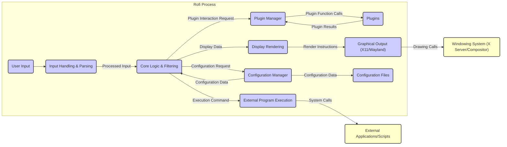

# Project Design Document: Rofi - A Window Switcher, Application Launcher and dmenu Replacement

**Version:** 1.1
**Date:** October 26, 2023
**Author:** Gemini (AI Language Model)

## 1. Introduction

This document provides a detailed design overview of Rofi, a versatile window switcher, application launcher, and dmenu replacement. The primary goal of this document is to clearly articulate the system's architecture, components, and data flow, making it suitable for subsequent threat modeling activities. It aims to provide a comprehensive understanding of Rofi's functionalities and interactions to facilitate the identification of potential security vulnerabilities.

## 2. Goals

*   Provide a clear and comprehensive description of Rofi's architecture and functionality.
*   Identify key components and their interactions with a focus on security-relevant aspects.
*   Outline the data flow within the application, highlighting potential points of vulnerability.
*   Serve as a foundation for future threat modeling exercises, enabling a structured approach to security analysis.
*   Document the design in a manner easily understandable by security professionals, developers, and other stakeholders.

## 3. Scope

This document covers the core functionalities of Rofi as described in the project's GitHub repository. It focuses on the architectural design and data flow relevant to security considerations. The scope includes:

*   Mechanisms for user interaction and input processing.
*   The core application logic responsible for filtering and action execution.
*   Handling of configuration data and settings.
*   The plugin system and its interaction with the core application.
*   Communication and interaction with the underlying operating system and windowing system.

This document explicitly excludes:

*   Detailed implementation specifics of individual functions or code modules.
*   In-depth code-level analysis or static/dynamic code review findings.
*   Identification of specific, known vulnerabilities or exploits.
*   Discussion of future planned features that are not yet implemented or part of the current codebase.

## 4. High-Level Overview

Rofi is a highly customizable and efficient application launcher and window switcher that can also function as a drop-in replacement for dmenu. It operates within a graphical environment, primarily interacting with the windowing system (typically X11 or Wayland). Users interact with Rofi through a text-based interface, typing queries to filter and select applications, windows, or trigger other actions. Rofi's extensibility is provided through a plugin system, allowing for a wide range of additional functionalities. Its core function is to efficiently present and act upon user choices based on typed input.

## 5. System Architecture

Rofi's architecture is modular, consisting of several key components that interact to deliver its functionality. Understanding these components and their relationships is crucial for identifying potential security boundaries and attack vectors.

### 5.1. Components

*   **User Input:** Represents the initial point of interaction, where the user provides input to Rofi, typically via keyboard. This is a primary source of external data.
*   **Input Handling & Parsing:** This component receives raw user input and processes it. This involves interpreting key presses, handling special characters, and preparing the input string for the core logic. Crucially, this component should perform initial input validation and sanitization.
*   **Core Logic & Filtering:** The central component responsible for the main functionality of Rofi. It receives processed user input and performs filtering operations based on the active mode (e.g., application launcher, window switcher). It interacts with the `Configuration Manager` to retrieve settings and the `Plugin Manager` to access extended functionalities.
*   **Display Rendering:** This component takes the filtered results from the `Core Logic` and generates the visual representation of Rofi's interface. It prepares the data for display by the `Graphical Output` component.
*   **Configuration Manager:** Responsible for loading, parsing, and managing Rofi's configuration settings from `Configuration Files`. It provides configuration data to other components, particularly the `Core Logic`.
*   **Plugin Manager:** This component handles the loading, initialization, and management of external `Plugins`. It provides an interface for the `Core Logic` to interact with plugin functionalities.
*   **Plugins:** External, dynamically loaded modules that extend Rofi's capabilities. They can introduce new modes, actions, or data sources. Plugins operate within the Rofi process and have access to its resources.
*   **External Program Execution:** This component handles the execution of external applications or scripts based on user selections or plugin actions. This involves creating new processes and potentially interacting with the operating system's process management mechanisms.
*   **Graphical Output (X11/Wayland):** This component interfaces directly with the underlying windowing system (`Windowing System`) to render Rofi's user interface on the screen. It handles drawing primitives and window management tasks.
*   **Configuration Files:** Text-based files storing Rofi's configuration settings, including themes, keybindings, and plugin-specific configurations. These files are typically located in the user's home directory.

### 5.2. External Entities

*   **Windowing System (X Server/Compositor):** The underlying system responsible for managing graphical displays, user input events, and window management. Rofi relies on this for displaying its interface and receiving user input.
*   **External Applications/Scripts:** The applications or scripts that Rofi launches or interacts with. These are separate processes executed by Rofi.

## 6. Data Flow

Understanding the flow of data through Rofi's components is essential for identifying potential points where data could be intercepted, manipulated, or misused.

1. **User Input:** The user provides input (keystrokes) to Rofi.
2. **Input Handling & Parsing:** The `Input Handling & Parsing` component receives the raw input.
3. **Processed Input:** The processed and potentially sanitized input is passed to the `Core Logic & Filtering` component.
4. **Configuration Retrieval:** The `Core Logic` may request configuration data from the `Configuration Manager`.
5. **Configuration Data:** The `Configuration Manager` retrieves and provides the requested configuration data from `Configuration Files`.
6. **Plugin Interaction Request:** The `Core Logic` may request interaction with plugins from the `Plugin Manager`.
7. **Plugin Function Calls:** The `Plugin Manager` invokes the appropriate functions within the loaded `Plugins`.
8. **Plugin Results:** `Plugins` return results or data to the `Plugin Manager`.
9. **Filtering:** The `Core Logic` filters the list of available options (applications, windows, etc.) based on the processed user input, configuration, and plugin data.
10. **Display Data:** The filtered results are formatted and passed as `Display Data` to the `Display Rendering` component.
11. **Render Instructions:** The `Display Rendering` component generates `Render Instructions` for the `Graphical Output`.
12. **Drawing Calls:** The `Graphical Output` component makes drawing calls to the `Windowing System` to display the Rofi interface.
13. **User Selection:** The user selects an item from the displayed list.
14. **Execution Command:** Based on the user's selection, the `Core Logic` generates an `Execution Command`.
15. **System Calls:** The `External Program Execution` component uses system calls to launch the selected `External Applications/Scripts`.

## 7. Security Considerations

This section outlines potential security considerations based on Rofi's architecture and data flow. This serves as a starting point for a more in-depth threat modeling exercise.

*   **Input Validation Vulnerabilities:** The `Input Handling & Parsing` component is a critical point for security. Failure to properly validate and sanitize user input could lead to command injection vulnerabilities when interacting with the shell or external programs. Maliciously crafted input could also potentially exploit vulnerabilities in the display rendering logic or other components.
*   **Configuration File Manipulation:** If `Configuration Files` are writable by unauthorized users, an attacker could modify them to execute arbitrary commands upon Rofi startup or user interaction. This could involve altering the application list, keybindings, or plugin configurations. Proper file permissions are crucial.
*   **Malicious Plugins:** The plugin system introduces a significant attack surface. Malicious `Plugins` could be designed to execute arbitrary code, access sensitive data, or compromise the entire system. Lack of proper sandboxing or permission controls for plugins exacerbates this risk. The plugin API itself needs to be carefully designed to prevent vulnerabilities.
*   **Command Injection via External Program Execution:** The `External Program Execution` component must carefully handle the construction of commands passed to the shell. Insufficient sanitization of user input or data from plugins could lead to command injection vulnerabilities, allowing attackers to execute arbitrary commands with the privileges of the Rofi process.
*   **Memory Safety Issues:** As Rofi is written in C, it is susceptible to memory safety vulnerabilities such as buffer overflows, use-after-free errors, and format string bugs. These vulnerabilities could be exploited to achieve arbitrary code execution.
*   **Dependency Vulnerabilities:** Rofi relies on external libraries. Vulnerabilities in these dependencies could be exploited through Rofi. Regular updates and security audits of dependencies are necessary.
*   **Insecure Inter-Process Communication (IPC):** If Rofi utilizes IPC mechanisms (though not explicitly detailed in the provided information), these channels could be vulnerable to eavesdropping or manipulation if not properly secured.
*   **Wayland Security Considerations:** When running under Wayland, the security model of the compositor and the Wayland protocol itself needs to be considered. While Wayland aims for better security than X11, vulnerabilities can still exist in compositor implementations.
*   **Privilege Escalation:** If Rofi runs with elevated privileges (which should generally be avoided), vulnerabilities within the application could be exploited to gain further access to the system.

## 8. Future Considerations

*   **Plugin Sandboxing:** Implementing a robust sandboxing mechanism for `Plugins` would significantly mitigate the risks associated with malicious or poorly written plugins by limiting their access to system resources.
*   **Enhanced Input Sanitization:** Employing more rigorous input sanitization techniques to prevent a wider range of injection attacks. Consider using parameterized commands or escaping shell metacharacters when executing external programs.
*   **Secure Configuration Loading:** Exploring methods to ensure the integrity and authenticity of `Configuration Files`, such as using checksums or digital signatures.
*   **Principle of Least Privilege:** Ensuring Rofi runs with the minimum necessary privileges to perform its functions.
*   **Regular Security Audits:** Conducting periodic security audits and penetration testing to identify and address potential vulnerabilities.

## 9. Conclusion

This document provides an enhanced design overview of Rofi, detailing its architecture, data flow, and key security considerations. This information is intended to serve as a valuable resource for conducting thorough threat modeling and security analysis. Understanding the components, their interactions, and the potential vulnerabilities outlined here is crucial for developing strategies to secure Rofi and the systems on which it operates.