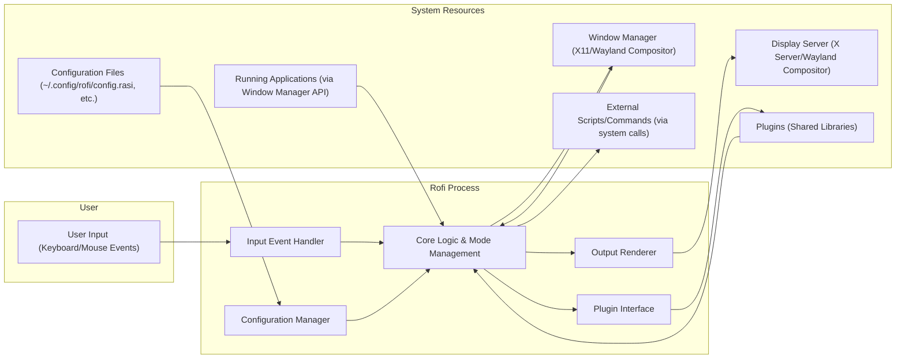
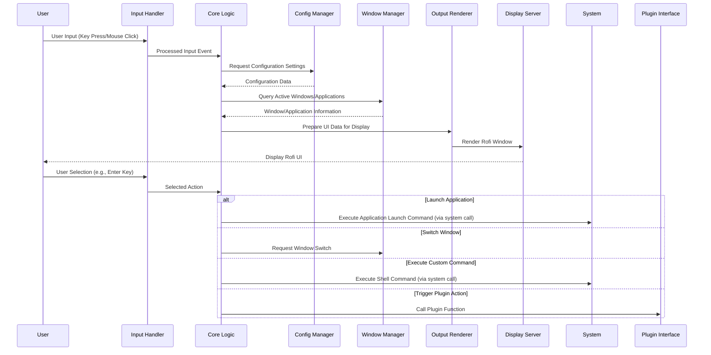

# Project Design Document: Rofi - A Window Switcher, Application Launcher and dmenu Replacement

**Version:** 1.1
**Date:** October 26, 2023
**Author:** AI Software Architect

## 1. Project Overview

This document details the design of Rofi, a highly versatile and customizable window switcher, application launcher, and dmenu replacement. Rofi's primary goal is to provide users with a rapid and efficient method for interacting with their desktop environment. This is achieved through features like quick application launching, seamless window switching, and the ability to execute shell commands directly. This document serves as a comprehensive blueprint of Rofi's architecture and will be a key resource for subsequent threat modeling exercises.

## 2. Goals and Objectives

*   **Performance:** Deliver a highly responsive user interface for application launching and window switching, minimizing latency and maximizing user experience.
*   **Customization:** Offer extensive configuration options, allowing users to tailor Rofi's appearance, behavior, and functionality to their specific preferences and workflows.
*   **dmenu Compatibility:** Function as a fully compatible drop-in replacement for dmenu, inheriting its core functionality while providing significant enhancements and extensions.
*   **Modularity and Extensibility:** Maintain a modular architectural design to facilitate the development and integration of new features and extensions through a well-defined plugin interface.
*   **Input Method Flexibility:** Support various input methods, primarily focusing on keyboard interaction but potentially accommodating mouse input where appropriate.
*   **Desktop Environment Integration:** Ensure seamless integration with a wide range of common desktop environments and window managers on Linux and potentially other Unix-like systems.

## 3. Target Audience

*   Experienced Linux desktop users who prioritize keyboard-driven workflows for efficiency.
*   Users seeking a fast and customizable alternative to traditional application menus or docks.
*   Individuals who require a powerful and flexible window switching solution.
*   Developers and power users interested in extending Rofi's functionality through custom themes, scripts, and plugins.

## 4. System Architecture

Rofi's architecture is designed around a core set of interacting components:

- User Interface (UI) Layer
- Core Logic and Management
- Configuration Management
- Input Event Handling
- Output Rendering
- Plugin System (Optional)

### 4.1. Component Descriptions

-   **User Input (Keyboard/Mouse Events):** Represents user interactions with Rofi, primarily through keyboard input for typing search terms and navigating results, and potentially mouse clicks for selection.
-   **Core Logic & Mode Management:** The central component responsible for:
    -   Receiving and interpreting processed user input from the Input Event Handler.
    -   Interacting with the Configuration Manager to retrieve and apply settings.
    -   Querying the Window Manager for information about active windows and applications.
    -   Retrieving lists of installed applications from the system.
    -   Executing commands and launching applications using system calls.
    -   Managing different operational modes (e.g., `drun`, `window`, `ssh`).
    -   Interacting with loaded plugins through the Plugin Interface.
    -   Formatting data for display and passing it to the Output Renderer.
-   **Configuration Manager:**  Handles the loading, parsing, and management of Rofi's configuration settings. This includes reading configuration files, processing command-line arguments, and providing access to configuration values for other components.
-   **Input Event Handler:**  Responsible for capturing and processing raw input events from the operating system. This involves translating keyboard and mouse events into meaningful actions and data for the Core Logic.
-   **Output Renderer:**  Manages the rendering of the Rofi user interface on the display server. This includes drawing the search bar, results list, icons, and other visual elements according to the current theme and configuration.
-   **Plugin Interface:**  Provides a defined API for external plugins to extend Rofi's functionality. Plugins can introduce new modes, features, or integrations with other applications.
-   **Configuration Files (~/.config/rofi/config.rasi, etc.):** Stores Rofi's persistent configuration settings, including themes, keybindings, behavior customizations, and mode-specific options.
-   **Running Applications (via Window Manager API):** Represents the collection of currently running applications on the system, accessible through the Window Manager's API. Rofi queries this information for window switching and application launching.
-   **Window Manager (X11/Wayland Compositor):** The software responsible for managing the layout and appearance of windows on the screen. Rofi interacts with the Window Manager to obtain window lists and perform actions like switching focus between windows.
-   **Display Server (X Server/Wayland Compositor):** The underlying system responsible for handling graphical output and input events. Rofi interacts with the Display Server through libraries like Xlib/XCB or Wayland client libraries.
-   **External Scripts/Commands (via system calls):** Represents the ability of Rofi to execute arbitrary shell commands or scripts based on user input or configuration, leveraging standard system call mechanisms.
-   **Plugins (Shared Libraries):** Dynamically loaded libraries that extend Rofi's core functionality, offering new features and integrations.

## 5. Data Flow

The typical flow of data within Rofi during a user interaction can be visualized as follows:

### 5.1. Data Flow Description

1. The user initiates an interaction by providing input through the keyboard or mouse.
2. The Input Event Handler captures and interprets these raw input events.
3. The Input Event Handler sends the processed input event to the Core Logic.
4. The Core Logic may request configuration settings from the Configuration Manager to determine how to handle the input.
5. The Configuration Manager provides the requested configuration data to the Core Logic.
6. The Core Logic often needs information about the current state of the system, such as the list of running applications and windows, which it queries from the Window Manager.
7. The Window Manager responds with the requested information.
8. Based on the input and system state, the Core Logic prepares the data that needs to be displayed in the Rofi interface.
9. The Core Logic sends this UI data to the Output Renderer.
10. The Output Renderer interacts with the Display Server to draw the Rofi window on the screen.
11. The Display Server updates the user's display to show the Rofi UI.
12. The user makes a selection within the Rofi interface (e.g., by pressing Enter).
13. The Input Event Handler captures this selection.
14. The Input Event Handler informs the Core Logic about the selected action.
15. Depending on the selected action, the Core Logic will:
    -   Execute a command to launch a new application using a system call.
    -   Request the Window Manager to switch focus to a different window.
    -   Execute a custom shell command using a system call.
    -   Trigger an action within a loaded plugin through the Plugin Interface.

## 6. Key Components and Their Responsibilities

-   **`rofi` (Main Executable):**
    -   Serves as the entry point and orchestrates the interaction between different components.
    -   Parses command-line arguments provided by the user.
    -   Initializes the Configuration Manager, Input Event Handler, Output Renderer, and Plugin Interface.
    -   Manages the main event loop, processing user input and system events.
-   **Configuration Subsystem (Implemented by Configuration Manager):**
    -   Loads configuration files from standard locations (e.g., `~/.config/rofi/config.rasi`).
    -   Parses the configuration syntax, likely a custom format (e.g., HOCON or a similar structure).
    -   Provides an API for other components to access configuration values.
    -   Handles command-line overrides of configuration settings, taking precedence over file-based configurations.
-   **Input Subsystem (Implemented by Input Event Handler):**
    -   Captures low-level keyboard and (potentially) mouse events from the operating system.
    -   Maps raw input events to higher-level actions based on defined keybindings and context.
    -   Provides mechanisms for handling text input, including character composition and input method support.
-   **Output Subsystem (Implemented by Output Renderer):**
    -   Interacts directly with the Display Server (X Server or Wayland compositor) using appropriate libraries.
    -   Renders the Rofi window and its contents, including text, icons, and other visual elements.
    -   Handles theming and visual customization based on configuration settings.
    -   Manages the positioning and focus of the Rofi window on the screen.
-   **Mode Handlers (Part of Core Logic):**
    -   Implement the specific logic for different Rofi operating modes (e.g., `drun` for application launching, `window` for window switching, `ssh` for connecting to SSH hosts, `combi` for combining modes).
    -   Each mode handler is responsible for fetching and processing data relevant to its function. For example, the `drun` mode handler retrieves a list of executable applications.
    -   Plugin modes extend this system, allowing plugins to introduce new functionalities.

## 7. Security Considerations (Detailed)

This section outlines specific security considerations relevant to Rofi's design, which will be crucial for threat modeling.

-   **Configuration File Parsing and Handling:**
    -   **Vulnerability:** Improper parsing of configuration files (e.g., `config.rasi`) could lead to vulnerabilities such as arbitrary code execution if the parser is susceptible to exploits or if insecure directives are allowed.
    -   **Mitigation:** Employ a robust and well-tested parsing library. Implement strict validation of configuration values. Avoid executing arbitrary code based on configuration file contents. Ensure proper file permissions to prevent unauthorized modification.
-   **Input Sanitization and Validation:**
    -   **Vulnerability:** Failure to sanitize and validate user input (especially when executing commands or scripts) can lead to command injection attacks.
    -   **Mitigation:** Implement rigorous input validation and sanitization techniques. Avoid directly passing user-provided strings to shell commands. Use parameterized commands or safer alternatives where possible.
-   **Execution of External Processes:**
    -   **Vulnerability:** Executing arbitrary commands or scripts based on user input or configuration introduces significant security risks, potentially allowing privilege escalation or system compromise.
    -   **Mitigation:** Minimize the need to execute external processes. If necessary, provide clear warnings to the user. Consider sandboxing or limiting the privileges of executed processes. Carefully validate the paths and arguments of executed commands.
-   **Plugin Architecture Security:**
    -   **Vulnerability:** Malicious or poorly written plugins can introduce vulnerabilities, potentially granting access to sensitive data or allowing arbitrary code execution within the Rofi process.
    -   **Mitigation:** Implement a secure plugin loading mechanism. Consider using code signing or sandboxing for plugins. Provide clear documentation and guidelines for plugin developers. Potentially implement a plugin permission system.
-   **Inter-Process Communication (IPC) Security (If Applicable):**
    -   **Vulnerability:** If Rofi uses IPC for communication, vulnerabilities in the IPC mechanism could be exploited to eavesdrop on communication or inject malicious messages.
    -   **Mitigation:** Use secure IPC mechanisms. Authenticate communication endpoints. Encrypt sensitive data transmitted over IPC.
-   **Memory Safety:**
    -   **Vulnerability:** Memory corruption bugs (e.g., buffer overflows, use-after-free) in the C/C++ codebase can lead to crashes or arbitrary code execution.
    -   **Mitigation:** Employ memory-safe programming practices. Utilize static and dynamic analysis tools to detect memory errors. Regularly audit the codebase for potential vulnerabilities.
-   **Display Server Interaction:**
    -   **Vulnerability:** While less common, vulnerabilities in the interaction with the X11 or Wayland protocols could potentially be exploited.
    -   **Mitigation:** Adhere to best practices for interacting with the display server. Stay updated on security advisories related to X11 and Wayland.
-   **Default Configurations:**
    -   **Vulnerability:** Insecure default configurations could expose users to unnecessary risks.
    -   **Mitigation:** Ensure that default configurations are secure and follow the principle of least privilege. Provide clear documentation on how to configure Rofi securely.

## 8. Dependencies

Rofi relies on the following libraries and system components:

-   **Standard C/C++ Library (`libc`, `libstdc++`):** Provides fundamental functionalities for the application.
-   **X Window System Libraries (`libX11`, `libXft`, `libXrandr`):** Required for interacting with the X server on traditional Linux desktops.
-   **Wayland Client Libraries (`libwayland-client`, `libwayland-cursor`, `libxkbcommon`):** Necessary for supporting Wayland-based desktop environments.
-   **Pango:** Used for advanced text rendering and layout.
-   **Cairo:** A 2D graphics library used for drawing UI elements.
-   **libconfig:** A library for parsing structured configuration files.
-   **Optional Dependencies (for specific features):**
    -   **libssh:** For the `ssh` mode.
    -   **Other libraries:** Depending on specific plugin functionalities.

## 9. Deployment Model

Rofi is typically deployed as a standalone executable, installed on the user's system. Common deployment methods include:

-   **Package Managers:** Most Linux distributions provide Rofi packages that can be installed using their respective package managers (e.g., `apt`, `pacman`, `dnf`).
-   **Compilation from Source:** Users can download the source code from the official repository and compile Rofi manually.
-   **Executable Installation:** The compiled executable is typically placed in a system-wide executable directory (e.g., `/usr/bin`, `/usr/local/bin`).
-   **Configuration:** User-specific configuration files are usually located in the `~/.config/rofi/` directory.
-   **Execution:** Rofi is launched by the user, typically through a keyboard shortcut configured in their window manager or desktop environment, or by typing `rofi` in a terminal.

## 10. Future Considerations

-   **Enhanced Wayland Support:** Continue improving Wayland support to achieve full feature parity with the X11 backend.
-   **Expanded Plugin API:** Further develop the plugin API to allow for more extensive customization and integration possibilities.
-   **Improved Search Algorithms:** Explore and implement more sophisticated search algorithms to enhance the accuracy and relevance of search results.
-   **Integration with Cloud Services:** Investigate potential integrations with cloud-based applications or services.
-   **Graphical Configuration Tool:** Consider developing a graphical user interface for configuring Rofi, making it more accessible to a wider range of users.
-   **Security Audits:** Regularly conduct security audits and penetration testing to identify and address potential vulnerabilities.

This revised document provides a more detailed and comprehensive overview of Rofi's design, with a stronger emphasis on security considerations. This information will be invaluable for conducting thorough threat modeling and ensuring the security of the application.
