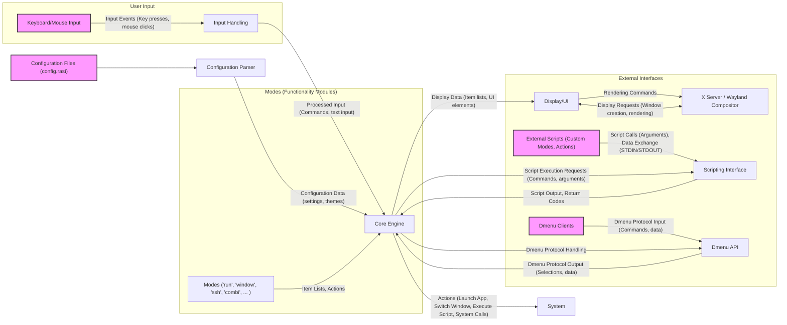
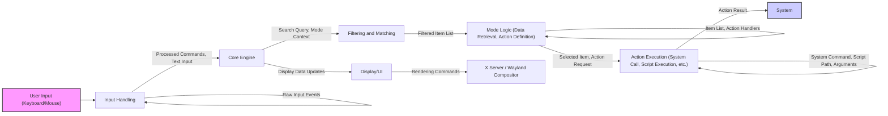
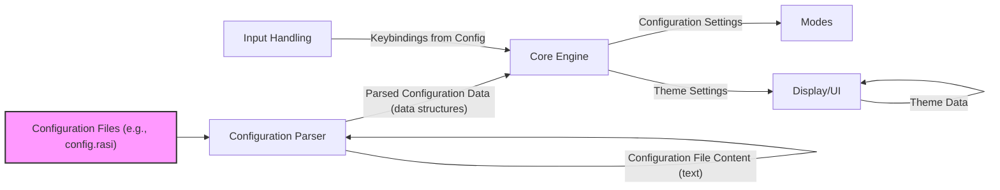

# Project Design Document: Rofi - Window Switcher, Application Launcher, and dmenu Replacement

**Project Name:** Rofi

**Project Repository:** [https://github.com/davatorium/rofi](https://github.com/davatorium/rofi)

**Document Version:** 1.1

**Date:** 2023-10-27

**Author:** AI Software Architecture Expert

## 1. Introduction

This document provides a detailed design overview of the Rofi project, a versatile window switcher, application launcher, and dmenu replacement. This document is intended to be used as a basis for threat modeling activities. It outlines the system's architecture, components, data flow, and external interfaces, highlighting areas relevant to security considerations.

Rofi is designed to be highly customizable and scriptable, allowing users to tailor its behavior and appearance to their specific needs. Its core functionality revolves around efficiently presenting lists of items (applications, windows, scripts, etc.) to the user and executing actions based on user selection. This document aims to provide a deeper understanding of Rofi's internal workings to facilitate effective threat modeling and security analysis.

## 2. Project Overview

**Purpose:** Rofi aims to provide a fast, efficient, and highly customizable application launcher, window switcher, and dmenu replacement for X Window System and Wayland environments. It prioritizes keyboard-centric workflows and extensibility.

**Key Features:**

*   **Application Launching:** Quickly launch applications by name, leveraging system's `$PATH` and desktop entry files.
*   **Window Switching:** Switch between open windows managed by the window manager.
*   **dmenu Replacement:** Function as a drop-in replacement for dmenu, supporting the dmenu protocol and enabling integration with existing dmenu-based scripts and workflows.
*   **Customizable Modes:** Supports a variety of built-in modes (e.g., 'run', 'window', 'ssh', 'combi', 'calc', 'emoji') and allows for the creation of custom modes.
*   **Scripting and Extensibility:** Highly scriptable and extensible through custom modes implemented as external scripts or dynamically loaded plugins (less common, but possible).
*   **Theming:** Extensive theming capabilities using a custom theming language (`rasi`) to customize appearance (fonts, colors, layout).
*   **Keyboard-Centric:** Designed for efficient keyboard navigation and operation, minimizing reliance on mouse interaction.
*   **Cross-Desktop Environment Compatibility:** Aims to function consistently across different desktop environments and window managers on both X and Wayland.

**Target Audience:** Linux users, especially developers, power users, and system administrators who value efficiency, customization, and keyboard-driven workflows.

## 3. System Architecture

Rofi is designed as a single-process application with a modular architecture. It interacts with the operating system kernel, windowing system (X or Wayland), user configuration files, and potentially external scripts and applications. The architecture is structured into distinct layers to promote modularity and maintainability.

*   **User Interface (UI) Layer:** Responsible for rendering the Rofi window, displaying lists of items, and handling visual aspects based on the chosen theme.
*   **Input Handling Layer:** Captures and processes user input events from keyboard and mouse, translating raw events into actions for the Core Engine.
*   **Core Engine Layer:** The central control unit, managing application state, coordinating data flow between components, handling mode logic, filtering, and action execution.
*   **Mode Layer:** Provides modular functionalities, each mode responsible for a specific task (e.g., listing applications, windows, SSH hosts). Modes act as data providers and action handlers.
*   **Configuration Layer:** Loads, parses, and manages user configuration settings from configuration files, influencing the behavior and appearance of Rofi.
*   **External Interface Layer:** Facilitates communication with the windowing system (X Server or Wayland Compositor), external scripts (for custom modes and actions), and dmenu clients (for dmenu compatibility).

### 3.1. Architecture Diagram

## 4. Component Breakdown

### 4.1. Input Handling

*   **Functionality:**  Captures raw input events from the windowing system (Xlib for X, Wayland protocols for Wayland) related to keyboard and mouse. Translates these raw events into higher-level commands and text input for the Core Engine. Handles keyboard shortcuts, text input, and mouse interactions within the Rofi window.
*   **Data Inputs:**
    *   Raw keyboard events (key presses, key releases, key codes, modifiers).
    *   Raw mouse events (button presses, button releases, mouse motion, coordinates).
*   **Data Outputs:**
    *   Processed input commands (e.g., "select item", "next item", "previous item", "activate").
    *   Text input strings (for filtering and searching).
*   **Security Relevance:**  This component is the first point of contact with user-provided data. Vulnerabilities here could lead to:
    *   **Input Injection:** If input is not properly sanitized or validated, malicious input sequences could be interpreted as commands, potentially leading to unintended actions.
    *   **Denial of Service (DoS):**  Malformed input events or excessive input rates could potentially overwhelm the input handling logic, leading to DoS.
*   **Details:**  Relies on system-specific APIs (Xlib, Wayland) for event capture.  Needs to correctly interpret keymaps, keyboard layouts, and handle different input methods.

### 4.2. Core Engine

*   **Functionality:** The central orchestrator of Rofi. Manages application state, processes commands from Input Handling, interacts with Modes to retrieve data, performs filtering and matching of items, generates the UI data for Display/UI, and executes actions based on user selections and mode logic.
*   **Data Inputs:**
    *   Processed input commands and text input from Input Handling.
    *   Configuration data from Configuration Parser.
    *   Item lists and action definitions from Modes.
    *   Script output and return codes from Scripting Interface.
    *   Dmenu protocol input from Dmenu API.
*   **Data Outputs:**
    *   Display data (item lists, UI elements, prompts) for Display/UI.
    *   Script execution requests for Scripting Interface.
    *   Dmenu protocol output for Dmenu API.
    *   Action execution requests (system calls, application launches, script executions).
*   **Security Relevance:**  The Core Engine makes critical decisions based on input and configuration. Vulnerabilities here could have significant security implications:
    *   **Logic Flaws:**  Errors in the core logic could lead to unexpected behavior, potentially exploitable for malicious purposes.
    *   **State Manipulation:**  If application state is not managed securely, it could be manipulated to bypass security checks or trigger unintended actions.
    *   **Authorization Bypass:**  Flaws in action execution logic could lead to unauthorized actions being performed.
*   **Details:** Implements core filtering algorithms (fuzzy matching, substring matching), mode switching logic, action dispatching, and manages the overall application lifecycle.

### 4.3. Configuration Parser

*   **Functionality:** Reads and parses configuration files written in the `rasi` theming language (typically `config.rasi` and theme files). Extracts settings related to appearance, behavior, and mode configurations.
*   **Data Inputs:**
    *   Configuration files (`.rasi` files) from user-defined locations (e.g., `~/.config/rofi/`).
*   **Data Outputs:**
    *   Configuration data structures representing parsed settings, themes, and mode configurations.
*   **Security Relevance:**  Processes user-provided configuration files, making it a potential attack surface:
    *   **Configuration Injection:**  If the parser is not robust, specially crafted configuration files could exploit vulnerabilities like buffer overflows, format string bugs, or even code execution during parsing.
    *   **Denial of Service (DoS):**  Malformed or excessively large configuration files could cause the parser to consume excessive resources, leading to DoS.
    *   **Theme Injection:** Malicious themes could potentially contain code or exploits if theme parsing is not strictly controlled (though less likely in Rofi's `rasi` language, but still a consideration for complex theming engines).
*   **Details:**  Uses a custom parser for the `rasi` language. Needs to handle various data types (strings, integers, booleans, colors), sections, and directives defined in the `rasi` syntax.

### 4.4. Modes

*   **Functionality:**  Modular components providing specific functionalities to Rofi. Each mode is responsible for:
    *   Fetching and providing a list of items relevant to its function (e.g., applications, windows, SSH hosts, files).
    *   Defining actions to be performed when an item is selected (e.g., launch application, switch window, connect to SSH host).
*   **Data Inputs:**
    *   System data (e.g., list of installed applications, running windows, SSH configuration files).
    *   User input (for filtering within the mode).
    *   Configuration settings specific to the mode.
*   **Data Outputs:**
    *   Lists of items to be displayed in Rofi.
    *   Action definitions associated with each item.
*   **Security Relevance:** Modes interact with external systems and data sources, introducing potential security risks:
    *   **Data Source Vulnerabilities:** If a mode relies on insecure data sources (e.g., parsing untrusted files, querying vulnerable services), it could inherit or amplify those vulnerabilities.
    *   **Command Injection (in custom modes):** Custom modes implemented as scripts are particularly vulnerable to command injection if they are not carefully written and handle input securely.
    *   **Information Disclosure:** Modes might inadvertently expose sensitive information if they retrieve and display data without proper sanitization or access control.
*   **Details:**  Built-in modes are implemented in C within Rofi. Custom modes can be implemented as external scripts in various languages. Modes are dynamically loaded or invoked by the Core Engine.

### 4.5. Display/UI

*   **Functionality:**  Renders the Rofi window and its contents on the screen. Handles drawing text, icons, and other UI elements based on the current theme and data provided by the Core Engine. Manages window creation, positioning, and focus.
*   **Data Inputs:**
    *   Display data from the Core Engine (item lists, UI elements, text prompts).
    *   Theme data from Configuration Parser.
*   **Data Outputs:**
    *   Rendering commands to the windowing system (X Server or Wayland Compositor).
*   **Security Relevance:** Primarily related to visual aspects and interaction, but some security considerations exist:
    *   **Rendering Vulnerabilities:**  While less common, vulnerabilities in rendering libraries or font handling could potentially be exploited.
    *   **Information Leakage (UI Redress):**  In rare cases, UI rendering issues or theming flaws could potentially be manipulated to obscure or misrepresent information, leading to UI redress attacks (though less likely in Rofi's context).
    *   **Denial of Service (Resource Exhaustion):**  Malicious themes or excessive UI elements could potentially cause resource exhaustion and DoS if not handled efficiently.
*   **Details:**  Uses graphics libraries (Xlib or Wayland client libraries) for rendering.  Handles font rendering, color management, and UI layout based on theme settings.

### 4.6. Scripting Interface

*   **Functionality:**  Allows Rofi to execute external scripts for custom modes, actions, and extensions. Provides a mechanism for Rofi to interact with external programs and leverage their functionalities.
*   **Data Inputs:**
    *   Script execution requests from the Core Engine (script path, arguments).
    *   Standard input to scripts (potentially data from Rofi).
*   **Data Outputs:**
    *   Standard output from scripts (data for Rofi to process).
    *   Script return codes.
*   **Security Relevance:**  This is a high-risk component due to the execution of external code:
    *   **Command Injection:**  If script arguments are not properly sanitized or if Rofi constructs script commands insecurely, it could lead to command injection vulnerabilities, allowing attackers to execute arbitrary commands on the system.
    *   **Arbitrary Code Execution:**  Maliciously crafted scripts, if executed by Rofi, can perform arbitrary actions with the privileges of the Rofi process (typically user privileges).
    *   **Path Traversal:** If script paths are not validated, attackers might be able to execute scripts outside of intended directories.
*   **Details:**  Uses system calls (e.g., `fork`, `execve`, `popen`) to execute external scripts.  Needs to carefully manage the execution environment, argument passing, and input/output streams.

### 4.7. Dmenu API

*   **Functionality:**  Implements the dmenu protocol, allowing Rofi to function as a drop-in replacement for dmenu. Listens for dmenu commands on standard input and outputs results to standard output, adhering to the dmenu protocol specification.
*   **Data Inputs:**
    *   Dmenu protocol commands and data from dmenu clients via standard input.
*   **Data Outputs:**
    *   Dmenu protocol responses and data to dmenu clients via standard output.
*   **Security Relevance:**  Involves receiving input from external processes (dmenu clients):
    *   **Input Injection (Dmenu Protocol):**  If dmenu protocol parsing is not robust, malicious dmenu clients could potentially inject commands or data that could be exploited by Rofi.
    *   **Denial of Service (Dmenu Protocol):**  Malformed or excessive dmenu protocol input could potentially lead to DoS.
*   **Details:**  Parses dmenu protocol commands and data from standard input.  Generates dmenu protocol compliant output to standard output.

### 4.8. External Interfaces

*   **X Server / Wayland Compositor:**  Windowing system providing display services, input event delivery, and graphics rendering capabilities.
*   **System Libraries:** Standard C libraries, windowing system libraries (Xlib, Wayland client libraries), and potentially other libraries for specific functionalities (e.g., icon loading, string manipulation).
*   **External Scripts:** User-provided scripts for custom modes and actions, executed via the Scripting Interface.
*   **Dmenu Clients:** External applications that use Rofi as a dmenu replacement via the Dmenu API.
*   **Configuration Files:** User-editable configuration files in `~/.config/rofi/`.
*   **Desktop Environment Services:**  Potentially interacts with desktop environment services for application listing, window management, etc. (though Rofi aims to be DE-agnostic as much as possible).

## 5. Data Flow

### 5.1. User Input to Action Execution (Detailed)

**Data Flow Description:**

1.  **User Input:** User interacts with Rofi via keyboard or mouse, generating raw input events.
2.  **Input Handling:** The Input Handling component receives raw input events, processes them (e.g., keycode to character conversion, command recognition), and outputs processed commands and text input.
3.  **Core Engine:** The Core Engine receives processed input, updates its internal state, and initiates filtering and matching based on the current mode and user input.
4.  **Filtering and Matching:** The Core Engine applies filtering algorithms to the item list provided by the active Mode, generating a filtered list of items that match the user's input.
5.  **Mode Logic:** The active Mode provides the initial item list, defines action handlers for each item type, and may perform mode-specific data retrieval or processing.
6.  **Action Execution:** Upon user selection, the Core Engine determines the appropriate action based on the selected item and mode logic. It then executes the action, which could involve system calls, launching applications, executing scripts via the Scripting Interface, or other operations.
7.  **System:** The Action Execution component interacts with the underlying operating system or external applications to perform the requested action.
8.  **Display Update:** Throughout the process, the Core Engine sends display data updates to the Display/UI component to reflect changes in the item list, user input, and UI state.
9.  **Rendering:** The Display/UI component translates display data into rendering commands for the windowing system, updating the visual representation of Rofi on the screen.

### 5.2. Configuration Loading (Detailed)

**Data Flow Description:**

1.  **Configuration Files:** Rofi reads configuration files (e.g., `config.rasi`, theme files) from user-defined locations.
2.  **Configuration Parser:** The Configuration Parser reads the content of configuration files, parses them according to the `rasi` syntax, and generates parsed configuration data structures.
3.  **Core Engine:** The Core Engine receives the parsed configuration data and applies the settings to its internal state, influencing its behavior and functionality.
4.  **Modes:** Configuration settings can affect the behavior of individual Modes, customizing their data retrieval, filtering, and action logic.
5.  **Display/UI:** Theme settings from the configuration data are passed to the Display/UI component, controlling the visual appearance of Rofi (colors, fonts, layout).
6.  **Input Handling:** Keybindings defined in the configuration are loaded and used by the Input Handling component to map key presses to specific commands.

## 6. Security Considerations (Categorized)

This section outlines security considerations for Rofi, categorized by attack surface and component, to facilitate structured threat modeling.

**6.1. Input Handling Attack Surface:**

*   **Threat:** Input Injection Vulnerabilities (e.g., command injection via specially crafted key sequences).
    *   **Component:** Input Handling, Core Engine.
    *   **Description:** If input processing is not robust, malicious key sequences or mouse actions could be misinterpreted as commands or data, leading to unintended actions or code execution.
    *   **Mitigation (High-Level):** Strict input validation and sanitization. Use safe input processing functions. Principle of least privilege for actions triggered by input.
*   **Threat:** Denial of Service (DoS) via Input Flooding.
    *   **Component:** Input Handling.
    *   **Description:**  Excessive input events (e.g., rapid key presses, mouse movements) could overwhelm the Input Handling component, leading to resource exhaustion and DoS.
    *   **Mitigation (High-Level):** Input rate limiting, efficient event processing, resource management.

**6.2. Configuration Parsing Attack Surface:**

*   **Threat:** Configuration Injection Vulnerabilities (e.g., buffer overflows, format string bugs, code execution during parsing).
    *   **Component:** Configuration Parser.
    *   **Description:** Maliciously crafted configuration files could exploit vulnerabilities in the `rasi` parser, leading to buffer overflows, format string bugs, or even arbitrary code execution during parsing.
    *   **Mitigation (High-Level):** Secure parsing techniques, input validation for configuration values, use of memory-safe parsing libraries (if applicable), sandboxing parser (if feasible).
*   **Threat:** Denial of Service (DoS) via Malformed Configuration Files.
    *   **Component:** Configuration Parser.
    *   **Description:**  Malformed or excessively large configuration files could cause the parser to consume excessive resources (CPU, memory), leading to DoS.
    *   **Mitigation (High-Level):** Input validation for configuration file structure and size, resource limits during parsing, error handling and graceful degradation.

**6.3. Scripting Interface Attack Surface:**

*   **Threat:** Command Injection Vulnerabilities.
    *   **Component:** Scripting Interface, Core Engine, Modes (Custom Modes).
    *   **Description:** If script arguments are not properly sanitized or if Rofi constructs script commands insecurely, attackers could inject arbitrary commands into scripts executed by Rofi.
    *   **Mitigation (High-Level):**  Strict sanitization of script arguments, avoid shell command construction if possible, use safe APIs for process execution, principle of least privilege for script execution, consider sandboxing scripts.
*   **Threat:** Arbitrary Code Execution via Malicious Scripts.
    *   **Component:** Scripting Interface, Modes (Custom Modes).
    *   **Description:** Users might execute malicious scripts unknowingly (e.g., downloaded from untrusted sources) as custom modes or actions, leading to arbitrary code execution with user privileges.
    *   **Mitigation (High-Level):** User education about script security, warnings about executing external scripts, consider mechanisms for script verification or sandboxing (though challenging for user-provided scripts).
*   **Threat:** Path Traversal Vulnerabilities in Script Execution.
    *   **Component:** Scripting Interface.
    *   **Description:** If script paths are not validated, attackers might be able to execute scripts from unintended locations, potentially bypassing security restrictions.
    *   **Mitigation (High-Level):**  Strict validation of script paths, restrict script execution to whitelisted directories (if feasible), avoid relying on user-provided paths directly.

**6.4. Dmenu API Attack Surface:**

*   **Threat:** Input Injection via Dmenu Protocol.
    *   **Component:** Dmenu API, Core Engine.
    *   **Description:** Malicious dmenu clients could potentially inject commands or data via the dmenu protocol that could be exploited by Rofi if dmenu protocol parsing is not robust.
    *   **Mitigation (High-Level):**  Strict validation of dmenu protocol input, sanitize data received from dmenu clients, principle of least privilege for actions triggered by dmenu input.
*   **Threat:** Denial of Service (DoS) via Dmenu Protocol Flooding.
    *   **Component:** Dmenu API.
    *   **Description:**  Excessive or malformed dmenu protocol input could overwhelm the Dmenu API component, leading to DoS.
    *   **Mitigation (High-Level):** Input rate limiting for dmenu protocol input, efficient protocol parsing, resource management.

**6.5. General Security Considerations:**

*   **Dependency Vulnerabilities:** Rofi relies on external libraries. Vulnerabilities in these dependencies could indirectly affect Rofi's security.
    *   **Mitigation (High-Level):** Regular dependency updates, vulnerability scanning of dependencies, use of secure coding practices in Rofi itself to minimize reliance on potentially vulnerable library features.
*   **Information Disclosure:** Rofi should avoid inadvertently disclosing sensitive information through its UI, logging, or error messages.
    *   **Mitigation (High-Level):**  Careful handling of sensitive data, avoid displaying sensitive information unnecessarily, secure logging practices, minimize verbose error messages in production builds.

## 7. Assumptions and Trust Boundaries

**7.1. Assumptions:**

*   **User Trust:** It is assumed that the user running Rofi is a trusted user of the system and is not intentionally trying to harm themselves through Rofi's features. However, the system should still be resilient to accidental misconfigurations or unintentional security vulnerabilities.
*   **Configuration File Integrity:** It is assumed that the user's configuration files are not maliciously modified by other users or processes with lower privileges.
*   **Operating System Security:** It is assumed that the underlying operating system and windowing system provide a reasonable level of security and isolation between processes.
*   **Library Security:** It is assumed that the external libraries Rofi depends on are reasonably secure and do not contain critical vulnerabilities.

**7.2. Trust Boundaries:**

*   **Rofi Process Boundary:** Rofi itself runs as a user-level process. The trust boundary is primarily within the Rofi process itself and its interactions with external components.
*   **User Configuration Boundary:** User configuration files are considered within the user's trust domain. Rofi trusts the content of these files to be within the user's intended configuration, but must still parse them securely to prevent vulnerabilities.
*   **External Script Boundary:** External scripts executed by Rofi are considered to be outside of Rofi's direct trust domain. Rofi must treat script execution as a potentially risky operation and implement appropriate security measures.
*   **Dmenu Client Boundary:** Dmenu clients interacting with Rofi via the Dmenu API are considered to be outside of Rofi's direct trust domain. Rofi must validate and sanitize input received from dmenu clients.

## 8. Mitigation Strategies (High-Level)

This section outlines high-level mitigation strategies for the security considerations identified in Section 6.

*   **Input Validation and Sanitization:** Implement rigorous input validation and sanitization for all external inputs, including keyboard input, mouse input, configuration file content, script arguments, and dmenu protocol input. Use safe input processing functions and libraries.
*   **Secure Parsing:** Employ secure parsing techniques for configuration files and dmenu protocol input to prevent vulnerabilities like buffer overflows, format string bugs, and injection attacks. Consider using memory-safe parsing libraries or sandboxing the parser.
*   **Principle of Least Privilege:** Apply the principle of least privilege throughout Rofi's design. Minimize the privileges required for Rofi to perform its functions. When executing external scripts, consider running them with reduced privileges if possible.
*   **Command Injection Prevention:**  Implement robust measures to prevent command injection vulnerabilities in the Scripting Interface. Sanitize script arguments, avoid shell command construction if possible, use safe APIs for process execution, and consider sandboxing scripts.
*   **Resource Management:** Implement resource management mechanisms to prevent denial-of-service attacks. This includes input rate limiting, resource limits during parsing, and efficient resource allocation.
*   **Regular Security Audits and Code Reviews:** Conduct regular security audits and code reviews to identify and address potential vulnerabilities in Rofi's codebase.
*   **Dependency Management:** Implement a robust dependency management process, including regular dependency updates, vulnerability scanning of dependencies, and careful selection of dependencies.
*   **User Education:** Educate users about security best practices related to Rofi, such as the risks of executing untrusted scripts and the importance of using secure configuration practices.
*   **Error Handling and Graceful Degradation:** Implement robust error handling to prevent crashes and unexpected behavior in case of invalid input or errors. Ensure graceful degradation in case of resource limitations or security issues.

## 9. Intended Use for Threat Modeling

This design document is intended to be used as a foundation for a comprehensive threat modeling exercise for Rofi. It provides:

*   **Detailed System Description:** A thorough overview of Rofi's architecture, components, data flow, and external interfaces.
*   **Attack Surface Identification:** Clear identification of potential attack surfaces, categorized by component and interface.
*   **Threat Scenario Brainstorming:**  A structured basis for brainstorming potential threat scenarios and attack vectors based on the identified attack surfaces and security considerations.
*   **Security Control Assessment:**  A framework for assessing existing security controls and identifying areas where additional controls are needed.
*   **Risk Prioritization:**  Information to help prioritize security efforts by focusing on the most critical components and high-risk areas identified through threat modeling.
*   **Mitigation Strategy Planning:**  High-level mitigation strategies to guide the development and implementation of security enhancements.

This document should be used in conjunction with threat modeling methodologies (e.g., STRIDE, PASTA) to systematically analyze Rofi's security posture and develop a comprehensive security plan. Further investigation, code analysis, and dynamic testing are recommended to validate the threat model and identify specific vulnerabilities.