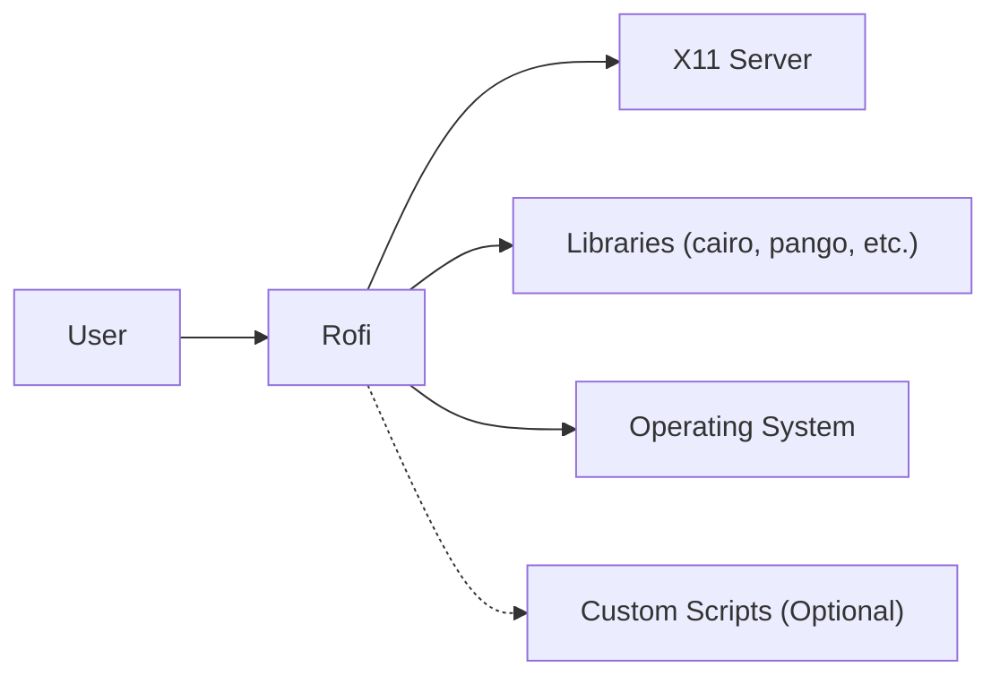
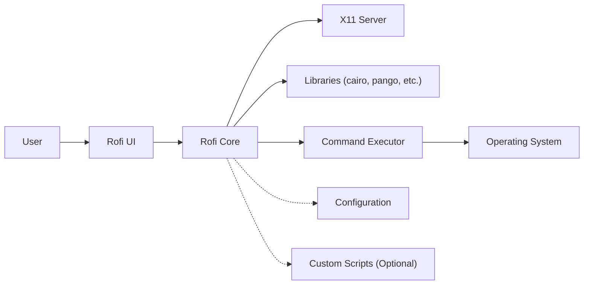
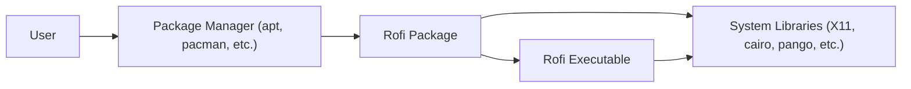
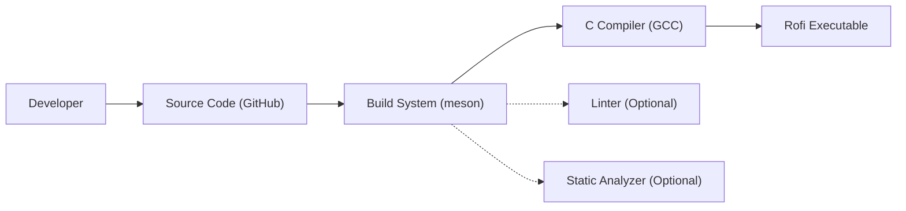

Okay, let's create a design document for the Rofi project, keeping in mind its purpose and potential security considerations.

# BUSINESS POSTURE

Rofi is a versatile window switcher, application launcher, and dmenu replacement.  It's primarily used on Linux systems, often with tiling window managers, to provide a keyboard-centric interface for interacting with the operating system.

Priorities and Goals:

*   Provide a fast and efficient way to switch windows, launch applications, and run commands.
*   Offer a highly customizable and extensible user experience.
*   Maintain a small footprint and minimal dependencies.
*   Be reliable and stable, avoiding crashes or unexpected behavior.

Business Risks:

*   Usability Issues: If Rofi fails to launch, is slow, or crashes frequently, it directly impacts user productivity, as it's often a core part of the desktop workflow.
*   Configuration Errors: Complex configuration options, if misused, could lead to unexpected behavior or make the system difficult to use.
*   Dependency Problems: Reliance on specific libraries or system configurations could limit portability and create compatibility issues across different Linux distributions.
*   Security Vulnerabilities: As a program that interacts with user input and potentially executes commands, vulnerabilities in Rofi could be exploited to gain unauthorized access or execute malicious code. This is the most significant risk.

# SECURITY POSTURE

Existing Security Controls:

*   security control: Code Quality: The project is actively maintained and has a history of addressing reported issues, suggesting a commitment to code quality. (Source: GitHub repository activity and issue tracker).
*   security control: Input Handling: Rofi likely implements some form of input sanitization to prevent common injection vulnerabilities, although the specifics would need to be verified in the code. (Assumption, needs verification).
*   security control: Limited Scope: Rofi's core functionality is relatively focused, reducing the attack surface compared to more complex applications.
*   security control: Open Source: The project is open source, allowing for community scrutiny and contributions to security.

Accepted Risks:

*   accepted risk: Dependency Vulnerabilities: Rofi depends on external libraries (e.g., X11, cairo, pango), which could have their own vulnerabilities.  Mitigation relies on users keeping their systems updated.
*   accepted risk: Configuration-Based Attacks:  Rofi's configuration files and custom scripts could be manipulated by an attacker with local access to execute malicious code. This is inherent to the design and flexibility of Rofi.
*   accepted risk: Limited Privilege Separation: Rofi typically runs with the user's privileges. While not running as root, it still has access to the user's data and resources.

Recommended Security Controls:

*   security control: Static Analysis: Integrate static analysis tools (e.g., linters, security-focused code analyzers) into the build process to identify potential vulnerabilities early.
*   security control: Fuzzing: Implement fuzzing to test Rofi's input handling with a wide range of unexpected inputs, uncovering potential crashes or vulnerabilities.
*   security control: Documentation: Improve documentation on secure configuration practices, warning users about the risks of executing arbitrary commands or using untrusted scripts.
*   security control: Sandboxing: Explore options for sandboxing Rofi, potentially using technologies like seccomp or containers, to limit its access to system resources. This might be challenging due to its interaction with X11.

Security Requirements:

*   Authentication: Not directly applicable, as Rofi primarily acts as a user interface tool. It doesn't handle authentication itself.
*   Authorization: Rofi executes commands with the user's privileges. No additional authorization mechanisms are typically used.
*   Input Validation:
    *   Rofi must properly handle and sanitize user input to prevent command injection vulnerabilities.
    *   Special characters and escape sequences should be handled carefully to avoid unintended execution of commands.
    *   Input length limits should be enforced to prevent buffer overflows.
*   Cryptography:
    *   If Rofi is used to handle sensitive data (e.g., passwords in custom scripts), it should use appropriate cryptographic libraries and algorithms to protect that data. This is primarily the responsibility of the scripts, not Rofi itself.
    *   If Rofi communicates over a network (e.g., in a custom plugin), it should use secure communication protocols (e.g., TLS).
* Secure configuration:
    * Rofi configuration should be validated to prevent execution of unintended commands.

# DESIGN

## C4 CONTEXT

Context Diagram Element List:

*   Element:
    *   Name: User
    *   Type: Person
    *   Description: The person interacting with Rofi.
    *   Responsibilities: Provides input to Rofi, views Rofi's output.
    *   Security controls: None (external to Rofi).

*   Element:
    *   Name: Rofi
    *   Type: Software System
    *   Description: The window switcher, application launcher, and dmenu replacement.
    *   Responsibilities: Manages windows, launches applications, executes commands, displays a user interface.
    *   Security controls: Input sanitization, code quality checks, potential sandboxing (future).

*   Element:
    *   Name: X11 Server
    *   Type: Software System
    *   Description: The X Window System server, responsible for displaying graphics and handling input.
    *   Responsibilities: Provides the graphical environment for Rofi.
    *   Security controls: Managed by the X11 server itself (external to Rofi).

*   Element:
    *   Name: Libraries
    *   Type: Software System
    *   Description: External libraries used by Rofi (e.g., cairo, pango, glib).
    *   Responsibilities: Provide functionality for graphics rendering, text layout, and other tasks.
    *   Security controls: Managed by the library maintainers (external to Rofi).

*   Element:
    *   Name: OS
    *   Type: Software System
    *   Description: Operating System.
    *   Responsibilities: Provides functionality to run commands.
    *   Security controls: Managed by OS.

*   Element:
    *   Name: Custom Scripts (Optional)
    *   Type: Software System
    *   Description: User-defined scripts that extend Rofi's functionality.
    *   Responsibilities: Varies depending on the script.
    *   Security controls: Responsibility of the script author. Rofi should provide documentation on secure scripting practices.

## C4 CONTAINER

Since Rofi is a relatively simple application, the container diagram is essentially an extension of the context diagram.

Container Diagram Element List:

*   Element:
    *   Name: User
    *   Type: Person
    *   Description: The person interacting with Rofi.
    *   Responsibilities: Provides input to Rofi, views Rofi's output.
    *   Security controls: None (external to Rofi).

*   Element:
    *   Name: Rofi UI
    *   Type: Container
    *   Description: The user interface component of Rofi.
    *   Responsibilities: Handles user input, displays the Rofi window and its contents.
    *   Security controls: Input sanitization.

*   Element:
    *   Name: Rofi Core
    *   Type: Container
    *   Description: The core logic of Rofi.
    *   Responsibilities: Manages window lists, application launching, command execution, configuration loading.
    *   Security controls: Code quality checks, potential sandboxing (future).

*   Element:
    *   Name: X11 Server
    *   Type: Software System
    *   Description: The X Window System server.
    *   Responsibilities: Provides the graphical environment.
    *   Security controls: Managed by the X11 server itself.

*   Element:
    *   Name: Libraries
    *   Type: Software System
    *   Description: External libraries.
    *   Responsibilities: Provide functionality for graphics, text, etc.
    *   Security controls: Managed by the library maintainers.

*   Element:
    *   Name: Command Executor
    *   Type: Container
    *   Description: Component responsible for executing commands.
    *   Responsibilities: Executes shell commands or applications based on user input.
    *   Security controls: Input sanitization, careful handling of shell metacharacters.

*   Element:
    *   Name: OS
    *   Type: Software System
    *   Description: Operating System.
    *   Responsibilities: Provides functionality to run commands.
    *   Security controls: Managed by OS.

*   Element:
    *   Name: Configuration
    *   Type: Data Store
    *   Description: Rofi's configuration files.
    *   Responsibilities: Stores user preferences and settings.
    *   Security controls: File permissions (managed by the user and OS).

*   Element:
    *   Name: Custom Scripts (Optional)
    *   Type: Software System
    *   Description: User-defined scripts.
    *   Responsibilities: Varies.
    *   Security controls: Responsibility of the script author.

## DEPLOYMENT

Rofi is typically deployed as a standalone executable on a Linux system.  It relies on the X11 Window System and several libraries.

Possible Deployment Solutions:

1.  Package Manager: Installation via the distribution's package manager (e.g., apt, pacman, dnf). This is the most common and recommended approach.
2.  Source Compilation: Building Rofi from source code. This provides more control over build options but requires more technical expertise.
3.  Containerization (less common):  While less common, Rofi could be packaged within a container (e.g., Docker) for isolation or portability. This might be useful in specific environments or for testing.

Chosen Solution (Package Manager):

Deployment Diagram Element List:

*   Element:
    *   Name: User
    *   Type: Person
    *   Description: The person installing or using Rofi.
    *   Responsibilities: Initiates the installation process.
    *   Security controls: None (external to Rofi).

*   Element:
    *   Name: Package Manager
    *   Type: Software System
    *   Description: The system's package manager (e.g., apt, pacman).
    *   Responsibilities: Downloads, installs, and manages software packages.
    *   Security controls: Package signing, repository verification (managed by the package manager).

*   Element:
    *   Name: Rofi Package
    *   Type: Data Store
    *   Description: The Rofi software package.
    *   Responsibilities: Contains the Rofi executable and metadata.
    *   Security controls: Package integrity checks (managed by the package manager).

*   Element:
    *   Name: Rofi Executable
    *   Type: Software Component
    *   Description: The compiled Rofi binary.
    *   Responsibilities: Runs Rofi.
    *   Security controls: Code signing (if implemented), build-time security checks.

*   Element:
    *   Name: System Libraries
    *   Type: Software System
    *   Description: Shared libraries required by Rofi.
    *   Responsibilities: Provide functionality to Rofi.
    *   Security controls: Managed by the operating system and library maintainers.

## BUILD

Rofi's build process typically involves compiling the source code using a C compiler (like GCC) and linking against required libraries.  The build system uses `meson`.

Build Process Description:

1.  Developer: The developer writes and modifies the Rofi source code.
2.  Source Code: The source code is stored in a Git repository (GitHub).
3.  Build System (meson): The `meson` build system is used to configure and manage the build process. It reads the `meson.build` files to determine dependencies, compiler flags, and build targets.
4.  C Compiler (GCC): The C compiler (typically GCC) compiles the source code into object files.
5.  Linker: The linker combines the object files and links them against the required libraries (X11, cairo, pango, etc.) to create the final Rofi executable.
6.  Rofi Executable: The final executable file is produced.
7.  Linter (Optional): A linter (e.g., `clang-tidy`) can be integrated into the build process to check for code style issues and potential errors.
8.  Static Analyzer (Optional): A static analyzer (e.g., Coverity, SonarQube) can be used to perform deeper code analysis and identify potential security vulnerabilities.

Security Controls in Build Process:

*   security control: Compiler Warnings: The build process should enable compiler warnings and treat them as errors to catch potential issues early.
*   security control: Static Analysis: Integrating static analysis tools can help identify vulnerabilities like buffer overflows, memory leaks, and other security-related coding errors.
*   security control: Dependency Management: The build system should clearly define and manage dependencies to ensure that known vulnerable versions of libraries are not used.
*   security control: Reproducible Builds: Aiming for reproducible builds helps ensure that the build process is deterministic and that the resulting executable is consistent across different build environments.

# RISK ASSESSMENT

Critical Business Processes:

*   Window Switching: Users rely on Rofi for efficient window management, especially in tiling window manager environments.
*   Application Launching: Rofi provides a quick and convenient way to launch applications.
*   Command Execution: Rofi allows users to execute custom commands and scripts, extending its functionality.

Data Protection:

*   User Input: Rofi handles user input, which could potentially include sensitive information (e.g., if used with custom scripts that handle passwords). Sensitivity: Low to Medium (depending on usage).
*   Configuration Data: Rofi's configuration files store user preferences and settings. Sensitivity: Low.
*   Displayed Information: Rofi displays window titles and application names, which could potentially reveal sensitive information. Sensitivity: Low to Medium (depending on the context).

# QUESTIONS & ASSUMPTIONS

Questions:

*   What specific input sanitization techniques are currently implemented in Rofi?
*   Are there any plans to implement sandboxing or other security hardening measures?
*   How are custom scripts handled, and are there any security guidelines for script authors?
*   Are there any known vulnerabilities or security concerns that have been reported but not yet addressed?
*   What is the process for reporting security vulnerabilities?

Assumptions:

*   BUSINESS POSTURE: Users are primarily using Rofi on personal or workstation Linux systems, not on servers or critical infrastructure.
*   SECURITY POSTURE: Rofi is regularly updated by users through their distribution's package manager, ensuring that they receive security updates for Rofi and its dependencies.
*   DESIGN: Rofi's core functionality remains relatively stable, and major architectural changes are unlikely. The primary attack vector is through malicious input or configuration.
*   DESIGN: User will keep system up to date.
*   DESIGN: User will follow secure configuration practices.