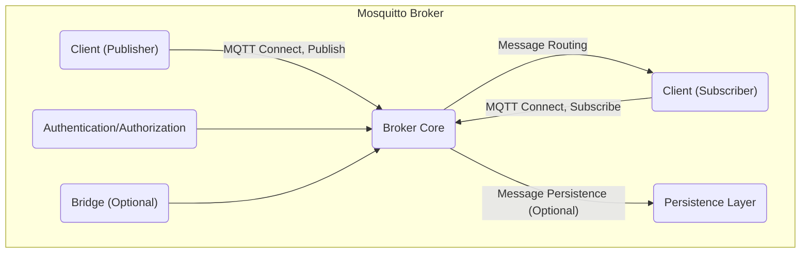
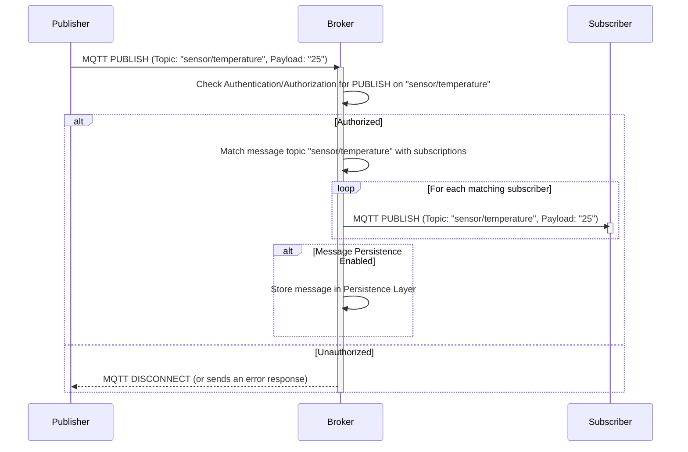

# Project Design Document: Eclipse Mosquitto

**Version:** 1.1
**Date:** October 26, 2023
**Author:** AI Software Architect

## 1. Introduction

This document provides an enhanced design overview of the Eclipse Mosquitto project, an open-source message broker implementing the MQTT protocol. This detailed description is specifically designed to facilitate thorough threat modeling. It elaborates on the system's architecture, core components, data flow, and security mechanisms, highlighting potential areas of concern for security analysis.

## 2. Project Overview

Eclipse Mosquitto is a widely adopted, lightweight message broker adhering to the MQTT (Message Queuing Telemetry Transport) protocol. MQTT is tailored for machine-to-machine (M2M) communication and the Internet of Things (IoT), emphasizing efficiency in resource-constrained environments with limited network bandwidth.

**Key Goals of Mosquitto:**

*   Deliver a dependable and performant MQTT broker solution.
*   Maintain a small footprint and efficient resource utilization.
*   Offer straightforward installation and configuration processes.
*   Support a comprehensive set of MQTT features and extensions.
*   Provide robust and configurable security options.

## 3. System Architecture

The central element of Mosquitto is the broker, which orchestrates communication between MQTT clients by managing connections and message exchange.

**Architectural Components:**

*   **Client (Publisher):** An MQTT entity responsible for publishing messages to designated topics.
*   **Client (Subscriber):** An MQTT entity that subscribes to specific topics to receive published messages.
*   **Broker Core:** The central processing unit of Mosquitto, responsible for:
    *   Accepting and managing incoming client connections.
    *   Maintaining and processing client subscriptions.
    *   Directing messages from publishers to relevant subscribers based on topic matching.
    *   Implementing MQTT protocol specifications, including Quality of Service (QoS) levels and retained messages.
*   **Persistence Layer (Optional):** A mechanism for durable storage of messages and subscription data, ensuring data integrity across broker restarts. This can be file-based or integrated with external database systems.
*   **Authentication/Authorization:** The security gatekeeper, verifying the identity of connecting clients and enforcing access control policies for topics.
*   **Bridge (Optional):** Enables interconnection with other MQTT brokers, facilitating message exchange across different broker instances.

## 4. Key Components in Detail

*   **Broker Core:**
    *   **Connection Handling:** Manages incoming MQTT CONNECT requests, establishes client sessions, and handles disconnections. *Threat Consideration:* Vulnerabilities in connection handling could lead to resource exhaustion or denial-of-service.
    *   **Subscription Management:** Maintains a registry of active client subscriptions and their associated topics. *Threat Consideration:*  Improper management could lead to unauthorized message delivery.
    *   **Message Routing:**  Compares the topic of published messages against active subscriptions to identify target recipients. *Threat Consideration:*  Logic flaws could result in messages being delivered to unintended clients.
    *   **Quality of Service (QoS) Implementation:**  Implements the different QoS levels (0, 1, 2) as defined by the MQTT protocol, ensuring message delivery guarantees. *Threat Consideration:* Incorrect QoS handling could lead to message loss or duplication.
    *   **Retained Message Handling:** Stores and delivers the last message published on a topic to new subscribers. *Threat Consideration:*  Exposure of sensitive data through retained messages if not properly managed.
    *   **WILL Message Processing:** Stores and sends a pre-defined "last will and testament" message on behalf of a client that disconnects unexpectedly. *Threat Consideration:*  Potential for abuse if WILL messages can be manipulated.

*   **Persistence Layer:**
    *   **Purpose:** To guarantee message durability and the persistence of subscription information across broker restarts. This is crucial for reliability.
    *   **Mechanism:** Typically involves writing messages and subscription details to persistent storage, such as files or databases. *Threat Consideration:* Security of the underlying storage mechanism is critical. Access control and encryption of persistent data are important.
    *   **Configuration:** The specific persistence mechanism (e.g., file-based, database) and its configuration parameters are configurable. *Threat Consideration:* Misconfigured persistence settings could lead to data loss or corruption.
    *   **Considerations:** Performance implications are associated with different persistence methods. Frequent writes can impact broker performance.

*   **Authentication/Authorization:**
    *   **Purpose:** To secure the broker by verifying client identities and controlling access to topics. This prevents unauthorized access and manipulation of messages.
    *   **Authentication Methods:**
        *   **Username/Password Authentication:** Clients provide credentials upon connection. *Threat Consideration:* Susceptible to brute-force attacks if not properly protected (e.g., rate limiting).
        *   **TLS Client Certificates:** Clients authenticate using digital certificates. *Threat Consideration:* Requires secure management and distribution of client certificates. Revocation mechanisms are important.
        *   **External Authentication Plugins:** Allows integration with external authentication services (e.g., LDAP, OAuth). *Threat Consideration:* Security relies on the robustness of the external system and the plugin implementation.
    *   **Authorization Methods:**
        *   **Access Control Lists (ACLs):** Define permissions based on usernames, client IDs, and topic patterns. *Threat Consideration:*  Complex ACL configurations can be error-prone and may lead to unintended access.
        *   **Plugin-based Authorization:** Enables more sophisticated and dynamic authorization logic. *Threat Consideration:* Security depends on the plugin's implementation and the security of the external authorization service.

*   **Bridge:**
    *   **Purpose:** To create federated networks of MQTT brokers, enabling message exchange between different broker deployments.
    *   **Functionality:** Subscribes to specified topics on a remote broker and republishes received messages locally, or vice versa. This allows for message routing across broker boundaries. *Threat Consideration:*  A compromised bridge can be used to inject malicious messages into the local broker network.
    *   **Configuration:** Requires specifying the remote broker's address, port, authentication details, and the topics to be bridged. *Threat Consideration:*  Insecurely configured bridges can expose internal networks or data.

## 5. Data Flow

The typical flow of data for a message published by a client involves several key steps within the Mosquitto broker.

**Detailed Steps:**

1. **Publisher Connects:** The publishing client establishes a connection with the Mosquitto broker using the MQTT CONNECT message. This includes authentication credentials if required by the broker's configuration. *Threat Consideration:*  Unencrypted connections expose credentials.
2. **Publisher Publishes:** The publisher sends an MQTT PUBLISH message to the broker, specifying the topic (e.g., "sensor/temperature") and the message payload (e.g., "25").
3. **Broker Receives Message:** The broker receives the PUBLISH message and parses its contents.
4. **Authentication/Authorization Check:** The broker verifies if the publishing client is authorized to publish to the specified topic. This check uses the configured authentication and authorization mechanisms. *Threat Consideration:* Weak or missing authorization can allow unauthorized message publishing.
5. **Message Routing:** If the publisher is authorized, the broker examines its internal list of active subscriptions to find clients that have subscribed to the published topic. The broker matches the message topic against the subscription filters.
6. **Message Delivery:** The broker sends the message to all matching subscribing clients. The delivery mechanism and guarantees depend on the QoS level specified in the PUBLISH message.
7. **Optional Persistence:** If message persistence is enabled and configured for the topic (or globally), the broker stores a copy of the message in the persistence layer. This ensures message delivery even if subscribers are temporarily offline.
8. **Subscriber Receives Message:** The subscribing clients receive the published message from the broker.

## 6. Security Considerations

Mosquitto incorporates several security features to protect the broker and the data it transmits. Understanding these is crucial for threat modeling.

*   **Transport Layer Security (TLS):**
    *   **Encryption:** Encrypts the communication channel between clients and the broker, protecting against eavesdropping and man-in-the-middle attacks. *Threat Consideration:*  Weak TLS configurations or outdated protocols can be vulnerable.
    *   **Mutual Authentication (Client Certificates):**  Allows the broker to authenticate clients using digital certificates, providing stronger authentication than username/password. *Threat Consideration:*  Compromised or improperly managed client certificates can lead to unauthorized access.
    *   **Configuration:** Requires configuring server certificates and private keys on the broker. Client certificate verification requires configuring the Certificate Authority (CA) certificate. *Threat Consideration:* Improperly generated or stored certificates can be a security risk.

*   **Authentication:**
    *   **Purpose:** Verifies the identity of clients attempting to connect to the broker.
    *   **Methods:** Includes username/password authentication and TLS client certificate authentication (as described above). Pluggable authentication backends allow for integration with external systems. *Threat Consideration:*  Default or weak passwords are a common vulnerability. Lack of account lockout mechanisms can facilitate brute-force attacks.

*   **Authorization:**
    *   **Purpose:** Controls which authenticated clients are permitted to publish to or subscribe to specific topics.
    *   **Mechanisms:** Access Control Lists (ACLs) are the primary mechanism. These can be configured to grant or deny access based on usernames, client IDs, and topic patterns. Pluggable authorization allows for more complex rules. *Threat Consideration:*  Overly permissive ACLs can grant unintended access. Incorrectly configured ACLs can block legitimate clients.

*   **Bridges Security:**
    *   **Secure Connections:** Connections between brokers should also be secured using TLS and authentication to prevent unauthorized access and message tampering. *Threat Consideration:* Unsecured bridge connections are a significant security risk.
    *   **Topic Filtering:** Careful configuration of bridged topics is essential to prevent unintended information sharing between brokers. *Threat Consideration:*  Misconfigured topic mappings can leak sensitive information.

*   **WebSockets Security:**
    *   When using the WebSockets transport for browser-based clients, standard web security practices apply. Using HTTPS is crucial for encrypting the WebSocket connection. *Threat Consideration:*  Unsecured WebSocket connections expose data in transit.

*   **Denial of Service (DoS) Prevention:**
    *   **Configuration Limits:** Mosquitto provides configuration options to limit the number of connected clients, maximum message sizes, and other parameters to mitigate DoS attacks. *Threat Consideration:*  Insufficiently restrictive limits can leave the broker vulnerable to resource exhaustion.

## 7. Deployment Considerations

The way Mosquitto is deployed impacts its security and availability.

*   **Standalone Broker:** A single instance of the broker running on a server. Simplest to deploy but represents a single point of failure.
*   **Clustered Brokers:** Multiple brokers working together to provide high availability and scalability. Requires a clustering mechanism (e.g., using a plugin or external solution). *Threat Consideration:* Security of the clustering mechanism is critical. Inter-node communication needs to be secured.
*   **Cloud Deployments:** Can be deployed on cloud platforms (e.g., AWS, Azure, GCP) using virtual machines, containers (Docker), or orchestration platforms (Kubernetes). Leveraging cloud security features is important. *Threat Consideration:*  Misconfigured cloud security settings can expose the broker.
*   **Embedded Systems:** Due to its lightweight nature, Mosquitto can be deployed on resource-constrained devices. Security considerations are paramount in such environments. *Threat Consideration:* Limited resources may restrict the ability to implement robust security measures.

## 8. Technology Stack

Understanding the underlying technologies helps identify potential vulnerabilities.

*   **Programming Language:** C (known for performance but requires careful memory management). *Threat Consideration:*  Memory safety vulnerabilities (e.g., buffer overflows) are potential risks in C code.
*   **Networking Library:** Standard socket APIs. *Threat Consideration:*  Vulnerabilities in the underlying operating system's networking stack can impact Mosquitto.
*   **Persistence (Optional):**
    *   File-based storage: Simple but may lack advanced security features. *Threat Consideration:*  File permissions and access control are crucial.
    *   Integration with databases (via plugins or custom implementations): Security depends on the chosen database and its configuration. *Threat Consideration:*  Database injection vulnerabilities are possible if input is not properly sanitized.
*   **TLS/SSL Library:** Primarily OpenSSL. *Threat Consideration:*  Known vulnerabilities in OpenSSL need to be addressed through updates and proper configuration.
*   **WebSockets Support (Optional):** libwebsockets. *Threat Consideration:*  Vulnerabilities in libwebsockets can impact the security of WebSocket connections.

## 9. Future Considerations (Relevant for Ongoing Threat Assessment)

*   **Plugin Architecture:** The plugin system offers extensibility but introduces potential security risks. Unvetted or insecurely developed plugins can introduce vulnerabilities. *Threat Consideration:*  Plugins should be carefully reviewed and their permissions restricted.
*   **Configuration Management:**  Incorrect or insecure configuration is a major source of vulnerabilities. Secure defaults and robust validation are essential. *Threat Consideration:*  Configuration files should be protected from unauthorized access.
*   **Dependency Management:** Security vulnerabilities in underlying libraries (e.g., OpenSSL, libwebsockets) can directly impact Mosquitto. Regular updates and vulnerability scanning are necessary. *Threat Consideration:*  Keeping dependencies up-to-date is crucial for security.
*   **MQTT Protocol Vulnerabilities:**  Staying informed about potential vulnerabilities in the MQTT protocol itself is important. While Mosquitto implements the protocol, inherent protocol weaknesses could be exploited.
*   **Rate Limiting and DoS Protection:**  Further enhancements to rate limiting and DoS prevention mechanisms could improve resilience against attacks.

This enhanced design document provides a more detailed and security-focused overview of the Eclipse Mosquitto project. It is intended to serve as a valuable resource for conducting comprehensive threat modeling activities, enabling a proactive approach to identifying and mitigating potential security risks.
